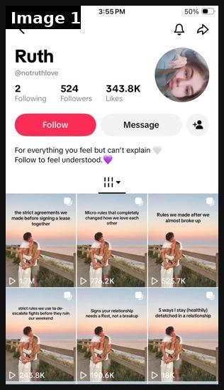
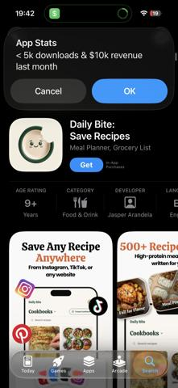
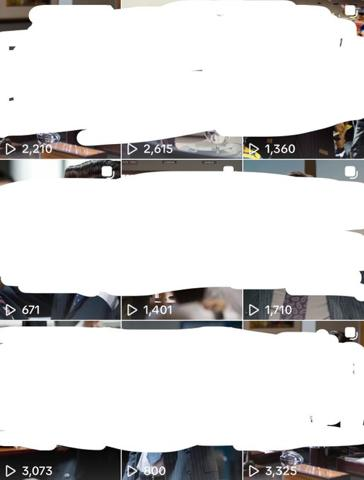
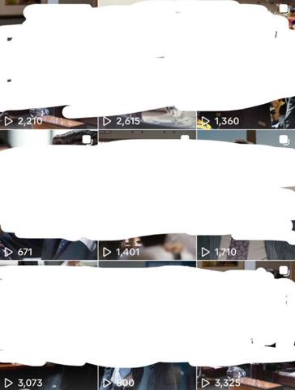
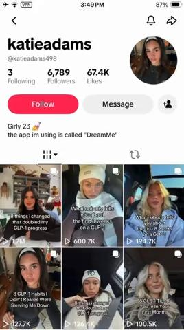
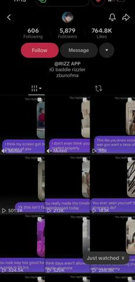
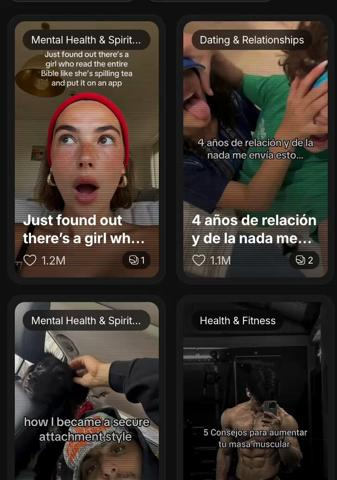

# 01 · Faceless niche slideshow (content-first, product as one tip): see it, then make it

[](https://x.com/leonclipping/status/2104660939069170110)

**The example:** [@leonclipping on X](https://x.com/leonclipping/status/2104660939069170110) · 1 image · 449 likes, 37K views

**Watch it:** [open the post on X](https://x.com/leonclipping/status/2104660939069170110)

> this girl might be a fucking genius she built a relationship page around the same couple photo on every post, posts simple "rules we made after a fight" slideshows and then plugs an AI advice app on the last slide no face no filming no audience needed just: -> one stock couple pic -> relatable relationship content -> same slideshow format every post -> app plug as a "bonus tip" the page only has 524 followers and it'…

## What you are seeing

A TikTok profile for a faceless relationship page (@notruthlove). Every post uses the same photo of a couple by the sea. Only the title text changes ("the strict agreements we made before signing a lease", "Rules we made after we almost broke up"), and each post gets about 100K to 775K views. The page never shows a face, and the product is pushed inside the slides.

## Image by image

| Image | Text on it (OCR, rough) |
|---|---|
| 1 | 524 343.8K Following Followers Likes Message 12 For everything you feel but can’t explain Follow to feel understood. … my a the strict agreements we Micro-rules that completely made before signing a lease changed how we love each Rules we made after we together other almost broke up … escalate fight |

## More real examples (8)

Other posts that show this format, or a close cousin of it. Click a thumbnail to open it on X.

| | | |
|---|---|---|
| [](https://x.com/PerezHatesAI/status/2106779894785188006)<br>**@PerezHatesAI** · images · 2K views<br>This is wild 😭 4.3M views. 250K saves. On a "weird habits" slideshow. No product demo. No feature dump. Just aesthetic slides of habits that "actually | [](https://x.com/rsalimx/status/2108259483902513153)<br>**@rsalimx** · images · 6K views<br>nah this is actually insane 😭 the account has posts sitting at 40m views and the app is doing ~$10k mrr off it recipes are the most natural slideshow | [](https://x.com/rsalimx/status/2107517609960702306)<br>**@rsalimx** · images · 6K views<br>Running-girl ICP page; app shows on slide 4 of 5 right before last tip (can't get full list without seeing it). |
| [](https://x.com/ChadAppDev/status/2098786343836860487)<br>**@ChadAppDev** · image · 18K views<br>Before building: make niche TikTok page, find most viral slideshow formats, copy with own flavor, 1/day. | [](https://x.com/ChadAppDev/status/2107186633871114374)<br>**@ChadAppDev** · image · 5K views<br>Repost of ChadAppDev niche slideshow method. | [](https://x.com/leonclipping/status/2106833379823894702)<br>**@leonclipping** · 0:16 video · 8K views<br>GLP-1 diary page: different selfie per post, 'what nobody tells you about first 8 weeks', tracker app as one tip. |
| [](https://x.com/Dkevs_/status/2100425887636472312)<br>**@Dkevs_** · 0:05 video · 4K views<br>$200K MRR app via TikTok slideshows; don't overcomplicate with clippers. | [](https://x.com/mufvza/status/2082847934841049519)<br>**@mufvza** · 0:18 video · 44K views<br>Analysis of 1,000 app slideshows: most-viewed != most installs; track saves/profile clicks per slideshow. |   |

## How to make one like it

**The format in one line:** A 4-6 slide photo carousel that reads like genuinely useful niche content (tips, rules, lists, diary). The product appears **once**, framed as one of the tips — typically slide N-1 ("right before the last tip so you can't get the full list without seeing it", @rsalimx).

**Why it works:** Photo-mode posts get saved and swiped (dwell + saves are strong ranking signals); the content is useful on its own so it isn't skipped as an ad; one recognisable visual constant builds a "page" people follow. @mufvza's 1,000-slideshow analysis: **most-viewed ≠ most installs** — track saves and profile clicks, not views. @g_buildz_apps: fewer slides (≤4) and CTA always last.

**Contents:** [1. Structure](#1-copy-the-structure) · [2. Shot by shot](#2-shot-by-shot-remake) · [3. Script and hooks](#3-write-the-script) · [4. Prompts](#4-prompts) · [5. Tools and settings](#5-tools-and-settings) · [6. Louise Carter remake](#6-louise-carter-remake) · [7. Variants and test](#7-variants-and-test-plan) · [8. Pitfalls](#8-pitfalls)

### 1. Copy the structure

The skeleton every version follows: **hook → problem or tension → turn (the product shows up) → proof → one clear ask.** The shot-by-shot below fills it in.

### 2. Shot-by-shot remake

**Target length / size:** 5-6 slides, 1080x1920 (TikTok photo mode) or 1080x1350 (IG)

| # | Time / slot | What we see (visual + camera) | Dialogue / on-screen text |
|---|---|---|---|
| 1 | Slide 1 (cover) | The page's signature photo (same one every post: a faceless couple / hands / a view), slightly darkened so white text reads | Title in TikTok "Classic" font, white with black shadow, 6-10 words: "rules we made after we almost broke up" |
| 2 | Slide 2 | Same photo or a close variant | Tip 1, written like a diary line: "1. no phones at dinner. not even face down." |
| 3 | Slide 3 | Same photo | Tip 2, slightly vulnerable: "2. we say the annoying thing the same day" |
| 4 | Slide 4 (product slide) | Same photo; the product is NOT pictured big. Optional small inset of it worn | Tip 3 IS the product, framed as a habit: "3. matching necklaces we never take off. even in the shower (ours are from [brand])" |
| 5 | Slide 5 | Same photo | Tip 4, the most emotional one, so the product slide is sandwiched |
| 6 | Slide 6 | Same photo | Soft close: "save this for the next hard week". No CTA, no link. |

### 3. Write the script

Open with one of these hooks (first 1–3 seconds, or the headline on a static):

- "rules we made after a fight" / "things my boyfriend does that…" (relationship)
- "what nobody tells you about [first 8 weeks of X]" (diary)
- "5 ways to get [result]" / "[N] [things] for your lazy ass" (listicle)
- "POV: you finally [identity outcome]"
- "things I wish I knew before [milestone]"

Then fill the beats from the table above. Pull the wording from real customer reviews, not from ad copy: a review line beats a copywriter line almost every time. Read every line out loud and cut anything you would not say to a friend. Ready-made Louise Carter scripts are in section 6; hand [BOT.md](BOT.md) to any AI agent to write versions for another brand.

### 4. Prompts

**Midjourney / Nano Banana (signature photo)**

```text
candid film photo of a couple seen from behind sitting on a sea wall at golden hour, faces not visible, her hand on his knee, thin gold chain on her neck, soft grain, 35mm, muted warm tones, vertical 9:16 --style raw
```

**Claude / ChatGPT (captions)**

```text
Write 10 slideshow scripts for a faceless relationship page. Each: a 6-10 word title in lowercase, 5 numbered tips in the voice of a woman writing in her notes app. In exactly one tip per script, mention [product] as a habit the couple has, never as a recommendation. No hashtags, no emojis.
```

### 5. Tools and settings

- Research account: fresh TikTok used only for research, follow nothing but the niche, like/save target content for a few days so the FYP becomes a format feed (@brainextends).
- Images: own UGC photos / product shots / licensed lifestyle photos, or AI images (Nano Banana, GPT Image) with a consistent persona prompt. @MaxHirsch13 agent prompt: *"Make me a 6-slide TikTok photo carousel for [brand]: slide 1 is a wide, candid, realistic photo with the hook '5 ways to get [result]' in white text, slides 2-6 …one tip each"*.
- Build: Canva bulk-create, Volume, or a Claude script writing slide JSON → Canva/Figma template. Schedule via native scheduler or Postiz/Buffer (official APIs).
- Cost: ~$0-3/post; time ~15 min/post batched.

| Setting | Value |
|---|---|
| Canvas | 1080×1350 (4:5) per slide; 1080×1920 for TikTok photo mode |
| Slides | 5–10; slide 1 is the hook only, last slide is the ask (save / follow / shop) |
| Type | 64–96 px headline per slide, one idea per slide, consistent position across slides |
| Continuity | Same template, colour and font on every slide so it reads as one piece |
| Audio (TikTok) | Add a trending sound at low volume; photo mode auto-advances |
| Tools | Canva or Figma template; Postnitro or ChatGPT for drafts; export PNG, sRGB |

### 6. Louise Carter remake

**A. "Things I stopped doing at 30" (identity/self-care page, LC-run & disclosed)**
1. Candid mirror selfie, text: "things I stopped doing at 30 (that made me feel put-together)"
2. "Stopped buying 'fast fashion' jewelry that turns my neck green"
3. "Stopped taking my necklaces off to shower — mine are 14K PVD and waterproof" (product shot: Chelsea Herringbone on wet skin) 
4. "Stopped saving 'nice' things for special occasions"
5. "Started a 3-piece everyday stack and never think about it" → caption: "stack in pic is @louisecarter".

**B. "Beach-trip packing rules" (travel/vacation)**
1. Suitcase flat-lay: "rules for packing jewelry for a beach trip"
2. "Only bring pieces you can swim in" 3. "One chain, one huggie, one ring = every outfit" (LC stack) 4. "Use a pill organizer for earrings" 5. "Never pack anything that tarnishes in salt water."

**C. "Bridesmaid gift ideas they'll actually wear" (gifting, Q4)**
1. Bridesmaids photo: "bridesmaid gifts they'll actually wear again" 2-3 non-LC ideas (robe, letter) 4. Matching waterproof initial necklaces (LC) 5. "Bonus: a note for each one".

Brand rules, claims you can and cannot make, and more scripts: [brands/louise-carter.md](brands/louise-carter.md). Step-by-step from idea to scale: [STAGES.md](STAGES.md).

### 7. Variants and test plan

**Test plan:** - 2 weeks, 30 posts on main TikTok + IG, 2 disclosed LC niche pages max. - Primary: saves/1k views and profile-click rate per post; Omni: new-customer revenue with `utm_source=tiktok&utm_content=F01-<post>` from bio link / Linktree; secondary: branded search lift. - Winner rule: top 3 by saves rate → boost as Spark Ads / Partnership ads; kill formats with <1% save rate after 5 posts.

**Naming:** `F01-<variant>-<hook##>-<date>` so results map back to this folder. Change one thing per test (hook, narrator, length or offer), never two.

### 8. Pitfalls

- Changing the photo every post kills the page identity; the repeat image IS the brand.
- The product slide must read like a tip, not an ad. If it says "shop now" the slideshow loses saves.
- Post 1-3 times a day from a warmed account for 2+ weeks before judging; one slideshow is not a test.
- Use AI or licensed photos only; never lift a real couple's photo.
- A weak first slide: nobody swipes past a boring cover.
- No reason to save: give a list, a checklist or a reference people come back to.

**Compliance:** See [_COMPLIANCE.md](../_COMPLIANCE.md). Specific: several source accounts run 30+ identical accounts or buy warmed accounts on proxies (@yassratti, @brainextends, @MaxHirsch13 warns it's unprofitable) — **do not**. Niche pages must disclose LC ownership in bio. Don't reuse the source accounts' photos/personas.

## Field notes

Newer observations live in the playbook: [Wave 2c update: slideshow volume via account farms (yurahulei), with caution](README.md) · [Wave 3 update: brands & apps crushing it (Oct 2026)](README.md) · [Wave 5 update: persona mirror-selfie and agent-run slideshows (Oct 2026)](README.md)

## More examples

Every post we found for this format, with transcripts: [examples/](examples/README.md). Playbook: [README.md](README.md). Agent brief: [BOT.md](BOT.md).
