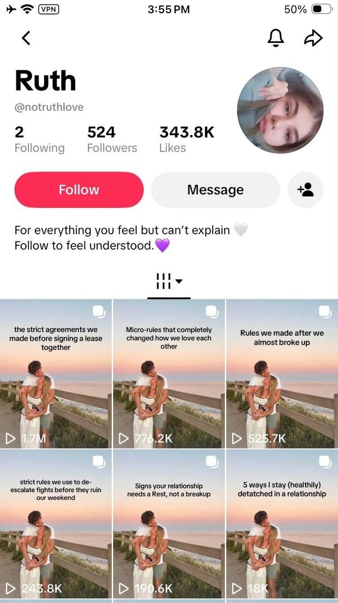

# 01 · Faceless niche slideshow

<!-- HERO:START -->

**[See the example and how to make it →](EXAMPLE.md)** · [watch on X](https://x.com/leonclipping/status/2104660939069170110)
<!-- HERO:END -->

## What it looks like
A 4-6 slide photo carousel that reads like genuinely useful niche content (tips, rules, lists, diary). The product appears **once**, framed as one of the tips — typically slide N-1 ("right before the last tip so you can't get the full list without seeing it", @rsalimx).

Slide-by-slide (proven skeleton):
1. **Hook slide** — candid, slightly imperfect photo (same persona/couple/selfie style every post for recognisability) + big white text hook: "rules we made after a fight", "what nobody tells you about the first 8 weeks", "5 ways to get [result]".
2-3. **Value slides** — one tip per slide, short, true, specific.
4. **Product slide disguised as a tip** — "#4: the one thing I stopped doing… I switched to X".
5. **Last tip / payoff** — closes the list (keeps saves high), soft CTA in caption.

Account pattern: one niche identity (relationship, GLP-1 diary, running girl, recipes), one visual constant (same couple photo / different selfie each post), same format every post, 1-2 posts/day. Batch: research 1h → write 2 months of slides in one 4-6h day (@sulfurscales, @brainextends, @enzoxmotion). Sequence: content, content, content, content, "ad warm-up", product push.

## Hook patterns
- "rules we made after a fight" / "things my boyfriend does that…" (relationship)
- "what nobody tells you about [first 8 weeks of X]" (diary)
- "5 ways to get [result]" / "[N] [things] for your lazy ass" (listicle)
- "POV: you finally [identity outcome]"
- "things I wish I knew before [milestone]"

## Why it spreads
Photo-mode posts get saved and swiped (dwell + saves are strong ranking signals); the content is useful on its own so it isn't skipped as an ad; one recognisable visual constant builds a "page" people follow. @mufvza's 1,000-slideshow analysis: **most-viewed ≠ most installs** — track saves and profile clicks, not views. @g_buildz_apps: fewer slides (≤4) and CTA always last.

## Production recipe
- Research account: fresh TikTok used only for research, follow nothing but the niche, like/save target content for a few days so the FYP becomes a format feed (@brainextends).
- Images: own UGC photos / product shots / licensed lifestyle photos, or AI images (Nano Banana, GPT Image) with a consistent persona prompt. @MaxHirsch13 agent prompt: *"Make me a 6-slide TikTok photo carousel for [brand]: slide 1 is a wide, candid, realistic photo with the hook '5 ways to get [result]' in white text, slides 2-6 …one tip each"*.
- Build: Canva bulk-create, Volume, or a Claude script writing slide JSON → Canva/Figma template. Schedule via native scheduler or Postiz/Buffer (official APIs).
- Cost: ~$0-3/post; time ~15 min/post batched.

## LC adaptation — 3 scripts
**A. "Things I stopped doing at 30" (identity/self-care page, LC-run & disclosed)**
1. Candid mirror selfie, text: "things I stopped doing at 30 (that made me feel put-together)"
2. "Stopped buying 'fast fashion' jewelry that turns my neck green"
3. "Stopped taking my necklaces off to shower — mine are 14K PVD and waterproof" (product shot: Chelsea Herringbone on wet skin) 
4. "Stopped saving 'nice' things for special occasions"
5. "Started a 3-piece everyday stack and never think about it" → caption: "stack in pic is @louisecarter".

**B. "Beach-trip packing rules" (travel/vacation)**
1. Suitcase flat-lay: "rules for packing jewelry for a beach trip"
2. "Only bring pieces you can swim in" 3. "One chain, one huggie, one ring = every outfit" (LC stack) 4. "Use a pill organizer for earrings" 5. "Never pack anything that tarnishes in salt water."

**C. "Bridesmaid gift ideas they'll actually wear" (gifting, Q4)**
1. Bridesmaids photo: "bridesmaid gifts they'll actually wear again" 2-3 non-LC ideas (robe, letter) 4. Matching waterproof initial necklaces (LC) 5. "Bonus: a note for each one".

## Test plan + metric
- 2 weeks, 30 posts on main TikTok + IG, 2 disclosed LC niche pages max.
- Primary: saves/1k views and profile-click rate per post; Omni: new-customer revenue with `utm_source=tiktok&utm_content=F01-<post>` from bio link / Linktree; secondary: branded search lift.
- Winner rule: top 3 by saves rate → boost as Spark Ads / Partnership ads; kill formats with <1% save rate after 5 posts.

## Compliance notes
See [_COMPLIANCE.md](../_COMPLIANCE.md). Specific: several source accounts run 30+ identical accounts or buy warmed accounts on proxies (@yassratti, @brainextends, @MaxHirsch13 warns it's unprofitable) — **do not**. Niche pages must disclose LC ownership in bio. Don't reuse the source accounts' photos/personas.

## Wave 2c update: slideshow volume via account farms (yurahulei), with caution
- @yurahulei: an AI agent runs 100 TikTok accounts (rented US iPhones on Minionix, warmed in the niche) posting slideshows built from a 100K Pinterest image DB; 100 accounts × 1/day = 3,000 slideshows/month. Screenshot example: persona accounts all posting "She edits her photos too much" for the Flibbo app (7.6M-34.6M views).
- **LC position:** take the caption-template idea (**F85**) on a few disclosed LC accounts with owned or licensed images. Do **not** run rented-device account farms or scraped Pinterest images (TikTok inauthentic-behavior rules, copyright).

<!-- EVIDENCE:START -->
## Evidence from X discovery (auto-generated)

| Date | Author | Post | Engagement | Grade | Gist |
|---|---|---|---|---|---|
| 2026-09-25 | [@ErnestoSOFTWARE](https://x.com/ErnestoSOFTWARE) | [link](https://x.com/ErnestoSOFTWARE/status/2103534688048414959) | 941L/1533BM/94kV | HYPE | 11.5M views one faceless account; pitches Arcads automating carousels; 3-4 accounts. |
| 2026-07-10 | [@sulfurscales](https://x.com/sulfurscales) | [link](https://x.com/sulfurscales/status/2075642615316513195) | 452L/1127BM/86kV | SOME | Batch 2 months of slideshows in one 4-6h day; sequence content x4 -> ad warm-up -> product push. |
| 2026-09-28 | [@leonclipping](https://x.com/leonclipping) | [link](https://x.com/leonclipping/status/2104660939069170110) | 449L/765BM/37kV | VALUE | Faceless relationship page: same couple photo every post, 'rules we made after a fight' slides, app plug as bonus tip; 1.7M top post. |
| 2026-10-06 | [@eglitisX](https://x.com/eglitisX) | [link](https://x.com/eglitisX/status/2107476467127050598) | 294L/387BM/15kV | SOME | Slideshows need zero skill: Pinterest-style own images + CTA. |
| 2026-07-30 | [@mufvza](https://x.com/mufvza) | [link](https://x.com/mufvza/status/2082847934841049519) | 277L/674BM/44kV | VALUE | Analysis of 1,000 app slideshows: most-viewed != most installs; track saves/profile clicks per slideshow. |
| 2026-10-06 | [@rsalimx](https://x.com/rsalimx) | [link](https://x.com/rsalimx/status/2107549240868422131) | 267L/428BM/15kV | VALUE | Fitness page pushing one workout app; 4.8M views slideshow; reads as tips, is an ad. |
| 2026-09-09 | [@brainextends](https://x.com/brainextends) | [link](https://x.com/brainextends/status/2097756649872298049) | 213L/437BM/15kV | SOME | Slideshow playbook: 1h competitor research, save top slideshows, study hooks, batch 3 days for 2 months content. |
| 2026-10-07 | [@eglitisX](https://x.com/eglitisX) | [link](https://x.com/eglitisX/status/2107885511855706387) | 172L/186BM/10kV | SOME | TikTok slideshows vs Instagram Trial Reels comparison: 3x MRR in <30 days. |
| 2026-10-04 | [@leonclipping](https://x.com/leonclipping) | [link](https://x.com/leonclipping/status/2106833379823894702) | 139L/278BM/7kV | VALUE | GLP-1 diary page: different selfie per post, 'what nobody tells you about first 8 weeks', tracker app as one tip. |
| 2026-10-06 | [@rsalimx](https://x.com/rsalimx) | [link](https://x.com/rsalimx/status/2107517609960702306) | 120L/200BM/6kV | VALUE | Running-girl ICP page; app shows on slide 4 of 5 right before last tip (can't get full list without seeing it). |
| 2026-09-12 | [@ChadAppDev](https://x.com/ChadAppDev) | [link](https://x.com/ChadAppDev/status/2098786343836860487) | 110L/195BM/18kV | VALUE | Before building: make niche TikTok page, find most viral slideshow formats, copy with own flavor, 1/day. |
| 2026-09-10 | [@adamtwtz](https://x.com/adamtwtz) | [link](https://x.com/adamtwtz/status/2097925109155549689) | 92L/175BM/9kV | VALUE | Symmetry gym app: 150k downloads/mo off one slideshow format, no ads (AI body scan before/after). |
| 2026-09-17 | [@Dkevs_](https://x.com/Dkevs_) | [link](https://x.com/Dkevs_/status/2100425887636472312) | 90L/102BM/4kV | SOME | $200K MRR app via TikTok slideshows; don't overcomplicate with clippers. |
| 2026-09-30 | [@MaxHirsch13](https://x.com/MaxHirsch13) | [link](https://x.com/MaxHirsch13/status/2105342205342941358) | 88L/72BM/9kV | VALUE | Warning: paying $100/mo per warmed account + $1.50/upload is unprofitable; most slideshows <2k views -> bad effective CPM. |
| 2026-09-13 | [@brainextends](https://x.com/brainextends) | [link](https://x.com/brainextends/status/2099238343074832810) | 82L/119BM/4kV | SOME | Founder scaled app to $10k MRR with slideshows; NOTE uses fresh iPhones + proxies (device farm) - copy only content method. |
| 2026-10-05 | [@ChadAppDev](https://x.com/ChadAppDev) | [link](https://x.com/ChadAppDev/status/2107186633871114374) | 78L/144BM/4kV | VALUE | Repost of ChadAppDev niche slideshow method. |
| 2026-09-12 | [@brainextends](https://x.com/brainextends) | [link](https://x.com/brainextends/status/2098901464693502340) | 76L/109BM/18kV | VALUE | Create a research-only TikTok account, train FYP on niche to surface viral formats daily. |
| 2026-08-19 | [@rsalimx](https://x.com/rsalimx) | [link](https://x.com/rsalimx/status/2090094780864713021) | 76L/122BM/8kV | SOME | Claim slideshows convert harder than videos; it's about finding the right format. |
| 2026-09-11 | [@enzoxmotion](https://x.com/enzoxmotion) | [link](https://x.com/enzoxmotion/status/2098401400954794402) | 75L/143BM/8kV | SOME | Same batch-research slideshow playbook (screenshot every viral slideshow in niche, rebuild with own flavor). |
| 2026-07-10 | [@maxfranzen](https://x.com/maxfranzen) | [link](https://x.com/maxfranzen/status/2075615421978312713) | 54L/7BM/412kV | SOME | Listing: AI garden app $1.8k MRR all from organic TikTok slideshows (proof organic slideshows monetize). |
| 2026-09-07 | [@alexxgrowth](https://x.com/alexxgrowth) | [link](https://x.com/alexxgrowth/status/2097077774578065638) | 48L/34BM/5kV | VALUE | Content Rewards campaign: $21.4k spent for 23.1M views (≈$0.93 CPM) of faceless slideshows; app $2k->$25k MRR. |
| 2026-07-13 | [@yassratti](https://x.com/yassratti) | [link](https://x.com/yassratti/status/2076801602187407773) | 46L/113BM/9kV | SOME | $40k MRR app runs 30+ accounts spamming identical format around an everyday physical problem (bulk-account risk). |
| 2026-09-17 | [@g_buildz_apps](https://x.com/g_buildz_apps) | [link](https://x.com/g_buildz_apps/status/2100625122843320629) | 41L/60BM/2kV | SOME | Fewer slides (max 4) -> 2x MRR; CTA always last slide. |
| 2026-08-19 | [@sulfurscales](https://x.com/sulfurscales) | [link](https://x.com/sulfurscales/status/2090128553082036542) | 127L/154BM/22kV | SOME | App slideshow networks: keep the proven structure, vary pain point/images/captions, lock the ad slide; one publisher ~$40k/mo (claim). |
<!-- EVIDENCE:END -->
