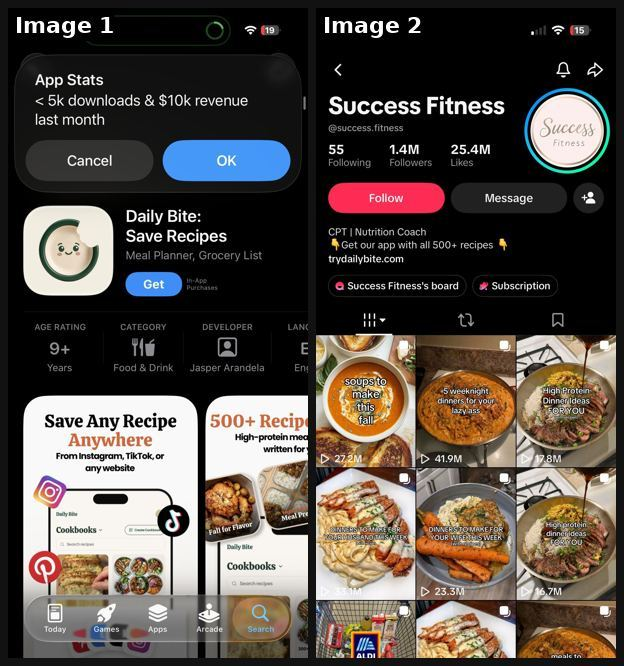
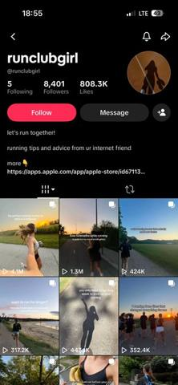
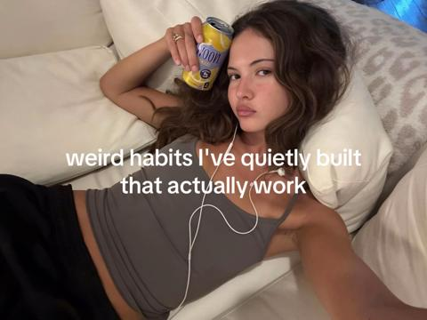
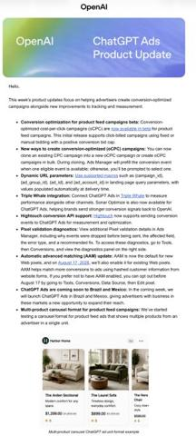
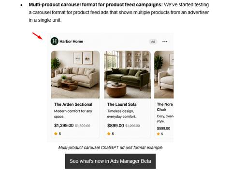

# 02 · Listicle save-carousel (one item per slide): see it, then make it

[](https://x.com/rsalimx/status/2108259483902513153)

**The example:** [@rsalimx on X](https://x.com/rsalimx/status/2108259483902513153) · 2 images · 149 likes, 9K views

**Watch it:** [open the post on X](https://x.com/rsalimx/status/2108259483902513153)

> nah this is actually insane 😭 the account has posts sitting at 40m views and the app is doing ~$10k mrr off it recipes are the most natural slideshow format that exists, one meal per slide, people save it on instinct and then the app is just “all of this, in your pocket” that’s the move for your app give away a small piece of what your app does in every slideshow, the app sells the full version

## What you are seeing

Two screenshots: a recipe app's App Store page (Daily Bite, "Save Any Recipe Anywhere") and the TikTok profile that drives it ("Success Fitness"), a grid of one-meal-per-slide recipe carousels, many past 1M views. The carousel is the content; the app is the save-it-for-later tool.

## Image by image

| Image | Text on it (OCR, rough) |
|---|---|
| 1 | 19:42 19 App Stats 5k downloads $10k revenue last month Cancel Daily Bite: Save Recipes … Meal Planner, Grocery List … DEV LANG Years Food Drink Jasper … Save Any Recipe 500 … High-protein Anywhere written for From Instagram, … or any website of Daily Bite Meal pre … Apps Arcade Search |
| 2 | 20:09 iS 15 … 55 1.4M 25.4M Following Followers Likes Follow Message … Nutrition Coach Get our app with all 500 recipes … Pull WEEK! YOUR: |

## More real examples (5)

Other posts that show this format, or a close cousin of it. Click a thumbnail to open it on X.

| | | |
|---|---|---|
| [](https://x.com/rsalimx/status/2107517609960702306)<br>**@rsalimx** · images · 6K views<br>Running-girl ICP page; app shows on slide 4 of 5 right before last tip (can't get full list without seeing it). | [](https://x.com/PerezHatesAI/status/2106779894785188006)<br>**@PerezHatesAI** · images · 2K views<br>This is wild 😭 4.3M views. 250K saves. On a "weird habits" slideshow. No product demo. No feature dump. Just aesthetic slides of habits that "actually | [](https://x.com/_afterblossom_/status/2095194062756413781)<br>**@_afterblossom_** · images · 35K views<br>Throwing back this piece to see in the new carousel format https://t.co/rOPT5RDzKO |
| [](https://x.com/rustybrick/status/2085121962976661782)<br>**@rustybrick** · image · 5K views<br>ChatGPT Ads Product Updates including multi-product carousel format for product feed campaigns https://t.co/TWMRyCOCy2 | [](https://x.com/glenngabe/status/2085345793343377737)<br>**@glenngabe** · image · 2K views<br>ChatGPT Ads update -&gt; ChatGPT is testing a multi-product carousel format for product feed campaigns "We’ve started testing a carousel format for pr |   |

## How to make one like it

**The format in one line:** Cover slide with a big, warm "for you" headline over a hero image ("High protein dinner ideas FOR YOU", "5 weeknight dinners for your lazy ass", "dinners to make for your husband this week") then **one item per slide**, each a beautiful photo + 1-line label. Product/app line sits in bio ("Get our app with all 500+ recipes") or on the last slide ("all of this, in your pocket"). Example account: @su

**Why it works:** People save lists on instinct (utility), share to partners/friends ("make this for me"), and return to it; saves + shares push distribution. Zero face, zero filming.

**Contents:** [1. Structure](#1-copy-the-structure) · [2. Shot by shot](#2-shot-by-shot-remake) · [3. Script and hooks](#3-write-the-script) · [4. Prompts](#4-prompts) · [5. Tools and settings](#5-tools-and-settings) · [6. Louise Carter remake](#6-louise-carter-remake) · [7. Variants and test](#7-variants-and-test-plan) · [8. Pitfalls](#8-pitfalls)

### 1. Copy the structure

The skeleton every version follows: **hook → problem or tension → turn (the product shows up) → proof → one clear ask.** The shot-by-shot below fills it in.

### 2. Shot-by-shot remake

**Target length / size:** 6-10 slides, 1080x1350 or 1080x1920

| # | Time / slot | What we see (visual + camera) | Dialogue / on-screen text |
|---|---|---|---|
| 1 | Slide 1 (cover) | Best-looking item photo, full bleed, bright | Warm headline in big rounded type: "7 ways to wear gold FOR YOU" / "gift ideas for the friend who never takes jewelry off" |
| 2 | Slides 2-8 | One item per slide, same framing and light, item centred | Item name + one useful line (price, why it works, how to use). Number in the corner (2/8) |
| 3 | One middle slide | The product, styled like every other item | Same template, so it reads as one of the list |
| 4 | Last slide | Collage of all items | "save this so you don't forget" + small handle |

### 3. Write the script

Open with one of these hooks (first 1–3 seconds, or the headline on a static):

"[N] [things] for your [lazy ass / husband / 9-5 week]", "[season] [things] to [do]", "[Result] ideas FOR YOU (with [details])", "save this for [occasion]".

Then fill the beats from the table above. Pull the wording from real customer reviews, not from ad copy: a review line beats a copywriter line almost every time. Read every line out loud and cut anything you would not say to a friend. Ready-made Louise Carter scripts are in section 6; hand [BOT.md](BOT.md) to any AI agent to write versions for another brand.

### 4. Prompts

**Canva / Figma**

```text
Template: 1080x1350, photo 100% bleed, 8% black gradient top, headline 72-96px rounded sans (e.g. "Poppins Bold"), item caption 40px, slide counter top-right 28px.
```

**Claude**

```text
Give me 15 save-worthy carousel topics for [audience] where [product] fits naturally as one of 6-8 items. For each: cover headline with "for you" or a direct address, the item list, and one useful line per item.
```

### 5. Tools and settings

Photos: LC product photography + customer UGC (with permission) + AI-styled on-body shots (see F20). Template in Canva: cover + 5-8 item slides. Agent prompt (adapted from @MaxHirsch13): *"Make a 7-slide carousel for Louise Carter: slide 1 wide candid photo of [persona] with hook '[N] waterproof stacks for [occasion]' in white serif text; slides 2-7 one stack per slide, label = piece names + price; last slide 'all pieces 14K PVD, shower-proof'."*

| Setting | Value |
|---|---|
| Canvas | 1080×1350 (4:5) per slide; 1080×1920 for TikTok photo mode |
| Slides | 5–10; slide 1 is the hook only, last slide is the ask (save / follow / shop) |
| Type | 64–96 px headline per slide, one idea per slide, consistent position across slides |
| Continuity | Same template, colour and font on every slide so it reads as one piece |
| Audio (TikTok) | Add a trending sound at low volume; photo mode auto-advances |
| Tools | Canva or Figma template; Postnitro or ChatGPT for drafts; export PNG, sRGB |

### 6. Louise Carter remake

A. "7 stacks you can wear in the shower (and the ocean)" — one stack per slide, names + prices, last slide "build any 7 for $85".
B. "Gifts for her under $50 that won't turn green" — 6 single pieces (single-piece first orders have the best LTV), each slide one piece, recipient tag ("for your sister who loses everything").
C. "Fall outfit + jewelry pairings for your 9-5 week" — Mon-Fri outfit photos each with an LC stack callout.

Brand rules, claims you can and cannot make, and more scripts: [brands/louise-carter.md](brands/louise-carter.md). Step-by-step from idea to scale: [STAGES.md](STAGES.md).

### 7. Variants and test plan

**Test plan:** 15 carousels/2 weeks. Primary: saves/1k + shares/1k; Omni first-order revenue from bio link UTMs `F02-*`; check whether single-piece lists produce single-piece first orders (higher LTV). Winners → Pinterest pins + Meta carousel ads.

**Naming:** `F02-<variant>-<hook##>-<date>` so results map back to this folder. Change one thing per test (hook, narrator, length or offer), never two.

### 8. Pitfalls

- A cover that does not promise a useful list will not get saves; test 3 covers on the same list.
- If the product slide looks different (studio shot among phone shots) it reads as an ad.
- Keep text above the bottom 20% so TikTok UI does not cover it.
- A weak first slide: nobody swipes past a boring cover.
- No reason to save: give a list, a checklist or a reference people come back to.

**Compliance:** [_COMPLIANCE.md](../_COMPLIANCE.md). Prices must match site; claims "shower-proof" only per PDP wording.

## Field notes

Newer observations live in the playbook: [Wave 2b update — carousel sub-types (GetHookd library)](README.md) · [Wave 3 update: brands & apps crushing it (Oct 2026)](README.md)

## More examples

Every post we found for this format, with transcripts: [examples/](examples/README.md). Playbook: [README.md](README.md). Agent brief: [BOT.md](BOT.md).
