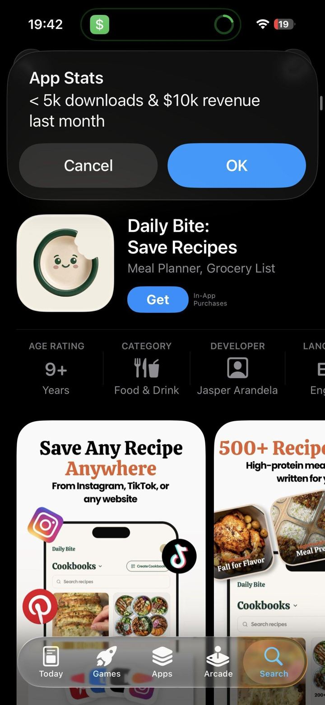

# 02 · Listicle save-carousel

<!-- HERO:START -->

**[See the example and how to make it →](EXAMPLE.md)** · [watch on X](https://x.com/rsalimx/status/2108259483902513153)
<!-- HERO:END -->

## What it looks like
Cover slide with a big, warm "for you" headline over a hero image ("High protein dinner ideas FOR YOU", "5 weeknight dinners for your lazy ass", "dinners to make for your husband this week") then **one item per slide**, each a beautiful photo + 1-line label. Product/app line sits in bio ("Get our app with all 500+ recipes") or on the last slide ("all of this, in your pocket"). Example account: @success.fitness — 1.4M followers, 25.4M likes, posts at 16-42M views ([@rsalimx](https://x.com/rsalimx/status/2108259483902513153)).

## Hook patterns
"[N] [things] for your [lazy ass / husband / 9-5 week]", "[season] [things] to [do]", "[Result] ideas FOR YOU (with [details])", "save this for [occasion]".

## Why it spreads
People save lists on instinct (utility), share to partners/friends ("make this for me"), and return to it; saves + shares push distribution. Zero face, zero filming.

## Production recipe
Photos: LC product photography + customer UGC (with permission) + AI-styled on-body shots (see F20). Template in Canva: cover + 5-8 item slides. Agent prompt (adapted from @MaxHirsch13): *"Make a 7-slide carousel for Louise Carter: slide 1 wide candid photo of [persona] with hook '[N] waterproof stacks for [occasion]' in white serif text; slides 2-7 one stack per slide, label = piece names + price; last slide 'all pieces 14K PVD, shower-proof'."*

## LC adaptation — 3 scripts
A. "7 stacks you can wear in the shower (and the ocean)" — one stack per slide, names + prices, last slide "build any 7 for $85".
B. "Gifts for her under $50 that won't turn green" — 6 single pieces (single-piece first orders have the best LTV), each slide one piece, recipient tag ("for your sister who loses everything").
C. "Fall outfit + jewelry pairings for your 9-5 week" — Mon-Fri outfit photos each with an LC stack callout.

## Test plan + metric
15 carousels/2 weeks. Primary: saves/1k + shares/1k; Omni first-order revenue from bio link UTMs `F02-*`; check whether single-piece lists produce single-piece first orders (higher LTV). Winners → Pinterest pins + Meta carousel ads.

## Compliance
[_COMPLIANCE.md](../_COMPLIANCE.md). Prices must match site; claims "shower-proof" only per PDP wording.

## Wave 2b update — carousel sub-types (GetHookd library)
Eight paid carousel types: step-by-step tutorial, before/after, feature breakdown, social-proof stack, problem-solution, comparison, FAQ, UGC. Each card has one job (hook → proof → CTA); 1080×1350 (4:5); 8-10 words per card. For jewelry styling carousels see [57](../57-styling-carousel-how-to-wear/README.md). Source: [https://www.gethookd.ai/learn/8-effective-instagram-carousel-ad-examples-tips-for-2026/](https://www.gethookd.ai/learn/8-effective-instagram-carousel-ad-examples-tips-for-2026/).

<!-- EVIDENCE:START -->
## Wave 3 update: brands & apps crushing it (Oct 2026)
- Put the product in the middle of the list, not the end where people drop off: Albo habit #4-5 ([@PerezHatesAI](https://x.com/PerezHatesAI/status/2106779894785188006)); running page slide 4/5 ([@rsalimx](https://x.com/rsalimx/status/2107517609960702306)).
- Save test: write the list first without LC; only post it if you'd save it yourself.

## Evidence from X discovery (auto-generated)

| Date | Author | Post | Engagement | Grade | Gist |
|---|---|---|---|---|---|
| 2026-10-06 | [@rsalimx](https://x.com/rsalimx) | [link](https://x.com/rsalimx/status/2107517609960702306) | 120L/200BM/6kV | VALUE | Running-girl ICP page; app shows on slide 4 of 5 right before last tip (can't get full list without seeing it). |
| 2026-10-08 | [@rsalimx](https://x.com/rsalimx) | [link](https://x.com/rsalimx/status/2108259483902513153) | 103L/146BM/5kV | VALUE | Recipe slideshows (one meal per slide) hit 40M views; app = 'all of this in your pocket'. Save-bait listicle. |
| 2026-10-08 | [@MaxHirsch13](https://x.com/MaxHirsch13) | [link](https://x.com/MaxHirsch13/status/2108340891601748034) | 75L/224BM/3kV | VALUE | Exact agent prompt for 6-slide carousel: candid wide photo + '5 ways to get [result]' hook, slides 2-6 one tip each. |
<!-- EVIDENCE:END -->
