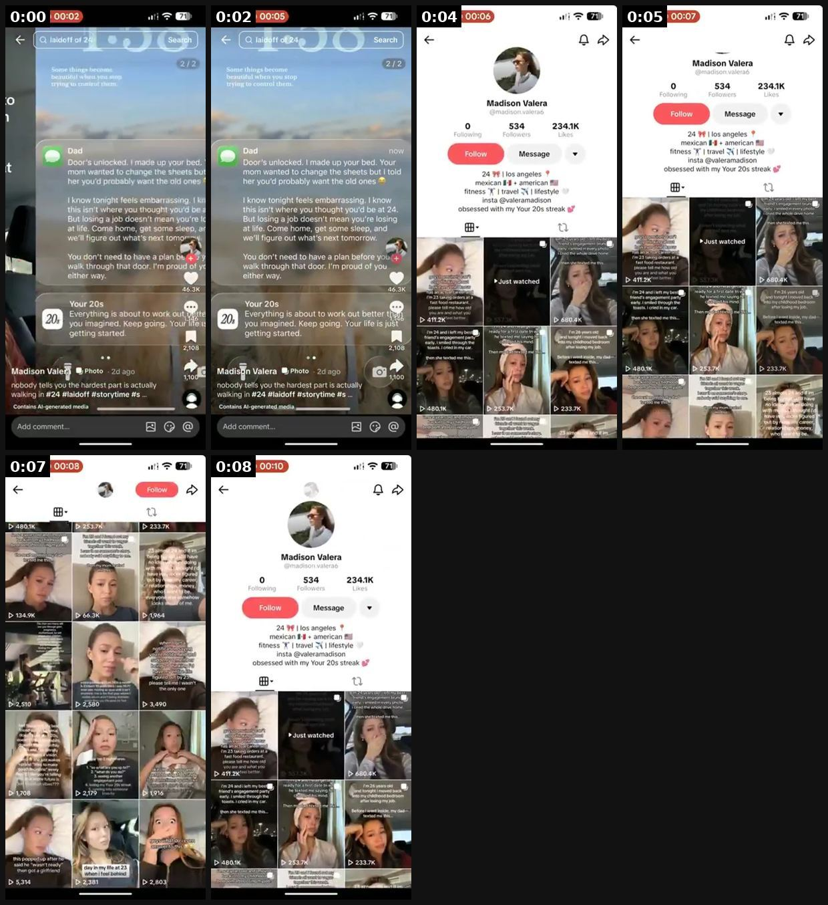

# 03 · Notification / lock-screen 2-slide slideshow: see it, then make it

[](https://x.com/brainextends/status/2099496707209994736)

**The example:** [@brainextends on X](https://x.com/brainextends/status/2099496707209994736) · 0:09 video · 265 likes, 16K views

**Watch it:** [open the post on X](https://x.com/brainextends/status/2099496707209994736) · [play the video file](https://video.twimg.com/amplify_video/2099496665107615744/vid/avc1/320x710/zyfYf1h6eN_IVgZX.mp4?tag=29)

> this app went from $1k/mo to $5k/mo in 7 days f*cling days and it came from a 2-slide tiktok slideshow the post did 1M+ views and the content is basically -> 2 slides -> AI generated visuals -> notification style copy -> app comes in naturally that’s literally it this is why i keep talking about slideshows you can make 50 versions of something like this without spending days filming content all of them can have a dif…

## What you are seeing

A short slideshow built from big stat cards and phone UI: "#00", "4.8", "<$5K" tiles over lifestyle photos, then an iPhone lock screen at 9:41 with notification bubbles ("Follow your routine"). Two slides, phone-native look, no talking.

## Beat by beat

The storyboard above samples the video every 0:01. Lines are the transcript for that stretch; on-screen text comes from OCR, so treat it as rough.

| Frame | Time | On screen | Said / sung |
|---|---|---|---|
| 1 | 0:00–0:01 | wi 71 1:06 ob an 46.3 ar 80.56 RE ul ee 2d ago 1,100 tells you the hardest part is actually walking in #24 Contains Al-generated media Add comment... | · |
| 2 | 0:01–0:03 | 11:06 100%05 a it ir home, wha n't to do po 46. 3K ee ff in Photo 2d age nobody tells you the hardest part is actually Bi. walking in #24 Contains Al-generated  | · |
| 3 | 0:03–0:04 | · | · |
| 4 | 0:04–0:06 | 00:07 ali 719 11:06 Madison te 534 234.1K Message 24 los angeles mexican american fitness travel 24 lifestyle insta obsessed with my Your 20s streak vp re tree  | · |
| 5 | 0:06–0:08 | 11:06 00:08 ron a 253.7% 233.7K ws 480.1K mind Pa ans Aha cB rE hem, tin ae nt: ME BON ca me fo ks with ne pure: by no every looks 134.9K 1,964 Ge an NT raul rd | · |
| 6 | 0:08–0:09 | · | · |

## How to make one like it

**The format in one line:** 2 slides. Slide 1: aesthetic AI/lifestyle visual with an iPhone lock screen overlay showing 2-4 push notifications written in a witty/brutal brand voice ("Right now is another chance to become who you want to be"). Slide 2: the "app comes in naturally" — product/app screenshot or a single line. ([@brainextends](https://x.com/brainextends/status/2099496707209994736), [@enzoxmotion](https://x.com/en

**Why it works:** Feels like a meme/screenshot, instantly readable, relatable voice; 2 slides = high completion.

**Contents:** [1. Structure](#1-copy-the-structure) · [2. Shot by shot](#2-shot-by-shot-remake) · [3. Script and hooks](#3-write-the-script) · [4. Prompts](#4-prompts) · [5. Tools and settings](#5-tools-and-settings) · [6. Louise Carter remake](#6-louise-carter-remake) · [7. Variants and test](#7-variants-and-test-plan) · [8. Pitfalls](#8-pitfalls)

### 1. Copy the structure

Use the example's timing as your beat sheet. Keep the beat, change the words and the product.

| Beat | Time | In the example | Your version |
|---|---|---|---|
| 1 | 0:00 | on screen: wi 71 1:06 ob an 46.3 ar 80.56 RE ul ee 2d ago 1,100 tells you the hardest part is actually walking in #24 Contains Al-g | … |
| 2 | 0:02 | on screen: 11:06 100%05 a it ir home, wha n't to do po 46. 3K ee ff in Photo 2d age nobody tells you the hardest part is actually B | … |
| 3 | 0:04 | (visual beat, see frame 3) | … |
| 4 | 0:05 | on screen: 00:07 ali 719 11:06 Madison te 534 234.1K Message 24 los angeles mexican american fitness travel 24 lifestyle insta obse | … |
| 5 | 0:07 | on screen: 11:06 00:08 ron a 253.7% 233.7K ws 480.1K mind Pa ans Aha cB rE hem, tin ae nt: ME BON ca me fo ks with ne pure: by no e | … |
| 6 | 0:08 | (visual beat, see frame 6) | … |

### 2. Shot-by-shot remake

**Target length / size:** 2 slides, 1080x1920

| # | Time / slot | What we see (visual + camera) | Dialogue / on-screen text |
|---|---|---|---|
| 1 | Slide 1 | Aesthetic lifestyle photo (beach towel, bathroom shelf, a hand in water) with an iPhone lock screen overlaid: time 9:41, date, 2-4 notification bubbles | Notifications in a brutal/witty brand voice: "[Brand]: you took it off again?" / "Reminder: it's waterproof. stop." |
| 2 | Slide 2 | Product worn in the same scene, or a clean stat card | Payoff line: "14K PVD. Shower, sea, sleep. Never take it off." Optional price. |

### 3. Write the script

Open with one of these hooks (first 1–3 seconds, or the headline on a static):

Lock-screen time + 3 notifications from the brand: affirmation, call-out, joke. "your necklace texted you", "notifications from your jewelry box".

Then fill the beats from the table above. Pull the wording from real customer reviews, not from ad copy: a review line beats a copywriter line almost every time. Read every line out loud and cut anything you would not say to a friend. Ready-made Louise Carter scripts are in section 6; hand [BOT.md](BOT.md) to any AI agent to write versions for another brand.

### 4. Prompts

**Figma**

```text
Use an iOS 17 lock-screen kit: SF Pro Display 96pt time, notification card 32px radius, 70% white blur, app icon 38px. Place over the photo, centred upper third.
```

**Nano Banana / Midjourney (background)**

```text
flat lay of a wet beach towel, sunglasses and a gold necklace on warm sand, top-down, late afternoon light, vertical 9:16, photoreal
```

### 5. Tools and settings

Figma/Canva lock-screen template (generic iOS-style, no Apple logos), AI background (consistent palette), copy generated in batches of 50 by Claude in LC voice, human-edited. 
Prompt: *"Write 30 sets of 3 lock-screen notifications from 'Louise Carter' (jewelry) to its owner. Voice: warm, teasing best friend. Themes: showering with jewelry on, beach days, compliments, stacking, Monday. Max 70 chars each. No false claims; jewelry is 14K PVD waterproof."*

| Setting | Value |
|---|---|
| Canvas | 1080×1350 (4:5) per slide; 1080×1920 for TikTok photo mode |
| Slides | 5–10; slide 1 is the hook only, last slide is the ask (save / follow / shop) |
| Type | 64–96 px headline per slide, one idea per slide, consistent position across slides |
| Continuity | Same template, colour and font on every slide so it reads as one piece |
| Audio (TikTok) | Add a trending sound at low volume; photo mode auto-advances |
| Tools | Canva or Figma template; Postnitro or ChatGPT for drafts; export PNG, sRGB |

### 6. Louise Carter remake

A. Lock screen 7:42 AM: "LC: you showered with me on again. good." / "LC: someone's going to ask where your necklace is from today" / "LC: wear the hoops. trust." → Slide 2: product flat-lay "the necklace that texts back (it doesn't, but it's waterproof)".
B. Beach day: "LC: ocean? we're fine." / "LC: sunscreen won't hurt us either" / "LC: take the pic." → Slide 2: stack on wet wrist.
C. Monday: "LC: you don't have to take us off. ever." / "LC: 3 pieces. 0 thinking." → Slide 2: 3-piece stack with "build your 7 for $85".

Brand rules, claims you can and cannot make, and more scripts: [brands/louise-carter.md](brands/louise-carter.md). Step-by-step from idea to scale: [STAGES.md](STAGES.md).

### 7. Variants and test plan

**Test plan:** 10 posts; metric: shares/1k and comments mentioning "where from"; Omni bio-link revenue `F03-*`. Pair with Klaviyo/Omnisend push-style SMS copy test (same voice).

**Naming:** `F03-<variant>-<hook##>-<date>` so results map back to this folder. Change one thing per test (hook, narrator, length or offer), never two.

### 8. Pitfalls

- More than 4 notifications becomes unreadable at scroll speed.
- Do not fake notifications from real apps or people (no fake bank alerts or texts from named people); use the brand as the sender.
- Slide 1 must make sense on its own; most viewers never swipe.
- A weak first slide: nobody swipes past a boring cover.
- No reason to save: give a list, a checklist or a reference people come back to.

**Compliance:** [_COMPLIANCE.md](../_COMPLIANCE.md). Don't imitate Apple UI trademarks exactly; generic notification style. No "texted you" that could be read as real SMS spoofing.

## More examples

Every post we found for this format, with transcripts: [examples/](examples/README.md). Playbook: [README.md](README.md). Agent brief: [BOT.md](BOT.md).
