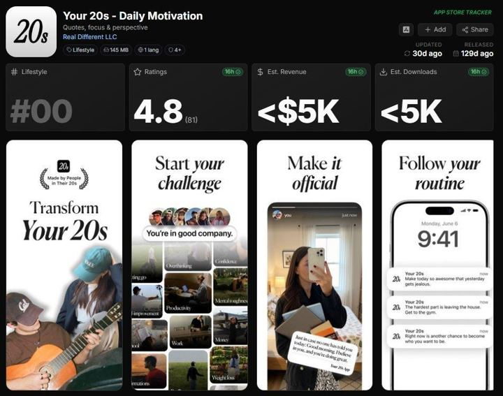

# 03 · Notification / lock-screen slides

<!-- HERO:START -->

**[See the example and how to make it →](EXAMPLE.md)** · [watch on X](https://x.com/brainextends/status/2099496707209994736)
<!-- HERO:END -->

## What it looks like
2 slides. Slide 1: aesthetic AI/lifestyle visual with an iPhone lock screen overlay showing 2-4 push notifications written in a witty/brutal brand voice ("Right now is another chance to become who you want to be"). Slide 2: the "app comes in naturally" — product/app screenshot or a single line. ([@brainextends](https://x.com/brainextends/status/2099496707209994736), [@enzoxmotion](https://x.com/enzoxmotion/status/2099622190970712321)).

## Hook patterns
Lock-screen time + 3 notifications from the brand: affirmation, call-out, joke. "your necklace texted you", "notifications from your jewelry box".

## Why it spreads
Feels like a meme/screenshot, instantly readable, relatable voice; 2 slides = high completion.

## Production recipe
Figma/Canva lock-screen template (generic iOS-style, no Apple logos), AI background (consistent palette), copy generated in batches of 50 by Claude in LC voice, human-edited. 
Prompt: *"Write 30 sets of 3 lock-screen notifications from 'Louise Carter' (jewelry) to its owner. Voice: warm, teasing best friend. Themes: showering with jewelry on, beach days, compliments, stacking, Monday. Max 70 chars each. No false claims; jewelry is 14K PVD waterproof."*

## LC adaptation — 3 scripts
A. Lock screen 7:42 AM: "LC: you showered with me on again. good." / "LC: someone's going to ask where your necklace is from today" / "LC: wear the hoops. trust." → Slide 2: product flat-lay "the necklace that texts back (it doesn't, but it's waterproof)".
B. Beach day: "LC: ocean? we're fine." / "LC: sunscreen won't hurt us either" / "LC: take the pic." → Slide 2: stack on wet wrist.
C. Monday: "LC: you don't have to take us off. ever." / "LC: 3 pieces. 0 thinking." → Slide 2: 3-piece stack with "build your 7 for $85".

## Test plan + metric
10 posts; metric: shares/1k and comments mentioning "where from"; Omni bio-link revenue `F03-*`. Pair with Klaviyo/Omnisend push-style SMS copy test (same voice).

## Compliance
[_COMPLIANCE.md](../_COMPLIANCE.md). Don't imitate Apple UI trademarks exactly; generic notification style. No "texted you" that could be read as real SMS spoofing.

<!-- EVIDENCE:START -->
## Wave 4 update: Fedotoff October 2026 swipe boards
- Japanese Taste: iPhone Notes checklist static (Japanese Taste), 238 days live (iPhone Notes / Text Messages / Reddit / Google Search / Breaking News / DMs / Amazon Review / TikTok Comments board). It looks like the user's own note.
- Stills, how-to and LC remakes: [adlibrary/](adlibrary/README.md).

## Evidence from X discovery (auto-generated)

| Date | Author | Post | Engagement | Grade | Gist |
|---|---|---|---|---|---|
| 2026-09-14 | [@brainextends](https://x.com/brainextends) | [link](https://x.com/brainextends/status/2099496707209994736) | 265L/497BM/16kV | SOME | 2-slide slideshow, AI visuals + phone-notification copy -> 1M views, app $1k->$5k/mo. |
| 2026-09-14 | [@enzoxmotion](https://x.com/enzoxmotion) | [link](https://x.com/enzoxmotion/status/2099622190970712321) | 208L/378BM/13kV | SOME | Same 2-slide notification-style slideshow case ($1k->$10k MRR claim). |
<!-- EVIDENCE:END -->
