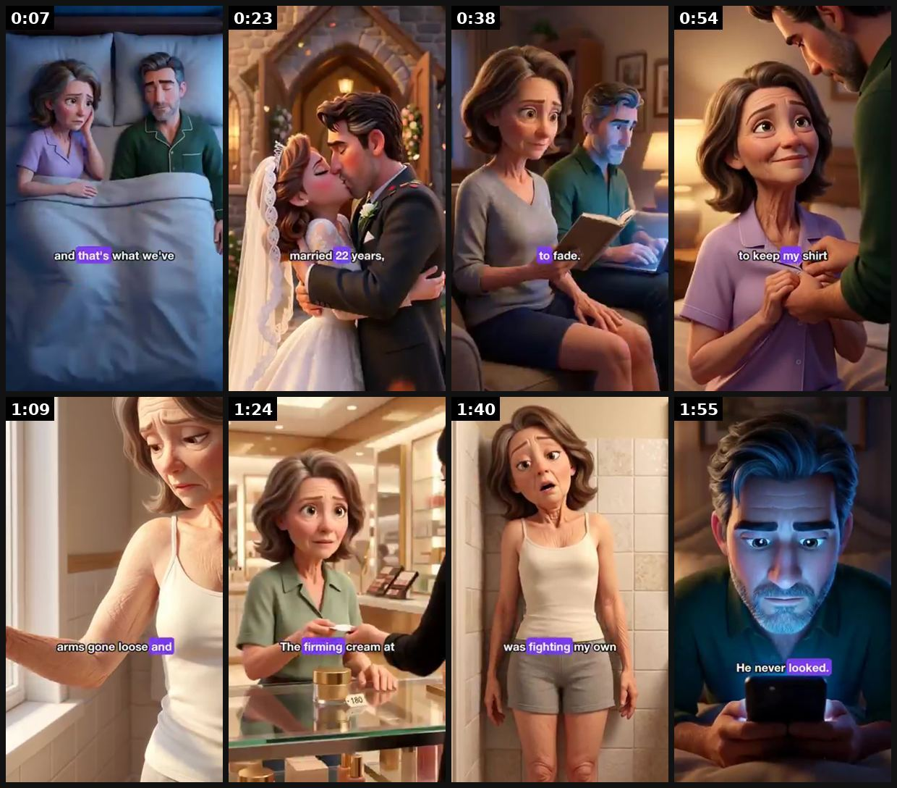
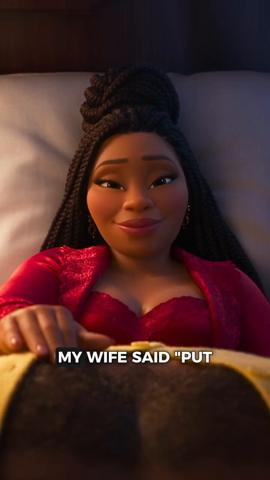
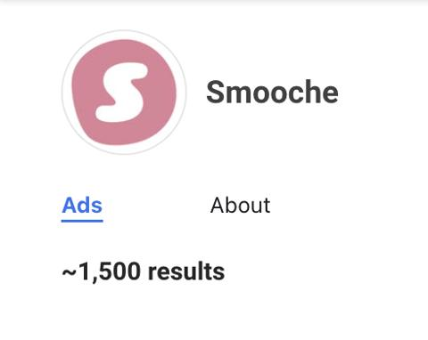
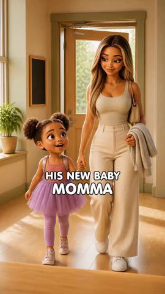
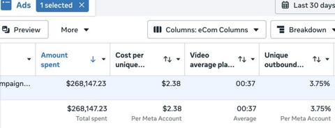
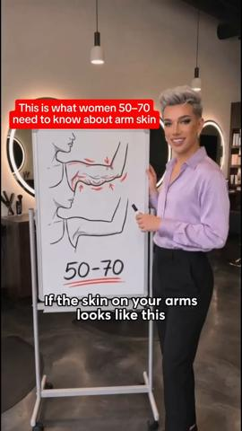
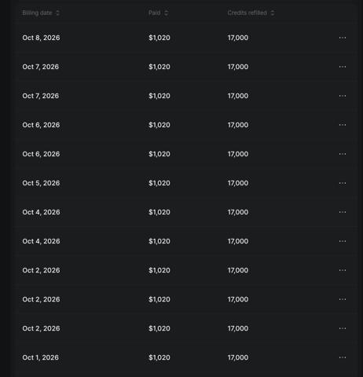
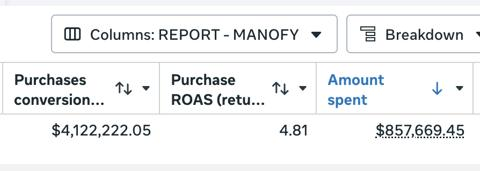

# 04 · AI song / singing story ad (Suno-style music-video ad): see it, then make it

[](https://x.com/LachezarVoynov/status/2108585587494019562)

**The example:** [@LachezarVoynov on X](https://x.com/LachezarVoynov/status/2108585587494019562) · 2:03 video · 57 likes, 3K views

**Watch it:** [open the post on X](https://x.com/LachezarVoynov/status/2108585587494019562) · [play the video file](https://video.twimg.com/ext_tw_video/2108585365560758272/pu/vid/avc1/320x568/SlR3MJ1mgUipB_WQ.mp4?tag=12)

> my first real attempt to fully automate video editing using AI this suno song ad was fully edited by the new AI Video Editing tool I am building internally using Claude Code i fed Claude a brief one my creative strategists made 1. An AI creative director broke down the whole storyline of the brief into multiple (100+) coherent scenes 2. Each scene was generated with Nano Banana using a custom prompt 3. Each Nano Bana…

## What you are seeing

A 2-minute Pixar-style 3D music video sung in the first person by a woman in her 50s, with word-highlighted lyric captions and roughly 3-second shots. It opens on the wound ("Last night my husband asked me to keep my shirt on / 22 years of marriage"), flashes back to young love, shows the slow fade (the new job, his phone face down), blames her crepey arm skin, runs through failed fixes ($180 firming cream, collagen coffee, dry brush), and stops as her sister arrives with the answer. It was edited end to end by an AI agent pipeline (Nano Banana stills, Kling 3.0 animation, Suno song).

## Beat by beat

The storyboard above samples the video every 0:15. Lines are the transcript for that stretch; on-screen text comes from OCR, so treat it as rough.

| Frame | Time | On screen | Said / sung |
|---|---|---|---|
| 1 | 0:00–0:15 | · | Last night my husband asked me to keep my shirt on 22 years of marriage And that's what we've come to He has no idea what that night |
| 2 | 0:15–0:30 | years, a a | We met when we were 24, married 22 years And for two decades they've been wanting me every night All of me like you couldn't keep his hands off me |
| 3 | 0:30–0:46 | · | In a kitchen, somewhere started to fade The new job, the lunches he never mentioned |
| 4 | 0:46–1:01 | · | His phone faced down on her the last phone offer Then he kept my shirt on I never said a word What do you even say? Why won't you look at me? |
| 5 | 1:01–1:17 | · | You can't ask that out So I blame my body The skin on my arms gone loose and wrinkled A kind you can pants and it takes a second to come back My legs creepy, my sister |
| 6 | 1:17–1:32 | · | Can I try? I've got elasticity to |
| 7 | 1:32–1:47 | 4? was fighting | · |
| 8 | 1:47–2:03 | · | · |

<details><summary>Full transcript (timestamped)</summary>

- `0:00` Last night my husband asked me to keep my shirt on
- `0:04` 22 years of marriage
- `0:07` And that's what we've come to
- `0:10` He has no idea what that night
- `0:16` We met when we were 24, married 22 years
- `0:24` And for two decades they've been wanting me every night
- `0:27` All of me like you couldn't keep his hands off me
- `0:32` In a kitchen, somewhere started to fade
- `0:39` The new job, the lunches he never mentioned
- `0:44` His phone faced down on her the last phone offer
- `0:52` Then he kept my shirt on
- `0:55` I never said a word
- `0:57` What do you even say?
- `1:00` Why won't you look at me?
- `1:02` You can't ask that out
- `1:05` So I blame my body
- `1:07` The skin on my arms gone loose and wrinkled
- `1:10` A kind you can pants and it takes a second to come back
- `1:14` My legs creepy, my sister
- `1:18` Can I try?
- `1:21` I've got elasticity to

</details>

## More real examples (8)

Other posts that show this format, or a close cousin of it. Click a thumbnail to open it on X.

| | | |
|---|---|---|
| [](https://x.com/LachezarVoynov/status/2107857984361808065)<br>**@LachezarVoynov** · 7:26 video · 8K views<br>my team just created a 40-page MD file breaking down how to create Suno song ads that rip $200k/mo+ in ad spend. Summary: 1. Suno songs are not songs. | [](https://x.com/adamtaylorl/status/2107425650478829611)<br>**@adamtaylorl** · images · 29K views<br>Smooche creative to study. | [](https://x.com/lifemaximised/status/2100659903488819256)<br>**@lifemaximised** · 4:54 video · 5K views<br>RYZE ($25M+/mo) AI song ad library breakdown. |
| [](https://x.com/therahulissar/status/2102465180567543939)<br>**@therahulissar** · image · 3K views<br>4-min AI song video, product not revealed until minute 3 - winner. | [](https://x.com/LachezarVoynov/status/2105679883300987071)<br>**@LachezarVoynov** · 2:38 video · 19K views<br>$25M/mo Meta spend: what scales (TOF creative first...). | [](https://x.com/mkwizrd/status/2088293230450512089)<br>**@mkwizrd** · image · 6K views<br>Brand reports AI song ad driving big order. |
| [](https://x.com/LachezarVoynov/status/2108263460005875769)<br>**@LachezarVoynov** · image · 47K views<br>About to cancel my Higgsfield subscription and I can’t be happier about it Last month we spent $35,000 on it When I found out how much we’re spending, | [](https://x.com/manojbash/status/2102083500052795710)<br>**@manojbash** · image · 183K views<br>Suno Ai Song Ads are absolutely ripping for us Launched this ad few months back and it's still the top spender If you haven't tried it yet give this a |   |

## How to make one like it

**The format in one line:** A full original song (30s to **4 minutes**) whose lyrics tell a relatable story — usually a woman's emotional problem → turning point → product as the quiet hero. Visuals are AI-generated scenes (realistic, Pixar-3D, or animated) cut to the lyrics, captions on screen like a lyric video. Product often **not revealed until late** (minute 3 in @therahulissar's winner). Variants:

**Why it works:** Songs are watched to the end (retention), emotionally sticky, feel like content not ads; novelty in feed; music lets you say a lot without a talking head. Long run-time works because Meta optimises on purchase, not view length.

**Contents:** [1. Structure](#1-copy-the-structure) · [2. Shot by shot](#2-shot-by-shot-remake) · [3. Script and hooks](#3-write-the-script) · [4. Prompts](#4-prompts) · [5. Tools and settings](#5-tools-and-settings) · [6. Louise Carter remake](#6-louise-carter-remake) · [7. Variants and test](#7-variants-and-test-plan) · [8. Pitfalls](#8-pitfalls)

### 1. Copy the structure

Use the example's timing as your beat sheet. Keep the beat, change the words and the product.

| Beat | Time | In the example | Your version |
|---|---|---|---|
| 1 | 0:07 | Last night my husband asked me to keep my shirt on 22 years of marriage And that's what we've come to He has no idea what that night | … |
| 2 | 0:23 | We met when we were 24, married 22 years And for two decades they've been wanting me every night All of me like you couldn't keep his hands | … |
| 3 | 0:38 | In a kitchen, somewhere started to fade The new job, the lunches he never mentioned | … |
| 4 | 0:54 | His phone faced down on her the last phone offer Then he kept my shirt on I never said a word What do you even say? Why won't you look at me | … |
| 5 | 1:09 | You can't ask that out So I blame my body The skin on my arms gone loose and wrinkled A kind you can pants and it takes a second to come bac | … |
| 6 | 1:24 | Can I try? I've got elasticity to | … |
| 7 | 1:40 | on screen: 4? was fighting | … |
| 8 | 1:55 | (visual beat, see frame 8) | … |

### 2. Shot-by-shot remake

**Target length / size:** 60-90s cut (test 30s and 3-4 min too), 1080x1920

| # | Time / slot | What we see (visual + camera) | Dialogue / on-screen text |
|---|---|---|---|
| 1 | 0-3s | Emotional close-up of the heroine (AI image-to-video, slow push-in) | Sung cold-open lyric that is a confession: "I took it off for the wedding photos..." Lyric caption centred, 2 lines max |
| 2 | 3-30s | Verse 1: 4-6 problem scenes, 4-6s each, cut on the beat | Lyrics name concrete moments (the green ring mark, the drawer of broken chains) |
| 3 | 30-45s | Chorus: the turning point, a friend/sister hands her the gift | The hook line of the song repeats here; this is the line people remember |
| 4 | 45-70s | Verse 2: life after, compliments, swimming, the daughter's graduation | Lyrics show proof through other people noticing |
| 5 | 70-90s | Outro: REAL product footage (not AI) on skin, then end card | Product name sung once; on-screen offer + "AI-generated visuals" label |

<details><summary>Playbook shot list (Louise Carter version from the README)</summary>

Shot-by-shot (60-90s cut):
0-3s cold open lyric line that is a hook statement ("I took it off for the wedding photos…") over an emotional close-up · 3-30s verse: the problem scenes · 30-45s chorus: turning point (friend/sister gives the gift) · 45-70s verse 2: life after (compliments, confidence) · 70-90s outro: product name sung once + on-screen offer.

</details>

### 3. Write the script

Open with one of these hooks (first 1–3 seconds, or the headline on a static):

First lyric = story conflict; sung confession; "I didn't know…"; question sung over silence; very specific scene (wine, wedding photos, airport).

Then fill the beats from the table above. Pull the wording from real customer reviews, not from ad copy: a review line beats a copywriter line almost every time. Read every line out loud and cut anything you would not say to a friend. Ready-made Louise Carter scripts are in section 6; hand [BOT.md](BOT.md) to any AI agent to write versions for another brand.

### 4. Prompts

**Suno (v4.5+, paid plan with commercial rights)**

```text
Style: emotional female pop ballad, piano and strings, 82 bpm, intimate close-mic vocal, builds at chorus. Lyrics: [paste verse/chorus/verse/outro, 120-180 words, product named once in the outro].
```

**Midjourney (keyframes)**

```text
cinematic still of a 38-year-old woman sitting on the edge of a bathtub holding a tarnished necklace, soft window light, shallow depth of field, Pixar-adjacent 3D or photoreal (pick one and keep it), consistent character --cref [heroine image] --ar 9:16
```

**Kling 2.x / Seedance / Veo (image-to-video)**

```text
5s, slow dolly-in, subtle hand movement, no camera shake, keep face consistent, no text
```

### 5. Tools and settings

1. Claude: write story brief from real review mining (top 20 LC 5-star reviews) → lyrics (verse/chorus/verse/outro, 120-180 words) with product named once.
2. Suno (paid plan with commercial rights) → generate 6-10 takes, pick 1. Optional: ElevenLabs for spoken bridge.
3. Visuals: Midjourney/Nano Banana keyframes with one consistent heroine → Kling/Seedance/Veo image-to-video 5-8s shots; or Pixar-style per F05.
4. Edit in CapCut: lyric captions, beat cuts, 9:16 + 4:5, real product shots for the reveal (use LC product footage, not AI-rendered jewelry, to avoid misrepresenting the product).
Cost ~$10-60 + 2-4h. Make 3 songs per concept (different genres), not 30 hook variants.

| Setting | Value |
|---|---|
| Canvas | 1080×1920 (9:16) master; crop a 1080×1350 (4:5) cut for feed placements |
| Frame rate | 30 fps (shoot 60 fps for slow-motion water or sparkle shots) |
| Camera | Phone main lens at 1x, exposure locked on skin, HDR off, grid on; tripod or a phone clamp for product shots |
| Light | One soft key at 45° (window or ring light), white card as fill; side light for metal sparkle |
| Audio | Lavalier or phone 15–20 cm from the mouth; mix voice at -14 LUFS, music at -28 to -30 dB under voice |
| Captions | Burned in, 2–5 words per line, 64–80 px bold sans, white with a black stroke or pill; keep text inside the safe zone (top 220 px and bottom 420 px clear, 64 px side margins) |
| Pacing | A visual change every 1.5–3 s; the hook lands in the first 1.5 s with no logo intro |
| Edit / export | CapCut or Premiere; H.264, 12–20 Mbps, AAC 320 kbps; upload natively to each platform, not via links |

### 6. Louise Carter remake

**A. "The necklace I never take off" (ballad, 60-90s)** — V1: "Mama's chain turned green the summer I turned twenty / I kept it in a box, I was scared to wear it any…" Chorus: "Now I swim in it, I sleep in it, I never take it off / 14 karat glow that the ocean can't wash off." V2: daughter's graduation, same necklace in every photo. Outro (spoken): "Louise Carter. Waterproof, 14K PVD. Build any 7 for $85."
**B. "Bridesmaid anthem" (upbeat pop, 45s)** — five friends getting ready; lyric lines per friend ("Jess lost every earring she has owned…") chorus "matching stacks, we're crying in the bathroom" → reveal matching initial necklaces gift.
**C. "Shower song" (comedic, 30s)** — woman singing in the shower about all the jewelry she used to have to take off ("rings on the sink, down the drain, goodbye") → ends wearing her LC stack in the shower.

Brand rules, claims you can and cannot make, and more scripts: [brands/louise-carter.md](brands/louise-carter.md). Step-by-step from idea to scale: [STAGES.md](STAGES.md).

### 7. Variants and test plan

**Test plan:** 3 concepts × 1 song each, 1 CBO, ad set per persona (gifting / self-purchase 25-40 / 40-55), $100/day each for 5 days. Metrics: hook rate (3s/impr) ≥25%, hold to 50% ≥10%, Omni first-order ROAS and new-customer % vs account baseline. Scale rule: beats account CPA by 20% after $500 → raise 30%/day (the $500→$12K/day ramp in @lorenzo_pravata's case came from a single winner).

**Naming:** `F04-<variant>-<hook##>-<date>` so results map back to this folder. Change one thing per test (hook, narrator, length or offer), never two.

### 8. Pitfalls

- Generate 6-10 song takes and pick one; the first take is almost never the one.
- AI-rendered jewelry misrepresents the product. Use real product footage for every shot where the piece is visible up close.
- Lyrics that insult the viewer (insecurity angles) can win on supplements but damage a gifting brand; aim at aspiration.
- Only use music you have commercial rights to; do not imitate a real artist's melody or voice.
- Slow open: if the first 1.5 s does not show the hook visually, most people swipe.
- Logo or brand intro at the start reads as an ad; put the brand at the end.
- Captions covered by the platform UI: check the safe zone on a real phone before posting.
- Music over the voice: keep music at least 14 dB under speech.

**Compliance:** [_COMPLIANCE.md](../_COMPLIANCE.md). Commercial-rights music only (song lawsuits over ad music are rising — @RobertFreundLaw). Characters are fictional; no fake dermatologist/stylist credentials. AI-made visuals → AI label. Don't copy any competitor's lyrics or melody.

## Field notes

Newer observations live in the playbook: [Wave 2d update: the Resilia / Smooche sung-drama VSL blueprint](README.md) · [Wave 7: Lachezar Voynov's automated Suno-song pipeline + the "keep my shirt on" song (Oct 9, 2026)](README.md) · [Wave 8 update: Voynov page, Adam Taylor teardowns, queued posts (Oct 9, 2026)](README.md) · [Wave 3 update: brands & apps crushing it (Oct 2026)](README.md)

## More examples

Every post we found for this format, with transcripts: [examples/](examples/README.md). Playbook: [README.md](README.md). Agent brief: [BOT.md](BOT.md).
