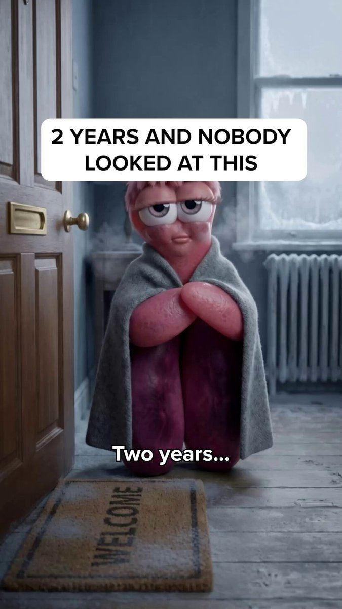

# 04 · AI song / singing story ad

<!-- HERO:START -->

**[See the example and how to make it →](EXAMPLE.md)** · [watch on X](https://x.com/LachezarVoynov/status/2108585587494019562)
<!-- HERO:END -->

## What it looks like
A full original song (30s to **4 minutes**) whose lyrics tell a relatable story — usually a woman's emotional problem → turning point → product as the quiet hero. Visuals are AI-generated scenes (realistic, Pixar-3D, or animated) cut to the lyrics, captions on screen like a lyric video. Product often **not revealed until late** (minute 3 in @therahulissar's winner). Variants:
- **Ballad/drama** (Smooche): "Lisa poured the wine and I started crying… he left, and I'm the one who looks like she lost… Lisa has been a dermatologist for 15 years… Sit down, I brought something" (transcript from @EcomSapo's example).
- **Comedic/rap** (Ecombos example): "3 a.m. wide awake… got home and saw my wife laughing with the neighbor".
- **Long-form Pixar 3D skit + song** (RYZE, @lifemaximised).
- **Male-angle cold open** (@qwertyu_alex's 5x ROAS ad, transcript): "I caught my wife in bed with a trainer. He was 26. I was 45" — a sung confession as the hook.
- Targeting women 45+ by naming insecurities (7 Suno links, @LachezarVoynov) — LC should use aspiration, not insecurity.

Shot-by-shot (60-90s cut):
0-3s cold open lyric line that is a hook statement ("I took it off for the wedding photos…") over an emotional close-up · 3-30s verse: the problem scenes · 30-45s chorus: turning point (friend/sister gives the gift) · 45-70s verse 2: life after (compliments, confidence) · 70-90s outro: product name sung once + on-screen offer.

## Hook patterns
First lyric = story conflict; sung confession; "I didn't know…"; question sung over silence; very specific scene (wine, wedding photos, airport).

## Why it spreads
Songs are watched to the end (retention), emotionally sticky, feel like content not ads; novelty in feed; music lets you say a lot without a talking head. Long run-time works because Meta optimises on purchase, not view length.

## Production recipe
1. Claude: write story brief from real review mining (top 20 LC 5-star reviews) → lyrics (verse/chorus/verse/outro, 120-180 words) with product named once.
2. Suno (paid plan with commercial rights) → generate 6-10 takes, pick 1. Optional: ElevenLabs for spoken bridge.
3. Visuals: Midjourney/Nano Banana keyframes with one consistent heroine → Kling/Seedance/Veo image-to-video 5-8s shots; or Pixar-style per F05.
4. Edit in CapCut: lyric captions, beat cuts, 9:16 + 4:5, real product shots for the reveal (use LC product footage, not AI-rendered jewelry, to avoid misrepresenting the product).
Cost ~$10-60 + 2-4h. Make 3 songs per concept (different genres), not 30 hook variants.

## LC adaptation — 3 scripts (lyric outlines)
**A. "The necklace I never take off" (ballad, 60-90s)** — V1: "Mama's chain turned green the summer I turned twenty / I kept it in a box, I was scared to wear it any…" Chorus: "Now I swim in it, I sleep in it, I never take it off / 14 karat glow that the ocean can't wash off." V2: daughter's graduation, same necklace in every photo. Outro (spoken): "Louise Carter. Waterproof, 14K PVD. Build any 7 for $85."
**B. "Bridesmaid anthem" (upbeat pop, 45s)** — five friends getting ready; lyric lines per friend ("Jess lost every earring she has owned…") chorus "matching stacks, we're crying in the bathroom" → reveal matching initial necklaces gift.
**C. "Shower song" (comedic, 30s)** — woman singing in the shower about all the jewelry she used to have to take off ("rings on the sink, down the drain, goodbye") → ends wearing her LC stack in the shower.

## Test plan + metric
3 concepts × 1 song each, 1 CBO, ad set per persona (gifting / self-purchase 25-40 / 40-55), $100/day each for 5 days. Metrics: hook rate (3s/impr) ≥25%, hold to 50% ≥10%, Omni first-order ROAS and new-customer % vs account baseline. Scale rule: beats account CPA by 20% after $500 → raise 30%/day (the $500→$12K/day ramp in @lorenzo_pravata's case came from a single winner).

## Compliance
[_COMPLIANCE.md](../_COMPLIANCE.md). Commercial-rights music only (song lawsuits over ad music are rising — @RobertFreundLaw). Characters are fictional; no fake dermatologist/stylist credentials. AI-made visuals → AI label. Don't copy any competitor's lyrics or melody.

## Wave 2d update: the Resilia / Smooche sung-drama VSL blueprint
- **What they run:** Resilia's best ads are songs "seven to ten minutes long, where one person sings about the worst chapter of their life and the product only shows up after the halfway mark" ([Maxfusion teardown](https://maxfusion.ai/blog/inside-resilias-song-ads)). Smooche (cosmetics, not a supplement) runs the same sung structure: "I had to sit next to my ex-husband and the woman he left me for… throughout my daughter's graduation" (10.5 min) and "At 63, I ran into my ex-husband at Walmart" (5:37, #1 of 721 brand ads on Atria, 70 days live).
- **12 beats:** ordinary world → humiliation (by the closest person) → wound deepens (friends knew) → frozen → hero sees it too → failed fixes (gym, diets, a doctor who says "it's age") → mentor (close and credible: brother who runs a clinic, best friend who is a dermatologist, Seoul colleague) → gift → doubt → week-by-week climb noticed by others → vindication that reverses the opening insult → pitch in the last ~minute.
- **Three story frames scaling** (@Salifsibane16): bumping into the ex (open at the end, rewind), week-by-week timeline (keep week 1 small), cheating → self-improvement.
- **Sub-avatar decides everything:** Resilia runs several versions of the same song, one per sub-avatar (e.g. "47, married, 30 extra pounds, afraid his wife no longer finds him attractive").
- **Tools now commoditising it:** Arcads "Singing Ads" (launched Sep 30, @EcomSapo: "this is going to get abused"); Suno for the track.
- **Counter-signals:** @ErJithin (Oct 6) sees song ads losing top impression rank to BOF statics in Resilia and Koriderm libraries; @TheIvanKreimer measured 90-95% drop-off before the product. Plan song ads as one lane, not the account.
- **Revenue claims:** Resilia "$14M from song ads" (Maxfusion), "$10-15M/month" (@lorenzo_pravata), "$20-30M/month" (X replies), "$36M/month" (@MaximilianMoj; BrandSearch estimate $19.9-36.1M/mo); Smooche "$22M/month" (@EcomSapo; BrandSearch $11.9-21.7M; EcomScout $2.9-7.2M). _Revenue figures are self-reported or third-party estimates and are unverified._
- Spoken (non-sung) version: **F91**. Foreign-insider mechanism: **F92**.

<!-- WAVE7 -->
## Wave 7: Lachezar Voynov's automated Suno-song pipeline + the "keep my shirt on" song (Oct 9, 2026)
Source: [@LachezarVoynov](https://x.com/LachezarVoynov/status/2108585587494019562) (an agency producing Meta creatives for 7- to 9-figure DTC brands; he says it oversees $25M/month in Meta spend). The example on this format's page is his 2:03 cut.

**The ad:** Pixar-style 3D, a woman in her 50s, sung first person, with word-highlighted lyric captions. The beats in his cut:
| Time | Beat | Lyric |
|---|---|---|
| 0:00 | Wound hook | "Last night my husband asked me to keep my shirt on. 22 years of marriage, and that's what we've come to." |
| 0:20 | What was lost | "We met when we were 24… he couldn't keep his hands off me in a kitchen full of people" |
| 0:36 | The fade | "A new job, the lunches he never mentioned, his phone face down on the counter, the lights going off first" |
| 1:04 | Blaming the body | "So I blame my body. The skin of my arms… crepey, my sister calls it" |
| 1:24 | Failed fixes | "The firming cream at $180, the collagen in my coffee, the body lotion that promised elasticity, the dry brush" |
| 1:38 | Rock bottom | "It felt like I was fighting my own body. And losing… He never looked." |
| 1:56 | Mentor arrives | "And my sister came over, and she saw it on my face…" (his cut ends here, before the product) |

**It is live on Meta.** The same lyrics ("One night my husband asked me to keep my shirt on…") run as at least 3 Resilia oil-of-oregano ads that started 2026-10-08, from the Resilia and "Midlife Wellness Journal" pages, at 4:49 each. Two more ads from the same batch keep the middle verses and swap the opening wound: "I put on lingerie… he said he wasn't feeling well" (4:15) and "My husband wouldn't hold my hand in public anymore" (4:31). The visuals are re-cast with different protagonists. So one song is re-cut with new hooks and re-cast (F97), and the long Meta version carries the mechanism, the week-by-week change, the vindication and the offer after the mentor beat (see F04/F97 adlibrary, wave 6).

**His pipeline (agent-built in Claude Code):**
1. A strategist writes a brief, and an "AI creative director" agent splits the storyline into 100+ coherent scenes.
2. Each scene becomes a Nano Banana image from a custom prompt.
3. Each image is animated with Kling 3.0 (image-to-video).
4. The Suno song is generated automatically from the lyrics.
5. The agent assembles the cut and adds captions in code.
6. Review happens in Frame.io: strategists' comments become revision prompts. This ad needed 4 revision rounds.
- Cost side: he says the agency spent $35K/month on Higgsfield and is moving generation to an aggregator API (Kie.ai), expecting about 40% lower cost ([post](https://x.com/LachezarVoynov/status/2108263460005875769)).
- What practitioners flagged in the replies: **character drift** across Kling shots by about scene 10, so lock a character sheet and reference images per shot. **The brief quality decides the output** more than the model does. **A machine-cut song needs human timing**: cut on the beat and the syllable. In the scene split, output each shot's duration, continuity notes and "must not change" items *before* generating. For the Frame.io webhook, persist the job and acknowledge before rendering, or retries spawn duplicate renders.

**His Suno rules** (from his team's "40-page MD file", [post](https://x.com/LachezarVoynov/status/2107857984361808065), with a 7:26 Resilia example):
1. A Suno song is not a song. It is long-form emotional storytelling for cold (top-of-funnel) audiences who have no intention of buying.
2. Nothing matters more than the hook: highly specific, highly relatable, a shocking moment that hits the audience's deepest fear.
3. The average clip is about **3 seconds** (a 2-min cut is about 40 shots, and a 7-min cut is about 140).
4. Length doesn't matter: 3-min and 10-min winners can spend at similar levels.
5. Every winner has **9 elements** in a hero's-journey arc. He did not publish the list. Our reconstruction from his two examples: (1) wound hook, (2) what was lost, (3) the slow fade or suspicion, (4) self-blame, (5) failed fixes, (6) rock bottom, (7) a close mentor, (8) the mechanism plus the week-by-week change, (9) vindication that reverses the hook, followed by a spoken offer and CTA ("70% off, 30-day money back… get your wife back").
- He also says top-of-funnel winners need a **higher CPA tolerance**: judge them by the share of new visitors they bring, not blended ROAS ([post](https://x.com/LachezarVoynov/status/2105679883300987071)).
- His format lists name two song sub-variants: "AI Musicals" and the "Text-messages AI song" (lyrics over a phone chat). See F103 for the chat look.

**LC version:** "She asked me to take my necklace off for the photos" (bride's mother, ballad). The beats are wound → the jewelry that always turned green → failed fixes (clear nail polish, taking it off for every shower) → a sister gives her the LC chain → 6 months of showers, a pool and a wedding → vindication at the wedding photo, then "Any 7 for $85". Use the pipeline above with a locked character sheet, real LC product footage for every product shot, and an AI-content label.
**Do not copy:** body-shaming hooks, invented health mechanisms ("parasites building walls"), and posting the song from pages posing as independent journals (see F80/F97).
<!-- /WAVE7 -->

<!-- W8NOTE -->
## Wave 8 update: Voynov page, Adam Taylor teardowns, queued posts (Oct 9, 2026)
- **Voynov's Suno variants:** "10-min Suno songs" (Resilia) on his [10/10 'illegal' ads list](https://x.com/LachezarVoynov/status/2097713680255189206), "Text-messages AI song" (Scribe) and "AI Musicals" in his [14 AI TOF formats](https://x.com/LachezarVoynov/status/2104599048493666326). Suno sits in his [5 formats every account needs](https://x.com/LachezarVoynov/status/2080681434839167212) and his [$300k/mo wrappers](https://x.com/LachezarVoynov/status/2097351286094021034).
- **PetLab's unaware ad is an AI song from the dog's POV:** "Mom, when I drag my nose across the carpet, that's me asking for help". The symptom and the product go unnamed, and it runs to a quiz ([@adamtaylorl thread](https://x.com/adamtaylorl/status/2108558106984595660)). LC: a song from the jewelry box's POV ("she takes me off every time she showers").
- **Do not copy:** "7 SUNO song ad examples selling to Women 45+ using their insecurities… Is it ethical? Probably not" ([post](https://x.com/LachezarVoynov/status/2100612763487740236)). Write to desire and relief, not shame.
<!-- /W8NOTE -->

<!-- EVIDENCE:START -->
## Wave 3 update: brands & apps crushing it (Oct 2026)
- Smooche ($22M/mo skincare): singing ads are "one of their favorite acquisition weapons"; Arcads now makes them a commodity, so expect saturation ([@EcomSapo](https://x.com/EcomSapo/status/2105288429873528875)).
- RYZE (mushroom coffee, $25M+/mo): long-form Pixar 3D song skits built on the Resilia plot (husband cheats, wife is the main character, postpartum body insecurity), then the SAME song re-made for a different couple, ethnicity, accent and gender: one concept cloned across every ICP ([@lifemaximised](https://x.com/lifemaximised/status/2100659903488819256)). LC: clone a winning song across bride / mom / sister personas (F97); skip insecurity-shaming.

## Evidence from X discovery (auto-generated)

| Date | Author | Post | Engagement | Grade | Gist |
|---|---|---|---|---|---|
| 2026-08-10 | [@LachezarVoynov](https://x.com/LachezarVoynov) | [link](https://x.com/LachezarVoynov/status/2086842038457098499) | 396L/1453BM/87kV | VALUE | 29 TOF video ad formats to test on Meta (transformation, Suno song, skit, beginner-intermediate-expert...). |
| 2026-10-06 | [@adamtaylorl](https://x.com/adamtaylorl) | [link](https://x.com/adamtaylorl/status/2107425650478829611) | 357L/463BM/28kV | SOME | Smooche creative to study. |
| 2026-09-30 | [@EcomSapo](https://x.com/EcomSapo) | [link](https://x.com/EcomSapo/status/2105288429873528875) | 157L/218BM/23kV | VALUE | Smooche ($22M/mo skincare) uses singing ads as acquisition weapon. |
| 2026-08-06 | [@rayjbjang](https://x.com/rayjbjang) | [link](https://x.com/rayjbjang/status/2085447071990251986) | 155L/207BM/21kV | VALUE | 9-fig founder group chats sharing singing animation ads - format printing. |
| 2026-10-02 | [@Ecombos_Ai](https://x.com/Ecombos_Ai) | [link](https://x.com/Ecombos_Ai/status/2106058921559630022) | 130L/138BM/10kV | SOME | Singing ad system (Ecombos) - tool/community pitch. |
| 2026-09-17 | [@LachezarVoynov](https://x.com/LachezarVoynov) | [link](https://x.com/LachezarVoynov/status/2100612763487740236) | 119L/339BM/9kV | VALUE | 7 Suno song ad examples selling to women 45+ (links). |
| 2026-09-22 | [@qwertyu_alex](https://x.com/qwertyu_alex) | [link](https://x.com/qwertyu_alex/status/2102454127494094887) | 102L/130BM/7kV | VALUE | One AI song ad: 5x ROAS, +$11k revenue; still early but will crowd. |
| 2026-09-17 | [@lifemaximised](https://x.com/lifemaximised) | [link](https://x.com/lifemaximised/status/2100659903488819256) | 63L/80BM/5kV | VALUE | RYZE ($25M+/mo) AI song ad library breakdown. |
| 2026-09-22 | [@therahulissar](https://x.com/therahulissar) | [link](https://x.com/therahulissar/status/2102465180567543939) | 51L/20BM/3kV | VALUE | 4-min AI song video, product not revealed until minute 3 - winner. |
| 2026-10-08 | [@antonioventre_](https://x.com/antonioventre_) | [link](https://x.com/antonioventre_/status/2108228200421576872) | 47L/49BM/2kV | VALUE | Supplement 3.17x ROAS: 1 CBO/product, 1 ad set/persona; creatives = Suno AI ads, professor interview... |
| 2026-10-05 | [@indiewhacker](https://x.com/indiewhacker) | [link](https://x.com/indiewhacker/status/2107121214716297532) | 45L/4BM/2kV | VALUE | Counterpoint: 92% of song ads suck and won't take spend; quality of lyrics/angle matters. |
| 2026-08-14 | [@mkwizrd](https://x.com/mkwizrd) | [link](https://x.com/mkwizrd/status/2088293230450512089) | 39L/4BM/5kV | SOME | Brand reports AI song ad driving big order. |
| 2026-10-01 | [@lorenzo_pravata](https://x.com/lorenzo_pravata) | [link](https://x.com/lorenzo_pravata/status/2105684266457637009) | 38L/58BM/3kV | VALUE | 4-min Suno song ad became top spender: beat ROAS in 5 days, $500->$12K+/day. |
| 2026-09-08 | [@LachezarVoynov](https://x.com/LachezarVoynov) | [link](https://x.com/LachezarVoynov/status/2097351286094021034) | 86L/102BM/10kV | VALUE | $300k/mo strategy: wrappers that became top spenders = skits, carpool ads, Suno songs, AI Pixar-character podcasts; hooks must target different people. |
| 2026-10-05 | [@Ecombos_Ai](https://x.com/Ecombos_Ai) | [link](https://x.com/Ecombos_Ai/status/2107157131010965744) | 22L/14BM/1kV | SOME | AI ecom format tiers: S = AI animation, AI singing, AI native statics → advertorial; A = AI before/after, AI podcast, talking product; F = AI avatar reading script, AI street interviews. |
| 2026-08-07 | [@zackpaid](https://x.com/zackpaid) | [link](https://x.com/zackpaid/status/2085621175292670183) | 9L/20BM/2kV | SOME | 11 AI formats (agency pitch): native UGC, founder, claymation, Pixar 3D, jingle, screen recording, before/after, testimonial compilation, cinematic demo, mini-doc, meme. |
| 2026-09-16 | [@alexgoughcooper](https://x.com/alexgoughcooper) | [link](https://x.com/alexgoughcooper/status/2100264709672849475) | 321L/921BM/49kV | VALUE | 12+ ad libraries for storytelling AI animation ads: Quasi, Resilia, Ankhway, Lymphoria, Koriderm, Nebula, Rise, Liven, Moongrade, BioRoot, Cosmetic Times (Smooche), Tradesman. |
| 2026-09-24 | [@EcomSapo](https://x.com/EcomSapo) | [link](https://x.com/EcomSapo/status/2103047669556166886) | 152L/212BM/22kV | VALUE | Smooche top ad of 1,600+: "At 63 I ran into my ex at Walmart" + Seoul colleague, 5:37; Atria #1 of 721, 70d. "Resilia blueprint works for skincare." |
| 2026-09-15 | [@Salifsibane16](https://x.com/Salifsibane16) | [link](https://x.com/Salifsibane16/status/2099891350015512903) | 105L/236BM/44kV | VALUE | 3 AI song-ad story frameworks: bumping into ex (start at end), week-by-week timeline, cheating → self-improvement. |
| 2026-10-06 | [@ErJithin](https://x.com/ErJithin) | [link](https://x.com/ErJithin/status/2107419279872360910) | 0L/1BM/0kV | SOME | Story-song ads losing top impression rank to BOF statics in Koriderm/Resilia libraries. |
<!-- EVIDENCE:END -->
