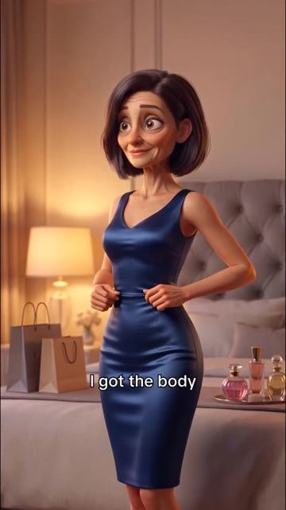
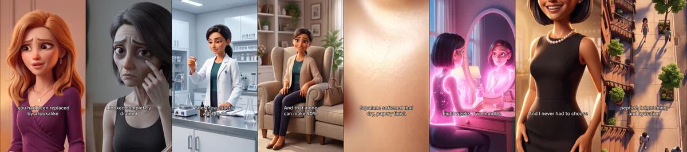
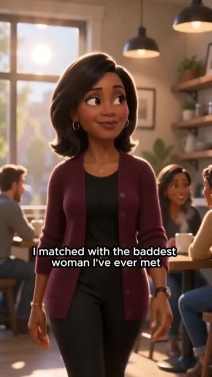
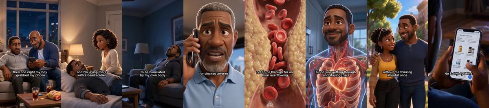
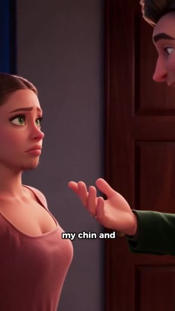
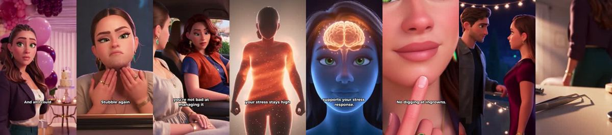
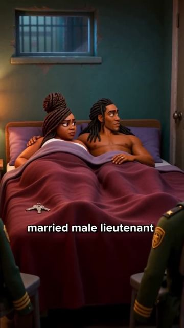
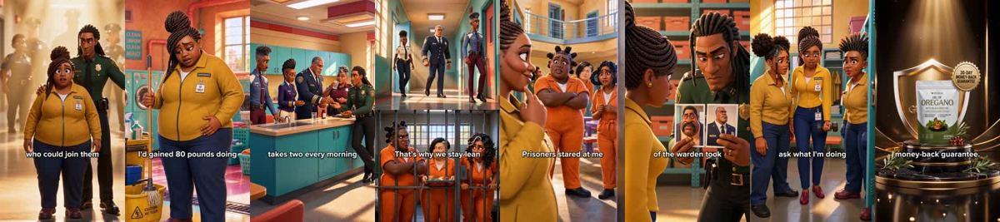
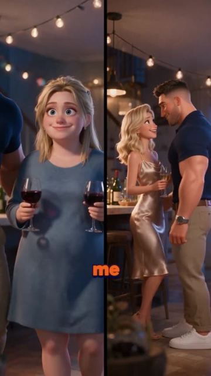
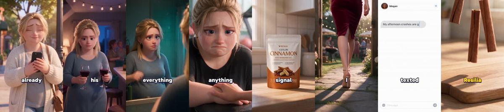

# Meta ad-library examples for F04

<!-- WAVE6 -->
## Wave 6: Resilia & Smooche live Meta ads (Oct 2026)

Pulled from the public Meta Ad Library on 2026-10-09 (Resilia: aged garlic, Ceylon cinnamon, oil of oregano; Smooche: color-changing foundation, Reverse Time peptide serum). Days live are counted to 2026-10-09; most video ads were new tests that week, while the long runners are statics and catalog templates. Transcripts are automatic. Brand claims are the advertisers', not verified, and many are health claims we would never make. The **Do not copy** line flags deceptive tactics (persona "publication" pages, undisclosed AI actors and "experts", fake stock counts).

### Smooche · Cosmetic Times: “I lost the weight, I cut the body The body I had chased for ten long…” (18 days live)

- **Ad:** [Meta Ad Library #1443044231065406](https://www.facebook.com/ads/library/?id=1443044231065406) · video 4:18 · page “Cosmetic Times” · started 2026-09-20 · 1 copies · lands on `smooche.com/pages/srm01`
- **What happens:** Opens: “I lost the weight, I cut the body The body I had chased for ten long years The my best friend looked at my face And said, honey If you were famous people It's where you had been replaced by a local…”
- **Why it works:** A sung story keeps people listening to the end. Resilia and Smooche run AI ballads ("He came with me, but left with my best friend"; "I lost the weight… ten long years") with lyric captions and stock-drama visuals.
- **How to make one:** Write a 3-verse story song (wound → discovery → glow-up), generate it with a Suno-style tool, cut to lyric captions, and put the product in the chorus.
- **Do not copy:** Some of the lyrics are explicit or body-shaming. Keep ours brand-safe.
- **LC remake:** A country ballad: "Seven little pieces that never turned green", sung over a summer of showers, pools and weddings.

Transcript (auto, first ~70 s)

> I lost the weight, I cut the body The body I had chased for ten long years The my best friend looked at my face And said, honey If you were famous people It's where you had been replaced by a local like She was right, the body showed up My face got left behind The weight came off fast She opened you one, help me get the body I had pinned And my vision bought for years The arms, the waist, all of it But my face, my cheeks went hollow My eyes looked f***ing tired Skin on top, look dry dull Unless firm, I have the dress I have the body butter But the neckline I looked completely drained To a nice bowl of liquid Looking face the deal

### Resilia · Active Longevity Review: “I matched with the baddest woman I've ever met Had her in my bed, her…” (1 day live)

- **Ad:** [Meta Ad Library #1544772294041365](https://www.facebook.com/ads/library/?id=1544772294041365) · video 11:03 · page “Active Longevity Review” · started 2026-10-07 · 1 copies · lands on `resilia.shop/products/resilia-aged-odorless-garlic`
- **What happens:** Opens: “I matched with the baddest woman I've ever met Had her in my bed, her body pressed against mine Begging me with her eyes And my d*** is laid dead like a f***ing coward Let me tell you what happened…”
- **Why it works:** A sung story keeps people listening to the end. Resilia and Smooche run AI ballads ("He came with me, but left with my best friend"; "I lost the weight… ten long years") with lyric captions and stock-drama visuals.
- **How to make one:** Write a 3-verse story song (wound → discovery → glow-up), generate it with a Suno-style tool, cut to lyric captions, and put the product in the chorus.
- **Do not copy:** Some of the lyrics are explicit or body-shaming. Keep ours brand-safe.
- **LC remake:** A country ballad: "Seven little pieces that never turned green", sung over a summer of showers, pools and weddings.

Transcript (auto, first ~70 s)

> I matched with the baddest woman I've ever met Had her in my bed, her body pressed against mine Begging me with her eyes And my d*** is laid dead like a f***ing coward Let me tell you what happened because if you're divorced And think about I didn't want to, I told myself I was healing, the truth was I was terrified of failing in front of another woman Said just see, she She laughed at my joke, she was smart, she was...

### Resilia · Gut Health Insider: “The man who touched my chin and laughed It feels like touching a guy…” (1 day live)

- **Ad:** [Meta Ad Library #1645580000337205](https://www.facebook.com/ads/library/?id=1645580000337205) · video 4:30 · page “Gut Health Insider” · started 2026-10-07 · 1 copies · lands on `resilia.shop/products/resilia-oil-of-oregano-softgels`
- **What happens:** Opens: “The man who touched my chin and laughed It feels like touching a guy Four months later, Brought him a night He looked once and twice Stood frozen by the door You look nothing like before And all I…”
- **Why it works:** A sung story keeps people listening to the end. Resilia and Smooche run AI ballads ("He came with me, but left with my best friend"; "I lost the weight… ten long years") with lyric captions and stock-drama visuals.
- **How to make one:** Write a 3-verse story song (wound → discovery → glow-up), generate it with a Suno-style tool, cut to lyric captions, and put the product in the chorus.
- **Do not copy:** Some of the lyrics are explicit or body-shaming. Keep ours brand-safe.
- **LC remake:** A country ballad: "Seven little pieces that never turned green", sung over a summer of showers, pools and weddings.

Transcript (auto, first ~70 s)

> The man who touched my chin and laughed It feels like touching a guy Four months later, Brought him a night He looked once and twice Stood frozen by the door You look nothing like before And all I could think of, what changed Oct is number one home cried Because I'd shave Grounds under the skicks later my friend caught me

### Resilia · Gut Health Insider: “I'm feeling it all, hit their bodies the same Worked the same stress…” (0 days live)

- **Ad:** [Meta Ad Library #1523981363108261](https://www.facebook.com/ads/library/?id=1523981363108261) · video 3:32 · page “Gut Health Insider” · started 2026-10-08 · 1 copies · lands on `resilia.shop/products/resilia-oil-of-oregano-softgels`
- **What happens:** Opens: “I'm feeling it all, hit their bodies the same Worked the same stress but stayed lean it made no sense By year five, I gained 80 pounds doin' the same job Blow it, swollen, tired lookin' like the…”
- **Why it works:** A sung story keeps people listening to the end. Resilia and Smooche run AI ballads ("He came with me, but left with my best friend"; "I lost the weight… ten long years") with lyric captions and stock-drama visuals.
- **How to make one:** Write a 3-verse story song (wound → discovery → glow-up), generate it with a Suno-style tool, cut to lyric captions, and put the product in the chorus.
- **Do not copy:** Some of the lyrics are explicit or body-shaming. Keep ours brand-safe.
- **LC remake:** A country ballad: "Seven little pieces that never turned green", sung over a summer of showers, pools and weddings.

Transcript (auto, first ~70 s)

> I'm feeling it all, hit their bodies the same Worked the same stress but stayed lean it made no sense By year five, I gained 80 pounds doin' the same job Blow it, swollen, tired lookin' like the prison is wild They say detention, don't use the talk to me I was invisible and suddenly I maded at the solopool We started meetin' in the storage room, the prison is notice Lookie to Ford, goodbye after Banks ever gang wait, he went quiet Then he pulled out the dark and bottled with the soft gels Every officer in this prison takes two every morning That's why nobody gains weight He said, he said, he said, he said, he said, he

### Resilia · Blood Sugar Wellness: “He came with me, but left with my best friend I met him at a coffee…” (0 days live)

- **Ad:** [Meta Ad Library #1707551010336967](https://www.facebook.com/ads/library/?id=1707551010336967) · video 4:45 · page “Blood Sugar Wellness” · started 2026-10-09 · 1 copies · lands on `resilia.shop/products/resilia-ceylon-cinnamon`
- **What happens:** Opens: “He came with me, but left with my best friend I met him at a coffee shop, on a Tuesday He came up to my table and asked if I wanted to grab a cup We satin' and now we're gonna walk down I was already…”
- **Why it works:** A sung story keeps people listening to the end. Resilia and Smooche run AI ballads ("He came with me, but left with my best friend"; "I lost the weight… ten long years") with lyric captions and stock-drama visuals.
- **How to make one:** Write a 3-verse story song (wound → discovery → glow-up), generate it with a Suno-style tool, cut to lyric captions, and put the product in the chorus.
- **Do not copy:** Some of the lyrics are explicit or body-shaming. Keep ours brand-safe.
- **LC remake:** A country ballad: "Seven little pieces that never turned green", sung over a summer of showers, pools and weddings.

Transcript (auto, first ~70 s)

> He came with me, but left with my best friend I met him at a coffee shop, on a Tuesday He came up to my table and asked if I wanted to grab a cup We satin' and now we're gonna walk down I was already falling for him Show him my best friend, this picture that night She said you two look so cute Girl, hold him tight, three dates and two weeks She was laughing like something had went upstairs

<!-- /WAVE6 -->

