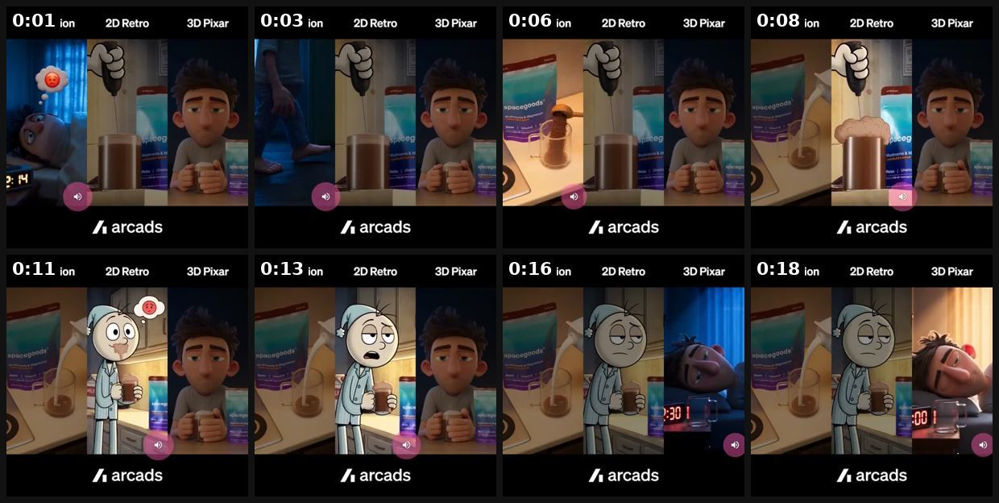
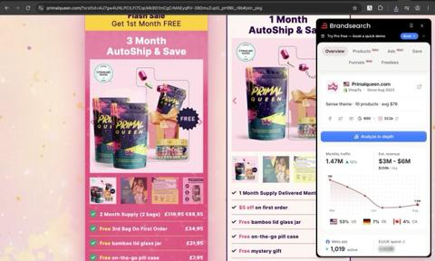
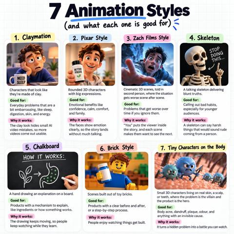
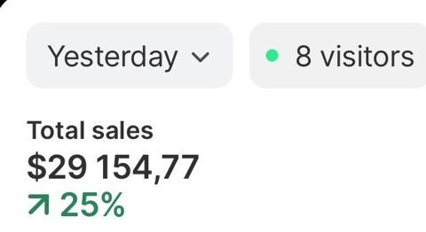
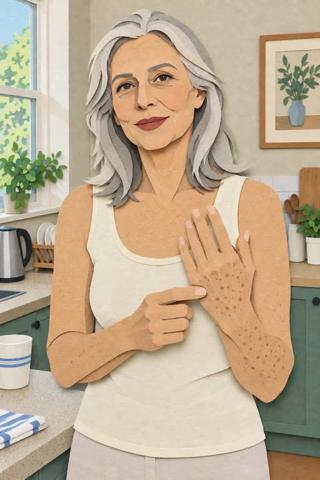
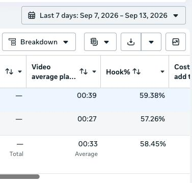
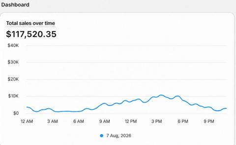

# 05 · AI animation format swap (Claymation, Pixar-3D, Zach-Films 2nd-person, Skeleton, Chalkboard, Brick, Tiny-characters): see it, then make it

[](https://x.com/oliverxmedia/status/2099359156121825337)

**The example:** [@oliverxmedia on X](https://x.com/oliverxmedia/status/2099359156121825337) · 0:20 video · 94 likes, 9K views

**Watch it:** [open the post on X](https://x.com/oliverxmedia/status/2099359156121825337) · [play the video file](https://video.twimg.com/amplify_video/2099359129601245184/vid/avc1/540x540/NNjJSlGc92Asva1C.mp4?tag=16)

> AI animation ads are still printing. I check hundreds of ad accounts every week, and this creative style keeps showing up on the winners list. Built this one with Arcads — just drop your website URL and a product image, pick a duration, and Mark hands you back the finished 3D animated ad. No editing, no manual prompting. 6 animation styles to run through: Pixar Claymotion Cartoon Flat 2D Zachdfilms Claymation Run a f…

## What you are seeing

An Arcads demo: one short scene re-rendered in several animation styles, shown side by side and sequenced (Pixar-3D kids in a room, then the same beat in other looks). It shows the core move of the format: keep the script, swap the visual style.

## Beat by beat

The storyboard above samples the video every 0:02. Lines are the transcript for that stretch; on-screen text comes from OCR, so treat it as rough.

| Frame | Time | On screen | Said / sung |
|---|---|---|---|
| 1 | 0:00–0:02 | · | 2-4-14 AM and my brain would like to revisit something I said in 2016. |
| 2 | 0:02–0:05 | · | · |
| 3 | 0:05–0:07 | · | No, we are not doing this, kitchen. |
| 4 | 0:07–0:10 | · | One scoop, hot milk, froth it like you mean it, chocolate, at bedtime, legally. |
| 5 | 0:10–0:12 | · | · |
| 6 | 0:12–0:15 | · | Raisin, magnesium, the ashwagangji thing, it's gone quiet in here, suspicious. |
| 7 | 0:15–0:17 | 2D Retro 3D Pixar ee ee ment Ls a 301 ip | Ooh, that's the good kind of heavy. |
| 8 | 0:17–0:20 | 2D Retro 3D Pixar od Ge oa Pt a pf a4 MN | · |

<details><summary>Full transcript (timestamped)</summary>

- `0:00` 2-4-14 AM and my brain would like to revisit something I said in 2016.
- `0:05` No, we are not doing this, kitchen.
- `0:07` One scoop, hot milk, froth it like you mean it, chocolate, at bedtime, legally.
- `0:12` Raisin, magnesium, the ashwagangji thing, it's gone quiet in here, suspicious.
- `0:16` Ooh, that's the good kind of heavy.

</details>

## More real examples (6)

Other posts that show this format, or a close cousin of it. Click a thumbnail to open it on X.

| | | |
|---|---|---|
| [](https://x.com/Diego_exits/status/2101991919920243015)<br>**@Diego_exits** · images · 4K views<br>PRIMALQUEEN $6M/mo, 1,019 active ads; normal cartoon ads. | [](https://x.com/CEO_Vlad/status/2107328605995077699)<br>**@CEO_Vlad** · image · 49K views<br>7 AI UGC animation styles and what each is good for (article). | [](https://x.com/ArmandasPuckus/status/2107781382533472512)<br>**@ArmandasPuckus** · image · 44K views<br>'Selling to menopausal women with AI animations IS the method'. |
| [](https://x.com/LordofAds/status/2102132251706429937)<br>**@LordofAds** · images · 5K views<br>'Money glitch': remake best 30-day ad in 6 animation styles (Pixar, anime, paper cutout, whiteboard, skeleton...). | [](https://x.com/therahulissar/status/2099519666045776287)<br>**@therahulissar** · images · 3K views<br>Break Meta audience cap with format change (same message, new display: AI video, static, lo-fi) and new personas. | [](https://x.com/CEO_Vlad/status/2087333716334924071)<br>**@CEO_Vlad** · image · 10K views<br>Pixar-style AI ads helped $117k day. |

## How to make one like it

**The format in one line:** Same script/angle as a proven ad, re-rendered in an animated style. Styles and their jobs (from @CEO_Vlad's 7-styles chart and tier list): | Style | Good for | Why | |---|---|---| | Claymation | everyday embarrassing problems | clay hides AI artifacts → highest usable rate | | Pixar-style 3D | emotional benefits (confidence, family) | faces carry emotion; stages what a camera can't | | "Zach Films

**Why it works:** Pattern-break in a feed of UGC; animation feels like content; characters stage impossible scenes (the necklace surviving the ocean, chlorine, sweat); new visual style = new Entity ID = fresh delivery.

**Contents:** [1. Structure](#1-copy-the-structure) · [2. Shot by shot](#2-shot-by-shot-remake) · [3. Script and hooks](#3-write-the-script) · [4. Prompts](#4-prompts) · [5. Tools and settings](#5-tools-and-settings) · [6. Louise Carter remake](#6-louise-carter-remake) · [7. Variants and test](#7-variants-and-test-plan) · [8. Pitfalls](#8-pitfalls)

### 1. Copy the structure

Use the example's timing as your beat sheet. Keep the beat, change the words and the product.

| Beat | Time | In the example | Your version |
|---|---|---|---|
| 1 | 0:01 | 2-4-14 AM and my brain would like to revisit something I said in 2016. | … |
| 2 | 0:03 | 2-4-14 AM and my brain would like to revisit something I said in 2016. No, we are not doing this, kitchen. | … |
| 3 | 0:06 | No, we are not doing this, kitchen. | … |
| 4 | 0:08 | No, we are not doing this, kitchen. One scoop, hot milk, froth it like you mean it, chocolate, at bedtime, legally. | … |
| 5 | 0:11 | One scoop, hot milk, froth it like you mean it, chocolate, at bedtime, legally. Raisin, magnesium, the ashwagangji thing, it's gone quiet in | … |
| 6 | 0:13 | Raisin, magnesium, the ashwagangji thing, it's gone quiet in here, suspicious. | … |
| 7 | 0:16 | Raisin, magnesium, the ashwagangji thing, it's gone quiet in here, suspicious. Ooh, that's the good kind of heavy. | … |
| 8 | 0:18 | Ooh, that's the good kind of heavy. | … |

### 2. Shot-by-shot remake

**Target length / size:** Same length as the source winner (15-60s)

| # | Time / slot | What we see (visual + camera) | Dialogue / on-screen text |
|---|---|---|---|
| 1 | Before you start | Pick ONE proven script (a winner with stable CPA) | Do not change a word of the script; only the visual style changes |
| 2 | 0-3s | Hook shot in the new style (claymation, Pixar-3D, 2nd-person "you" camera, stop-motion) | Same hook line, same timing as the winner |
| 3 | 3-end | Re-render each shot of the winner shot-for-shot in the chosen style | Same VO (re-use the original audio if it is yours) and captions |
| 4 | Product shots | Cut back to REAL product footage, or a faithful 3D model | Same CTA as the winner |

<details><summary>Playbook shot list (Louise Carter version from the README)</summary>

Shot structure (30-45s): 0-2s character + problem visual hook · 2-12s escalation (2-3 scenes) · 12-25s product enters as solution, mechanism visual · 25-35s life after · end card with real product photo + offer.

## Hook patterns
"What happens if you [do X] every day?" then Day 1 / Day 7 / Day 30 (FedotOff90 example transcript); skeleton: "Stop doing this…"; chalkboard: "How it works:" with a hand drawing.

</details>

### 3. Write the script

Open with one of these hooks (first 1–3 seconds, or the headline on a static):

"What happens if you [do X] every day?" then Day 1 / Day 7 / Day 30 (FedotOff90 example transcript); skeleton: "Stop doing this…"; chalkboard: "How it works:" with a hand drawing.

Then fill the beats from the table above. Pull the wording from real customer reviews, not from ad copy: a review line beats a copywriter line almost every time. Read every line out loud and cut anything you would not say to a friend. Ready-made Louise Carter scripts are in section 6; hand [BOT.md](BOT.md) to any AI agent to write versions for another brand.

### 4. Prompts

**Midjourney / Nano Banana (style frames)**

```text
claymation stop-motion style, handmade plasticine woman in a tiny bathroom set, soft studio light, visible fingerprints in clay, Aardman-like, 9:16 -- [scene description from the winner shot list]
```

**Kling / Runway / Seedance**

```text
image-to-video, 4-6s, keep the style frame exactly, gentle motion, no morphing, no text
```

**Arcads / Creatify (optional)**

```text
Upload the winning script, choose the "animation" or "Pixar" template, export 9:16 and 4:5.
```

### 5. Tools and settings

Claude skill pipeline (as built by @AlessandroLavis / @eliasrrecom): competitor research → script + hooks → scene list → image gen per scene (Nano Banana/Midjourney with style reference) → image-to-video (Kling/Seedance/Veo) → ElevenLabs VO → CapCut assembly. Agent "ad DNA" step (@ladprofit): extract hook, mechanism, emotional arc, belief shift from the winner before re-styling. Cost $5-40/ad, 1-3h.

| Setting | Value |
|---|---|
| Canvas | 1080×1920 (9:16) master; crop a 1080×1350 (4:5) cut for feed placements |
| Frame rate | 30 fps (shoot 60 fps for slow-motion water or sparkle shots) |
| Camera | Phone main lens at 1x, exposure locked on skin, HDR off, grid on; tripod or a phone clamp for product shots |
| Light | One soft key at 45° (window or ring light), white card as fill; side light for metal sparkle |
| Audio | Lavalier or phone 15–20 cm from the mouth; mix voice at -14 LUFS, music at -28 to -30 dB under voice |
| Captions | Burned in, 2–5 words per line, 64–80 px bold sans, white with a black stroke or pill; keep text inside the safe zone (top 220 px and bottom 420 px clear, 64 px side margins) |
| Pacing | A visual change every 1.5–3 s; the hook lands in the first 1.5 s with no logo intro |
| Edit / export | CapCut or Premiere; H.264, 12–20 Mbps, AAC 320 kbps; upload natively to each platform, not via links |

### 6. Louise Carter remake

**A. Chalkboard "Why your jewelry turns green (and ours doesn't)"** — hand draws a chain: "Most cheap jewelry = thin plating over brass → water + sweat → copper reacts → green neck" → draws LC layer: "[base metal per LC spec sheet] + 14K PVD coating" → "So: shower, swim, sweat." → real Chelsea Herringbone photo + "Build any 7 for $85". (Mechanism claims must match LC spec sheet.)
**B. Claymation "Every piece I've lost down the drain"** — clay woman taking off rings at the sink, ring rolls into drain (comic), repeated across years → friend hands her LC stack "you don't take these off" → clay woman in shower, swimming, smiling.
**C. Pixar-style "Grandma's advice"** — granddaughter afraid to wear "good" jewelry; grandma (3D) says "jewelry you save is jewelry you don't wear" → montage of everyday moments wearing LC.

Brand rules, claims you can and cannot make, and more scripts: [brands/louise-carter.md](brands/louise-carter.md). Step-by-step from idea to scale: [STAGES.md](STAGES.md).

### 7. Variants and test plan

**Test plan:** Pick LC's top-spending ad of last 30 days → 3 styles (chalkboard, claymation, Pixar) first. Separate ads in the same ad set (distinct Entity IDs). Metrics: CPM, hook rate, CPA vs original, Omni new-customer revenue. Keep styles beating original CPA by 15%.

**Naming:** `F05-<variant>-<hook##>-<date>` so results map back to this folder. Change one thing per test (hook, narrator, length or offer), never two.

### 8. Pitfalls

- Changing script and style at the same time means you will not know what worked.
- Each style is a new creative to Meta (new Entity ID); launch 3 styles together so they compete.
- Keep the product real: stylised characters are fine, stylised jewelry misleads.
- Pixar is crowded; claymation and 2nd-person POV were less saturated in the research window.
- Slow open: if the first 1.5 s does not show the hook visually, most people swipe.
- Logo or brand intro at the start reads as an ad; put the brand at the end.
- Captions covered by the platform UI: check the safe zone on a real phone before posting.
- Music over the voice: keep music at least 14 dB under speech.

**Compliance:** [_COMPLIANCE.md](../_COMPLIANCE.md). No Disney/Pixar/LEGO names, logos or recognisable characters — "3D animated" only. Animated depictions of product must match the real product (end with real photography). AI label on.

## Field notes

Newer observations live in the playbook: [Wave 2c update: AI animation style rotation (Fedotoff CGI Machine)](README.md) · [Wave 4 update: Fedotoff October 2026 swipe boards](README.md)

## More examples

Every post we found for this format, with transcripts: [examples/](examples/README.md). Playbook: [README.md](README.md). Agent brief: [BOT.md](BOT.md).
