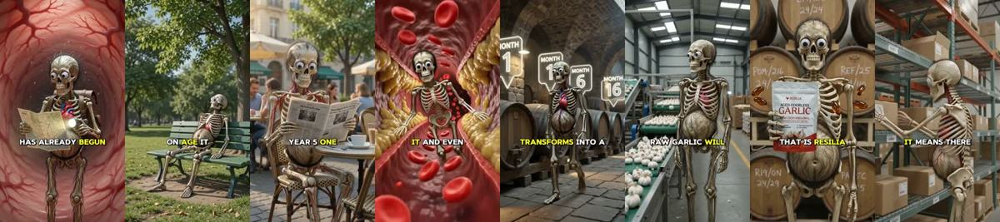

# Meta ad-library examples for F05

<!-- WAVE6 -->
## Wave 6: Resilia & Smooche live Meta ads (Oct 2026)

Pulled from the public Meta Ad Library on 2026-10-09 (Resilia: aged garlic, Ceylon cinnamon, oil of oregano; Smooche: color-changing foundation, Reverse Time peptide serum). Days live are counted to 2026-10-09; most video ads were new tests that week, while the long runners are statics and catalog templates. Transcripts are automatic. Brand claims are the advertisers', not verified, and many are health claims we would never make. The **Do not copy** line flags deceptive tactics (persona "publication" pages, undisclosed AI actors and "experts", fake stock counts).

### Resilia · Arterial Health Review: “What happens if you don if you don't clean out your arteries once they…” (1 day live)

- **Ad:** [Meta Ad Library #1466736258705803](https://www.facebook.com/ads/library/?id=1466736258705803) · video 2:41 · page “Arterial Health Review” · started 2026-10-07 · 1 copies · lands on `resilia.shop/products/resilia-aged-odorless-garlic`
- **What happens:** Opens: “What happens if you don if you don't clean out your arteries once they start to clog? Day one, you feel completely normal, exactly like you have for years, but inside it has already begun.”
- **Why it works:** The skeleton format (a skeleton reading the paper on a bench while his arteries clog) is pure pattern-break in a supplement feed.
- **How to make one:** Use a recurring skeleton or clay hero, a time-lapse of the problem, and the product as the turning point.
- **LC remake:** A skeleton still wearing its LC necklace in the year 2126: "Some things don't tarnish."

Transcript (auto, first ~70 s)

> What happens if you don if you don't clean out your arteries once they start to clog? Day one, you feel completely normal, exactly like you have for years, but inside it has already begun. Cholesterol and calcium are starting to settle against your artery walls. You cannot feel a thing. That is what makes it so dangerous. Year one, the build-up is thickening, the pipes are narrowing. Your blood cannot carry oxygen and nutrients the way it used to, so your energy starts to drop. You blame it on age. It is the beginning. Year two, now your blood pressure is high. You are tired all the time. Your arteries have gone stiff, and your heart has to slam harder and harder just to push the blood through walls the walls that are almost completely blocked. The damage is no longer quiet. Year five, one ordinary morning, making coffee, climbing the stairs, tying your shoes, the artery finally closes. No warning, that is the heart attack. that is the stroke, that is the moment it all ends. In front of the people who love you, years before you, you can you the heart.

<!-- /WAVE6 -->

<!-- WAVE4 -->
## Wave 4: Alex Fedotoff's October 2026 swipe boards (GetHookd public previews)

Each ad below is from the free 10-ad preview of a public GetHookd board that [@FedotOff90](https://x.com/FedotOff90) shared on X. Days live are as of 2026-10-09; brand claims are the advertisers', not verified.

### Hemios: Talking-product CGI skit (Hemios, "I'm not an accessory, Karen") (254 days live)

- **Board:** [AI & CGI Ads That Actually Convert](https://x.com/FedotOff90/status/2107892934050037807) · video 32 s
- **What happens:** A Pixar-style couple in bed talk to an animated hematite ring: "I have to apologize… I thought you were a scam… I'm not an accessory, Karen. I'm 2,000 years of natural hematite. I was fixing men before pills existed." 32 s.
- **Why it lasts:** 254 days with 346 ads. A talking product plus comedy plus a primal topic; the product defends itself, so it is not the brand making the claims.
- **How to make one:** Pixar-style 3D (Higgsfield / Kling), 2 characters plus a talking product, a 20-35 s gag, the product talks back.
- **LC remake:** An animated LC necklace: "I'm not costume jewelry, Karen. I'm 14K PVD. I've survived 300 showers."

### Dr. Lisa Downing: Pixar-style organ-and-pills CGI (kidneys) (217 days live)

- **Board:** [AI & CGI Ads That Actually Convert](https://x.com/FedotOff90/status/2107892934050037807) · video 123 s
- **What happens:** Pixar-style 3D characters around organs and a pill bottle, with captions like "That foam was protein leaking through stressed kidneys… By day 15…" 123 s.
- **Why it lasts:** 217 days, 1,357 page ads. The organ is made visible as a character; Fedotoff's CGI Machine style.
- **How to make one:** Choose one organ, make it a character, show it struggling then recovering, with a day-count timeline.
- **LC remake:** Not core for LC.

