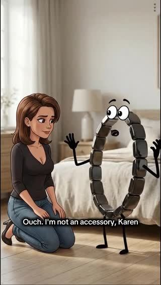
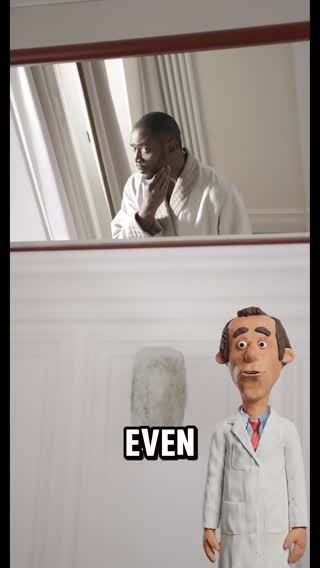

# Meta ad-library examples for F05

<!-- WAVE4 -->
## Wave 4: Alex Fedotoff's October 2026 swipe boards (GetHookd public previews)

Each ad below is from the free 10-ad preview of a public GetHookd board that [@FedotOff90](https://x.com/FedotOff90) shared on X. Days live are as of 2026-10-09; brand claims are the advertisers', not verified.

### Hemios: Talking-product CGI skit (Hemios, "I'm not an accessory, Karen") (254 days live)

- **Board:** [AI & CGI Ads That Actually Convert](https://x.com/FedotOff90/status/2107892934050037807) · video 32 s
- **What happens:** A Pixar-style couple in bed talk to an animated hematite ring: "I have to apologize… I thought you were a scam… I'm not an accessory, Karen. I'm 2,000 years of natural hematite. I was fixing men before pills existed." 32 s.
- **Why it lasts:** 254 days with 346 ads. A talking product plus comedy plus a primal topic; the product defends itself, so it is not the brand making the claims.
- **How to make one:** Pixar-style 3D (Higgsfield / Kling), 2 characters plus a talking product, a 20-35 s gag, the product talks back.
- **LC remake:** An animated LC necklace: "I'm not costume jewelry, Karen. I'm 14K PVD. I've survived 300 showers."

### Dr. Lisa Downing: Pixar-style organ-and-pills CGI (kidneys) (217 days live)

- **Board:** [AI & CGI Ads That Actually Convert](https://x.com/FedotOff90/status/2107892934050037807) · video 123 s
- **What happens:** Pixar-style 3D characters around organs and a pill bottle, with captions like "That foam was protein leaking through stressed kidneys… By day 15…" 123 s.
- **Why it lasts:** 217 days, 1,357 page ads. The organ is made visible as a character; Fedotoff's CGI Machine style.
- **How to make one:** Choose one organ, make it a character, show it struggling then recovering, with a day-count timeline.
- **LC remake:** Not core for LC.

