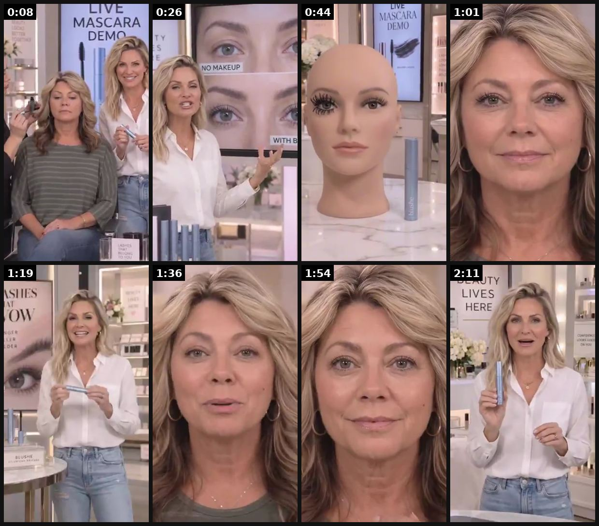
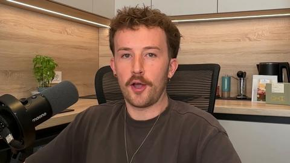
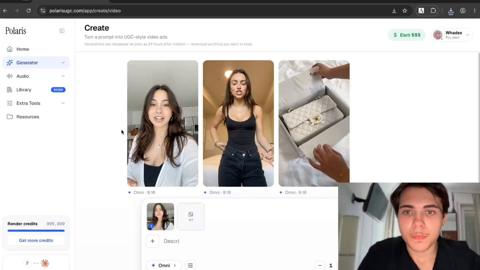
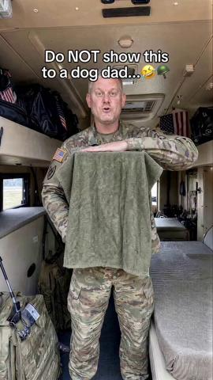
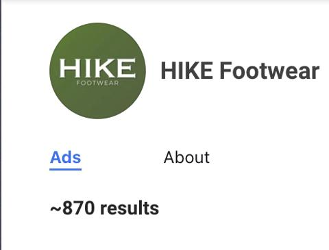
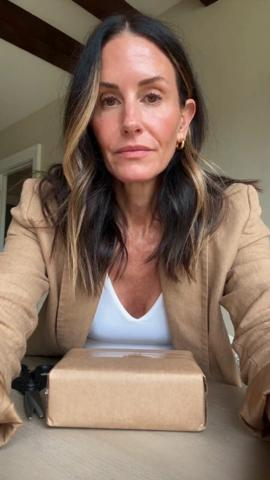

# 06 · AI UGC talking-head (avatar) — and its realism stack: see it, then make it

[](https://x.com/frankyecom/status/2105377535345258584)

**The example:** [@frankyecom on X](https://x.com/frankyecom/status/2105377535345258584) · 2:20 video · 344 likes, 54K views

**Watch it:** [open the post on X](https://x.com/frankyecom/status/2105377535345258584) · [play the video file](https://video.twimg.com/amplify_video/2105377309666525184/vid/avc1/320x568/xJ-NzaqYt5EcqagJ.mp4?tag=29)

> AI UGC is already dominating every major ad platform. And if you still need convincing of that, your brand probably just isn’t scaling hard enough yet. But there’s a much bigger takeaway here for creative strategists: Women consume advertising very differently than men do. They’ll sit through stories. Drama. Characters. Relationships. Tension. Resolution. And we already have decades of data proving this. Now look at …

## What you are seeing

A run of AI-made and real beauty talking heads: a TV-shopping set ("LIVE MASCARA DEMO"), tight face close-ups that read like UGC, a before/after face and a mannequin head. The speaker talks straight to camera with captions.

## Beat by beat

The storyboard above samples the video every 0:17. Lines are the transcript for that stretch; on-screen text comes from OCR, so treat it as rough.

| Frame | Time | On screen | Said / sung |
|---|---|---|---|
| 1 | 0:00–0:17 | MASCARA DEMO, 7k al | Okay, if your mascara just isn't doing what it used to, you need to see this. We're doing this completely live, one eye, one coat of blush. Watch what happens. Now she has absolutely nothing on these lashes right now. And look at that brush. You're getting right down at the root |
| 2 | 0:17–0:35 | · | and pulling all the way through to the tip. This is why I love doing these demonstrations live because there's nowhere to hide. Look at the difference in length, the definition, and especially how much more open that eye looks. You know, whenever I do makeup for a woman over 40 now, it's always blus |
| 3 | 0:35–0:52 | · | lashes. Like look at the difference on this model. Tell me which one you think has tubing mascara on versus the Korean lash casting. I mean, it's night and day of a difference. And here's what we're using. This is the blush lash casting mascara. |
| 4 | 0:52–1:10 | · | Look closely at that tube because that's a huge part of why you're getting that separation. Oh, that is beautiful. Look at her now. You can see every individual lash, but she doesn't have that heavy overloaded mascara look. And that's exactly it. Lash casting is specifically made for women 40 and up |
| 5 | 1:10–1:27 | SHE Ss Ow a mf | for our aged lashes. And that's exactly why this Korean formula has gotten so popular. It's natural, but attaches to each individual lash, giving you that natural volume you want without all of that weight or dark look from your old tubing mascara. It's brand new from Korea, |
| 6 | 1:27–1:45 | · | and it's selling fast. I mean, if you guys aren't blown away by this, I don't know what will. So tell us what do you think? I can't believe these are my lashes. I love it. Oh my goodness, they look so natural. My old mascara could never do this, right? I always found that |
| 7 | 1:45–2:03 | PS ee a | while tubing gives you that big dark look, I always just wanted something more natural, but still gave me that volume I was looking for. And I mean, look at these lashes. You look stunning. Tell me those don't look like extensions or some expensive salon treatment. |
| 8 | 2:03–2:20 | BEAUTY il LIVES HERE ah LOC cD a a Ps | That was just two passes on each eyelash. It really is a total game changer. If you're a woman at home watching over 40, you need to see it for yourself to understand. So if you've been piling on mascara and wondering why you're still not getting the lashes you want, try blush. One product, your own |

<details><summary>Full transcript (timestamped)</summary>

- `0:00` Okay, if your mascara just isn't doing what it used to, you need to see this.
- `0:04` We're doing this completely live, one eye, one coat of blush.
- `0:08` Watch what happens. Now she has absolutely nothing on these lashes right now.
- `0:13` And look at that brush. You're getting right down at the root
- `0:16` and pulling all the way through to the tip. This is why I love doing these
- `0:20` demonstrations live because there's nowhere to hide.
- `0:22` Look at the difference in length, the definition, and especially how much more
- `0:27` open that eye looks. You know, whenever I do makeup for a woman over 40 now,
- `0:31` it's always blush lash casting. I never go for tubing anymore. It's way too clumpy on mature
- `0:37` lashes. Like look at the difference on this model. Tell me which one you think has tubing
- `0:42` mascara on versus the Korean lash casting. I mean, it's night and day of a difference.
- `0:47` And here's what we're using. This is the blush lash casting mascara.
- `0:51` Look closely at that tube because that's a huge part of why you're getting that separation.
- `0:56` Oh, that is beautiful. Look at her now. You can see every individual lash,
- `1:01` but she doesn't have that heavy overloaded mascara look. And that's exactly it.
- `1:07` Lash casting is specifically made for women 40 and up. Tubing mascara is way too heavy of a formula
- `1:13` for our aged lashes. And that's exactly why this Korean formula has gotten so popular.
- `1:19` It's natural, but attaches to each individual lash, giving you that natural volume you want
- `1:24` without all of that weight or dark look from your old tubing mascara. It's brand new from Korea,
- `1:30` and it's selling fast. I mean, if you guys aren't blown away by this, I don't know what will. So
- `1:34` tell us what do you think? I can't believe these are my lashes. I love it. Oh my goodness,
- `1:39` they look so natural. My old mascara could never do this, right? I always found that
- `1:45` while tubing gives you that big dark look, I always just wanted something more natural,
- `1:50` but still gave me that volume I was looking for. And I mean, look at these lashes.
- `1:54` You look stunning. Tell me those don't look like extensions or some expensive salon treatment.
- `2:00` That was just two passes on each eyelash. It really is a total game changer.
- `2:05` If you're a woman at home watching over 40, you need to see it for yourself to understand. So if
- `2:11` you've been piling on mascara and wondering why you're still not getting the lashes you want,
- `2:15` try blush. One product, your own lashes, and you just saw the difference live.

</details>

## More real examples (6)

Other posts that show this format, or a close cousin of it. Click a thumbnail to open it on X.

| | | |
|---|---|---|
| [](https://x.com/kristian_jennin/status/2101352217089282066)<br>**@kristian_jennin** · 31:13 video · 231K views<br>AI UGC looks fake because of a missing step (realism workflow video). | [](https://x.com/zedmadeit/status/2107552798842003488)<br>**@zedmadeit** · 1:58 video · 20K views<br>Intentional AI ad system starting from brand/product/customer, visuals matched to script. | [](https://x.com/eliasrrecom/status/2092612451623694388)<br>**@eliasrrecom** · 1:26 video · 54K views<br>Realistic AI UGC ads tutorial. |
| [](https://x.com/ladprofit/status/2100960479577362499)<br>**@ladprofit** · 0:12 video · 2K views<br>Seedance AI UGC page for Veterans Day: same B-roll, new hook each post, trending audio, comment-keyword link (comment-gated teardown). | [](https://x.com/adamtaylorl/status/2089713928511345017)<br>**@adamtaylorl** · images · 22K views<br>Hike Footwear ad 100% AI. | [](https://x.com/CEO_Vlad/status/2108405736245952955)<br>**@CEO_Vlad** · 0:20 video · 21 views<br>Audio is what makes AI UGC feel real; one robotic sentence kills it. |

## How to make one like it

**The format in one line:** A phone-selfie video of a "creator" talking to camera — bedroom, bathroom, car, kitchen — holding/wearing the product, 15-45s, casual captions. Sub-formats ranked by @CEO_Vlad: **S** podcast ad, talking head ("cleanest test of whether your angle works"), in-car ("reads private, cheapest to render well"); **A** street interview, multi-scene demo; **B** reply-to-comment overlay, split-screen day. Ex

**Contents:** [1. Structure](#1-copy-the-structure) · [2. Shot by shot](#2-shot-by-shot-remake) · [3. Script and hooks](#3-write-the-script) · [4. Prompts](#4-prompts) · [5. Tools and settings](#5-tools-and-settings) · [6. Louise Carter remake](#6-louise-carter-remake) · [7. Variants and test](#7-variants-and-test-plan) · [8. Pitfalls](#8-pitfalls)

### 1. Copy the structure

Use the example's timing as your beat sheet. Keep the beat, change the words and the product.

| Beat | Time | In the example | Your version |
|---|---|---|---|
| 1 | 0:08 | Okay, if your mascara just isn't doing what it used to, you need to see this. We're doing this completely live, one eye, one coat of blush. | … |
| 2 | 0:26 | and pulling all the way through to the tip. This is why I love doing these demonstrations live because there's nowhere to hide. Look at the | … |
| 3 | 0:44 | lashes. Like look at the difference on this model. Tell me which one you think has tubing mascara on versus the Korean lash casting. I mean, | … |
| 4 | 1:01 | Look closely at that tube because that's a huge part of why you're getting that separation. Oh, that is beautiful. Look at her now. You can | … |
| 5 | 1:19 | for our aged lashes. And that's exactly why this Korean formula has gotten so popular. It's natural, but attaches to each individual lash, g | … |
| 6 | 1:36 | and it's selling fast. I mean, if you guys aren't blown away by this, I don't know what will. So tell us what do you think? I can't believe | … |
| 7 | 1:54 | while tubing gives you that big dark look, I always just wanted something more natural, but still gave me that volume I was looking for. And | … |
| 8 | 2:11 | That was just two passes on each eyelash. It really is a total game changer. If you're a woman at home watching over 40, you need to see it | … |

### 2. Shot-by-shot remake

**Target length / size:** 15-45s, 1080x1920, 30fps

| # | Time / slot | What we see (visual + camera) | Dialogue / on-screen text |
|---|---|---|---|
| 1 | 0-2s | Avatar holding the product up close to a phone camera in a real-looking room (bathroom mirror, car, kitchen) | Hook from a real review: "okay I need to talk about this necklace because I literally sleep in it" |
| 2 | 2-10s | Medium selfie, natural hand movement, slight handheld wobble | Problem in her words: "every gold necklace I owned turned green or snapped" |
| 3 | 10-25s | Cutaways: REAL product B-roll (shower, sea, close-up of clasp) | Proof beats: "I showered, I swam, it looks the same" |
| 4 | 25-35s | Back to avatar, smiling, touching the piece | Offer + CTA: "they do any 7 for $85, link's below" |

### 3. Write the script

Then fill the beats from the table above. Pull the wording from real customer reviews, not from ad copy: a review line beats a copywriter line almost every time. Read every line out loud and cut anything you would not say to a friend. Ready-made Louise Carter scripts are in section 6; hand [BOT.md](BOT.md) to any AI agent to write versions for another brand.

### 4. Prompts

**Arcads / HeyGen / Creatify (avatar)**

```text
Choose a 25-40 female avatar filmed in a bathroom or car, natural lighting, casual clothes. Script: [paste]. Settings: "casual" tone, add 2-3 natural pauses, slight pitch variation, 9:16.
```

**Realism stack**

```text
Add background room tone, a 3-5% handheld shake, auto-captions in TikTok style, cut every 2-4s, cover the mouth area with B-roll at least 40% of the time.
```

### 5. Tools and settings

Angles from real reviews (Claude: cluster LC reviews into motivators: shower-proof, gifting, compliments, sensitive skin feel, value of stack) → script per motivator → avatar (Arcads/HeyGen/Higgsfield; or Seedance/Veo with reference image) → voice (ElevenLabs, matched) → **real LC product B-roll cut-ins** (never render the jewelry with AI in close-up) → CapCut captions.

| Setting | Value |
|---|---|
| Canvas | 1080×1920 (9:16) master; crop a 1080×1350 (4:5) cut for feed placements |
| Frame rate | 30 fps (shoot 60 fps for slow-motion water or sparkle shots) |
| Camera | Phone main lens at 1x, exposure locked on skin, HDR off, grid on; tripod or a phone clamp for product shots |
| Light | One soft key at 45° (window or ring light), white card as fill; side light for metal sparkle |
| Audio | Lavalier or phone 15–20 cm from the mouth; mix voice at -14 LUFS, music at -28 to -30 dB under voice |
| Captions | Burned in, 2–5 words per line, 64–80 px bold sans, white with a black stroke or pill; keep text inside the safe zone (top 220 px and bottom 420 px clear, 64 px side margins) |
| Pacing | A visual change every 1.5–3 s; the hook lands in the first 1.5 s with no logo intro |
| Edit / export | CapCut or Premiere; H.264, 12–20 Mbps, AAC 320 kbps; upload natively to each platform, not via links |

### 6. Louise Carter remake

A. In-car (persona 28-35): "Okay I have to tell you this before I go inside — I've literally been swimming in this necklace for three months and it looks the same. [cut: real close-up] It's 14K PVD, it's from Louise Carter, and I built a stack of seven for 85 bucks."
B. Bathroom mirror (gifting): "My sister has turned four necklaces green. So for her birthday I got her one she can't ruin…"
C. Reply-to-comment overlay: comment bubble "does it actually not tarnish??" → "Here's mine after six months of daily wear" (only real creator, real piece — AI can dramatize hooks but not testimonials).

Brand rules, claims you can and cannot make, and more scripts: [brands/louise-carter.md](brands/louise-carter.md). Step-by-step from idea to scale: [STAGES.md](STAGES.md).

### 7. Variants and test plan

**Test plan:** Use AI UGC as the cheap first pass: 5 angles × 2 avatars → $50 each → winners by CTR/hook rate → **remake top 2 with real creators** (strategy 29). Omni: compare AI vs real-creator CPA and new-customer rate.

**Naming:** `F06-<variant>-<hook##>-<date>` so results map back to this folder. Change one thing per test (hook, narrator, length or offer), never two.

### 8. Pitfalls

- Avatars reading a script word-perfect look fake; add fillers ("like", "honestly") and a stumble.
- Avatars may not claim a personal experience they did not have in places where that is regulated; label AI and keep claims to product facts.
- Never show the avatar "wearing" AI jewelry; cut to real product footage.
- Ranked by researchers: avatar reading a script = F tier; avatar inside a story or skit performs better.
- Slow open: if the first 1.5 s does not show the hook visually, most people swipe.
- Logo or brand intro at the start reads as an ad; put the brand at the end.
- Captions covered by the platform UI: check the safe zone on a real phone before posting.
- Music over the voice: keep music at least 14 dB under speech.

**Compliance:** [_COMPLIANCE.md](../_COMPLIANCE.md). AI avatars must not claim personal usage as real testimony ("I've been swimming in this for 3 months" is a testimonial claim → only from real creators who did it; AI version must be framed as a dramatization or use non-testimonial copy). AI label on TikTok/Meta. GIVA examples are promos for Arcads, not proof of performance.

## Field notes

Newer observations live in the playbook: [Wave 2d update: AI UGC at Resilia, Lymphoria, Rosabella scale](README.md) · [Wave 4 update: Fedotoff October 2026 swipe boards](README.md)

## More examples

Every post we found for this format, with transcripts: [examples/](examples/README.md). Playbook: [README.md](README.md). Agent brief: [BOT.md](BOT.md).
