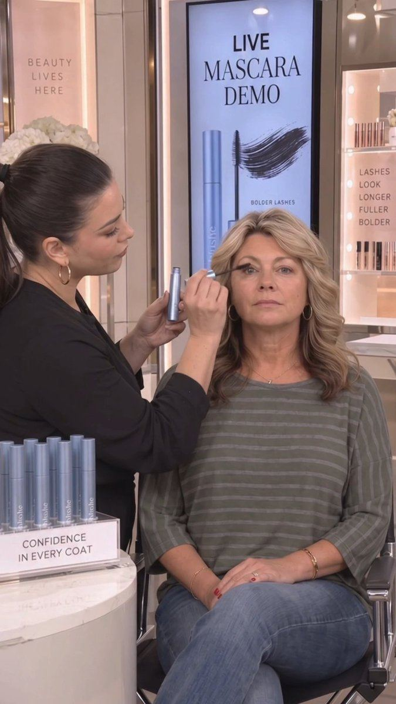

# 06 · AI UGC talking-head

<!-- HERO:START -->

**[See the example and how to make it →](EXAMPLE.md)** · [watch on X](https://x.com/frankyecom/status/2105377535345258584)
<!-- HERO:END -->

## What it looks like
A phone-selfie video of a "creator" talking to camera — bedroom, bathroom, car, kitchen — holding/wearing the product, 15-45s, casual captions. Sub-formats ranked by @CEO_Vlad: **S** podcast ad, talking head ("cleanest test of whether your angle works"), in-car ("reads private, cheapest to render well"); **A** street interview, multi-scene demo; **B** reply-to-comment overlay, split-screen day.
Example (jewelry): GIVA collection "I'm obsessed with these tiny little things and I've been stacking them like this…" (Arcads promo, [@SparkifyAI](https://x.com/SparkifyAI/status/2101869170937958407)).

Script skeleton (30s): 0-3s hook line + gesture ("I don't usually film unboxings but…") · 3-15s problem/story · 15-25s product proof (close-up, real product footage cut-in) · 25-30s CTA.

## The realism stack (what separates usable from slop)
- **Audio first**: "1 robotic sentence and the viewer will scroll" — match voice to face/age, add room tone, breaths, filler words ([@CEO_Vlad](https://x.com/CEO_Vlad/status/2108405736245952955)).
- Reference images → precise prompts → consistent character → guided motion → repeatable system (@oliverxmedia).
- Lock character + product in a JSON prompt to get 50 consistent ads (@danclipping).
- The "extra step" fix ([@kristian_jennin](https://x.com/kristian_jennin/status/2101352217089282066), 1.1k likes / 3k bookmarks).
- Counterpoint: realism ≠ ROAS; copy and angle matter more ([@iowntraffic](https://x.com/iowntraffic/status/2087224676292472948)); find winners through review mining, personas, awareness levels — not more AI UGC volume ([@adamtaylorl](https://x.com/adamtaylorl/status/2105613706227069087)).

## Production recipe
Angles from real reviews (Claude: cluster LC reviews into motivators: shower-proof, gifting, compliments, sensitive skin feel, value of stack) → script per motivator → avatar (Arcads/HeyGen/Higgsfield; or Seedance/Veo with reference image) → voice (ElevenLabs, matched) → **real LC product B-roll cut-ins** (never render the jewelry with AI in close-up) → CapCut captions.

## LC adaptation — 3 scripts
A. In-car (persona 28-35): "Okay I have to tell you this before I go inside — I've literally been swimming in this necklace for three months and it looks the same. [cut: real close-up] It's 14K PVD, it's from Louise Carter, and I built a stack of seven for 85 bucks."
B. Bathroom mirror (gifting): "My sister has turned four necklaces green. So for her birthday I got her one she can't ruin…"
C. Reply-to-comment overlay: comment bubble "does it actually not tarnish??" → "Here's mine after six months of daily wear" (only real creator, real piece — AI can dramatize hooks but not testimonials).

## Test plan + metric
Use AI UGC as the cheap first pass: 5 angles × 2 avatars → $50 each → winners by CTR/hook rate → **remake top 2 with real creators** (strategy 29). Omni: compare AI vs real-creator CPA and new-customer rate.

## Compliance
[_COMPLIANCE.md](../_COMPLIANCE.md). AI avatars must not claim personal usage as real testimony ("I've been swimming in this for 3 months" is a testimonial claim → only from real creators who did it; AI version must be framed as a dramatization or use non-testimonial copy). AI label on TikTok/Meta. GIVA examples are promos for Arcads, not proof of performance.

## Wave 2d update: AI UGC at Resilia, Lymphoria, Rosabella scale
- Lymphoria's winning AI creator: one consistent character, ~55-second car-vlog monologue, product held to camera, meme-style photo insets, captions on every line; built with Claude + Higgsfield (creator Istiak Hossan, LinkedIn). Engine: symptom → reframe → hidden villain → buildup → 4 herbs → timeline → discount/guarantee (Felipe Gomes audit of 3,600 ads).
- Rosabella: AI UGC + native statics via whitelisted Pages, text PDP, no VSL; "$100M in the first year" claim (Funnel of the Week, unverified). Lawsuit risk: AI "doctors" (see F80).
- @lorenzo_pravata on Resilia: the gap is **real people**. "Take the exact concepts already winning and reshoot them with a real actor… same proven angle, format they don't have yet." For LC, real creators are the edge, not a fallback.

<!-- W7NOTE -->
## Wave 7 update: Lachezar Voynov (Oct 9, 2026)
- **Wave 7 (Oct 9):** "these are not real people… you're gonna see them in one of my clients' ads" ([@LachezarVoynov](https://x.com/LachezarVoynov/status/2107510774583455878), a 10 s realistic AI-person clip). Agencies now ship photoreal AI people into client ads by default. Our rule stands: label AI, and no AI "customers" giving testimonials.
<!-- /W7NOTE -->

<!-- EVIDENCE:START -->
## Wave 4 update: Fedotoff October 2026 swipe boards
- Khazanay Pakistan: Clinic presenter in scrubs (orthopedic shoes), 338 days live (AI UGC + Doctor Avatars board). The scrubs give authority, the reframe ("it's not an injury, it's your shoes") does the selling, and running two near-identical cuts is typical DCO practice.
- Blossom Essentials Skin: Short AI-UGC "only balm I'll ever buy" (Blossom Essentials, 3 variants), 213 days live (AI UGC + Doctor Avatars board). One script on many faces is Fedotoff's "avatar is the variable, mechanism is the template".
- Stills, how-to and LC remakes: [adlibrary/](adlibrary/README.md).

## Evidence from X discovery (auto-generated)

| Date | Author | Post | Engagement | Grade | Gist |
|---|---|---|---|---|---|
| 2026-09-19 | [@kristian_jennin](https://x.com/kristian_jennin) | [link](https://x.com/kristian_jennin/status/2101352217089282066) | 1123L/3024BM/231kV | VALUE | AI UGC looks fake because of a missing step (realism workflow video). |
| 2026-10-06 | [@zedmadeit](https://x.com/zedmadeit) | [link](https://x.com/zedmadeit/status/2107552798842003488) | 347L/472BM/20kV | SOME | Intentional AI ad system starting from brand/product/customer, visuals matched to script. |
| 2026-09-30 | [@frankyecom](https://x.com/frankyecom) | [link](https://x.com/frankyecom/status/2105377535345258584) | 344L/248BM/53kV | VALUE | AI UGC dominating; women consume ads differently (story/drama) - creative strategist takeaway. |
| 2026-08-26 | [@eliasrrecom](https://x.com/eliasrrecom) | [link](https://x.com/eliasrrecom/status/2092612451623694388) | 266L/548BM/54kV | SOME | Realistic AI UGC ads tutorial. |
| 2026-08-18 | [@adamtaylorl](https://x.com/adamtaylorl) | [link](https://x.com/adamtaylorl/status/2089713928511345017) | 266L/426BM/21kV | SOME | Hike Footwear ad 100% AI. |
| 2026-07-29 | [@NahFlo2n](https://x.com/NahFlo2n) | [link](https://x.com/NahFlo2n/status/2082463906694648266) | 169L/147BM/12kV | HYPE | $74k/mo from AI UGC avatars (promo). |
| 2026-08-13 | [@LukasPakter](https://x.com/LukasPakter) | [link](https://x.com/LukasPakter/status/2087883254850289744) | 169L/123BM/14kV | VALUE | $1M->$80M brand: 6,000+ ads/mo with $0 upfront (performance-based creators). |
| 2026-09-09 | [@adamtaylorl](https://x.com/adamtaylorl) | [link](https://x.com/adamtaylorl/status/2097641383355879452) | 139L/203BM/13kV | VALUE | Tier list of ecom formats: F = AI UGC, street interviews, read scripts; B = founder, testimonial compilations, listicle statics... |
| 2026-09-21 | [@SparkifyAI](https://x.com/SparkifyAI) | [link](https://x.com/SparkifyAI/status/2101869170937958407) | 134L/2BM/7kV | HYPE | GIVA jewelry UGC fully AI (Arcads promo) - jewelry reference. |
| 2026-08-06 | [@Mho_23](https://x.com/Mho_23) | [link](https://x.com/Mho_23/status/2085374858267857069) | 131L/192BM/8kV | SOME | Realistic AI UGC with Seedance 2.0 full breakdown (mho_23). |
| 2026-09-29 | [@oliverxmedia](https://x.com/oliverxmedia) | [link](https://x.com/oliverxmedia/status/2104954498565464350) | 130L/77BM/4kV | SOME | Realistic AI = reference images + precise prompts + consistent characters + guided motion. |
| 2026-09-28 | [@jonnyscales](https://x.com/jonnyscales) | [link](https://x.com/jonnyscales/status/2104572111549247916) | 129L/180BM/7kV | VALUE | Consumer app distribution ranked: real organic UGC #1 ... AI UGC slop last. |
| 2026-09-08 | [@CEO_Vlad](https://x.com/CEO_Vlad) | [link](https://x.com/CEO_Vlad/status/2097454666342674542) | 105L/157BM/16kV | SOME | $200k/day brand on AI UGC; guide (angles, rewrite prompt, avatars). |
| 2026-07-27 | [@oliverxmedia](https://x.com/oliverxmedia) | [link](https://x.com/oliverxmedia/status/2081741532915450137) | 90L/17BM/22kV | HYPE | Same GIVA jewelry AI UGC promo. |
| 2026-09-06 | [@CEO_Vlad](https://x.com/CEO_Vlad) | [link](https://x.com/CEO_Vlad/status/2096569603761827953) | 88L/169BM/5kV | VALUE | AI UGC formats tiered: S = podcast, talking head, in-car... |
| 2026-08-12 | [@adswithcami](https://x.com/adswithcami) | [link](https://x.com/adswithcami/status/2087547218605523005) | 83L/106BM/8kV | HYPE | AI UGC spent $405k/30d one client; comment-for-skill bait. |
| 2026-09-21 | [@danclipping](https://x.com/danclipping) | [link](https://x.com/danclipping/status/2102021063295013031) | 78L/99BM/5kV | SOME | Lock character/product JSON prompt -> 50 consistent AI UGC ads. |
| 2026-10-01 | [@httpsean_ca](https://x.com/httpsean_ca) | [link](https://x.com/httpsean_ca/status/2105481327906853022) | 69L/17BM/4kV | VALUE | Use Trybe as performance platform, not gifting/seeding. |
| 2026-08-11 | [@iowntraffic](https://x.com/iowntraffic) | [link](https://x.com/iowntraffic/status/2087224676292472948) | 56L/15BM/2kV | VALUE | Counter: realism != ROAS; spend time on copywriting not aesthetics. |
| 2026-09-03 | [@JacobCanfield](https://x.com/JacobCanfield) | [link](https://x.com/JacobCanfield/status/2095562486481137809) | 51L/52BM/9kV | VALUE | Old UGC model ($1k for 3-5 videos) dead -> performance creative management. |
| 2026-10-06 | [@jonnyscales](https://x.com/jonnyscales) | [link](https://x.com/jonnyscales/status/2107472215474094436) | 43L/100BM/4kV | SOME | 1.2M views in 48h from UGC campaign for app; how to escape 200-view jail. |
| 2026-10-09 | [@CEO_Vlad](https://x.com/CEO_Vlad) | [link](https://x.com/CEO_Vlad/status/2108405736245952955) | 0L/0BM/0kV | VALUE | Audio is what makes AI UGC feel real; one robotic sentence kills it. |
| 2026-10-07 | [@jakecastilloooo](https://x.com/jakecastilloooo) | [link](https://x.com/jakecastilloooo/status/2107873317369581751) | 984L/3090BM/290kV | VALUE | Ex-Cal AI UGC lead's full AI UGC workflow (article): customer context → outlier videos vs creator baseline → reverse-engineer → believable first frame → test take → batch → 4-platform scheduling → remake winners with real creators, then paid. |
| 2026-08-20 | [@rewind02](https://x.com/rewind02) | [link](https://x.com/rewind02/status/2090437914052227288) | 37L/14BM/1kV | SOME | Baby gift shop with 5.9k followers hit 21.5M views with AI-generated UGC; format > follower count. |
| 2026-09-30 | [@sulfurscales](https://x.com/sulfurscales) | [link](https://x.com/sulfurscales/status/2105345336768405749) | 164L/30BM/19kV | HYPE | Ava Studio AI UGC pitch (research hooks → scripts → variations → read Meta data). |
| 2026-09-18 | [@ladprofit](https://x.com/ladprofit) | [link](https://x.com/ladprofit/status/2100960479577362499) | 35L/26BM/2kV | HYPE | Seedance AI UGC page for Veterans Day: same B-roll, new hook each post, trending audio, comment-keyword link (comment-gated teardown). |
| 2026-10-08 | [@zackpaid](https://x.com/zackpaid) | [link](https://x.com/zackpaid/status/2108284716709208534) | 26L/13BM/1kV | HYPE | Home-services AI UGC loop (comment-gated doc): 60+ day ads from ad library → Claude → Higgsfield variants. |
| 2026-10-08 | [@traqscales](https://x.com/traqscales) | [link](https://x.com/traqscales/status/2108113354178932920) | 22L/26BM/1kV | VALUE | Once app: 22.5M views from 2 AI UGC creators (one 13M, 9 >100K) — AI bride crying at her reception, "we gave every guest a camera instead of hiring more photographers" → QR → app as the mechanism. |
<!-- EVIDENCE:END -->
