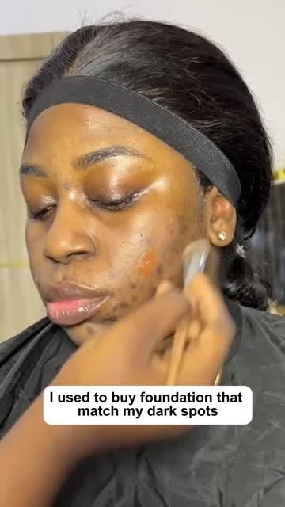
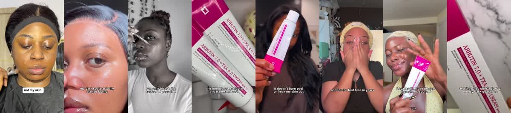
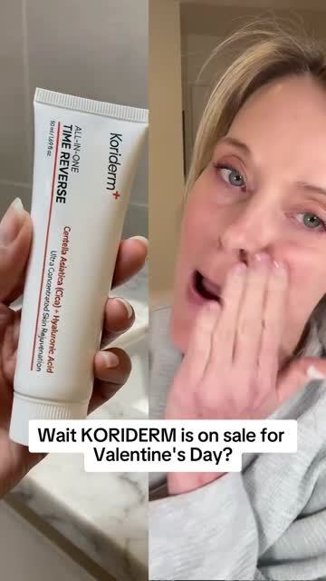
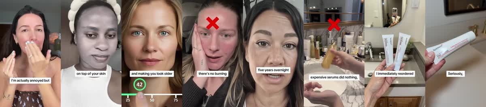

# Meta ad-library examples for F06

<!-- WAVE7 -->
## Wave 7: Lachezar Voynov's "Ad Bible" libraries (Oct 2026)

On Oct 6, 2026 [@LachezarVoynov](https://x.com/LachezarVoynov/status/2107498173384061027) named five Meta pages as "Ad Bibles" for AI ads: Seora Skincare (realistic AI UGC), Koriderm (AI drama), Azure Boutique (AI skits), IM8 Health (AI timeline) and a Resilia page (Suno songs, no active ads when we checked on Oct 9). We pulled each page sorted by impressions and picked the longest-running unique ads. Days live are counted to 2026-10-09, and the brands' claims are not verified.

### Seora Skincare: Buy 1 Get 1 FREE ✨ (24 days live)

- **Ad:** [Meta Ad Library #2127653891437479](https://www.facebook.com/ads/library/?id=2127653891437479) · video 0:58 · page “Seora Skincare” · started 2026-09-15 · from the “Realistic AI UGC ads” library [@LachezarVoynov](https://x.com/LachezarVoynov/status/2107498173384061027) calls an ‘Ad Bible’ ([page](https://www.facebook.com/ads/library/?active_status=active&ad_type=all&country=ALL&search_type=page&view_all_page_id=459501810587662))
- **What happens:** A montage of AI-UGC faces with dark spots: "I used to buy a foundation that matched my dark spots, not my skin. Then I tried this Korean brightening cream… in under eight weeks my dark spots actually started fading."
- **Why it works:** A specific, relatable opener (matching foundation to the flaw), the 8-week timeline, and several faces, so it reads as many customers rather than one.
- **How to make one:** Use the confession opener, then the mechanism in plain words, the week count, and 3-5 face close-ups. Use real customers, or label AI.
- **Do not copy:** Many of these "customers" appear AI-generated. Do not present AI people as real customers.
- **LC remake:** "I used to buy cheap chains that matched my green neck, not my style…"

Transcript (auto, first 90 s)

> I used to buy a foundation that matched my dark spots, not my skin. Then I tried this Korean brightening cream. I applied it daily and in under eight weeks, my dark spots actually started fading. My overall tone started evening out and my skin looked calmer instead of irritated. Most dark spots treatments can only bleach the surface of your skin. This one targets melanin over production, which is why dark spots keep coming back in the first place. The formula uses Arbutin and Tranaxamic Acid, ingredients known to fade hyperpigmentation without damaging your skin. It doesn't burn, peel, or freak my skin out. It just works. Now it's part of my nightly routine and for the first time in years, I don't feel like I have to hide my skin anymore. The brand I've been using is called Sierra because they use the real ingredients source directly from Korea. Not that fake stuff you see on Amazon. They sent me two free gifts with my order and they also offer a 60-day money-back guarantee so you have nothing to lose.

### Koriderm: Buy 1 Get 1 Free Today Only! (133 days live)

- **Ad:** [Meta Ad Library #1340214774727903](https://www.facebook.com/ads/library/?id=1340214774727903) · video 1:23 · page “Koriderm” · started 2026-05-29 · from the “AI drama ads” library [@LachezarVoynov](https://x.com/LachezarVoynov/status/2107498173384061027) calls an ‘Ad Bible’ ([page](https://www.facebook.com/ads/library/?active_status=active&ad_type=all&country=ALL&search_type=page&view_all_page_id=964998840030543))
- **What happens:** "Wait, Koriderm is on sale for Valentine's Day? Why didn't anyone tell me this before I paid full price last month? I'm actually annoyed." Then the demo: the cream on the face and an X over the alternatives.
- **Why it works:** Annoyance at missing a sale is both social proof (she already bought it at full price) and a time-limited offer. It has run 133 days with the holiday swapped in.
- **How to make one:** Open with the creator annoyed at the sale, say "if you've been putting it off, this is your sign", show 3 reasons with a demo, and close on the offer.
- **LC remake:** "Wait, LC is any-7-for-$85 this week? I paid full price for three last month and I'm annoyed."

Transcript (auto, first 90 s)

> Wait, core-derm is on sale for Valentine's Day? Why didn't anyone tell me this before I paid full rice last month? I'm actually annoyed. But if you've been wanting to try this Korean pharmacy cream and put it off because of the price, then this is your sign. Let me show you why I'm obsessed. Unlike every anti-aging cream that just sits on top of your skin doing nothing, core-derm absorbs three times faster and actually gets inside your skin where the damage is happening. It triggers your skin to rebuild its own collagen. The stuff that's disappearing and making you look older every year. It's what Korean women have been using while we've been wasting hundreds on fancy department store jars that don't work. I use it every night and it takes 30 seconds before bed. There's no burning, no irritation, no 10 step routine. You literally just put it on and go to sleep. This was my skin two months ago. Lines around my mouth, tired looking, dull. I looked like I aged five years overnight. And this is now crazy, right? My skin actually glows. It's honestly the first thing that's actually worked for me. And I tried everything. Retinol made my skin keel. Expensive serums did nothing. I even considered Botox, but didn't want needles in my face. This actually works. And two million Korean women can't be wrong. So when I saw they're doing this Valentine's Day Sale right now, I immediately reordered. I don't know how long it's going to last. And this stuff sells out constantly. Even in Korea,

<!-- /WAVE7 -->

<!-- WAVE4 -->
## Wave 4: Alex Fedotoff's October 2026 swipe boards (GetHookd public previews)

Each ad below is from the free 10-ad preview of a public GetHookd board that [@FedotOff90](https://x.com/FedotOff90) shared on X. Days live are as of 2026-10-09; brand claims are the advertisers', not verified.

### Khazanay Pakistan: Clinic presenter in scrubs (orthopedic shoes) (338 days live)

- **Board:** [AI UGC + Doctor Avatars — Health & Wellness](https://x.com/FedotOff90/status/2106401392374186396) · video 70 s
- **What happens:** A woman in navy scrubs in a clinic corridor: "Let me tell you that you don't need a new body. You just need better support… it's not always an injury… unsupported shoes… plantar fasciitis". 70 s, run as 2 near-identical ads.
- **Why it lasts:** 338 days. The scrubs give authority, the reframe ("it's not an injury, it's your shoes") does the selling, and running two near-identical cuts is typical DCO practice.
- **How to make one:** A specialist look-alike (scrubs, not a named doctor), a reframe sentence first, then cause, then product category. Captions mid-frame.
- **LC remake:** "You don't need new skin. You need better metal." A specialist explains nickel and brass.

### Blossom Essentials Skin: Short AI-UGC "only balm I'll ever buy" (Blossom Essentials, 3 variants) (213 days live)

- **Board:** [AI UGC + Doctor Avatars — Health & Wellness](https://x.com/FedotOff90/status/2106401392374186396) · video 33 s
- **What happens:** Three 24-33 s UGC cuts: "This is the only skin balm I will ever spend money on… I've tried everything, from prescription to specialist." Different women, same script skeleton.
- **Why it lasts:** 210-213 days each. One script on many faces is Fedotoff's "avatar is the variable, mechanism is the template".
- **How to make one:** Write one 60-word script and record it with 3-10 faces (AI UGC or creators). Change only the opener.
- **LC remake:** "The only necklace I'll ever spend money on again."

