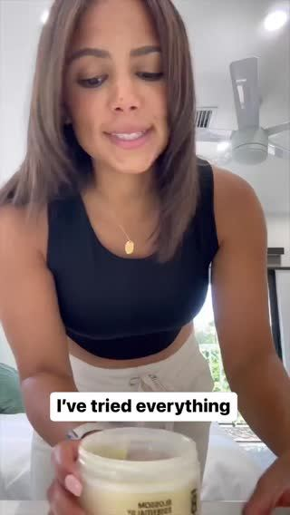

# Meta ad-library examples for F06

<!-- WAVE4 -->
## Wave 4: Alex Fedotoff's October 2026 swipe boards (GetHookd public previews)

Each ad below is from the free 10-ad preview of a public GetHookd board that [@FedotOff90](https://x.com/FedotOff90) shared on X. Days live are as of 2026-10-09; brand claims are the advertisers', not verified.

### Khazanay Pakistan: Clinic presenter in scrubs (orthopedic shoes) (338 days live)

- **Board:** [AI UGC + Doctor Avatars — Health & Wellness](https://x.com/FedotOff90/status/2106401392374186396) · video 70 s
- **What happens:** A woman in navy scrubs in a clinic corridor: "Let me tell you that you don't need a new body. You just need better support… it's not always an injury… unsupported shoes… plantar fasciitis". 70 s, run as 2 near-identical ads.
- **Why it lasts:** 338 days. The scrubs give authority, the reframe ("it's not an injury, it's your shoes") does the selling, and running two near-identical cuts is typical DCO practice.
- **How to make one:** A specialist look-alike (scrubs, not a named doctor), a reframe sentence first, then cause, then product category. Captions mid-frame.
- **LC remake:** "You don't need new skin. You need better metal." A specialist explains nickel and brass.

### Blossom Essentials Skin: Short AI-UGC "only balm I'll ever buy" (Blossom Essentials, 3 variants) (213 days live)

- **Board:** [AI UGC + Doctor Avatars — Health & Wellness](https://x.com/FedotOff90/status/2106401392374186396) · video 33 s
- **What happens:** Three 24-33 s UGC cuts: "This is the only skin balm I will ever spend money on… I've tried everything, from prescription to specialist." Different women, same script skeleton.
- **Why it lasts:** 210-213 days each. One script on many faces is Fedotoff's "avatar is the variable, mechanism is the template".
- **How to make one:** Write one 60-word script and record it with 3-10 faces (AI UGC or creators). Change only the opener.
- **LC remake:** "The only necklace I'll ever spend money on again."

