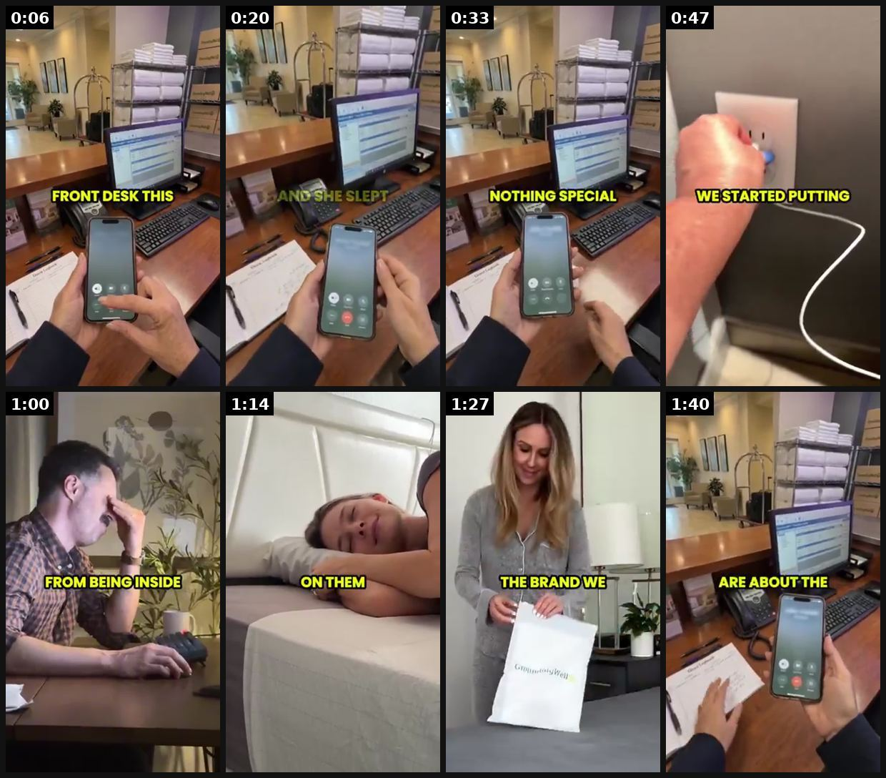
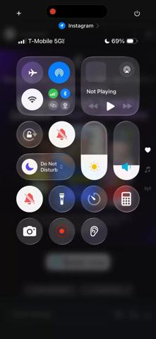

# 07 · Street / resort interview & "overheard question" ("what are you wearing?"): see it, then make it

[](https://x.com/adamtaylorl/status/2094742062755422423)

**The example:** [@adamtaylorl on X](https://x.com/adamtaylorl/status/2094742062755422423) · 1:47 video · 362 likes, 26K views

**Watch it:** [open the post on X](https://x.com/adamtaylorl/status/2094742062755422423) · [play the video file](https://video.twimg.com/amplify_video/2094711596698181632/vid/avc1/320x568/Bt72fu10StlTc2QN.mp4?tag=29)

> If you're in ecom Pay the f*ck attention to what GroundingWell is doing with their creative right now 550+ ads live. Their winning angle is hotel guests asking what mattress they use. They don't even sell mattresses. https://t.co/N4JQnVFdr3

## What you are seeing

Phone-in-hand at a hotel front desk: the creator films herself asking staff what mattress the hotel uses (captions "FRONT DESK THIS...", "NOTHING SPECIAL", "WE STARTED PUTTING"), then cuts to a man sleeping badly, a woman unboxing the brand and the answer reveal. It looks like an overheard real conversation, not an ad.

## Beat by beat

The storyboard above samples the video every 0:13. Lines are the transcript for that stretch; on-screen text comes from OCR, so treat it as rough.

| Frame | Time | On screen | Said / sung |
|---|---|---|---|
| 1 | 0:00–0:13 | · | I already know what this call is gonna be about. Front desk, this is Sarah. Yeah, hi. We just checked out of room 217 this morning. My wife and I were in for a wedding. |
| 2 | 0:13–0:26 | · | Quick question, what kind of mattress do you guys use? Because my wife has fibromyalgia. She hasn't slept through the night in years, and she slept, seven, eight hours straight, |
| 3 | 0:26–0:40 | 3. Vet a | · |
| 4 | 0:40–0:53 | WE STARTED, PUTTING | · |
| 5 | 0:53–1:07 | · | I'm not the science person, I'm not the science person. My manager could explain it better. But basically your body builds up a positive charge |
| 6 | 1:07–1:20 | · | · |
| 7 | 1:20–1:34 | THE BRAND WE | and they have a 90-day return. So if your wife doesn't feel a difference, you just send it back. |
| 8 | 1:34–1:47 | · | Sarah, I think you just saved me three grand. Half the calls I get now are about the sheets. I don't usually tell them. I'm ordering one tonight. Good, get some real sleep. |

<details><summary>Full transcript (timestamped)</summary>

- `0:03` I already know what this call is gonna be about.
- `0:06` Front desk, this is Sarah.
- `0:08` Yeah, hi.
- `0:09` We just checked out of room 217 this morning.
- `0:11` My wife and I were in for a wedding.
- `0:13` Quick question, what kind of mattress do you guys use?
- `0:16` Because my wife has fibromyalgia.
- `0:18` She hasn't slept through the night in years,
- `0:20` and she slept, seven, eight hours straight,
- `0:53` I'm not the science person, I'm not the science person.
- `0:54` My manager could explain it better.
- `0:56` But basically your body builds up a positive charge
- `1:29` and they have a 90-day return.
- `1:31` So if your wife doesn't feel a difference,
- `1:33` you just send it back.
- `1:34` Sarah, I think you just saved me three grand.
- `1:39` Half the calls I get now are about the sheets.
- `1:41` I don't usually tell them.
- `1:43` I'm ordering one tonight.
- `1:45` Good, get some real sleep.

</details>

## More real examples (5)

Other posts that show this format, or a close cousin of it. Click a thumbnail to open it on X.

| | | |
|---|---|---|
| [](https://x.com/tryatria_AI/status/2095860430099058905)<br>**@tryatria_AI** · 0:45 video · 9K views<br>AI resort 'random interview' ('Are you really 56?') hook format. | [](https://x.com/maxxmalist/status/2080007884406960319)<br>**@maxxmalist** · 0:35 video · 6K views<br>the new animation ads are crushing on fb here's an example created by my whop member you can literally do any format with AI: - podcasts - street inte | [](https://x.com/0xROAS/status/2078901864498692155)<br>**@0xROAS** · 0:55 video · 20K views<br>the new drama ADS are crushing on fb lol. you can literally do any format with AI: - podcasts - street interview - drama ads - doctor/authority figure |
| [](https://x.com/vicmediaco/status/2092248121581486114)<br>**@vicmediaco** · 0:19 video · 1K views<br>Made this street interview ad for a beauty brand … what do you think ? Need Video ads? …send a DM 📩 https://t.co/Km4XvI6oNF | [](https://x.com/theisaacmed/status/2087181812103831724)<br>**@theisaacmed** · 0:06 video · 9K views<br>The ad frequency on my meta account for street interview agencies is at 100x. Every day I login to ig and am blasted by ads. https://t.co/UdeTr0VJDw |   |

## How to make one like it

**The format in one line:** **Variant 1 — Interview**: handheld mic, stranger on the street/resort: "Are you really 56?" → "I lost 18 pounds in one month… it was cortisol" ([@tryatria_AI](https://x.com/tryatria_AI/status/2095860430099058905)). Question does the hooking; answer is social proof. **Variant 2 — Overheard question (stronger)**: the product is discovered by a third party asking. GroundingWell: hotel guests calling

**Why it works:** Curiosity + third-party validation; viewer becomes the person asking. Resolves "is it real gold?" doubt via an honest answer on camera.

**Contents:** [1. Structure](#1-copy-the-structure) · [2. Shot by shot](#2-shot-by-shot-remake) · [3. Script and hooks](#3-write-the-script) · [4. Prompts](#4-prompts) · [5. Tools and settings](#5-tools-and-settings) · [6. Louise Carter remake](#6-louise-carter-remake) · [7. Variants and test](#7-variants-and-test-plan) · [8. Pitfalls](#8-pitfalls)

### 1. Copy the structure

Use the example's timing as your beat sheet. Keep the beat, change the words and the product.

| Beat | Time | In the example | Your version |
|---|---|---|---|
| 1 | 0:06 | I already know what this call is gonna be about. Front desk, this is Sarah. Yeah, hi. We just checked out of room 217 this morning. My wife | … |
| 2 | 0:20 | Quick question, what kind of mattress do you guys use? Because my wife has fibromyalgia. She hasn't slept through the night in years, and sh | … |
| 3 | 0:33 | on screen: 3. Vet a | … |
| 4 | 0:47 | on screen: WE STARTED, PUTTING | … |
| 5 | 1:00 | I'm not the science person, I'm not the science person. My manager could explain it better. But basically your body builds up a positive cha | … |
| 6 | 1:14 | (visual beat, see frame 6) | … |
| 7 | 1:27 | and they have a 90-day return. So if your wife doesn't feel a difference, you just send it back. | … |
| 8 | 1:40 | Sarah, I think you just saved me three grand. Half the calls I get now are about the sheets. I don't usually tell them. I'm ordering one ton | … |

### 2. Shot-by-shot remake

**Target length / size:** 20-60s, 1080x1920

| # | Time / slot | What we see (visual + camera) | Dialogue / on-screen text |
|---|---|---|---|
| 1 | 0-3s | Phone in hand, filming a stranger or staff member (hotel desk, beach, street). Handheld, vertical, a bit messy | The overheard question as hook caption: "asked the hotel front desk what mattress this is" |
| 2 | 3-15s | The interviewee answers on camera (or the interviewer reacts) | Natural answer, unscripted feel: "people ask every day, it's [brand]" |
| 3 | 15-30s | Cutaways to the product in that real setting | Captions carry the key facts |
| 4 | 30-end | Creator to camera or end card | "so I bought one" + offer |

<details><summary>Playbook shot list (Louise Carter version from the README)</summary>

Shot list (20-30s, V2): 0-2s stranger approaches / phone rings "Sorry—where is your necklace from?" · 2-10s owner answers casually, fiddles with it · 10-20s reveal detail ("I swim in it") + close-up · 20-25s asker: "okay I'm ordering one" · end card.

## Why it spreads
Curiosity + third-party validation; viewer becomes the person asking. Resolves "is it real gold?" doubt via an honest answer on camera.

</details>

### 3. Write the script

Then fill the beats from the table above. Pull the wording from real customer reviews, not from ad copy: a review line beats a copywriter line almost every time. Read every line out loud and cut anything you would not say to a friend. Ready-made Louise Carter scripts are in section 6; hand [BOT.md](BOT.md) to any AI agent to write versions for another brand.

### 4. Prompts

**Interview brief (real shoot)**

```text
Shoot at a resort pool/beach. Ask 20 women: "what is that necklace, it looks expensive?" Ask permission on camera, get a signed release, film 4K 30fps vertical, wireless lav on the interviewer.
```

**AI version (Veo 3 / Seedance)**

```text
handheld vertical phone footage of a woman at a hotel front desk asking the receptionist a question, natural daylight, realistic skin, slight camera shake, ambient lobby noise; 8s; then the receptionist smiling and answering
```

### 5. Tools and settings

Real: hire 2 creators, film in a café/beach, scripted-but-natural (disclose as ad). AI: Seedance/Veo two-character scene — only for dramatized skits, not presented as real people.

| Setting | Value |
|---|---|
| Canvas | 1080×1920 (9:16) master; crop a 1080×1350 (4:5) cut for feed placements |
| Frame rate | 30 fps (shoot 60 fps for slow-motion water or sparkle shots) |
| Camera | Phone main lens at 1x, exposure locked on skin, HDR off, grid on; tripod or a phone clamp for product shots |
| Light | One soft key at 45° (window or ring light), white card as fill; side light for metal sparkle |
| Audio | Lavalier or phone 15–20 cm from the mouth; mix voice at -14 LUFS, music at -28 to -30 dB under voice |
| Captions | Burned in, 2–5 words per line, 64–80 px bold sans, white with a black stroke or pill; keep text inside the safe zone (top 220 px and bottom 420 px clear, 64 px side margins) |
| Pacing | A visual change every 1.5–3 s; the hook lands in the first 1.5 s with no logo intro |
| Edit / export | CapCut or Premiere; H.264, 12–20 Mbps, AAC 320 kbps; upload natively to each platform, not via links |

### 6. Louise Carter remake

A. Barista: "Okay, I have to ask, where's that necklace from? I've seen you in it every day for a month" → "It's Louise Carter — I literally never take it off, I swim in it" → barista writes it on her hand.
B. Beach lifeguard: "You know you can't swim in gold, right?" → "This one I can — 14K PVD." → splash, close-up.
C. Wedding: bridesmaid at the table asks the bride's mom about her stack → "Seven pieces, eighty-five dollars" → "Shut up."

Brand rules, claims you can and cannot make, and more scripts: [brands/louise-carter.md](brands/louise-carter.md). Step-by-step from idea to scale: [STAGES.md](STAGES.md).

### 7. Variants and test plan

**Test plan:** 3 real-creator skits + 3 AI-dramatized; Meta $50/day each 4 days; metrics hook rate, CPA, Omni new customer %. Kill rule: if both real and AI versions lose to account median CPA by 30% → format not for LC.

**Naming:** `F07-<variant>-<hook##>-<date>` so results map back to this folder. Change one thing per test (hook, narrator, length or offer), never two.

### 8. Pitfalls

- Staged "real people" interviews that are presented as real are deceptive; if actors or AI, label it.
- Get a release from everyone identifiable.
- The question must be one a real person would ask; scripted-sounding questions kill the overheard feel.
- Slow open: if the first 1.5 s does not show the hook visually, most people swipe.
- Logo or brand intro at the start reads as an ad; put the brand at the end.
- Captions covered by the platform UI: check the safe zone on a real phone before posting.
- Music over the voice: keep music at least 14 dB under speech.

**Compliance:** [_COMPLIANCE.md](../_COMPLIANCE.md). Interviews are ads → creators disclose; never present an AI "stranger" as a real customer. No health claims (Resilia/cortisol examples are supplement territory).

## Field notes

Newer observations live in the playbook: [Wave 2d update: AI street interviews (Resilia, Smooche)](README.md) · [Wave 4 update: Fedotoff October 2026 swipe boards](README.md)

## More examples

Every post we found for this format, with transcripts: [examples/](examples/README.md). Playbook: [README.md](README.md). Agent brief: [BOT.md](BOT.md).
