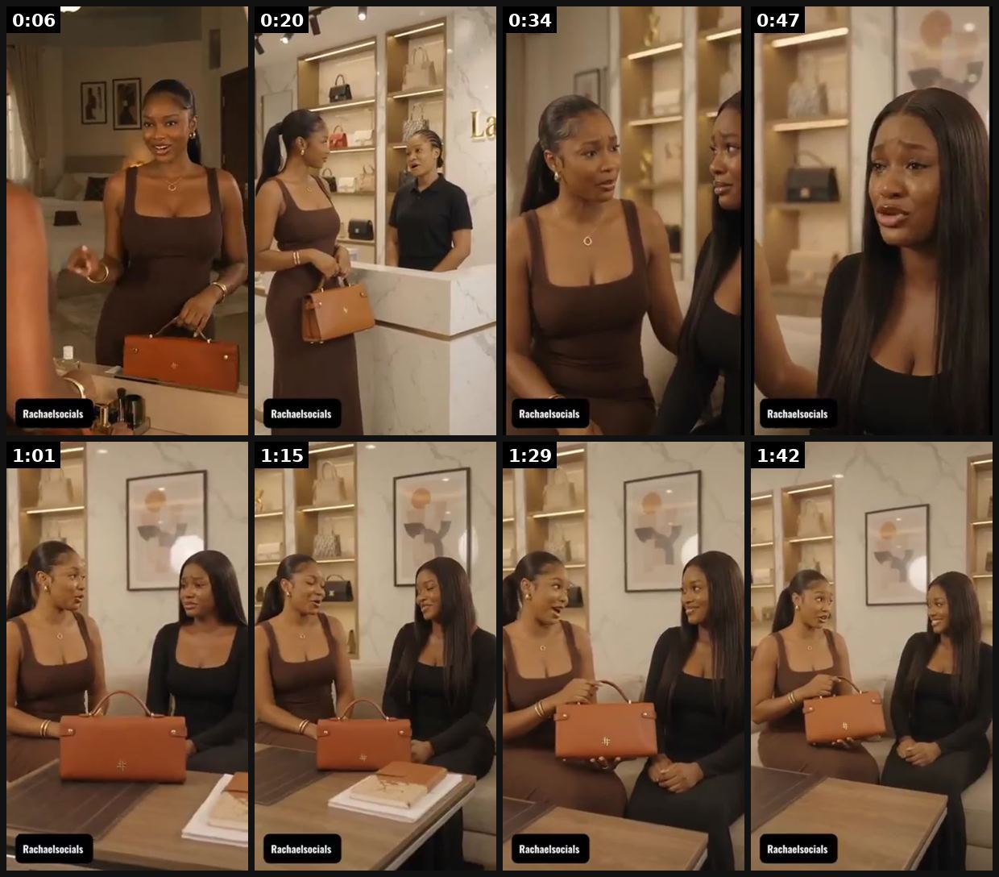

# 08 · Drama "show" micro-series (product as a prop, entertainment first): see it, then make it

[](https://x.com/JUSTCHAEL_/status/2098373776828256595)

**The example:** [@JUSTCHAEL_ on X](https://x.com/JUSTCHAEL_/status/2098373776828256595) · 1:49 video · 61 likes, 2K views

**Watch it:** [open the post on X](https://x.com/JUSTCHAEL_/status/2098373776828256595) · [play the video file](https://video.twimg.com/amplify_video/2098373566848708611/vid/avc1/320x568/5fJN8PQBSpH-pP7b.mp4?tag=29)

> Enjoy this short drama ad I created for Outlash, featuring their Curt Purse. @outlashbrand AI can create story-driven ads, not just pretty visuals. If you’re looking to advertise your brand, product or service with AI, send me a DM.

## What you are seeing

A short AI-made soap-opera scene for a handbag brand (Outlash): three women in a boutique, a tense confrontation, close-ups of the brown purse, then a cut to a living-room fallout. Shot and paced like an episode of a drama series, with the bag as a plot device.

## Beat by beat

The storyboard above samples the video every 0:13. Lines are the transcript for that stretch; on-screen text comes from OCR, so treat it as rough.

| Frame | Time | On screen | Said / sung |
|---|---|---|---|
| 1 | 0:00–0:13 | Ie a we 7. ap | Let's get the day started |
| 2 | 0:13–0:27 | · | Good morning ma. Good morning. How are you? I'm fine ma. Do we have any updates so far? None for now ma. Alright Ma one of your friends is around she said she wants to see you my friend. What could be the problem with her? |
| 3 | 0:27–0:41 | · | Please tell her to come in. What exactly is the problem? Why are you crying? Is it not Samuel? |
| 4 | 0:41–0:54 | · | Relationship matter again on a Monday morning. Eh? You can't blame me. Imagine him telling me he's going to break up with me because I don't have good fashion sense. He said I use I use tacky bags Can you imagine? Why are you laughing? Did I say anything funny? I'm not going to agree with him about  |
| 5 | 0:54–1:08 | · | But when it comes to the tacky bags issue, he is perfectly right Because you are the only person I know that earns well but still ends up buying low quality bags that start peeling after one month I don't know what to do |
| 6 | 1:08–1:22 | · | That's even why I came to meet you. You're my friend and you know your way around Iced bags and I'm so flattered Well, I'm glad you're finally ready to upgrade the kind of bags you use and guess what? I have a special collection for you |
| 7 | 1:22–1:35 | · | This is a curt purse from Outlash. It's even what I brought to the office today In fact, everybody around me knows how much I love buying bags from this brand. Wow I think I love this one. You should definitely go for it You know, I would never mislead you when it comes to getting nice bags |
| 8 | 1:35–1:49 | · | I even have a lot of bags from Outlash in the shop right now If you really want to step up your bag game as a Legos big girl Outlash is the right brand to start with. Please. I'm ready. Show me the rest of the bags from this bag |

<details><summary>Full transcript (timestamped)</summary>

- `0:05` Let's get the day started
- `0:08` Good morning ma. Good morning. How are you? I'm fine ma. Do we have any updates so far? None for now ma.
- `0:21` Alright
- `0:24` Ma one of your friends is around she said she wants to see you my friend. What could be the problem with her?
- `0:31` Please tell her to come in. What exactly is the problem? Why are you crying?
- `0:36` Is it not Samuel?
- `0:39` Relationship matter again on a Monday morning. Eh? You can't blame me.
- `0:44` Imagine him telling me he's going to break up with me because I don't have good fashion sense. He said I use I use tacky bags
- `0:49` Can you imagine?
- `0:50` Why are you laughing? Did I say anything funny? I'm not going to agree with him about the fashion sense part
- `0:56` But when it comes to the tacky bags issue, he is perfectly right
- `1:00` Because you are the only person I know that earns well but still ends up buying low quality bags that start peeling after one month
- `1:06` I don't know what to do
- `1:08` That's even why I came to meet you. You're my friend and you know your way around Iced bags and I'm so flattered
- `1:15` Well, I'm glad you're finally ready to upgrade the kind of bags you use and guess what? I have a special collection for you
- `1:21` This is a curt purse from Outlash. It's even what I brought to the office today
- `1:25` In fact, everybody around me knows how much I love buying bags from this brand. Wow
- `1:30` I think I love this one. You should definitely go for it
- `1:33` You know, I would never mislead you when it comes to getting nice bags
- `1:37` I even have a lot of bags from Outlash in the shop right now
- `1:40` If you really want to step up your bag game as a Legos big girl
- `1:43` Outlash is the right brand to start with. Please. I'm ready. Show me the rest of the bags from this bag

</details>

## How to make one like it

**The format in one line:** A 45-120s mini-episode with characters, conflict, tension and payoff; product enters late as the thing that changes the scene. "Women wanna watch shows… They don't wanna get 8 seconds into their scroll and suddenly feel ambushed by an ad. So give them the show" ([@frankyecom](https://x.com/frankyecom/status/2106833649970684195)). Best drama ads let the viewer "experience a version of themselves th

**Why it works:** Retention (people want the payoff), comments ("I need part 2"), shares among friends; avoids ad-blindness.

**Contents:** [1. Structure](#1-copy-the-structure) · [2. Shot by shot](#2-shot-by-shot-remake) · [3. Script and hooks](#3-write-the-script) · [4. Prompts](#4-prompts) · [5. Tools and settings](#5-tools-and-settings) · [6. Louise Carter remake](#6-louise-carter-remake) · [7. Variants and test](#7-variants-and-test-plan) · [8. Pitfalls](#8-pitfalls)

### 1. Copy the structure

Use the example's timing as your beat sheet. Keep the beat, change the words and the product.

| Beat | Time | In the example | Your version |
|---|---|---|---|
| 1 | 0:06 | Let's get the day started | … |
| 2 | 0:20 | Good morning ma. Good morning. How are you? I'm fine ma. Do we have any updates so far? None for now ma. Alright Ma one of your friends is a | … |
| 3 | 0:34 | Please tell her to come in. What exactly is the problem? Why are you crying? Is it not Samuel? | … |
| 4 | 0:47 | Relationship matter again on a Monday morning. Eh? You can't blame me. Imagine him telling me he's going to break up with me because I don't | … |
| 5 | 1:01 | But when it comes to the tacky bags issue, he is perfectly right Because you are the only person I know that earns well but still ends up bu | … |
| 6 | 1:15 | That's even why I came to meet you. You're my friend and you know your way around Iced bags and I'm so flattered Well, I'm glad you're final | … |
| 7 | 1:29 | This is a curt purse from Outlash. It's even what I brought to the office today In fact, everybody around me knows how much I love buying ba | … |
| 8 | 1:42 | I even have a lot of bags from Outlash in the shop right now If you really want to step up your bag game as a Legos big girl Outlash is the | … |

### 2. Shot-by-shot remake

**Target length / size:** 45-120s episode, 1080x1920

| # | Time / slot | What we see (visual + camera) | Dialogue / on-screen text |
|---|---|---|---|
| 1 | 0-5s | Cold open mid-conflict: two women, one accusing the other | First line is drama, not product: "You wore MY necklace to her wedding?" |
| 2 | 5-30s | Shot-reverse-shot dialogue, medium close-ups, warm interior | Escalation, a secret revealed |
| 3 | 30-60s | Twist: the necklace matters to the plot (it was a gift, it survived something) | Product appears as a prop, never pitched |
| 4 | 60-90s | Payoff + cliffhanger for episode 2 | "Part 2 tomorrow" caption |
| 5 | End card (2s) | Product + brand, quiet | "[Brand] · waterproof 14K" + AI label if generated |

### 3. Write the script

Open with one of these hooks (first 1–3 seconds, or the headline on a static):

"My husband's 'work wife' came to our anniversary…", "My ex showed up to the wedding with…", "She borrowed my necklace and never gave it back", "I found my mom's jewelry box after…".

Then fill the beats from the table above. Pull the wording from real customer reviews, not from ad copy: a review line beats a copywriter line almost every time. Read every line out loud and cut anything you would not say to a friend. Ready-made Louise Carter scripts are in section 6; hand [BOT.md](BOT.md) to any AI agent to write versions for another brand.

### 4. Prompts

**Script (Claude)**

```text
Write a 90-second soap-opera episode with 3 women, one location, one secret and a cliffhanger. A gold necklace from [brand] is the object the conflict is about. No product claims in dialogue except one natural line ("I literally swim in it").
```

**Veo 3 / Seedance (dialogue scenes)**

```text
cinematic medium close-up, two women in a boutique arguing, dramatic soft lighting, 35mm, natural lip-sync with dialogue "[line]", 8s, 9:16
```

### 5. Tools and settings

Claude writes 10 episode outlines from LC personas; AI video (Seedance/Veo/Kling) with locked cast reference sheets, or real actors on a 1-day shoot for 6 episodes; VO + captions; real product close-ups.

| Setting | Value |
|---|---|
| Canvas | 1080×1920 (9:16) master; crop a 1080×1350 (4:5) cut for feed placements |
| Frame rate | 30 fps (shoot 60 fps for slow-motion water or sparkle shots) |
| Camera | Phone main lens at 1x, exposure locked on skin, HDR off, grid on; tripod or a phone clamp for product shots |
| Light | One soft key at 45° (window or ring light), white card as fill; side light for metal sparkle |
| Audio | Lavalier or phone 15–20 cm from the mouth; mix voice at -14 LUFS, music at -28 to -30 dB under voice |
| Captions | Burned in, 2–5 words per line, 64–80 px bold sans, white with a black stroke or pill; keep text inside the safe zone (top 220 px and bottom 420 px clear, 64 px side margins) |
| Pacing | A visual change every 1.5–3 s; the hook lands in the first 1.5 s with no logo intro |
| Edit / export | CapCut or Premiere; H.264, 12–20 Mbps, AAC 320 kbps; upload natively to each platform, not via links |

### 6. Louise Carter remake

A. **"The necklace swap" (Ep1)**: Maid of honour notices the bride's sister keeps taking off her necklace before every photo (it's turning her neck green). Night before wedding, the bride slips her a Louise Carter box: "So you stop hiding in the pictures." Payoff: sister front and centre in the group photo, necklace catching light. Tag: "Waterproof 14K PVD. Gift sets."
B. **"Work wife" revenge (inspired by structure only)**: wife discovers husband's "work wife" will be at the beach trip; she shows up radiant, swimming in her full gold stack while the rival frets over her tarnishing bracelet. Payoff line: "Mine's waterproof, babe."
C. **"Mom's jewelry box" (tearjerker)**: daughter finds mom's tarnished jewelry she was "saving"; buys them both matching LC pieces to wear every day: "No more saving things for later."

Brand rules, claims you can and cannot make, and more scripts: [brands/louise-carter.md](brands/louise-carter.md). Step-by-step from idea to scale: [STAGES.md](STAGES.md).

### 7. Variants and test plan

**Test plan:** Episode 1 of 3 concepts; $100/day each; metrics: 50% hold, comments/1k, Omni new-customer CPA; winners get Ep2/Ep3 and run as a sequence (Meta sequencing via engaged-viewer audiences is optional; Advantage+ usually handles).

**Naming:** `F08-<variant>-<hook##>-<date>` so results map back to this folder. Change one thing per test (hook, narrator, length or offer), never two.

### 8. Pitfalls

- Entertainment first: if the product is pitched in the first 30s it becomes an ad and drops retention.
- Keep the same faces across episodes (character reference images), or the series feels fake.
- Long dialogue AI scenes break; keep each generated shot under 8s and cut between them.
- Slow open: if the first 1.5 s does not show the hook visually, most people swipe.
- Logo or brand intro at the start reads as an ad; put the brand at the end.
- Captions covered by the platform UI: check the safe zone on a real phone before posting.
- Music over the voice: keep music at least 14 dB under speech.

**Compliance:** [_COMPLIANCE.md](../_COMPLIANCE.md). Fiction must not imply real people; avoid sexual content and step-family tropes used by some advertorial examples in this feed. AI label if AI actors.

## Field notes

Newer observations live in the playbook: [Wave 2c update: long-form drama episodes (Pocket FM, via Fedotoff)](README.md) · [Wave 2d update: single-episode melodrama vs serial](README.md)

## More examples

Every post we found for this format, with transcripts: [examples/](examples/README.md). Playbook: [README.md](README.md). Agent brief: [BOT.md](BOT.md).
