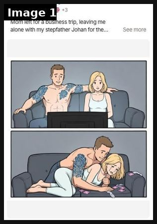
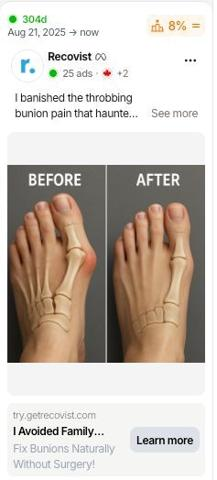
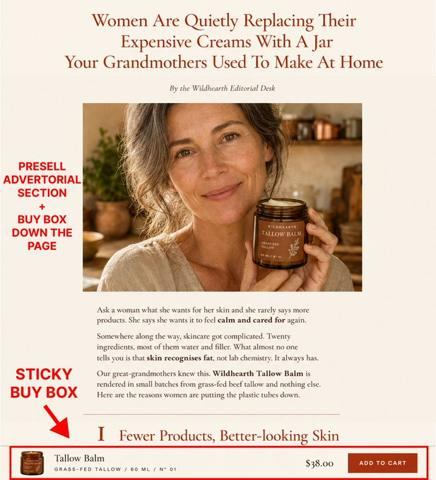
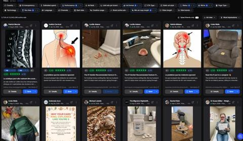
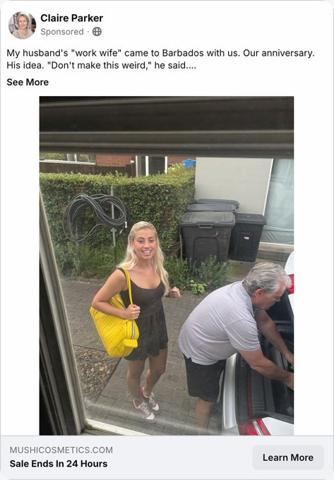
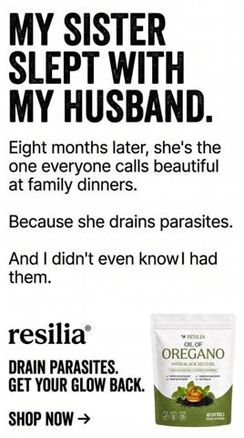
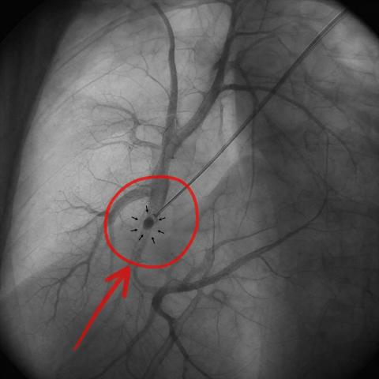
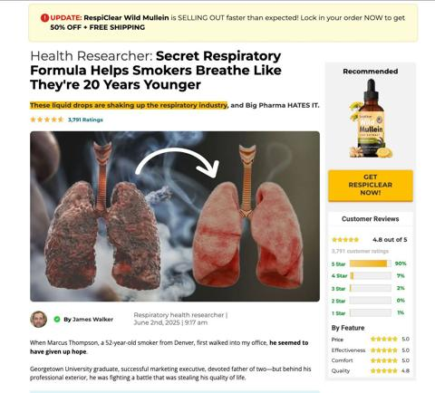

# 09 · Native story static → advertorial (long primary text, personal-post look, illustrated comic variant): see it, then make it

[](https://x.com/antonioventre_/status/2083619527170871298)

**The example:** [@antonioventre_ on X](https://x.com/antonioventre_/status/2083619527170871298) · 1 image · 131 likes, 18K views

**Watch it:** [open the post on X](https://x.com/antonioventre_/status/2083619527170871298)

> Illustrated story-based ad format is quietly crushing right now Long-form primary text The ad sells the next line of the story The advertorial does the closing https://t.co/QprAq5yLsw

## What you are seeing

A Facebook-native illustrated comic. The caption opens with a story hook ("Mom left for a business trip, leaving me alone with my stepfather Johan..." then See more) over two cartoon panels. It reads like a story post; the long primary text leads to an advertorial.

## Image by image

| Image | Text on it (OCR, rough) |
|---|---|
| 1 | 40 ads: Mom left for a business trip, leaving me See more alone with my stepfather Johan for the... Pos as |

## More real examples (8)

Other posts that show this format, or a close cousin of it. Click a thumbnail to open it on X.

| | | |
|---|---|---|
| [](https://x.com/antonioventre_/status/2078512377616589256)<br>**@antonioventre_** · image · 5K views<br>Before/after photos are best native ad image: change creates curiosity; long copy tells story. | [](https://x.com/blvckledge/status/2083175922048647671)<br>**@blvckledge** · image · 7K views<br>Advertorials outperform PDP for Google Shopping traffic. | [](https://x.com/EcomTable/status/2100980324633063694)<br>**@EcomTable** · image · 21K views<br>Ad-spy filters: top 10-25%, image, active, 14+ day run, 2,500+ char copy -> find long-copy native winners. |
| [](https://x.com/antonioventre_/status/2107899522353381868)<br>**@antonioventre_** · image · 20K views<br>Story ad >1M reach: wife/work-wife anniversary drama, no product in first 40 words, revenge payoff. | [](https://x.com/tryatria_AI/status/2105745816828940336)<br>**@tryatria_AI** · image · 4K views<br>Static hook 'My sister slept with my husband' vs generic benefit lines. | [](https://x.com/antonioventre_/status/2106778634006442013)<br>**@antonioventre_** · image · 2K views<br>The structure I use for story ads, in video and in long primary text: 1 - Hook: the problem, not the product 2 - Problem: make it specific enough that |
| [](https://x.com/HenryCrochemore/status/2081681278861021254)<br>**@HenryCrochemore** · image · 5K views<br>spoke with an operator running paid social for a fast-growing skincare brand they connected gethookd api + mcp to turn one winning angle into hundreds | [](https://x.com/antonioventre_/status/2078183710604591539)<br>**@antonioventre_** · image · 1K views<br>The native ad funnel, start to finish. 1. The ad. A native image and a long story in the primary text. Built for an unaware or problem-aware person. 2 |   |

## How to make one like it

**The format in one line:** Looks like a friend's Facebook post, not an ad: a person's name as page ("Claire Parker · Sponsored"), first line is a story ("My husband's 'work wife' came to Barbados with us. Our anniversary. His idea. 'Don't make this weird,' he said…"), a candid phone photo, **nothing about the product in the first 40 words**, then a long story (300-2,500 chars) where the product lands as the thing she used (

**Why it works:** Native look avoids ad-blindness; curiosity loop forces "See more" (a click that trains delivery); long copy pre-sells so advertorial CVR is high. Facebook skew older = gifting buyers.

**Contents:** [1. Structure](#1-copy-the-structure) · [2. Shot by shot](#2-shot-by-shot-remake) · [3. Script and hooks](#3-write-the-script) · [4. Prompts](#4-prompts) · [5. Tools and settings](#5-tools-and-settings) · [6. Louise Carter remake](#6-louise-carter-remake) · [7. Variants and test](#7-variants-and-test-plan) · [8. Pitfalls](#8-pitfalls)

### 1. Copy the structure

The skeleton every version follows: **hook → problem or tension → turn (the product shows up) → proof → one clear ask.** The shot-by-shot below fills it in.

### 2. Shot-by-shot remake

**Target length / size:** 1 image + 150-600 words of primary text

| # | Time / slot | What we see (visual + camera) | Dialogue / on-screen text |
|---|---|---|---|
| 1 | Image | Lo-fi illustration or real-looking phone photo of the story moment (two people, a table, a wedding) | No text on the image, or one short speech bubble |
| 2 | Primary text line 1 | - | A story hook that gets the "See more" tap: "My husband's 'work wife' came to Barbados with us..." |
| 3 | Primary text body | - | First-person story in short paragraphs, real details, the product enters as part of what happened |
| 4 | Close | - | Link to an advertorial that continues the story, not to the product page |
| 5 | Page name | - | A persona or editorial page, labelled as sponsored |

### 3. Write the script

Then fill the beats from the table above. Pull the wording from real customer reviews, not from ad copy: a review line beats a copywriter line almost every time. Read every line out loud and cut anything you would not say to a friend. Ready-made Louise Carter scripts are in section 6; hand [BOT.md](BOT.md) to any AI agent to write versions for another brand.

### 4. Prompts

**Illustration (Midjourney)**

```text
simple flat comic illustration, two panels, a woman at a dinner table looking at her husband laughing with a coworker, muted colours, Facebook comic style --ar 4:5
```

**Story (Claude)**

```text
Write a 400-word first-person Facebook post from a 42-year-old woman. Hook in the first 12 words. Story: [situation]. [Product] appears naturally at the turning point. Short paragraphs, no hashtags, ends by pointing to the full story.
```

### 5. Tools and settings

Claude writes 10 stories from review themes (gift moments, beach trip, wedding, divorce glow-up, mom/daughter); photo = real customer UGC (permission) or staged phone photo with LC piece visible; advertorial on Shopify page template (or Replo/Zipify): headline story, 3 reasons, real reviews, offer block (7 for $85), guarantee.

| Setting | Value |
|---|---|
| Canvas | 1080×1350 (4:5) for feed; 1080×1920 (9:16) story/reel version with the same elements stacked |
| Type | Headline 80–110 px, max 8 words; body 36–44 px; at most 2 typefaces |
| Layout | Headline readable at thumbnail size; product at least 40% of the canvas; logo small, bottom corner |
| Safe zone | Keep text out of the bottom 20% on 9:16 (UI overlays) |
| Tools | Figma or Canva for layout; Photoshop or Photoroom to cut out product; Midjourney or Flux only for backgrounds, never for the product itself |
| Export | PNG or JPG at quality 90, sRGB, under 1 MB |

### 6. Louise Carter remake

A. "My mother-in-law told me at Thanksgiving that 'real women wear real gold.' I smiled and said nothing. … [turn] What she didn't know: I'd been swimming in that necklace all summer. It's Louise Carter, 14K PVD…"
B. "I lost my wedding ring in the ocean on our 10th anniversary." … husband surprises her with an LC waterproof stack "so you never have to take anything off again".
C. Illustrated: Panel 1 teen daughter "borrows" mom's necklace for prom; Panel 2 it turns her neck green in the photos; caption "Mom had one rule after that…" → advertorial: the mom's story of switching the family to waterproof jewelry.

Brand rules, claims you can and cannot make, and more scripts: [brands/louise-carter.md](brands/louise-carter.md). Step-by-step from idea to scale: [STAGES.md](STAGES.md).

### 7. Variants and test plan

**Test plan:** Advertorial vs PDP split (same ad) — @blvckledge and @antonioventre_ both note PDP is often the wrong destination; comparison clicks should go to a comparison page. Metrics: CTR (link) ≥1.5%, advertorial→PDP click ≥35%, Omni CPA/new-customer revenue per landing page.

**Naming:** `F09-<variant>-<hook##>-<date>` so results map back to this folder. Change one thing per test (hook, narrator, length or offer), never two.

### 8. Pitfalls

- The first line decides everything; write 20 and test 5.
- Fiction must not be presented as a real customer testimonial; keep claims inside the advertorial truthful.
- Facebook flags sensational personal-attribute language ("are you fat?"); write about the character, not the reader.
- Too much text: if it cannot be read in 1 second at thumbnail size, cut it.
- AI-generated product images: show the real product; AI is fine for backgrounds only.

**Compliance:** [_COMPLIANCE.md](../_COMPLIANCE.md). Story ads are fiction → no "true story" claims unless true; persona page names must not impersonate real people; Meta requires the advertiser identity to be clear — run from LC page with a creator-style name only via Partnership ads with a real creator. Some feed examples use sexual/step-family comics — LC must not.

## Field notes

Newer observations live in the playbook: [Wave 2c update: the Native Statics Machine (Fedotoff)](README.md)

## More examples

Every post we found for this format, with transcripts: [examples/](examples/README.md). Playbook: [README.md](README.md). Agent brief: [BOT.md](BOT.md).
