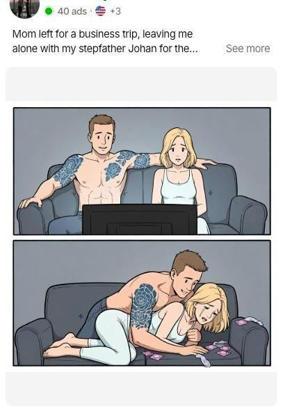

# 09 · Native story static → advertorial

<!-- HERO:START -->

**[See the example and how to make it →](EXAMPLE.md)** · [watch on X](https://x.com/antonioventre_/status/2083619527170871298)
<!-- HERO:END -->

## What it looks like
Looks like a friend's Facebook post, not an ad: a person's name as page ("Claire Parker · Sponsored"), first line is a story ("My husband's 'work wife' came to Barbados with us. Our anniversary. His idea. 'Don't make this weird,' he said…"), a candid phone photo, **nothing about the product in the first 40 words**, then a long story (300-2,500 chars) where the product lands as the thing she used ([@antonioventre_](https://x.com/antonioventre_/status/2107899522353381868)). Click → advertorial (first-person or news-interview style) → PDP/bundle.
Illustrated variant: 2-4 comic panels with a cliffhanger caption; "the ad sells the next line of the story; the advertorial does the closing" ([@antonioventre_](https://x.com/antonioventre_/status/2083619527170871298)).
Mirror ad: the ICP "must be shocked and see herself"; news-article style copy; advertorial = interview where ICP describes her discovery ([@dep_hart](https://x.com/dep_hart/status/2076056430986309814)).

Structure: photo (candid / before-after / comic) · line 1 conflict · 3-6 short paragraphs of story · turning point (product, specific) · result · soft CTA "here's the one I got" · link.

## Finding winners to learn from (research, not copying)
Ad library filters ([@EcomTable](https://x.com/EcomTable/status/2100980324633063694)): top 10-25% performance · image · active · run ≥14 days · min copy length 2,500 chars.

## Why it spreads
Native look avoids ad-blindness; curiosity loop forces "See more" (a click that trains delivery); long copy pre-sells so advertorial CVR is high. Facebook skew older = gifting buyers.

## Production recipe
Claude writes 10 stories from review themes (gift moments, beach trip, wedding, divorce glow-up, mom/daughter); photo = real customer UGC (permission) or staged phone photo with LC piece visible; advertorial on Shopify page template (or Replo/Zipify): headline story, 3 reasons, real reviews, offer block (7 for $85), guarantee.

## LC adaptation — 3 scripts (first lines + turn)
A. "My mother-in-law told me at Thanksgiving that 'real women wear real gold.' I smiled and said nothing. … [turn] What she didn't know: I'd been swimming in that necklace all summer. It's Louise Carter, 14K PVD…"
B. "I lost my wedding ring in the ocean on our 10th anniversary." … husband surprises her with an LC waterproof stack "so you never have to take anything off again".
C. Illustrated: Panel 1 teen daughter "borrows" mom's necklace for prom; Panel 2 it turns her neck green in the photos; caption "Mom had one rule after that…" → advertorial: the mom's story of switching the family to waterproof jewelry.

## Test plan + metric
Advertorial vs PDP split (same ad) — @blvckledge and @antonioventre_ both note PDP is often the wrong destination; comparison clicks should go to a comparison page. Metrics: CTR (link) ≥1.5%, advertorial→PDP click ≥35%, Omni CPA/new-customer revenue per landing page.

## Compliance
[_COMPLIANCE.md](../_COMPLIANCE.md). Story ads are fiction → no "true story" claims unless true; persona page names must not impersonate real people; Meta requires the advertiser identity to be clear — run from LC page with a creator-style name only via Partnership ads with a real creator. Some feed examples use sexual/step-family comics — LC must not.

## Wave 2c update: the Native Statics Machine (Fedotoff)
- **10 torn-down winners (score 98-100):** story native (The Blood Pressure Journal, 496 ads), dialogue native (Cattasaurus, 961), persona-page native (Eden Labs, 140), obedience-failed native, micro-niche native, fiction serial (**F81**), avatar rotation (one product, two pages, three lives; Ledisa 99 + 207 ads).
- **Grid:** 8 ideas × angles × visuals = 192 ads. Copy engine: a modeling chain of 3 prompts. The first 125 characters are the ad. Scale math: 4 bases become 30 copies before lunch.
- **Boards:** 777 native images + long copy; 122 unusual-visual natives (**F84**). Doc: [Native Statics Machine](https://rural-lifeboat-196.notion.site/3aedb9d7074d8199908edf9545dc8277).

<!-- EVIDENCE:START -->
## Evidence from X discovery (auto-generated)

| Date | Author | Post | Engagement | Grade | Gist |
|---|---|---|---|---|---|
| 2026-09-18 | [@EcomTable](https://x.com/EcomTable) | [link](https://x.com/EcomTable/status/2100980324633063694) | 285L/418BM/21kV | VALUE | Ad-spy filters: top 10-25%, image, active, 14+ day run, 2,500+ char copy -> find long-copy native winners. |
| 2026-10-07 | [@antonioventre_](https://x.com/antonioventre_) | [link](https://x.com/antonioventre_/status/2107899522353381868) | 241L/365BM/19kV | VALUE | Story ad >1M reach: wife/work-wife anniversary drama, no product in first 40 words, revenge payoff. |
| 2026-08-01 | [@antonioventre_](https://x.com/antonioventre_) | [link](https://x.com/antonioventre_/status/2083619527170871298) | 131L/233BM/17kV | VALUE | Illustrated story-based ad: long primary text, ad sells next line, advertorial closes. |
| 2026-07-18 | [@antonioventre_](https://x.com/antonioventre_) | [link](https://x.com/antonioventre_/status/2078512377616589256) | 79L/64BM/4kV | VALUE | Before/after photos are best native ad image: change creates curiosity; long copy tells story. |
| 2026-10-01 | [@tryatria_AI](https://x.com/tryatria_AI) | [link](https://x.com/tryatria_AI/status/2105745816828940336) | 73L/98BM/4kV | VALUE | Static hook 'My sister slept with my husband' vs generic benefit lines. |
| 2026-07-11 | [@dep_hart](https://x.com/dep_hart) | [link](https://x.com/dep_hart/status/2076056430986309814) | 65L/90BM/5kV | VALUE | Native ads: mirror ad (ICP sees herself), news-article copy, interview-style advertorial. |
| 2026-07-31 | [@blvckledge](https://x.com/blvckledge) | [link](https://x.com/blvckledge/status/2083175922048647671) | 50L/68BM/6kV | VALUE | Advertorials outperform PDP for Google Shopping traffic. |
| 2026-08-10 | [@adamtaylorl](https://x.com/adamtaylorl) | [link](https://x.com/adamtaylorl/status/2086814826177679660) | 36L/36BM/3kV | VALUE | Dead in 2026: polished studio, "hey guys" UGC, discount statics, founder-story VSLs. Printing: ugly advertorial statics, long-form yapper, comment-reply hooks, us-vs-them statics. |
| 2026-07-17 | [@williamkast_](https://x.com/williamkast_) | [link](https://x.com/williamkast_/status/2078179704050246125) | 28L/34BM/3kV | VALUE | 5 formats to test: founder talking head, voiceless B-roll text overlay, yapper (uncut), AI educational, camouflage static + long copy. |
| 2026-09-07 | [@FedotOff90](https://x.com/FedotOff90) | [link](https://x.com/FedotOff90/status/2096964245485449453) | 17L/18BM/3kV | VALUE | SafeRoad: 7,800-character confession (reading Amazon reviews at 1:23 AM) → comparison advertorial, 200 days live; port formats from outside your niche. |
| 2026-09-25 | [@therahulissar](https://x.com/therahulissar) | [link](https://x.com/therahulissar/status/2103485927528009820) | 12L/7BM/1kV | VALUE | Trends beyond AI: greenscreen personal story with no product until late; natives → quiz funnel; founder calling customers. |
| 2026-10-05 | [@Ecombos_Ai](https://x.com/Ecombos_Ai) | [link](https://x.com/Ecombos_Ai/status/2107157131010965744) | 22L/14BM/1kV | SOME | AI ecom format tiers: S = AI animation, AI singing, AI native statics → advertorial; A = AI before/after, AI podcast, talking product; F = AI avatar reading script, AI street interviews. |
<!-- EVIDENCE:END -->
