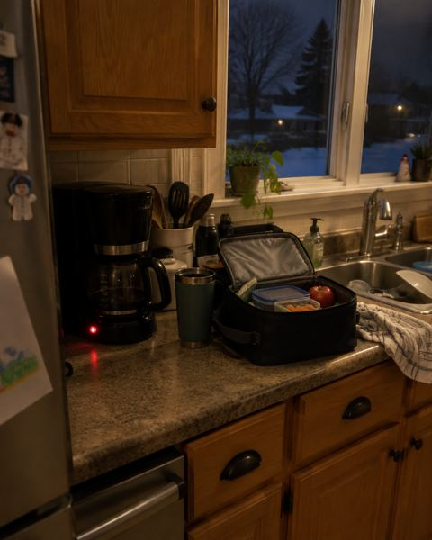
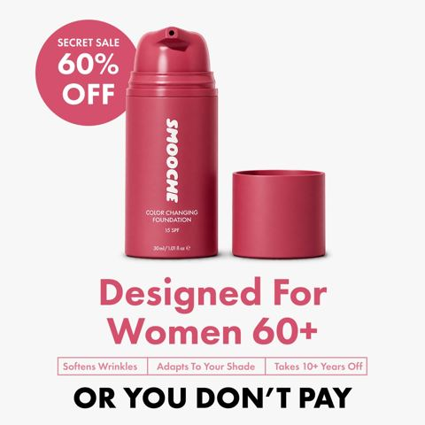

# Meta ad-library examples for F09

<!-- WAVE6 -->
## Wave 6: Resilia & Smooche live Meta ads (Oct 2026)

Pulled from the public Meta Ad Library on 2026-10-09 (Resilia: aged garlic, Ceylon cinnamon, oil of oregano; Smooche: color-changing foundation, Reverse Time peptide serum). Days live are counted to 2026-10-09; most video ads were new tests that week, while the long runners are statics and catalog templates. Transcripts are automatic. Brand claims are the advertisers', not verified, and many are health claims we would never make. The **Do not copy** line flags deceptive tactics (persona "publication" pages, undisclosed AI actors and "experts", fake stock counts).

### Resilia · Daily Wellness: “Three Octobers, a small pouch arrived in her mailbox” (0 days live)

- **Ad:** [Meta Ad Library #1018111660688286](https://www.facebook.com/ads/library/?id=1018111660688286) · static image · page “Daily Wellness” · started 2026-10-09 · lands on `resilias.ca/products/oregano-otp`
- **What happens:** "Three Octobers, a small pouch arrived in her mailbox…": a ~600-word story (Sophie, a dental hygienist…) under a dim, phone-style kitchen photo.
- **Why it works:** A long primary-text story ("Three Octobers, a small pouch arrived in her mailbox…", "I thought foundation was over for me at 52") under a plain, personal-looking photo reads like a friend's post.
- **How to make one:** Write 250-600 words in the first person or as a narrated story. Use a phone-style photo with no logo, and name the product once in the second half.
- **Do not copy:** Fictional narrators posted from pages like "Daily Wellness" and "Cosmetic Times".
- **LC remake:** "The necklace my daughter won't let me take off" (a 400-word story under a kitchen-table photo).

Primary text

> Three Octobers, a Small Pouch Arrived in Her Mailbox the Last Week of September. No Note, No Return Address. When She Finally Found Out Who'd Been Sending Them, the Woman Explained Everything in Eight Words. Picture a kitchen counter at twenty after five in the morning. An ordinary counter. A coffee maker with its red light on. A lunch bag half-packed. And lined up against the backsplash, in the spot where the toaster used to be, three bottles that appear every October like geese flying south. The oregano oil. The echinacea. The zinc. Call the woman standing at this counter Sophie. And on the top shelf of the medicine cabinet in the bathroom — behind the children's Tylenol, behind the contact lens solution, behind a box of plasters she bought in 2022 — there is a bottle of oregano oil drops from last October that is exactly as full as it was on November eleventh. This has happened three years running. Sophie has never once decided to stop taking them. There was no morning where she said, "That's it, I'm done." It just — stopped happening, the way snow stops falling. Quietly. Without a scene. Let me back up. You need Sophie first, and you've met her. Sophie is thirty-four, and for six years she has worked as a dental hygienist at a clinic in Kitchener. Which means her morning is not a morning. It's a launch sequence. Up at five-fifteen. Coffee by five-twenty. Lunches — hers and 

### Smooche · Aging Queens Magazine: “Designed for women 60+ or you don't pay” (6 days live)

- **Ad:** [Meta Ad Library #2560331541128371](https://www.facebook.com/ads/library/?id=2560331541128371) · static image · page “Aging Queens Magazine” · started 2026-10-02 · 1 copies · lands on `smooche.com/pages/bestfoundation`
- **What happens:** "Designed for women 60+ or you don't pay": a 60%-off image from the "Aging Queens Magazine" page, under first-person copy "I thought foundation was over for me at 52".
- **Why it works:** A long primary-text story ("Three Octobers, a small pouch arrived in her mailbox…", "I thought foundation was over for me at 52") under a plain, personal-looking photo reads like a friend's post.
- **How to make one:** Write 250-600 words in the first person or as a narrated story. Use a phone-style photo with no logo, and name the product once in the second half.
- **Do not copy:** Fictional narrators posted from pages like "Daily Wellness" and "Cosmetic Times".
- **LC remake:** "The necklace my daughter won't let me take off" (a 400-word story under a kitchen-table photo).

Primary text

> For years, every foundation I tried would settle into my fine lines, turn orange by noon, and make me look older instead of younger. I'd accepted that foundation just wasn't for mature skin anymore. Then I discovered color-adapting technology that actually works WITH aging skin instead of against it. No settling. No oxidizing. No cakey texture. Within minutes, I looked 10 years younger—and it lasted all day. If you've been struggling with foundation that makes you look older, this might change everything.

<!-- /WAVE6 -->

