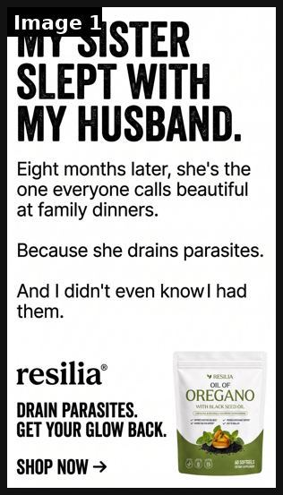
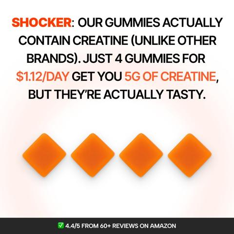
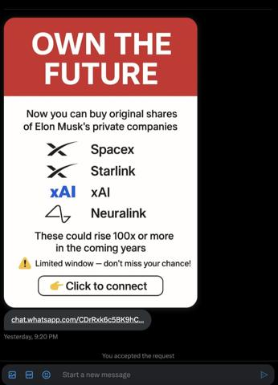

# 10 · Shock-headline typographic static (story headline + product block): see it, then make it

[](https://x.com/tryatria_AI/status/2105745816828940336)

**The example:** [@tryatria_AI on X](https://x.com/tryatria_AI/status/2105745816828940336) · 1 image · 73 likes, 4K views

**Watch it:** [open the post on X](https://x.com/tryatria_AI/status/2105745816828940336)

> 🔥 THIS IS HOW YOU STOP THE SCROLL WITH A STATIC AD. “My sister slept with my husband.” You could sell a parasite supplement with: ❌ “Support a healthy gut” ❌ “Feel better naturally” ❌ “Cleanse from within” Instead, they lead with family betrayal. 💀 The product doesn’t even appear until after the curiosity gap is created. Then the twist: “Because she drains parasites.” It’s absurd. It creates an information gap. And y…

## What you are seeing

A plain white static from Resilia with a huge black headline: "MY SISTER SLEPT WITH MY HUSBAND." Below: "Eight months later, she's the one everyone calls beautiful at family dinners. Because she drains parasites. And I didn't even know I had them." Then the product pack and "SHOP NOW". All the work is done by the shock line.

## Image by image

| Image | Text on it (OCR, rough) |
|---|---|
| 1 | MY SISTER SLEPT WITH MY HUSBAND Eight months later, she's the at family dinners one everyone calls beautiful Because she drains parasites And didn't even had ei of DRAIN PARASITES GET YOUR GLOW BACK. SHOP NOW |

## More real examples (2)

Other posts that show this format, or a close cousin of it. Click a thumbnail to open it on X.

| | | |
|---|---|---|
| [](https://x.com/iwo_cybulski/status/1946251552919814347)<br>**@iwo_cybulski** · image · 1K views<br>Long text static ad for Vitaboost 🔥 → Want high-converting static ads + media buying for your brand? DM me "ads" ⚡ | [](https://x.com/Aidanb2b/status/1989120076415705137)<br>**@Aidanb2b** · image · 154 views<br>Which one of you was behind this ad creative masterclass. Big headline Great offer Urgent CTA 10/10 |   |

## How to make one like it

**The format in one line:** White background, huge condensed black headline that is a story line, 3 short lines of body continuing the story with a twist, product pack-shot bottom right, brand + 2-line benefit + "SHOP NOW →". Example: "MY SISTER SLEPT WITH MY HUSBAND. / Eight months later, she's the one everyone calls beautiful at family dinners. / Because she drains parasites. / And I didn't even know I had them." ([@tryatr

**Why it works:** Typography-only reads in 1s, novelty of a tabloid line in a polished feed; cheap to produce → huge variant volume.

**Contents:** [1. Structure](#1-copy-the-structure) · [2. Shot by shot](#2-shot-by-shot-remake) · [3. Script and hooks](#3-write-the-script) · [4. Prompts](#4-prompts) · [5. Tools and settings](#5-tools-and-settings) · [6. Louise Carter remake](#6-louise-carter-remake) · [7. Variants and test](#7-variants-and-test-plan) · [8. Pitfalls](#8-pitfalls)

### 1. Copy the structure

The skeleton every version follows: **hook → problem or tension → turn (the product shows up) → proof → one clear ask.** The shot-by-shot below fills it in.

### 2. Shot-by-shot remake

**Target length / size:** 1 static, 1080x1350 (also 1080x1920)

| # | Time / slot | What we see (visual + camera) | Dialogue / on-screen text |
|---|---|---|---|
| 1 | Top 45% | White background, huge condensed black headline (Anton/Bebas/Druk), tight leading | Story line in quotes: "MY SISTER STOLE MY NECKLACE." |
| 2 | Middle | Regular weight body, 32-40px, 3 short lines | Twist that turns to the product: "Six months later she still won't give it back. Because she swims in it." |
| 3 | Bottom | Product pack shot right, brand + 2-line benefit left | "[Brand]. 14K PVD, waterproof." + "SHOP NOW →" |

### 3. Write the script

Open with one of these hooks (first 1–3 seconds, or the headline on a static):

Family betrayal line, confession, overheard insult, "Nobody at the reunion recognised me".

Then fill the beats from the table above. Pull the wording from real customer reviews, not from ad copy: a review line beats a copywriter line almost every time. Read every line out loud and cut anything you would not say to a friend. Ready-made Louise Carter scripts are in section 6; hand [BOT.md](BOT.md) to any AI agent to write versions for another brand.

### 4. Prompts

**Figma spec**

```text
Canvas 1080x1350, margins 64px, headline 120-150px condensed bold uppercase, line-height 0.95, body 36px regular, product PNG 380px with soft shadow, logo 48px.
```

**Headline bank (Claude)**

```text
Give me 30 one-line story headlines (max 7 words) about a woman and a piece of jewelry that sound like the start of a juicy story: betrayal, envy, a lost heirloom, a stolen gift. No product claims.
```

### 5. Tools and settings

Figma/Canva template; Claude writes 50 headlines in LC voice; designer approves 10; resize 1:1/4:5/9:16.

| Setting | Value |
|---|---|
| Canvas | 1080×1350 (4:5) for feed; 1080×1920 (9:16) story/reel version with the same elements stacked |
| Type | Headline 80–110 px, max 8 words; body 36–44 px; at most 2 typefaces |
| Layout | Headline readable at thumbnail size; product at least 40% of the canvas; logo small, bottom corner |
| Safe zone | Keep text out of the bottom 20% on 9:16 (UI overlays) |
| Tools | Figma or Canva for layout; Photoshop or Photoroom to cut out product; Midjourney or Flux only for backgrounds, never for the product itself |
| Export | PNG or JPG at quality 90, sRGB, under 1 MB |

### 6. Louise Carter remake

A. "MY SISTER STOLE MY NECKLACE. / I'd do the same. / It's survived 200 showers, 3 beach trips and her. / Louise Carter — waterproof 14K PVD."
B. "SHE ASKED IF IT WAS REAL GOLD. / I said it's better — I don't take it off. / Build any 7 for $85."
C. "MY EX KEPT THE RING. / I kept the glow. / Waterproof stacks from $[lowest live price]."

Brand rules, claims you can and cannot make, and more scripts: [brands/louise-carter.md](brands/louise-carter.md). Step-by-step from idea to scale: [STAGES.md](STAGES.md).

### 7. Variants and test plan

**Test plan:** 10 headlines in 1 ad set (Dynamic Creative off; separate ads); metric: thumb-stop CTR, CPA; Omni new-customer revenue.

**Naming:** `F10-<variant>-<hook##>-<date>` so results map back to this folder. Change one thing per test (hook, narrator, length or offer), never two.

### 8. Pitfalls

- The headline must be a story, not a benefit; "Waterproof gold" never stops a scroll.
- Keep the twist honest and tied to a real benefit.
- Do not imply a real named person did something.
- Too much text: if it cannot be read in 1 second at thumbnail size, cut it.
- AI-generated product images: show the real product; AI is fine for backgrounds only.

**Compliance:** [_COMPLIANCE.md](../_COMPLIANCE.md). Keep humorous, not degrading; prices/claims verified.

## More examples

Every post we found for this format, with transcripts: [examples/](examples/README.md). Playbook: [README.md](README.md). Agent brief: [BOT.md](BOT.md).
