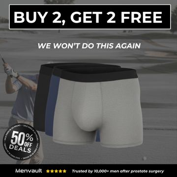
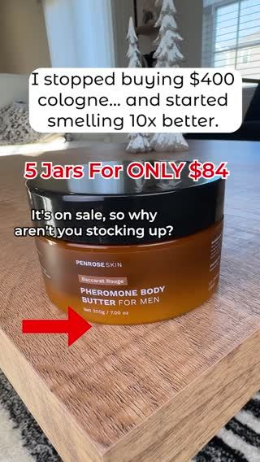

# Meta ad-library examples for F10 (GetHookd board 155932, gut health)

From [@FedotOff90](https://x.com/FedotOff90/status/2108212319113412929)'s public board preview. Days live are as of 2026-10-09. Full board breakdown is in the internal sources folder.

## Pinch Magic Fiber: Product callout-label static ('This cleared my stuck poop') (258 days live)

- **What happens:** Close-up of a scoop over the jar, black pill headline 'THIS CLEARED MY STUCK POOP' and 3 small callout labels pointing at the product (perfect poops / high-quality psyllium husk / tastes great).
- **Why it lasts:** 258 days live. A blunt first-person result headline + 3 benefit labels is readable in one glance.
- **How to make one:** One macro photo, Canva pill labels with thin leader lines; 1080x1350.
- **LC remake:** Wrist stack close-up, pill headline 'THIS SURVIVED 200 SHOWERS', labels: 14K PVD / won't turn green / any 7 for $85.

<!-- WAVE4 -->
## Wave 4: Alex Fedotoff's October 2026 swipe boards (GetHookd public previews)

Each ad below is from the free 10-ad preview of a public GetHookd board that [@FedotOff90](https://x.com/FedotOff90) shared on X. Days live are as of 2026-10-09; brand claims are the advertisers', not verified.

### BioRoot Labs: "We don't trick you into taking turmeric" retention-claim static (481 days live)

- **Board:** [AI Storytelling Ads: 13 Brands x 50 Longest-Running (Oct 2026)](https://x.com/FedotOff90/status/2107177846070202853) · image
- **What happens:** A beige static: "We don't trick you into taking turmeric. Your body convinces you to keep going. After one bottle, most people don't cancel. They stock up." Bottle and capsules, "Trusted by thousands" with Trustpilot stars.
- **Why it lasts:** 481 days, the longest in a 515-ad board. It sells the subscription with a retention claim instead of a discount.
- **How to make one:** One sentence that flips a fear (subscription trap) into proof (people stay), plus product, plus review stars.
- **LC remake:** "We don't lock you into a subscription. You'll just want all 7."

### Dr Ruth White: Persona-page "this woman found relief" static (Dr Ruth White) (416 days live)

- **Board:** [AI Storytelling Ads: 13 Brands x 50 Longest-Running (Oct 2026)](https://x.com/FedotOff90/status/2107177846070202853) · dco
- **What happens:** An older woman with a red-glowing knee inset; black bar: "VIRAL: THIS WOMAN FOUND RELIEF FROM DAILY IBUPROFEN WITH JUST ONE TURMERIC SUPPLEMENT · CLICK TO LEARN". Run from the persona page "Dr Ruth White". DCO with 22 media.
- **Why it lasts:** 416 days (the sibling ran 446 and 400 days). Third-person news framing on a persona page; it replaces a drug habit (ibuprofen).
- **How to make one:** A persona page, a photo of an avatar-age woman, a pain inset, a "this woman found relief from [drug] with just one [product]" headline.
- **LC remake:** "This woman stopped buying replacement jewelry with just one set."

### Pure Rhythm: "Content may go offline" podcast clip (weight loss) (326 days live)

- **Board:** [Podcast-Style Ads — Ecom (mic/interview format)](https://x.com/FedotOff90/status/2101063012471951797) · video 117 s
- **What happens:** "If you want to go from size L to size S, you need to hear this… three essential ingredients that the industry does everything to hide from you… share this with your friend because this content may go offline at any moment." 117 s.
- **Why it lasts:** 326 days, with 437 brand ads. It uses suppression and urgency framing ("may go offline").
- **How to make one:** A podcast guest, a secret framed as "what they hide", a share prompt. Use it carefully (it reads as hype).
- **LC remake:** Skip the suppression angle for LC.

### Wellness Way UK: "Regain your confidence, without pills" device static (Wellness Way UK) (252 days live)

- **Board:** [Winning Men's Health / Testosterone Ads — June 2026](https://x.com/FedotOff90/status/2102455699557200246) · image
- **What happens:** A hand holds a black device: "REGAIN YOUR CONFIDENCE, WITHOUT PILLS", "Harder, stronger erections in just 10 minutes", "50% OFF today" badge.
- **Why it lasts:** 252 days. A pill-free promise plus a time-bound result.
- **How to make one:** Product in hand, a "[outcome], without [drug]" headline, a time-bound result, a discount badge.
- **LC remake:** Not for LC.

### Shopmenvault: "BUY 2, GET 2 FREE – We won't do this again" offer static (251 days live)

- **Board:** [Winning Men's Health / Testosterone Ads — June 2026](https://x.com/FedotOff90/status/2102455699557200246) · image
- **What happens:** A black static: "BUY 2, GET 2 FREE", "WE WON'T DO THIS AGAIN", 3 boxer briefs, "50% OFF deals", "Trusted by 10,000+ men after prostate surgery".
- **Why it lasts:** 251 days. A big bundle plus a one-time claim plus a niche trust line.
- **How to make one:** Offer as headline, a scarcity sub-line, product, a niche trust line.
- **LC remake:** "BUY 3 GET 4 FREE" (any 7 for $85).

### Penrose Skin: "I stopped buying $400 colognes" price-anchor demo (89 days live)

- **Board:** [Penrose Skin: 100 Longest-Running 4-5 Star Ads (Oct 2026)](https://x.com/FedotOff90/status/2107841782251671953) · video 15 s
- **What happens:** Overlay: "I stopped buying $400 colognes… and started smelling like this", a red arrow pointing at the jar, "$ave for ONLY $XX". 15 s.
- **Why it lasts:** 89 days. A clear price-anchor switch story in 15 s.
- **How to make one:** One overlay sentence of the switch, an arrow at the product, a price.
- **LC remake:** "I stopped buying $300 gold chains… and started wearing this."

