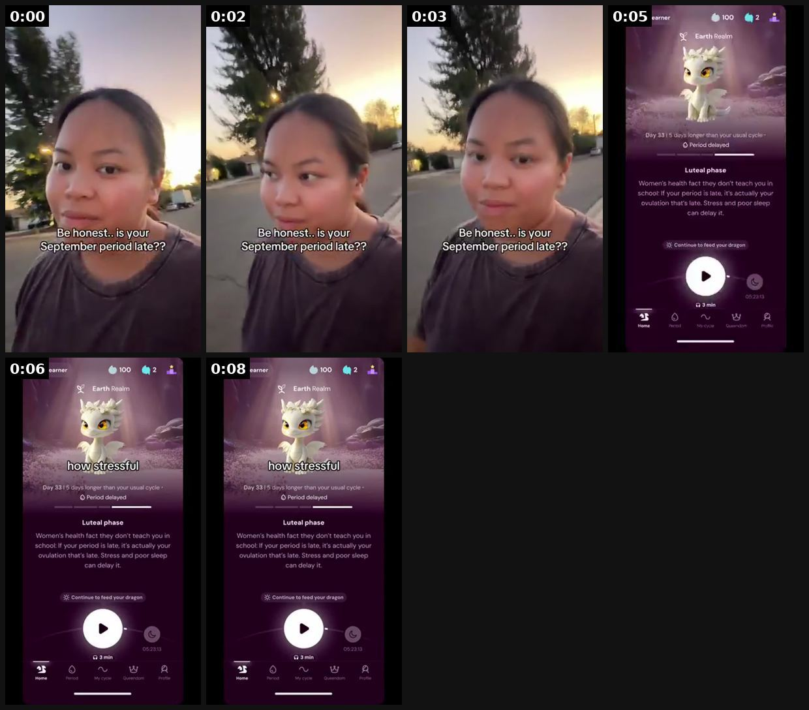
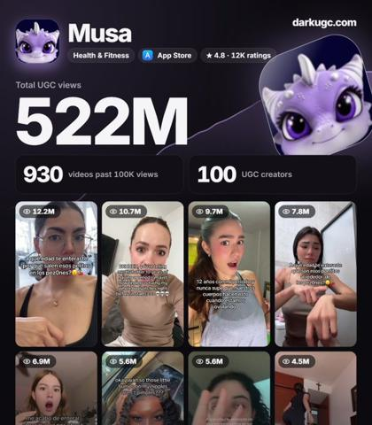
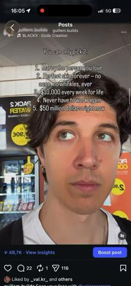

# 100 · Relatable body question + in-app answer (\"at what age did you find out…\" reaction, mascot explains): see it, then make it

[](https://x.com/jasonugc/status/2108273335314641352)

**The example:** [@jasonugc on X](https://x.com/jasonugc/status/2108273335314641352) · 0:09 video · 12 likes, 652 views

**Watch it:** [open the post on X](https://x.com/jasonugc/status/2108273335314641352) · [play the video file](https://video.twimg.com/amplify_video/2107829033807314944/vid/avc1/320x568/Dam8csY7llfHwt8E.mp4?tag=29)

> this period app quietly did 522M views 930 videos past 100k 100 creators one format every clip is a relatable body question "at what age did you find out..." then the app answers it they run it in english AND spanish 930 hits off one idea you can see their whole ugc operation here for free https://darkugc.com/?video=tt-7688183986643881247&ref=jasonugc

## What you are seeing

A creator walking outside at sunset. The on-screen text says "Be honest.. is your September period late??" and she gives the camera a knowing look (0:00-0:03). At 0:05 it hard-cuts to the app: a cute white dragon mascot ("Earth Realm"), "Day 33 | 5 days longer than your usual cycle, Period delayed". Under it is a Luteal-phase card: "Women's health fact they don't teach you in school: if your period is late, it's actually your ovulation that's late. Stress and poor sleep can delay it." The caption "how stressful" sits over the dragon. The video is 8 seconds with no voiceover. The question is the hook, the app gives the answer, and the mascot makes it shareable.

## Beat by beat

The storyboard above samples the video every 0:01. Lines are the transcript for that stretch; on-screen text comes from OCR, so treat it as rough.

| Frame | Time | On screen | Said / sung |
|---|---|---|---|
| 1 | 0:00–0:01 | Rear ce cA. il honest.. is your, September period late? | · |
| 2 | 0:01–0:03 | hi mm is your September period late?? | · |
| 3 | 0:03–0:04 | Say Be honest.. is your, September period late?? | · |
| 4 | 0:04–0:06 | a ou Period delayed phase Women's health fact they don’t teach you in school: If your period is fate, it’s actually your that’s late. Stress and poor sleep can  | · |
| 5 | 0:06–0:07 | mf Period delayed phase Women’s health fact they don’t teach you in school: If your period is late, it’s actually your that’s late. Stress and poor sleep can de | · |
| 6 | 0:07–0:09 | a, Da Period delayed phase Women’s health fact they don’t teach you in school: If your period is late, it’s actually your that’s late. Stress and poor sleep can | · |

## More real examples (3)

Other posts that show this format, or a close cousin of it. Click a thumbnail to open it on X.

| | | |
|---|---|---|
| [](https://x.com/leonclipping/status/2107903429490135362)<br>**@leonclipping** · images · 3K views<br>this app spams ONE format and pulled 522M views with organic UGC a 4 sec shocked reaction to a period fact nobody told you, then the dragon in the app | [](https://x.com/consumerxai/status/2107834606368293123)<br>**@consumerxai** · 0:08 video · 293 views<br>121M views lost to 9.6M on the number that matters more for engagement saves -> a save means "i'm going to do this later" and has high intent -> calor | [](https://x.com/guillemcraft/status/2075221274591101354)<br>**@guillemcraft** · 0:07 video · 11K views<br>50k+ views on insta in just ONE HOUR i posted a video while waiting for my flight to Menorca and went viral i found a format that works and i just rep |

## How to make one like it

**The format in one line:** A 3-5 second selfie of a creator reacting to a **body fact nobody told her** (caption: *"at what age did you find out that [surprising body fact]?"* or *"why did nobody tell me [fact]"*), then a cut to the app screen where the app's character (Musa uses a cute dragon) **answers the question** in 2-3 chat bubbles. The question is the content; the app is the place the answer lives. One hook, hundred

**Why it works:** - Taboo-adjacent body questions (period, discharge, cycle, skin) are things women google privately and never see discussed; seeing a peer react gives permission to watch and comment. - "At what age did you find out…" is a participation prompt: every comment is someone's age, so comments explode. - The app is framed as the friend who explains, not a product pitch; the mascot makes it soft and screenshot-able. - One template, infinite facts: a fact bank of 200 questions = 200 videos per creator, n

**Contents:** [1. Structure](#1-copy-the-structure) · [2. Shot by shot](#2-shot-by-shot-remake) · [3. Script and hooks](#3-write-the-script) · [4. Prompts](#4-prompts) · [5. Tools and settings](#5-tools-and-settings) · [6. Louise Carter remake](#6-louise-carter-remake) · [7. Variants and test](#7-variants-and-test-plan) · [8. Pitfalls](#8-pitfalls)

### 1. Copy the structure

Use the example's timing as your beat sheet. Keep the beat, change the words and the product.

| Beat | Time | In the example | Your version |
|---|---|---|---|
| 1 | 0:00 | on screen: Rear ce cA. il honest.. is your, September period late? | … |
| 2 | 0:02 | on screen: hi mm is your September period late?? | … |
| 3 | 0:03 | on screen: Say Be honest.. is your, September period late?? | … |
| 4 | 0:05 | on screen: a ou Period delayed phase Women's health fact they don’t teach you in school: If your period is fate, it’s actually your | … |
| 5 | 0:06 | on screen: mf Period delayed phase Women’s health fact they don’t teach you in school: If your period is late, it’s actually your t | … |
| 6 | 0:08 | on screen: a, Da Period delayed phase Women’s health fact they don’t teach you in school: If your period is late, it’s actually you | … |

### 2. Shot-by-shot remake

**Target length / size:** 12-17s, 1080x1920, creator selfie + answer card; works muted

| # | Time / slot | What we see (visual + camera) | Dialogue / on-screen text |
|---|---|---|---|
| 1 | 0-1s | Front camera, chest-up, bathroom/bedroom, natural light. Eyes widen, hand to mouth. No product visible. | Caption (top third, 64px white, black stroke): "at what age did you find out 'gold tone' means there's no gold in it??" |
| 2 | 1-4s | Hold the reaction; slow head shake, mouths "what". Do NOT talk. | Trending sound at -20 dB, or silence + one word "what??" |
| 3 | 4-9s | Hard cut to 9:16 answer card: brand character/avatar top-left, 2 chat bubbles typing in (CapCut "typewriter" 0.6s each) | Bubble 1 (≤22 words): "Gold tone = colour only. Most of it is brass with a thin plate that wears off with water and sweat." |
| 4 | 9-14s | Hands-only macro: LC necklace under a running tap, then on a towel, still bright | Bubble 2: "14K PVD bonds the gold to steel. Shower, swim, sleep in it." |
| 5 | 14-17s | End card: product grid on warm beige | "any 7 for $85" + "which fact next? 👇" |

<details><summary>Playbook shot list (Louise Carter version from the README)</summary>

| Time / slot | Visual | Audio / copy |
|---|---|---|
| 0-1s | Selfie, eyes wide / hand over mouth, bathroom or bedroom | Caption top: "at what age did you find out that gold-plated jewelry is basically a thin coat over brass??" |
| 1-4s | Creator slowly shakes head, mouths "what" | Trending audio low; no voice or one word ("what??") |
| 4-9s | Screen recording: LC "Ask Goldie" Q&A card / PDP FAQ or a simple branded explainer card | Bubble 1: "Most cheap gold jewelry = brass + a micro-layer of gold. Water and sweat wear it off → green skin." |
| 9-14s | Hands: 14K PVD necklace under the tap, still gold | Bubble 2: "PVD bonds the gold at a molecular level. That's why ours can go in the shower." |
| 14-17s | End card | "any 7 for $85 · link in bio" (organic) / CTA button (paid) |

</details>

### 3. Write the script

Open with one of these hooks (first 1–3 seconds, or the headline on a static):

- "at what age did you find out your necklace turning green isn't your skin's fault?"
- "at what age did you find out 'gold tone' means zero gold?"
- "why did nobody tell me you can shower in real gold jewelry"
- "I'm 31 and just found out what 'vermeil' actually means"
- "at what age did you find out sweat is why your earrings itch?"

Then fill the beats from the table above. Pull the wording from real customer reviews, not from ad copy: a review line beats a copywriter line almost every time. Read every line out loud and cut anything you would not say to a friend. Ready-made Louise Carter scripts are in section 6; hand [BOT.md](BOT.md) to any AI agent to write versions for another brand.

### 4. Prompts

**Fact bank (Claude)**

```text
Give me 60 true, surprising facts about gold jewelry, plating, sweat, water and skin that women 25-45 often learn late. Phrase each as "at what age did you find out ...?". Then mark which ones are supported by these product facts: {{PDP_FACTS}}. Drop anything medical.
```

**Answer card (Canva/Figma)**

```text
1080x1920, background #F6EFE6, avatar circle 160px top-left, chat bubbles 900px wide, 44px Hanken Grotesk, max 2 bubbles, 22 words each. Duplicate the page per fact.
```

**Creator brief**

```text
Film 10 reactions in one session: front camera, 4K 30fps, window light, neutral top, no jewelry visible. React to reading the fact for the first time; 3-5 s each; no speaking.
```

**Spanish version**

```text
Translate the hook as a native Mexican-Spanish speaker would say it on TikTok, keep "¿a qué edad te enteraste...?" structure; ≤14 words.
```

**Full creative-agent prompt (from the playbook):**

```
You are writing for Louise Carter (14K PVD gold jewelry you can shower, swim and sleep in; any 7 for $85).
Write 30 hooks in the exact pattern "at what age did you find out [true surprising fact about gold jewelry, plating, skin reactions, water or sweat]?"
Rules: every fact must be supported by {{PDP_FACTS}}; no medical claims; no competitor names.
For the best 10, write: (a) a 2-bubble answer the brand character gives (max 22 words per bubble), (b) the product shot that proves it, (c) a Spanish version of the hook.
```

### 5. Tools and settings

1. **Fact bank (1 h):** 100 true, surprising, PDP-backed facts about gold jewelry, skin, plating, sweat, water, allergies. Each one phrased as "at what age did you find out…". Verify each against the PDP / supplier spec.
2. **Answer cards:** design one reusable 9:16 answer template (character or brand avatar + 2-3 chat bubbles). Make it in Figma/Canva; swap text per video.
3. **Creator brief:** 3-5 s silent reaction, filmed front camera, natural light, no product in the first shot. Creators pick facts from the bank.
4. **Edit (CapCut):** caption 60-70 px white with black stroke, top third; hard cut at 4 s to the answer card; product shot; end card. 12-17 s total.
5. **Volume:** 10-30 creators × 1/day for 3 weeks; Spanish creators on the same bank.
6. **Promote:** top 3 by saves → Spark/Partnership ads; keep the question as the ad's primary text.

| Setting | Value |
|---|---|
| Canvas | 1080×1920 (9:16) master; crop a 1080×1350 (4:5) cut for feed placements |
| Frame rate | 30 fps (shoot 60 fps for slow-motion water or sparkle shots) |
| Camera | Phone main lens at 1x, exposure locked on skin, HDR off, grid on; tripod or a phone clamp for product shots |
| Light | One soft key at 45° (window or ring light), white card as fill; side light for metal sparkle |
| Audio | Lavalier or phone 15–20 cm from the mouth; mix voice at -14 LUFS, music at -28 to -30 dB under voice |
| Captions | Burned in, 2–5 words per line, 64–80 px bold sans, white with a black stroke or pill; keep text inside the safe zone (top 220 px and bottom 420 px clear, 64 px side margins) |
| Pacing | A visual change every 1.5–3 s; the hook lands in the first 1.5 s with no logo intro |
| Edit / export | CapCut or Premiere; H.264, 12–20 Mbps, AAC 320 kbps; upload natively to each platform, not via links |

### 6. Louise Carter remake

- A · "at what age did you find out 'gold tone' means there's no gold in it?" → reaction → answer card: 'gold tone = colour only' → LC 14K PVD under the shower → any 7 for $85.
- B · "I'm 34 and just found out sweat is what turns cheap rings green" → reaction → answer card explaining plating wear → gym-wrist stack demo.
- C · Spanish: "¿a qué edad te enteraste de que puedes ducharte con joyas de oro?" → same structure, Spanish creator → shower demo.

Brand rules, claims you can and cannot make, and more scripts: [brands/louise-carter.md](brands/louise-carter.md). Step-by-step from idea to scale: [STAGES.md](STAGES.md).

### 7. Variants and test plan

- Question wording ("at what age" vs "why did nobody tell me")
- Answer card: mascot vs plain brand avatar vs creator voiceover
- Reaction intensity (shock vs laugh vs facepalm)
- Language (EN vs ES)
- Fact category (plating vs skin vs care)

**Test plan:** - **Budget/structure:** Organic: 10-30 creators × daily for 3 weeks; Paid: top 3 by saves/1k → $50/day Spark each - **Primary KPIs:** Saves/1k, comments/1k, profile clicks; paid CPA; Omni new-customer revenue on `utm_content=F100-*` - **Kill rule:** median <1K views after 20 posts per creator, or saves/1k <3 - **Scale rule:** add creators + a second language; rotate fact categories weekly - **Naming:** `utm_content=F100-<fact>-<creator>`

**Naming:** `F100-<variant>-<hook##>-<date>` so results map back to this folder. Change one thing per test (hook, narrator, length or offer), never two.

### 8. Pitfalls

- The reaction must happen before any product appears; product in the first second kills it.
- One fact per video. Two facts = no one remembers either.
- Facts must be true and checkable; a wrong fact in the comments sinks the account.
- Keep the answer card short enough to read twice in 5 seconds.
- Slow open: if the first 1.5 s does not show the hook visually, most people swipe.
- Logo or brand intro at the start reads as an ad; put the brand at the end.
- Captions covered by the platform UI: check the safe zone on a real phone before posting.
- Music over the voice: keep music at least 14 dB under speech.

**Compliance:** Baseline: [_COMPLIANCE.md](../../_COMPLIANCE.md) (no fake testimonials, AI disclosure, no bulk/spoofed accounts, copy structure not assets, PDP-only claims). - Every fact must be true and supported by the PDP / supplier spec; no health or allergy cure claims ("hypoallergenic" only if certified). - The reaction must be the creator's genuine reaction; creators disclose (#ad / Paid partnership). - Don't imply competitors are fake or harmful; talk about "gold tone" or "plated" as categories, not brands.

## More examples

Every post we found for this format, with transcripts: [examples/](examples/README.md). Playbook: [README.md](README.md). Agent brief: [BOT.md](BOT.md).
