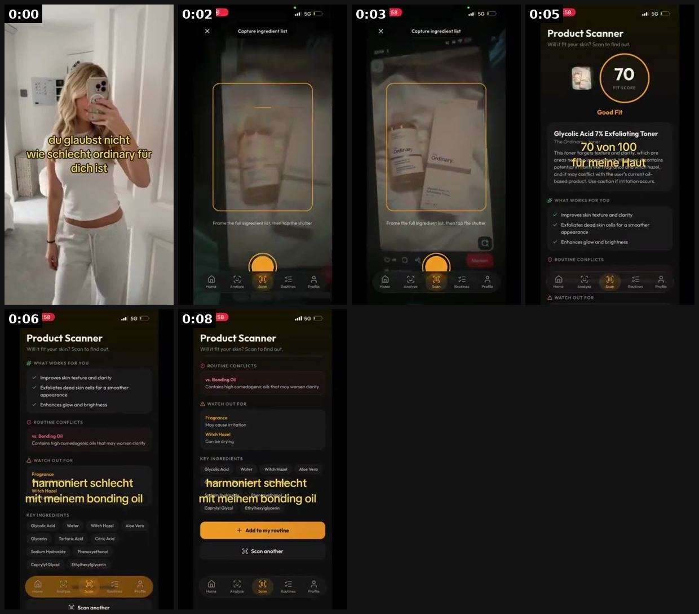
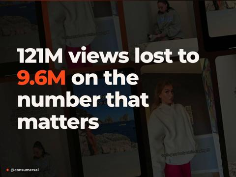
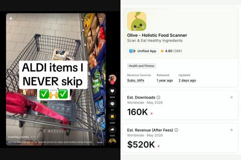

# 101 · In-store scan → score → reaction (scan a product on the shelf with the app, react to the score): see it, then make it

[](https://x.com/cicerougc/status/2075757653309919555)

**The example:** [@cicerougc on X](https://x.com/cicerougc/status/2075757653309919555) · 0:08 video · 0 likes, 165 views

**Watch it:** [open the post on X](https://x.com/cicerougc/status/2075757653309919555) · [play the video file](https://video.twimg.com/ext_tw_video/2075757593683701760/pu/vid/avc1/320x568/avp3kWsvV_mlVbVf.mp4?tag=26)

> 100k+ views with a skincare app using the easiest content format I've found. The formula: 1. Go to a supermarket (BIPA, DM, Sephora, etc.) 2. Pick up a skincare product. 3. Scan it with your app. 4. Record the score and your reaction. 5. Add an AI voiceover: "I went to BIPA to see if this product is actually worth buying..." 6. End with the result. That's it. Why it works: - People already recognize the products. - I…

## What you are seeing

A girl takes a mirror selfie with German text: "du glaubst nicht wie schlecht ordinary für dich ist" ("you won't believe how bad The Ordinary is for you"). At 0:02 the app's "Capture ingredient list" camera frames a bottle of The Ordinary Glycolic Acid 7% toner. At 0:05 the app shows "Product Scanner: 70 FIT SCORE, Good Fit", with the overlay "70 von 100 für meine Haut". At 0:06-0:08 it scrolls to "Routine conflicts: vs. Bonding Oil" and "Watch out for: Fragrance, Witch Hazel", with the overlay "harmoniert schlecht mit meinem bonding oil", then shows "Add to my routine". The whole video is 9 seconds: a famous product, a score, and a personal conflict.

## Beat by beat

The storyboard above samples the video every 0:01. Lines are the transcript for that stretch; on-screen text comes from OCR, so treat it as rough.

| Frame | Time | On screen | Said / sung |
|---|---|---|---|
| 1 | 0:00–0:01 | · | · |
| 2 | 0:01–0:02 | · | · |
| 3 | 0:02–0:04 | at'60 Capture ingredient list … hee a a … Home Analyze Sean | · |
| 4 | 0:04–0:05 | SGt Product Scanner … it fit your skin? Scan to find out. a Good Fit … 70 von 100 This … clarity, which ore … hazel and if may conflict with the user's current  | · |
| 5 | 0:05–0:07 | Product Scanner Will it fit your skin? Scan to find out. WHAT WORKS FOR YOU improves skin texture and clarity … dead skin cells for a smoother appearance Enhanc | · |
| 6 | 0:07–0:08 | Product Scanner Will it fit your skin? Scan to find out. ROUTINE CONFLICTS … oils that may … WATCH OUT FOR Fragrance … cause irritation Witch Hazel Can be dryin | · |

## More real examples (3)

Other posts that show this format, or a close cousin of it. Click a thumbnail to open it on X.

| | | |
|---|---|---|
| [](https://x.com/consumerxai/status/2107834606368293123)<br>**@consumerxai** · 0:08 video · 293 views<br>121M views lost to 9.6M on the number that matters more for engagement saves -> a save means "i'm going to do this later" and has high intent -> calor | [](https://x.com/brhansolo/status/2063698878172475407)<br>**@brhansolo** · 0:20 video · 32 views<br>this food scanner might be the cleanest app marketing on tikt0k right now 😭 the app is at $520K/mo 160K downloads last month they're not running ads o | [](https://x.com/fqizii/status/2075481622590177594)<br>**@fqizii** · 0:39 video · 500 views<br>🎥✨ My entry for the Emorya AI Food Scanning Contest! Check the video below and I hope you enjoy it . I decided to create this video myself and try out |

## How to make one like it

**The format in one line:** The creator walks into a store everyone knows (Sephora, DM, BIPA, Target), picks up a product people already own, **scans it with the app**, and the video holds on the score loading. Then a real reaction ("no way my moisturiser is a 23") and the next product. AI or creator voiceover: *"I went to BIPA to see if this product is actually worth buying…"*

**Why it works:** - Recognisable products = instant relevance ("I own that"). - A number on screen is a mini cliffhanger; viewers wait for the reveal. - The app's core feature IS the content (screen-recordable reveal = free ads, the same reason Cal AI / Umax spread). - Endless supply: one store trip = weeks of content (@cicerougc).

**Contents:** [1. Structure](#1-copy-the-structure) · [2. Shot by shot](#2-shot-by-shot-remake) · [3. Script and hooks](#3-write-the-script) · [4. Prompts](#4-prompts) · [5. Tools and settings](#5-tools-and-settings) · [6. Louise Carter remake](#6-louise-carter-remake) · [7. Variants and test](#7-variants-and-test-plan) · [8. Pitfalls](#8-pitfalls)

### 1. Copy the structure

Use the example's timing as your beat sheet. Keep the beat, change the words and the product.

| Beat | Time | In the example | Your version |
|---|---|---|---|
| 1 | 0:00 | (visual beat, see frame 1) | … |
| 2 | 0:02 | (visual beat, see frame 2) | … |
| 3 | 0:03 | on screen: at'60 Capture ingredient list … hee a a … Home Analyze Sean | … |
| 4 | 0:05 | on screen: SGt Product Scanner … it fit your skin? Scan to find out. a Good Fit … 70 von 100 This … clarity, which ore … hazel and | … |
| 5 | 0:06 | on screen: Product Scanner Will it fit your skin? Scan to find out. WHAT WORKS FOR YOU improves skin texture and clarity … dead ski | … |
| 6 | 0:08 | on screen: Product Scanner Will it fit your skin? Scan to find out. ROUTINE CONFLICTS … oils that may … WATCH OUT FOR Fragrance … c | … |

### 2. Shot-by-shot remake

**Target length / size:** 15-20s, 1080x1920, store walk + picture-in-picture phone screen

| # | Time / slot | What we see (visual + camera) | Dialogue / on-screen text |
|---|---|---|---|
| 1 | 0-2s | Walking POV into an accessories aisle (no store logo close-ups, no shoppers' faces) | VO: "I went to the mall to see if these 'gold' necklaces are actually gold." |
| 2 | 2-5s | Hand lifts a generic, unbranded gold-tone chain; macro on the "gold tone" tag | Caption: "$29 'gold' necklace" |
| 3 | 5-8s | PiP phone screen (bottom-right, 45% width): "Gold Check" quiz, score counter animates 0 → 18 | SFX tick-tick-ding; caption "Gold Check: 18/100" |
| 4 | 8-10s | Creator face reaction (front camera insert) | "...18." |
| 5 | 10-16s | Her LC necklace on her neck; same quiz → 92/100 | "this is the one I shower in" |
| 6 | 16-20s | End card | "Score yours → link · any 7 for $85" |

<details><summary>Playbook shot list (Louise Carter version from the README)</summary>

| Time / slot | Visual | Audio / copy |
|---|---|---|
| 0-2s | Walking into a jewelry aisle / department store accessories wall (no store logo close-up) | VO: "I went to the mall to see if these 'gold' necklaces are actually gold…" |
| 2-5s | Hand picks a generic gold-tone chain; label close-up "gold tone" | Caption: "$29 'gold' necklace" |
| 5-8s | Phone screen: LC "Gold Check" quiz or a printed label checklist; score animates 0 → 18/100 | SFX: tick-tick-ding |
| 8-10s | Creator face: wince | "…18." |
| 10-16s | Same check on her LC necklace (PVD 14K, waterproof) | Score 92/100 · "this one I shower in" |
| 16-20s | End card | "How does yours score? · any 7 for $85" |

</details>

### 3. Write the script

Open with one of these hooks (first 1–3 seconds, or the headline on a static):

- "I scanned every 'gold' necklace in the mall. Only one passed."
- "Is your $30 necklace actually gold? I checked."
- "Rating my jewelry box from 0-100 (it's bad)"
- "I went to [store] to see if this is worth buying…"

Then fill the beats from the table above. Pull the wording from real customer reviews, not from ad copy: a review line beats a copywriter line almost every time. Read every line out loud and cut anything you would not say to a friend. Ready-made Louise Carter scripts are in section 6; hand [BOT.md](BOT.md) to any AI agent to write versions for another brand.

### 4. Prompts

**Rubric (Claude)**

```text
Build a 0-100 rubric from 5 checkable criteria: material on the label (solid / PVD / vermeil / filled / plated / tone), water guidance, nickel content, warranty length, price per year of wear. Weight them, show the maths, and keep it publishable on an FAQ page.
```

**Score animation (CapCut)**

```text
Text "0" → keyframe number counter 0.0s-1.2s, ease-out, 140px bold, red under 40, amber 40-70, green over 70; add "ding" SFX at the end.
```

**AI voice (optional)**

```text
ElevenLabs, a warm 25-35 female voice, stability 45, style 20; one sentence per clip; disclose AI voice in the caption.
```

**Full creative-agent prompt (from the playbook):**

```
Design a transparent 0-100 'Gold Check' scoring rubric for gold-coloured jewelry using only verifiable criteria (material label, plating type, water exposure guidance, nickel content, warranty). Then write 12 store-aisle video scripts (15-20 s) where a creator scores a generic, unbranded piece and then her Louise Carter piece. No competitor names, logos or disparaging claims; every LC score point must map to {{PDP_FACTS}}.
```

### 5. Tools and settings

1. **Score tool:** LC has no scanner app, so build a 5-question "Gold Check" (tone vs plated vs PVD vs solid; water-safe; nickel-free; warranty; price per wear) in a quiz tool (F61) or a simple scoring card. The score must come from real criteria, published on the PDP/FAQ.
2. **Store run:** film in public aisles only where filming is allowed; never show a brand name or logo of a competitor product.
3. **Screen record** the quiz on the phone (iOS screen recording) and composite it in CapCut picture-in-picture.
4. **Voiceover:** creator or ElevenLabs voice (disclosed); 8-12 words max per line.
5. **Edit:** 15-20 s, score reveal at 5-8 s, LC comparison at 10-16 s.

| Setting | Value |
|---|---|
| Canvas | 1080×1920 (9:16) master; crop a 1080×1350 (4:5) cut for feed placements |
| Frame rate | 30 fps (shoot 60 fps for slow-motion water or sparkle shots) |
| Camera | Phone main lens at 1x, exposure locked on skin, HDR off, grid on; tripod or a phone clamp for product shots |
| Light | One soft key at 45° (window or ring light), white card as fill; side light for metal sparkle |
| Audio | Lavalier or phone 15–20 cm from the mouth; mix voice at -14 LUFS, music at -28 to -30 dB under voice |
| Captions | Burned in, 2–5 words per line, 64–80 px bold sans, white with a black stroke or pill; keep text inside the safe zone (top 220 px and bottom 420 px clear, 64 px side margins) |
| Pacing | A visual change every 1.5–3 s; the hook lands in the first 1.5 s with no logo intro |
| Edit / export | CapCut or Premiere; H.264, 12–20 Mbps, AAC 320 kbps; upload natively to each platform, not via links |

### 6. Louise Carter remake

- A · "I scored every 'gold' necklace at the mall" → generic gold-tone 18/100 → LC Chelsea Herringbone 92/100 → shower clip → any 7 for $85.
- B · "Rating my 10-year jewelry box" → old pieces get low scores (green, tarnish) → LC stack scores high → link.
- C · "Rate my bridesmaid gifts" → gift-set scoring → LC gift box with engraving.

Brand rules, claims you can and cannot make, and more scripts: [brands/louise-carter.md](brands/louise-carter.md). Step-by-step from idea to scale: [STAGES.md](STAGES.md).

### 7. Variants and test plan

- Store vs home jewelry box
- Real quiz screen vs printed score card
- AI voice vs creator voice
- Score reveal speed

**Test plan:** - **Budget/structure:** Organic first (3 creators × 10 videos); Paid: top 2 as Spark at $40/day - **Primary KPIs:** Hold to score reveal (3-8 s retention), comments ("do mine"), quiz starts, Omni revenue on `utm_content=F101-*` - **Kill rule:** <40% retention at 5 s after 10 posts - **Scale rule:** 'do mine' comment replies as F18 videos - **Naming:** `utm_content=F101-<store>-<variant>`

**Naming:** `F101-<variant>-<hook##>-<date>` so results map back to this folder. Change one thing per test (hook, narrator, length or offer), never two.

### 8. Pitfalls

- Never show or name a competitor brand; generic unbranded pieces only.
- Don't call a marketing quiz a "lab test".
- Score reveal must land by second 8 or retention collapses.
- Check store filming rules; film your own jewelry box if in doubt.
- Slow open: if the first 1.5 s does not show the hook visually, most people swipe.
- Logo or brand intro at the start reads as an ad; put the brand at the end.
- Captions covered by the platform UI: check the safe zone on a real phone before posting.
- Music over the voice: keep music at least 14 dB under speech.

**Compliance:** Baseline: [_COMPLIANCE.md](../_COMPLIANCE.md) (no fake testimonials, AI disclosure, no bulk/spoofed accounts, copy structure not assets, PDP-only claims). - No competitor brand names, logos or identifiable packaging; score only unbranded generic pieces. - The rubric must be public and objective; don't present a marketing quiz as an independent lab test. - Respect store filming rules; no customers in frame without consent.

## More examples

Every post we found for this format, with transcripts: [examples/](examples/README.md). Playbook: [README.md](README.md). Agent brief: [BOT.md](BOT.md).
