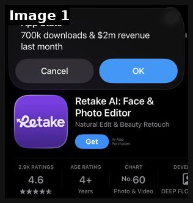
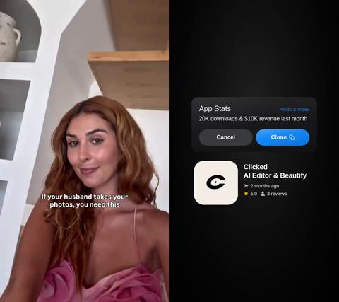
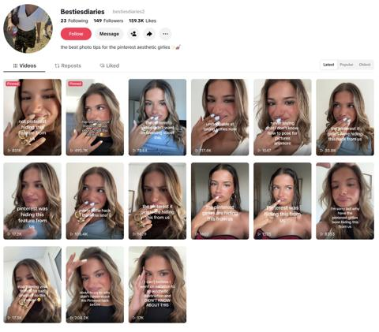

# 102 · Pinterest-pic recreation reveal (\"I recreated this Pinterest photo with me in it\"): see it, then make it

[](https://x.com/simonecanciello/status/2102046332970013078)

**The example:** [@simonecanciello on X](https://x.com/simonecanciello/status/2102046332970013078) · 1 image · 56 likes, 18K views

**Watch it:** [open the post on X](https://x.com/simonecanciello/status/2102046332970013078)

> **How close is this example?** Proxy: the App Store stats screenshot from the breakdown post; the Pinterest-recreation TikToks themselves are not attached. The gallery below has more examples.

> who’s building this $1M app? take a pic of yourself + pick any pic you want to recreate from pinterest. the app recreates the exact same pic, but replaces the girl with you. this market is HUGE - retake is doing $2M MRR. it’s basically a larping app for women.

## What you are seeing

The App Store "App Stats" overlay that the poster used: "700k downloads & $2m revenue last month", over the Retake AI listing (Face & Photo Editor, 4.6 stars, 2.9K ratings, No.60 in Photo & Video). The post text explains the format: take a selfie, pick any Pinterest pic, and the app recreates it with you in it. The TikToks themselves are not attached, so this is the proof screenshot and not the creative.

## Image by image

| Image | Text on it (OCR, rough) |
|---|---|
| 1 | App Stats 700k downloads $2m revenue last month Cancel Retake Al: Face Photo Editor Natural Edit Beauty In-App Purchases 2.9K RATINGS AGE RATING CHART 4.6 Years Photo Video DEEP FLO |

## More real examples (2)

Other posts that show this format, or a close cousin of it. Click a thumbnail to open it on X.

| | | |
|---|---|---|
| [](https://x.com/ErnestoSOFTWARE/status/2061578473370501423)<br>**@ErnestoSOFTWARE** · 0:12 video · 60K views<br>This is literally a $1M app idea...😭 This post has over 2 million views and 12k+ comments asking for the app its literally just an app that helps you | [](https://x.com/onlinedopamine/status/2082813772373098530)<br>**@onlinedopamine** · images · 3K views<br>these are the types of outsized organic views you get on new accounts when you nail > understanding of your target audience (= pinterest aesthetic gir |   |

## How to make one like it

**The format in one line:** Slide/clip 1 is a **saved Pinterest photo** (the aspirational image everyone has on a board), slide 2 is **the creator recreating it**: same pose, light, outfit and, for LC, the same jewelry stack. The reveal is the side-by-side. For the app version (Retake) the app generates the recreation; for a brand it is a styling challenge: *"I recreated my most-saved Pinterest jewelry pics with pieces under

**Why it works:** - Pinterest boards are where the purchase intent already lives; the viewer recognises the aesthetic. - Side-by-side = before/after without a 'before' that insults anyone. - Comments ask "do this one next" with their own pins, which writes the next 20 videos. - For women the desire is identity ("that girl, but me"); the product becomes the bridge.

**Contents:** [1. Structure](#1-copy-the-structure) · [2. Shot by shot](#2-shot-by-shot-remake) · [3. Script and hooks](#3-write-the-script) · [4. Prompts](#4-prompts) · [5. Tools and settings](#5-tools-and-settings) · [6. Louise Carter remake](#6-louise-carter-remake) · [7. Variants and test](#7-variants-and-test-plan) · [8. Pitfalls](#8-pitfalls)

### 1. Copy the structure

The skeleton every version follows: **hook → problem or tension → turn (the product shows up) → proof → one clear ask.** The shot-by-shot below fills it in.

### 2. Shot-by-shot remake

**Target length / size:** 5-slide photo carousel (1080x1920) or 9-12s video with a swipe transition

| # | Time / slot | What we see (visual + camera) | Dialogue / on-screen text |
|---|---|---|---|
| 1 | Slide 1 | The reference pin (LC-owned or follower-submitted with permission), Pinterest-style rounded crop with save count | "my most-saved pin for 3 years" |
| 2 | Slide 2 | Creator recreating it: same angle (phone at chest height), same light (window, 4-6pm), same neckline | "recreated it with pieces I can shower in" |
| 3 | Slide 3 | Macro of the stack, pieces labelled with thin lines | Piece names + "all 14K PVD" |
| 4 | Slide 4 | Split: pin left, recreation right | "total: any 7 for $85" |
| 5 | Slide 5 | Text slide on beige | "send me your pin, I'll recreate it next 👇" |

<details><summary>Playbook shot list (Louise Carter version from the README)</summary>

| Time / slot | Visual | Audio / copy |
|---|---|---|
| Slide 1 | Screenshot-style Pinterest pin of a gold-stacked neck/wrist look (own licensed or creator-shot reference; never a stolen photo) | Text: "my most-saved pin for 3 years" |
| Slide 2 | Creator recreating the pose, light and stack with LC pieces | "recreated it with pieces I can shower in" |
| Slide 3 | Close-up of the stack, piece names | "Chelsea Herringbone + 2 paperclip chains + mini hoops" |
| Slide 4 | Split screen: pin vs recreation | "total: any 7 for $85" |
| Slide 5 | CTA | "send me your pin, I'll recreate it next" |

</details>

### 3. Write the script

Open with one of these hooks (first 1–3 seconds, or the headline on a static):

- "Recreating my most-saved Pinterest jewelry looks (under $85)"
- "Pinterest vs me: the gold stack edition"
- "I recreated the 'clean girl' jewelry pin with waterproof pieces"
- "Send me your pin and I'll recreate it"

Then fill the beats from the table above. Pull the wording from real customer reviews, not from ad copy: a review line beats a copywriter line almost every time. Read every line out loud and cut anything you would not say to a friend. Ready-made Louise Carter scripts are in section 6; hand [BOT.md](BOT.md) to any AI agent to write versions for another brand.

### 4. Prompts

**Aesthetic list (Claude)**

```text
List 20 jewelry aesthetics that are highly saved on Pinterest right now (e.g. clean girl gold, coastal stack, bridal minimal). For each, the LC pieces from {{CATALOG}} that recreate it and a 9-word slide 1 caption.
```

**Shoot**

```text
iPhone portrait mode off, 1x lens, window light from the side, white tee or slip dress, hair tucked so the neck stack is visible; 10 frames per look, pick the closest match.
```

**Full creative-agent prompt (from the playbook):**

```
Write 15 'Pinterest vs me' carousel concepts for Louise Carter. Each: (1) describe a typical high-save Pinterest jewelry aesthetic (e.g. 'clean girl gold', 'beach stack', 'bridal minimal'), (2) the exact LC pieces from {{CATALOG}} that recreate it, (3) 5 slide captions (max 9 words each), (4) a comment-bait last slide. No celebrity names or copyrighted images.
```

### 5. Tools and settings

1. **Pin sourcing:** use LC's own Pinterest pins, customer UGC (with permission) or creator-shot reference images. Do not repost other people's photos without a licence.
2. **Recreate:** match angle (phone at chest height), light (window, golden hour), outfit colours; jewelry stack from LC.
3. **Format:** 5-slide TikTok photo carousel or 9 s video with a swipe transition; trending sound.
4. **Comment loop:** reply to "do mine" with F18 green-screen recreations.
5. **AI variant (internal test only):** generate lookbook recreations with F20 rules (QC every piece against the real product).

| Setting | Value |
|---|---|
| Canvas | 1080×1920 (9:16) master; crop a 1080×1350 (4:5) cut for feed placements |
| Frame rate | 30 fps (shoot 60 fps for slow-motion water or sparkle shots) |
| Camera | Phone main lens at 1x, exposure locked on skin, HDR off, grid on; tripod or a phone clamp for product shots |
| Light | One soft key at 45° (window or ring light), white card as fill; side light for metal sparkle |
| Audio | Lavalier or phone 15–20 cm from the mouth; mix voice at -14 LUFS, music at -28 to -30 dB under voice |
| Captions | Burned in, 2–5 words per line, 64–80 px bold sans, white with a black stroke or pill; keep text inside the safe zone (top 220 px and bottom 420 px clear, 64 px side margins) |
| Pacing | A visual change every 1.5–3 s; the hook lands in the first 1.5 s with no logo intro |
| Edit / export | CapCut or Premiere; H.264, 12–20 Mbps, AAC 320 kbps; upload natively to each platform, not via links |

### 6. Louise Carter remake

- A · "my most-saved pin for 3 years" → clean-girl gold stack recreated → piece list → any 7 for $85.
- B · "Pinterest beach jewelry vs me actually in the ocean" → recreation in the sea, pieces still gold.
- C · "bridal Pinterest board → bridesmaid gift version" → recreated with LC sets for 5 bridesmaids.

Brand rules, claims you can and cannot make, and more scripts: [brands/louise-carter.md](brands/louise-carter.md). Step-by-step from idea to scale: [STAGES.md](STAGES.md).

### 7. Variants and test plan

- Carousel vs video
- Own pin vs follower-submitted pin
- Price callout on vs off
- Aesthetic category

**Test plan:** - **Budget/structure:** Organic 3 posts/week on TikTok + Pinterest Idea pins for 4 weeks; Paid: best carousel as a Meta carousel ad $30/day - **Primary KPIs:** Saves/1k, "do mine" comments, Pinterest outbound clicks; Omni revenue on `utm_content=F102-*` - **Kill rule:** saves/1k <5 after 8 posts - **Scale rule:** turn into a weekly series - **Naming:** `utm_content=F102-<aesthetic>-<variant>`

**Naming:** `F102-<variant>-<hook##>-<date>` so results map back to this folder. Change one thing per test (hook, narrator, length or offer), never two.

### 8. Pitfalls

- Never repost someone else's photo without permission; that's both a copyright and trust problem.
- If the recreation looks worse than the pin, the post backfires; reshoot.
- AI recreations must be labelled and show the real product.
- Slow open: if the first 1.5 s does not show the hook visually, most people swipe.
- Logo or brand intro at the start reads as an ad; put the brand at the end.
- Captions covered by the platform UI: check the safe zone on a real phone before posting.
- Music over the voice: keep music at least 14 dB under speech.

**Compliance:** Baseline: [_COMPLIANCE.md](../../_COMPLIANCE.md) (no fake testimonials, AI disclosure, no bulk/spoofed accounts, copy structure not assets, PDP-only claims). - Only use pins you own or have permission for; credit the original when it's a follower's pin. - AI-generated recreations must be labelled and must match the real product exactly. - Don't imply a celebrity wore LC.

## More examples

Every post we found for this format, with transcripts: [examples/](examples/README.md). Playbook: [README.md](README.md). Agent brief: [BOT.md](BOT.md).
