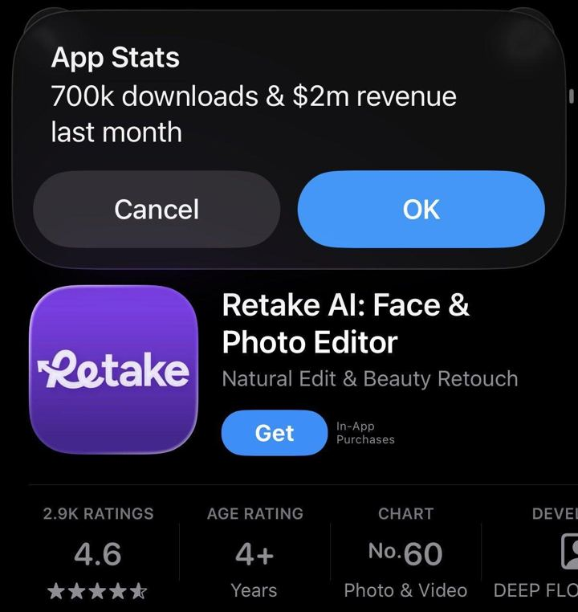

# 102 · Pinterest-pic recreation reveal ("I recreated this Pinterest photo with me in it")

<!-- HERO:START -->
[](EXAMPLE.md)

**[See the example and how to make it →](EXAMPLE.md)** · [watch on X](https://x.com/simonecanciello/status/2102046332970013078)
<!-- HERO:END -->


> **LC priority P2** · evidence: Medium-High (one $2M-MRR app + 2M-view demand signal) · hype risk: Medium · cost $0-80 · 30-60 min

## What it is
Slide/clip 1 is a **saved Pinterest photo** (the aspirational image everyone has on a board), slide 2 is **the creator recreating it**: same pose, light, outfit and, for LC, the same jewelry stack. The reveal is the side-by-side. For the app version (Retake) the app generates the recreation; for a brand it is a styling challenge: *"I recreated my most-saved Pinterest jewelry pics with pieces under $85."*

## Why it works
- Pinterest boards are where the purchase intent already lives; the viewer recognises the aesthetic.
- Side-by-side = before/after without a 'before' that insults anyone.
- Comments ask "do this one next" with their own pins, which writes the next 20 videos.
- For women the desire is identity ("that girl, but me"); the product becomes the bridge.

## Shot-by-shot (LC version)

| Time / slot | Visual | Audio / copy |
|---|---|---|
| Slide 1 | Screenshot-style Pinterest pin of a gold-stacked neck/wrist look (own licensed or creator-shot reference; never a stolen photo) | Text: "my most-saved pin for 3 years" |
| Slide 2 | Creator recreating the pose, light and stack with LC pieces | "recreated it with pieces I can shower in" |
| Slide 3 | Close-up of the stack, piece names | "Chelsea Herringbone + 2 paperclip chains + mini hoops" |
| Slide 4 | Split screen: pin vs recreation | "total: any 7 for $85" |
| Slide 5 | CTA | "send me your pin, I'll recreate it next" |

## Hooks (swap-in openers)
- "Recreating my most-saved Pinterest jewelry looks (under $85)"
- "Pinterest vs me: the gold stack edition"
- "I recreated the 'clean girl' jewelry pin with waterproof pieces"
- "Send me your pin and I'll recreate it"

## Real examples from X (studied)
- @simonecanciello: "take a pic of yourself + pick any pic you want to recreate from pinterest… the app recreates the exact same pic, but replaces the girl with you… Retake is doing $2M MRR. It's basically a larping app for women" ([post](https://x.com/simonecanciello/status/2102046332970013078)).
- @ErnestoSOFTWARE: a post asking for an app that helps you replicate aesthetic pictures got 2M+ views and 12K+ comments asking for the app: "pain killer apps for women sell out" ([post](https://x.com/ErnestoSOFTWARE/status/2061578473370501423)).
- @onlinedopamine: outsized organic views on brand-new accounts when you nail the "pinterest aesthetic girlies" audience plus one visually viral feature ([post](https://x.com/onlinedopamine/status/2082813772373098530)).

## Production recipe
1. **Pin sourcing:** use LC's own Pinterest pins, customer UGC (with permission) or creator-shot reference images. Do not repost other people's photos without a licence.
2. **Recreate:** match angle (phone at chest height), light (window, golden hour), outfit colours; jewelry stack from LC.
3. **Format:** 5-slide TikTok photo carousel or 9 s video with a swipe transition; trending sound.
4. **Comment loop:** reply to "do mine" with F18 green-screen recreations.
5. **AI variant (internal test only):** generate lookbook recreations with F20 rules (QC every piece against the real product).

## Bot prompt (copy into the creative agent)
```
Write 15 'Pinterest vs me' carousel concepts for Louise Carter. Each: (1) describe a typical high-save Pinterest jewelry aesthetic (e.g. 'clean girl gold', 'beach stack', 'bridal minimal'), (2) the exact LC pieces from {{CATALOG}} that recreate it, (3) 5 slide captions (max 9 words each), (4) a comment-bait last slide. No celebrity names or copyrighted images.
```

## 3 LC scripts
- A · "my most-saved pin for 3 years" → clean-girl gold stack recreated → piece list → any 7 for $85.
- B · "Pinterest beach jewelry vs me actually in the ocean" → recreation in the sea, pieces still gold.
- C · "bridal Pinterest board → bridesmaid gift version" → recreated with LC sets for 5 bridesmaids.

## Variants to test
- Carousel vs video
- Own pin vs follower-submitted pin
- Price callout on vs off
- Aesthetic category

## Omni test plan
- **Budget/structure:** Organic 3 posts/week on TikTok + Pinterest Idea pins for 4 weeks; Paid: best carousel as a Meta carousel ad $30/day
- **Primary KPIs:** Saves/1k, "do mine" comments, Pinterest outbound clicks; Omni revenue on `utm_content=F102-*`
- **Kill rule:** saves/1k <5 after 8 posts
- **Scale rule:** turn into a weekly series
- **Naming:** `utm_content=F102-<aesthetic>-<variant>`

## Compliance
Baseline: [_COMPLIANCE.md](../_COMPLIANCE.md) (no fake testimonials, AI disclosure, no bulk/spoofed accounts, copy structure not assets, PDP-only claims).
- Only use pins you own or have permission for; credit the original when it's a follower's pin.
- AI-generated recreations must be labelled and must match the real product exactly.
- Don't imply a celebrity wore LC.

## Related
- Strategies: 13-identity-shareables-accidental-virality, 01-viral-slideshow-recreation, 11-social-proof-credibility-engine
- Formats: [11-before-after-transformation](../11-before-after-transformation/README.md), [20-ai-model-lookbook-on-body](../20-ai-model-lookbook-on-body/README.md), [57-styling-carousel-how-to-wear](../57-styling-carousel-how-to-wear/README.md), [85-persona-aesthetic-slideshow-caption-template](../85-persona-aesthetic-slideshow-caption-template/README.md)
