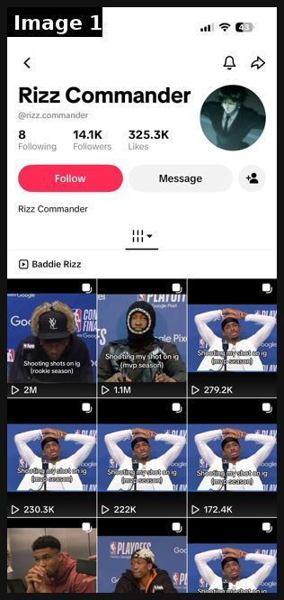
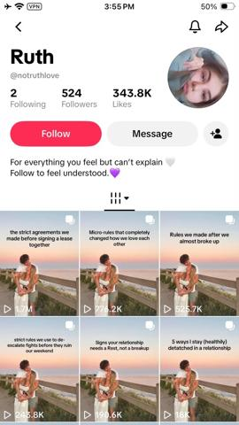

# 103 · DM-screenshot story slideshow (a chat people binge, the app/product on the slide that changes what happens next): see it, then make it

[](https://x.com/rsalimx/status/2103184083467837553)

**The example:** [@rsalimx on X](https://x.com/rsalimx/status/2103184083467837553) · 1 image · 40 likes, 3K views

**Watch it:** [open the post on X](https://x.com/rsalimx/status/2103184083467837553)

> **How close is this example?** Close: the page's TikTok grid of meme-cover DM slideshows (2M/1.1M views); the individual slides are not shown. The gallery below has more examples.

> Nah bro, this is genuinely crazy 😭 this ai rizz app is doing $100k/mo off tiktoks that look like memes every post is just his dms with girls, and one slide in the middle shows the app writing his next text even the ones where he gets curved do numbers 😭 turn a story people already binge into a slideshow series with a recurring hook give your app one slide, right where it changes what happens next by the time they rea…

## What you are seeing

The TikTok profile of "Rizz Commander" (@rizz.commander): 14.1K followers, 325.3K likes. The "Baddie Rizz" playlist is a grid of slideshow posts with NBA press-conference meme covers ("Shooting my shot on ig (mvp season)") at 2M, 1.1M, 279K, 230K and 222K views. Each slideshow is a DM screenshot story, and one middle slide shows the app writing the reply. The format is meme cover, then DMs, then the app slide.

## Image by image

| Image | Text on it (OCR, rough) |
|---|---|
| 1 | (mostly visual) |

## More real examples (1)

Other posts that show this format, or a close cousin of it. Click a thumbnail to open it on X.

| | | |
|---|---|---|
| [](https://x.com/leonclipping/status/2104660939069170110)<br>**@leonclipping** · images · 37K views<br>this girl might be a fucking genius she built a relationship page around the same couple photo on every post, posts simple "rules we made after a figh |   |   |

## How to make one like it

**The format in one line:** A TikTok photo slideshow made of **chat screenshots** that tell a story people want to finish (a flirt, a fight, a group chat meltdown). Somewhere in the middle, one slide shows the app/product **changing what happens next** (the AI writes the reply; the necklace is the thing she sends a photo of). Even the posts where the story goes badly do numbers, because the story is the content.

**Why it works:** - Chat screenshots are native and instantly readable; people read every bubble. - Story tension (will she reply?) drives swipes to the end, which TikTok rewards. - The product slide sits at the turning point, so it is remembered as the cause of the outcome. - Recurring hook ("part 7 of texting my ex with…") turns it into a series people follow.

**Contents:** [1. Structure](#1-copy-the-structure) · [2. Shot by shot](#2-shot-by-shot-remake) · [3. Script and hooks](#3-write-the-script) · [4. Prompts](#4-prompts) · [5. Tools and settings](#5-tools-and-settings) · [6. Louise Carter remake](#6-louise-carter-remake) · [7. Variants and test](#7-variants-and-test-plan) · [8. Pitfalls](#8-pitfalls)

### 1. Copy the structure

The skeleton every version follows: **hook → problem or tension → turn (the product shows up) → proof → one clear ask.** The shot-by-shot below fills it in.

### 2. Shot-by-shot remake

**Target length / size:** 6-slide TikTok photo slideshow (1080x1920), chat screenshots

| # | Time / slot | What we see (visual + camera) | Dialogue / on-screen text |
|---|---|---|---|
| 1 | Slide 1 | Chat header (contact name "Sister-in-law 🙄") + first bubble | Hook text overlay: "my sister-in-law has never complimented me. until today:" |
| 2 | Slide 2 | Her message: "ok where is that necklace from" | — |
| 3 | Slide 3 | Typing bubble; overlay text | "do I tell her or gatekeep" |
| 4 | Slide 4 | The photo she sends: real LC necklace under shower water | Bubble: "14K PVD, I literally shower in it" |
| 5 | Slide 5 | SIL: "ordering rn. matching for the wedding??" | — |
| 6 | Slide 6 | Black slide | "part 2: she ordered the same one 😭" |

<details><summary>Playbook shot list (Louise Carter version from the README)</summary>

| Time / slot | Visual | Audio / copy |
|---|---|---|
| Slide 1 | Hook slide: chat header + first message | "my sister-in-law has never once complimented me. until today:" |
| Slide 2 | iMessage: SIL: "ok where is that necklace from" | — |
| Slide 3 | Her reply draft; she hesitates | "do I tell her or gatekeep" |
| Slide 4 | Product slide: photo of the necklace in the shower (the photo she sends) | "14K PVD, I literally shower in it" |
| Slide 5 | SIL: "ordering rn. matching for the wedding??" | — |
| Slide 6 | Cliff/CTA | "part 2: she ordered the same one 😭" |

</details>

### 3. Write the script

Open with one of these hooks (first 1–3 seconds, or the headline on a static):

- "my sister-in-law has never complimented me. until today:"
- "group chat when I said my jewelry is waterproof"
- "texting my mom pics of my necklace after 6 months in the ocean"
- "part 3 of the bridesmaid chat"

Then fill the beats from the table above. Pull the wording from real customer reviews, not from ad copy: a review line beats a copywriter line almost every time. Read every line out loud and cut anything you would not say to a friend. Ready-made Louise Carter scripts are in section 6; hand [BOT.md](BOT.md) to any AI agent to write versions for another brand.

### 4. Prompts

**Story bank (Claude)**

```text
From these review themes {{REVIEW_THEMES}}, write 20 six-slide chat stories (5-7 bubbles total) where a Louise Carter piece changes the outcome on slide 4. First names only. End each with a "part 2" teaser.
```

**Chat mockups**

```text
Use a mock-iMessage template in Figma: 9:41 status bar, real-looking carrier, blue/grey bubbles at 17pt SF Pro scaled to 1080 wide, no real phone numbers or photos of real people.
```

**Full creative-agent prompt (from the playbook):**

```
Write 12 six-slide chat-screenshot stories for Louise Carter. Each: the chat participants (first names only), 5-7 bubbles total, the turning-point slide where an LC piece (from {{CATALOG}}) changes the outcome, and a 'part 2' teaser. Stories must be plausible and based on these real review themes: {{REVIEW_THEMES}}. Caption must say it is a dramatisation.
```

### 5. Tools and settings

1. **Story bank:** 20 short chat plots from real customer DMs/reviews (with permission, names changed): compliments, gifting, bridesmaids, mother-daughter, "you're swimming in that??".
2. **Make the screens:** build chats in a mock-iMessage generator or Figma template; real-looking timestamps, battery, carrier.
3. **Product slide** at slide 4 of 6 (the turning point), using a real LC photo.
4. **Series:** post as "part N", same account, same characters.
5. **Disclosure:** label as a dramatisation in the caption ("based on DMs we get").

| Setting | Value |
|---|---|
| Canvas | 1080×1350 (4:5) per slide; 1080×1920 for TikTok photo mode |
| Slides | 5–10; slide 1 is the hook only, last slide is the ask (save / follow / shop) |
| Type | 64–96 px headline per slide, one idea per slide, consistent position across slides |
| Continuity | Same template, colour and font on every slide so it reads as one piece |
| Audio (TikTok) | Add a trending sound at low volume; photo mode auto-advances |
| Tools | Canva or Figma template; Postnitro or ChatGPT for drafts; export PNG, sRGB |

### 6. Louise Carter remake

- A · "my sister-in-law has never complimented me" → "where is that from" → shower photo → she orders → part 2.
- B · "bridesmaid group chat when the bride said 'matching gold, no green necks'" → LC set photo → everyone orders.
- C · "texting my mom a pic of the necklace she said would turn green" → 6 months later, still gold → mom asks for one.

Brand rules, claims you can and cannot make, and more scripts: [brands/louise-carter.md](brands/louise-carter.md). Step-by-step from idea to scale: [STAGES.md](STAGES.md).

### 7. Variants and test plan

- Product slide position (3 vs 4 vs last)
- Series vs one-off
- iMessage vs WhatsApp vs IG DM look
- Happy vs savage ending

**Test plan:** - **Budget/structure:** Organic only: 1 account, 1-2 posts/day for 3 weeks - **Primary KPIs:** Completion (swipes to last slide), comments asking for part 2, profile clicks; Omni bio-link revenue on `utm_content=F103-*` - **Kill rule:** <1K median views after 21 posts - **Scale rule:** second account with a different character set - **Naming:** `utm_content=F103-<story>-<part>`

**Naming:** `F103-<variant>-<hook##>-<date>` so results map back to this folder. Change one thing per test (hook, narrator, length or offer), never two.

### 8. Pitfalls

- Label it a dramatisation in the caption.
- Product slide at the turning point, not the end; the end is the payoff.
- Same characters every part, or the series loses followers.
- A weak first slide: nobody swipes past a boring cover.
- No reason to save: give a list, a checklist or a reference people come back to.

**Compliance:** Baseline: [_COMPLIANCE.md](../../_COMPLIANCE.md) (no fake testimonials, AI disclosure, no bulk/spoofed accounts, copy structure not assets, PDP-only claims). - Dramatised chats must be labelled as dramatisations; never present invented messages as real customers. - No real names, numbers or profile photos of real people without consent. - No fake reviews inside the chats.

## More examples

Every post we found for this format, with transcripts: [examples/](examples/README.md). Playbook: [README.md](README.md). Agent brief: [BOT.md](BOT.md).
