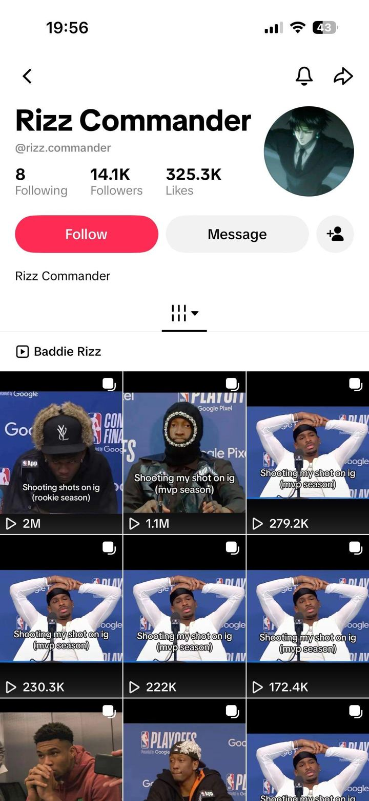

# 103 · DM-screenshot story slideshow (a chat people binge, the app/product on the slide that changes what happens next)

<!-- HERO:START -->
[](EXAMPLE.md)

**[See the example and how to make it →](EXAMPLE.md)** · [watch on X](https://x.com/rsalimx/status/2103184083467837553)
<!-- HERO:END -->


> **LC priority P2** · evidence: Medium-High (one $100K/mo app; known slideshow engine) · hype risk: Medium · cost $0 · 20-40 min

## What it is
A TikTok photo slideshow made of **chat screenshots** that tell a story people want to finish (a flirt, a fight, a group chat meltdown). Somewhere in the middle, one slide shows the app/product **changing what happens next** (the AI writes the reply; the necklace is the thing she sends a photo of). Even the posts where the story goes badly do numbers, because the story is the content.

## Why it works
- Chat screenshots are native and instantly readable; people read every bubble.
- Story tension (will she reply?) drives swipes to the end, which TikTok rewards.
- The product slide sits at the turning point, so it is remembered as the cause of the outcome.
- Recurring hook ("part 7 of texting my ex with…") turns it into a series people follow.

## Shot-by-shot (LC version)

| Time / slot | Visual | Audio / copy |
|---|---|---|
| Slide 1 | Hook slide: chat header + first message | "my sister-in-law has never once complimented me. until today:" |
| Slide 2 | iMessage: SIL: "ok where is that necklace from" | — |
| Slide 3 | Her reply draft; she hesitates | "do I tell her or gatekeep" |
| Slide 4 | Product slide: photo of the necklace in the shower (the photo she sends) | "14K PVD, I literally shower in it" |
| Slide 5 | SIL: "ordering rn. matching for the wedding??" | — |
| Slide 6 | Cliff/CTA | "part 2: she ordered the same one 😭" |

## Hooks (swap-in openers)
- "my sister-in-law has never complimented me. until today:"
- "group chat when I said my jewelry is waterproof"
- "texting my mom pics of my necklace after 6 months in the ocean"
- "part 3 of the bridesmaid chat"

## Real examples from X (studied)
- @rsalimx: AI rizz app doing ~$100K/mo off TikToks that look like memes; every post is his DMs with girls and one slide in the middle shows the app writing his next text; "turn a story people already binge into a slideshow series with a recurring hook, give your app one slide, right where it changes what happens next" ([post](https://x.com/rsalimx/status/2103184083467837553)).
- @leonclipping: the relationship page variant: one stock couple photo, "rules we made after a fight" slideshows, AI advice app on the last slide; 524 followers, 343K likes, top post 1.7M ([post](https://x.com/leonclipping/status/2104660939069170110)).

## Production recipe
1. **Story bank:** 20 short chat plots from real customer DMs/reviews (with permission, names changed): compliments, gifting, bridesmaids, mother-daughter, "you're swimming in that??".
2. **Make the screens:** build chats in a mock-iMessage generator or Figma template; real-looking timestamps, battery, carrier.
3. **Product slide** at slide 4 of 6 (the turning point), using a real LC photo.
4. **Series:** post as "part N", same account, same characters.
5. **Disclosure:** label as a dramatisation in the caption ("based on DMs we get").

## Bot prompt (copy into the creative agent)
```
Write 12 six-slide chat-screenshot stories for Louise Carter. Each: the chat participants (first names only), 5-7 bubbles total, the turning-point slide where an LC piece (from {{CATALOG}}) changes the outcome, and a 'part 2' teaser. Stories must be plausible and based on these real review themes: {{REVIEW_THEMES}}. Caption must say it is a dramatisation.
```

## 3 LC scripts
- A · "my sister-in-law has never complimented me" → "where is that from" → shower photo → she orders → part 2.
- B · "bridesmaid group chat when the bride said 'matching gold, no green necks'" → LC set photo → everyone orders.
- C · "texting my mom a pic of the necklace she said would turn green" → 6 months later, still gold → mom asks for one.

## Variants to test
- Product slide position (3 vs 4 vs last)
- Series vs one-off
- iMessage vs WhatsApp vs IG DM look
- Happy vs savage ending

## Omni test plan
- **Budget/structure:** Organic only: 1 account, 1-2 posts/day for 3 weeks
- **Primary KPIs:** Completion (swipes to last slide), comments asking for part 2, profile clicks; Omni bio-link revenue on `utm_content=F103-*`
- **Kill rule:** <1K median views after 21 posts
- **Scale rule:** second account with a different character set
- **Naming:** `utm_content=F103-<story>-<part>`

## Compliance
Baseline: [_COMPLIANCE.md](../_COMPLIANCE.md) (no fake testimonials, AI disclosure, no bulk/spoofed accounts, copy structure not assets, PDP-only claims).
- Dramatised chats must be labelled as dramatisations; never present invented messages as real customers.
- No real names, numbers or profile photos of real people without consent.
- No fake reviews inside the chats.

## Related
- Strategies: 22-serialized-chat-story-slideshows, 23-product-voice-notification-slideshows, 01-viral-slideshow-recreation
- Formats: [32-screenshot-native-static-pack](../32-screenshot-native-static-pack/README.md), [48-the-dm-i-get-every-day](../48-the-dm-i-get-every-day/README.md), [03-notification-lockscreen-slides](../03-notification-lockscreen-slides/README.md), [56-emotional-relatable-slideshow](../56-emotional-relatable-slideshow/README.md)
