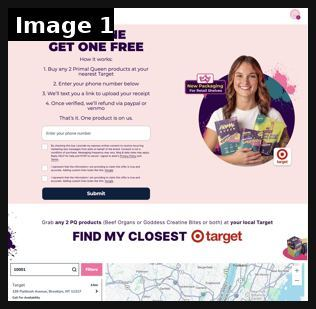

# 104 · Retail receipt rebate offer ad (\"buy 2 at Target, upload your receipt, get 1 back\"): see it, then make it

[](https://x.com/GustavWalsted/status/2105227892309594486)

**The example:** [@GustavWalsted on X](https://x.com/GustavWalsted/status/2105227892309594486) · 1 image · 9 likes, 376 views

**Watch it:** [open the post on X](https://x.com/GustavWalsted/status/2105227892309594486)

> **How close is this example?** Close: the live Target-receipt BOGO landing page behind the Meta ad, not the ad creative. The gallery below has more examples.

> Honestly, genius move @abdushodmonov. Hats off to you and the team. Primal Queen is running Meta ads with a simple offer: buy 2 products at Target, upload your receipt and get your money back for 1. Getting into Target is one thing. Actually selling enough to stay there is quite hard. Pretty smart way to get those Target sales up.

## What you are seeing

Primal Queen's live offer page behind the Meta ad. The headline is "BUY ONE GET ONE FREE". How it works: 1) buy any 2 Primal Queen products at your nearest Target; 2) enter your phone number; 3) we text you a link to upload your receipt; 4) once verified we refund via PayPal or Venmo. "That's it. One product is on us." Under that is a "FIND MY CLOSEST target" store locator with a map. Paid social drives retail sell-through, and the brand captures the SMS list.

## Image by image

| Image | Text on it (OCR, rough) |
|---|---|
| 1 | QUEEN BUY ONE GET ONE FREE How it works: 1. Buy any Primal Queen products at your nearest Target ey 2. Enter your phone number below For 3. We'll text you a link to upload your receipt 4. Once verified, we'll refund via paypal or ve That's it. One product is on us. ta Enter your phone number Cg ae G |

## More real examples (1)

Other posts that show this format, or a close cousin of it. Click a thumbnail to open it on X.

| | | |
|---|---|---|
| [](https://x.com/eCom_Amin/status/2099533970484646210)<br>**@eCom_Amin** · 1:42 video · 28K views<br>primal queen prints $2M a month and their google funnel is the most complete i've dissected all year AI youtube ads with 1M+ views, an advertorial run |   |   |

## How to make one like it

**The format in one line:** A DTC brand that has just landed in a retailer runs **Meta ads that send people to the store, not the website**: *"Buy 2 Primal Queen at Target → upload your receipt → we refund one."* The ad is a simple static or creator clip of the shelf, the offer, and a QR/receipt-upload page. It turns Meta spend into retail sell-through, which is what keeps a new brand on the shelf.

**Why it works:** - Getting into Target is easy compared with selling enough to stay; this pushes velocity per store (@GustavWalsted). - "Get one free" via rebate converts better than a percentage, and the brand still books 2 retail units. - Receipt upload gives the brand the customer's email/phone, which retail normally hides. - It reuses the brand's DTC audiences, now pointed at a store they already visit.

**Contents:** [1. Structure](#1-copy-the-structure) · [2. Shot by shot](#2-shot-by-shot-remake) · [3. Script and hooks](#3-write-the-script) · [4. Prompts](#4-prompts) · [5. Tools and settings](#5-tools-and-settings) · [6. Louise Carter remake](#6-louise-carter-remake) · [7. Variants and test](#7-variants-and-test-plan) · [8. Pitfalls](#8-pitfalls)

### 1. Copy the structure

The skeleton every version follows: **hook → problem or tension → turn (the product shows up) → proof → one clear ask.** The shot-by-shot below fills it in.

### 2. Shot-by-shot remake

**Target length / size:** 1 static 1080x1350 + one 12-15s creator aisle clip

| # | Time / slot | What we see (visual + camera) | Dialogue / on-screen text |
|---|---|---|---|
| 1 | Static headline | Hand holding 2 products in a real retail aisle | "Buy 2 at [Retailer]. Get 1 back." |
| 2 | Static body | Three icons left→right: cart, receipt photo, money back | "Upload your receipt at [brand].com/rebate" |
| 3 | Static footer | Small print bar | "Ends [date]. 1 per customer. Terms at [url]." |
| 4 | Video 0-3s | Creator walks to the shelf | "Okay [Retailer] has [brand] now" |
| 5 | Video 3-10s | Grabs two, checkout, phone uploading the receipt | "and you get one back. Like, free." |
| 6 | Video 10-15s | End card with QR | "Rebate link in bio / tap Learn More" |

<details><summary>Playbook shot list (Louise Carter version from the README)</summary>

| Time / slot | Visual | Audio / copy |
|---|---|---|
| Static | Creator hand holding 2 products in a store aisle (real shelf) | Headline: "Buy 2 at [Retailer]. Get 1 back." |
| Line 2 | Three icons: cart → receipt photo → money back | "Upload your receipt at [brand].com/rebate" |
| Footer | Retailer logo usage per retailer brand rules | "Limited time · terms apply" |
| Video version 0-3s | Creator walks to the shelf: "okay so Target has [brand] now" | — |
| 3-12s | Picks 2, shows phone uploading the receipt | "you literally get one back" |

</details>

### 3. Write the script

Open with one of these hooks (first 1–3 seconds, or the headline on a static):

- "Buy 2 at [Retailer], get 1 back"
- "It's at [Retailer] now. And the second one is on us."
- "Found it at [Retailer] 😭 here's the rebate"
- LC (Amazon/retail version): "Order on Amazon, send us your order number, get a free stack piece"

Then fill the beats from the table above. Pull the wording from real customer reviews, not from ad copy: a review line beats a copywriter line almost every time. Read every line out loud and cut anything you would not say to a friend. Ready-made Louise Carter scripts are in section 6; hand [BOT.md](BOT.md) to any AI agent to write versions for another brand.

### 4. Prompts

**Copy (Claude)**

```text
Write 10 headline variants for a "buy 2 at {{RETAILER}}, get 1 back via receipt upload" offer. ≤8 words each, no exclamation marks, plus a 1-line legal footer.
```

**Targeting**

```text
Meta location targeting: 10-15 mile radius around stores carrying the SKU; exclude existing DTC buyers 30d.
```

**Full creative-agent prompt (from the playbook):**

```
Write 6 Meta static concepts and 2 UGC scripts (15 s) for a 'buy 2 at {{RETAILER}}, upload receipt, get 1 back' offer for {{BRAND}}. Include the exact headline, sub-line, 3-step icon copy, legal footer, and a geo-targeting note. Keep claims to {{PDP_FACTS}}.
```

### 5. Tools and settings

1. Confirm the rebate is allowed under the retailer agreement and set budget caps.
2. Build a rebate page (Typeform/Jotform + receipt upload + email/phone); auto-reply with the payout timeline.
3. Make 3 statics + 2 creator clips; geo-target store radiuses (Meta location targeting).
4. Track redemptions per store; feed rebate emails into the CRM.
5. **LC now:** adapt as an Amazon/marketplace order-number rebate only if LC sells there; otherwise use the mechanic as a DTC 'send us your old green necklace photo, get $15' trade-in.

| Setting | Value |
|---|---|
| Canvas | 1080×1920 (9:16) master; crop a 1080×1350 (4:5) cut for feed placements |
| Frame rate | 30 fps (shoot 60 fps for slow-motion water or sparkle shots) |
| Camera | Phone main lens at 1x, exposure locked on skin, HDR off, grid on; tripod or a phone clamp for product shots |
| Light | One soft key at 45° (window or ring light), white card as fill; side light for metal sparkle |
| Audio | Lavalier or phone 15–20 cm from the mouth; mix voice at -14 LUFS, music at -28 to -30 dB under voice |
| Captions | Burned in, 2–5 words per line, 64–80 px bold sans, white with a black stroke or pill; keep text inside the safe zone (top 220 px and bottom 420 px clear, 64 px side margins) |
| Pacing | A visual change every 1.5–3 s; the hook lands in the first 1.5 s with no logo intro |
| Edit / export | CapCut or Premiere; H.264, 12–20 Mbps, AAC 320 kbps; upload natively to each platform, not via links |

### 6. Louise Carter remake

- A · (if LC goes retail) "Buy 2 at [Retailer], get 1 back" → aisle static → rebate page.
- B · DTC trade-in twist: "Send us a pic of the necklace that turned green → $15 off your first stack" (photo upload → code).
- C · Marketplace: "Bought LC on Amazon? Upload your order number → free mini hoops."

Brand rules, claims you can and cannot make, and more scripts: [brands/louise-carter.md](brands/louise-carter.md). Step-by-step from idea to scale: [STAGES.md](STAGES.md).

### 7. Variants and test plan

- Rebate vs instant code
- Store-radius vs national
- Static vs creator aisle clip

**Test plan:** - **Budget/structure:** Only when LC has retail/marketplace presence; $50/day per region for 2 weeks - **Primary KPIs:** Redemptions, cost per redemption, store sell-through lift; Omni/CRM new contacts on `utm_content=F104-*` - **Kill rule:** cost per redemption > gross margin of 1 unit - **Scale rule:** expand to all stores carrying the product - **Naming:** `utm_content=F104-<retailer>-<variant>`

**Naming:** `F104-<variant>-<hook##>-<date>` so results map back to this folder. Change one thing per test (hook, narrator, length or offer), never two.

### 8. Pitfalls

- Check the retailer agreement before advertising a rebate.
- Payout delays kill trust; automate refunds within 7 days.
- LC is DTC-only today; only use the trade-in variant until it has retail or marketplace presence.
- Slow open: if the first 1.5 s does not show the hook visually, most people swipe.
- Logo or brand intro at the start reads as an ad; put the brand at the end.
- Captions covered by the platform UI: check the safe zone on a real phone before posting.
- Music over the voice: keep music at least 14 dB under speech.

**Compliance:** Baseline: [_COMPLIANCE.md](../../_COMPLIANCE.md) (no fake testimonials, AI disclosure, no bulk/spoofed accounts, copy structure not assets, PDP-only claims). - Rebate terms (limits, dates, eligible stores, payout timing) must be stated on the ad landing page. - Retailer logos only per the retailer's brand guidelines and agreement. - Collect only the data needed for the rebate; state the privacy use.

## More examples

Every post we found for this format, with transcripts: [examples/](examples/README.md). Playbook: [README.md](README.md). Agent brief: [BOT.md](BOT.md).
