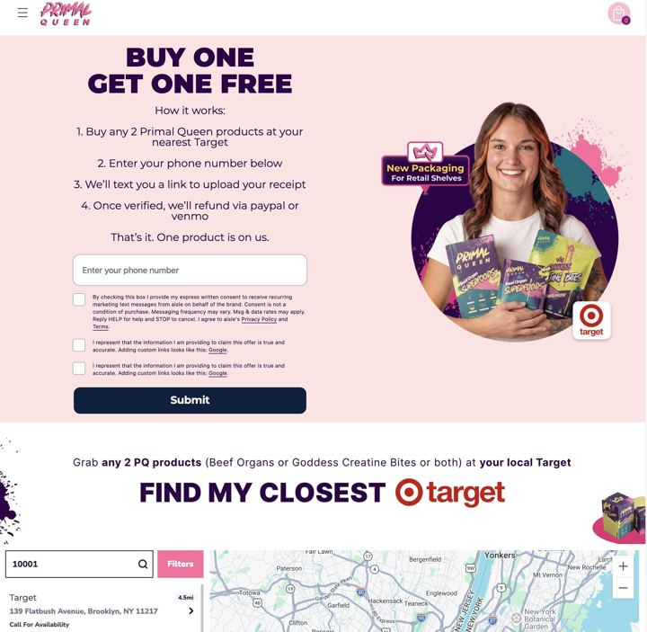

# 104 · Retail receipt rebate offer ad ("buy 2 at Target, upload your receipt, get 1 back")

<!-- HERO:START -->
[](EXAMPLE.md)

**[See the example and how to make it →](EXAMPLE.md)** · [watch on X](https://x.com/GustavWalsted/status/2105227892309594486)
<!-- HERO:END -->


> **LC priority P3** · evidence: Medium (one big brand, live ads) · hype risk: Low · cost $0-100 per static + rebate cost · 1-2 h

## What it is
A DTC brand that has just landed in a retailer runs **Meta ads that send people to the store, not the website**: *"Buy 2 Primal Queen at Target → upload your receipt → we refund one."* The ad is a simple static or creator clip of the shelf, the offer, and a QR/receipt-upload page. It turns Meta spend into retail sell-through, which is what keeps a new brand on the shelf.

## Why it works
- Getting into Target is easy compared with selling enough to stay; this pushes velocity per store (@GustavWalsted).
- "Get one free" via rebate converts better than a percentage, and the brand still books 2 retail units.
- Receipt upload gives the brand the customer's email/phone, which retail normally hides.
- It reuses the brand's DTC audiences, now pointed at a store they already visit.

## Shot-by-shot (LC version)

| Time / slot | Visual | Audio / copy |
|---|---|---|
| Static | Creator hand holding 2 products in a store aisle (real shelf) | Headline: "Buy 2 at [Retailer]. Get 1 back." |
| Line 2 | Three icons: cart → receipt photo → money back | "Upload your receipt at [brand].com/rebate" |
| Footer | Retailer logo usage per retailer brand rules | "Limited time · terms apply" |
| Video version 0-3s | Creator walks to the shelf: "okay so Target has [brand] now" | — |
| 3-12s | Picks 2, shows phone uploading the receipt | "you literally get one back" |

## Hooks (swap-in openers)
- "Buy 2 at [Retailer], get 1 back"
- "It's at [Retailer] now. And the second one is on us."
- "Found it at [Retailer] 😭 here's the rebate"
- LC (Amazon/retail version): "Order on Amazon, send us your order number, get a free stack piece"

## Real examples from X (studied)
- @GustavWalsted: Primal Queen Meta ads: "buy 2 products at Target, upload your receipt and get your money back for 1… Getting into Target is one thing. Actually selling enough to stay there is quite hard" ([post](https://x.com/GustavWalsted/status/2105227892309594486)).
- @eCom_Amin: Primal Queen's Google funnel: AI YouTube ads with 1M+ views, an advertorial running on Shopping listings, and a homepage that is secretly a sales letter ([post](https://x.com/eCom_Amin/status/2099533970484646210)).
- @zarastrategy: Primal Queen ~1,600 active Meta ads; Us-vs-Them is their signature ([post](https://x.com/zarastrategy/status/2090820261574529478)).

## Production recipe
1. Confirm the rebate is allowed under the retailer agreement and set budget caps.
2. Build a rebate page (Typeform/Jotform + receipt upload + email/phone); auto-reply with the payout timeline.
3. Make 3 statics + 2 creator clips; geo-target store radiuses (Meta location targeting).
4. Track redemptions per store; feed rebate emails into the CRM.
5. **LC now:** adapt as an Amazon/marketplace order-number rebate only if LC sells there; otherwise use the mechanic as a DTC 'send us your old green necklace photo, get $15' trade-in.

## Bot prompt (copy into the creative agent)
```
Write 6 Meta static concepts and 2 UGC scripts (15 s) for a 'buy 2 at {{RETAILER}}, upload receipt, get 1 back' offer for {{BRAND}}. Include the exact headline, sub-line, 3-step icon copy, legal footer, and a geo-targeting note. Keep claims to {{PDP_FACTS}}.
```

## 3 LC scripts
- A · (if LC goes retail) "Buy 2 at [Retailer], get 1 back" → aisle static → rebate page.
- B · DTC trade-in twist: "Send us a pic of the necklace that turned green → $15 off your first stack" (photo upload → code).
- C · Marketplace: "Bought LC on Amazon? Upload your order number → free mini hoops."

## Variants to test
- Rebate vs instant code
- Store-radius vs national
- Static vs creator aisle clip

## Omni test plan
- **Budget/structure:** Only when LC has retail/marketplace presence; $50/day per region for 2 weeks
- **Primary KPIs:** Redemptions, cost per redemption, store sell-through lift; Omni/CRM new contacts on `utm_content=F104-*`
- **Kill rule:** cost per redemption > gross margin of 1 unit
- **Scale rule:** expand to all stores carrying the product
- **Naming:** `utm_content=F104-<retailer>-<variant>`

## Compliance
Baseline: [_COMPLIANCE.md](../_COMPLIANCE.md) (no fake testimonials, AI disclosure, no bulk/spoofed accounts, copy structure not assets, PDP-only claims).
- Rebate terms (limits, dates, eligible stores, payout timing) must be stated on the ad landing page.
- Retailer logos only per the retailer's brand guidelines and agreement.
- Collect only the data needed for the rebate; state the privacy use.

## Related
- Strategies: 05-offer-page-engineering, 16-rewards-streaks-earned-discounts, 21-one-channel-deep-then-layer
- Formats: [37-urgency-offer-statics](../37-urgency-offer-statics/README.md), [86-offer-architecture-bundle-picker](../86-offer-architecture-bundle-picker/README.md), [62-catalog-collection-dpa-ads](../62-catalog-collection-dpa-ads/README.md), [25-sweepstakes-celebrity-giveaway](../25-sweepstakes-celebrity-giveaway/README.md)
