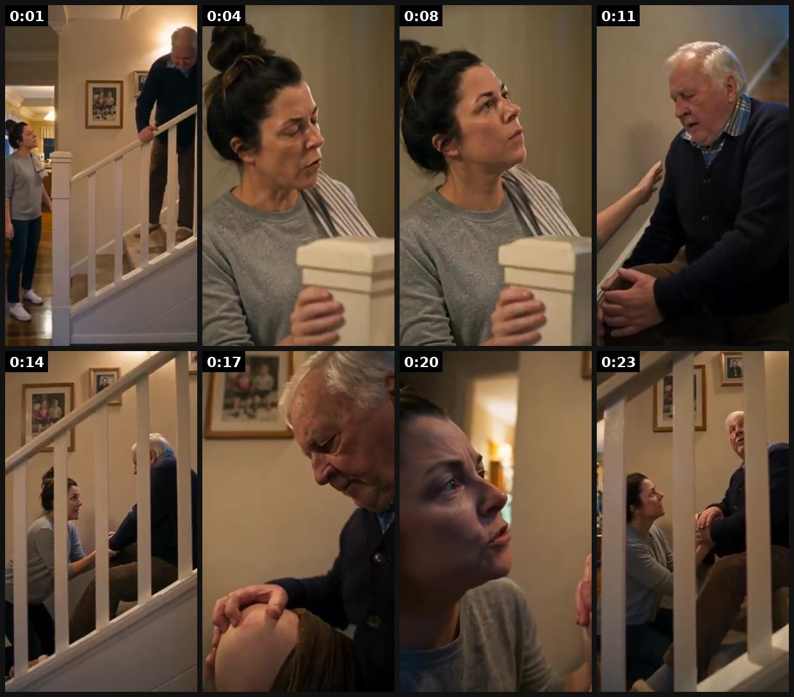
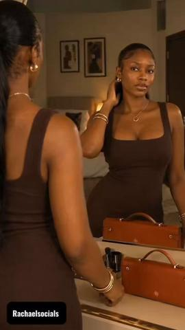

# 105 · Short AI revenge-drama ad (25-60 s: betrayal open, fast cuts, twist, product is how she gets even): see it, then make it

[](https://x.com/0xROAS/status/2107188290264740348)

**The example:** [@0xROAS on X](https://x.com/0xROAS/status/2107188290264740348) · 0:25 video · 104 likes, 9K views

**Watch it:** [open the post on X](https://x.com/0xROAS/status/2107188290264740348) · [play the video file](https://video.twimg.com/amplify_video/2107188258639642624/vid/avc1/320x568/N7pBJJ5VyleH1rGX.mp4?tag=29)

> 100% AI Drama Ad with Seedance 2.5... module is live inside ai ads community here’s how to make sure your dramas hit: - start with a very aggressive hook - make a plot twist - add revenge the reason people like drama ads is because they're very entertaining to watch especially if you use multiple cuts per video which will keep them hooked.

## What you are seeing

A 25-second AI drama (Seedance 2.5). A woman calls up the stairs: "Dad, tea's on the table, it's getting cold." Dad struggles on the stairs: "40 years I've done these stairs... I'm all right." Close-ups: "You're not all right, Dad. It's been like this since Christmas. Why didn't you say something?" "Didn't want to be the old bloke who can't do the stairs." She kneels beside him on the stairs, with family photos on the wall. The product (a joint or mobility aid) is set up as the emotional resolution. It plays like a cinematic family scene, not an ad.

## Beat by beat

The storyboard above samples the video every 0:03. Lines are the transcript for that stretch; on-screen text comes from OCR, so treat it as rough.

| Frame | Time | On screen | Said / sung |
|---|---|---|---|
| 1 | 0:00–0:03 | · | · |
| 2 | 0:03–0:06 | · | Dad tea's on the table. It's getting cold coming love. You're right 40 years. I've done these stairs |
| 3 | 0:06–0:09 | · | · |
| 4 | 0:09–0:12 | · | Dad I'm all right. I'm all right |
| 5 | 0:12–0:15 | · | · |
| 6 | 0:15–0:19 | · | You're not all right dad. It's been like this since Christmas. Why didn't you say something? |
| 7 | 0:19–0:22 | · | · |
| 8 | 0:22–0:25 | · | Didn't want to be the old bloke who can't do the stairs |

<details><summary>Full transcript (timestamped)</summary>

- `0:00` Dad tea's on the table. It's getting cold coming love. You're right 40 years. I've done these stairs
- `0:09` Dad
- `0:11` I'm all right. I'm all right
- `0:13` You're not all right dad. It's been like this since Christmas. Why didn't you say something?
- `0:22` Didn't want to be the old bloke who can't do the stairs

</details>

## More real examples (5)

Other posts that show this format, or a close cousin of it. Click a thumbnail to open it on X.

| | | |
|---|---|---|
| [](https://x.com/david_attisaas/status/2108195582607081720)<br>**@david_attisaas** · 5:25 video · 724 views<br>I'm running short drama ads for a few apps right now, and every one of them started as a copy of something a dropshipper ran first. I went looking aft | [](https://x.com/ViralOps_/status/2108255353016406383)<br>**@ViralOps_** · 1:00 video · 589 views<br>Koriderm is absolutely CRUSHING with these DRAMA ads rn. they're literally making mini movies just to sell skincare products 😭 and i think this could | [](https://x.com/zedmadeit/status/2102176819709673703)<br>**@zedmadeit** · 1:36 video · 3K views<br>heres how to make ai drama ads for your brand ai dramas are the new trend and theyre great for engagement but you want the right kind the kind that ac |
| [](https://x.com/JUSTCHAEL_/status/2098373776828256595)<br>**@JUSTCHAEL_** · 1:50 video · 2K views<br>Enjoy this short drama ad I created for Outlash, featuring their Curt Purse. @outlashbrand AI can create story-driven ads, not just pretty visuals. If | [](https://x.com/frankyecom/status/2106833649970684195)<br>**@frankyecom** · 7:00 video · 66K views<br>Women want shows: characters, drama, payoff; build entertainment first, slot product in. |   |

## How to make one like it

**The format in one line:** The short cousin of F91. A 25-60 second AI-generated (or acted) mini-movie built like a ReelShort clip: **0-3 s betrayal or humiliation** ("my sister-in-law laughed at my jewelry in front of everyone"), **fast cuts every 1-2 s**, a **twist**, and the **product is the reason she wins**. No narrator selling; the product is a plot device. It ends on the satisfying payoff, not a cliffhanger (that is F

**Why it works:** - Micro-drama viewers (ReelShort, DramaBox) are already trained on betrayal → twist → revenge; boomers and women 35+ binge it and rarely notice it is AI (@david_attisaas). - It is entertainment first, so CPMs drop and people stay (frankyecom: "stop interrupting the show, make the ad the show"). - 25 s keeps the product inside the retention window; F91 long melodramas lose 90-95% before the product (@TheIvanKreimer). - Revenge gives the product an emotional job, not just a feature.

**Contents:** [1. Structure](#1-copy-the-structure) · [2. Shot by shot](#2-shot-by-shot-remake) · [3. Script and hooks](#3-write-the-script) · [4. Prompts](#4-prompts) · [5. Tools and settings](#5-tools-and-settings) · [6. Louise Carter remake](#6-louise-carter-remake) · [7. Variants and test](#7-variants-and-test-plan) · [8. Pitfalls](#8-pitfalls)

### 1. Copy the structure

Use the example's timing as your beat sheet. Keep the beat, change the words and the product.

| Beat | Time | In the example | Your version |
|---|---|---|---|
| 1 | 0:01 | Dad tea's on the table. It's getting cold coming love. You're right 40 years. I've done these stairs | … |
| 2 | 0:04 | Dad tea's on the table. It's getting cold coming love. You're right 40 years. I've done these stairs | … |
| 3 | 0:08 | Dad | … |
| 4 | 0:11 | Dad I'm all right. I'm all right | … |
| 5 | 0:14 | I'm all right. I'm all right | … |
| 6 | 0:17 | You're not all right dad. It's been like this since Christmas. Why didn't you say something? | … |
| 7 | 0:20 | (visual beat, see frame 7) | … |
| 8 | 0:23 | Didn't want to be the old bloke who can't do the stairs | … |

### 2. Shot-by-shot remake

**Target length / size:** 25-30s (plus a 45-60s cut), 1080x1920, 12-16 shots of 1.5-2.5s

| # | Time / slot | What we see (visual + camera) | Dialogue / on-screen text |
|---|---|---|---|
| 1 | 0-2s | Engagement party, medium close-up. SIL flicks the bride's necklace with one finger. | SIL: "Cute. Did it come with the cake?" + crowd laugh |
| 2 | 2-4s | Bride's face, push-in; party sound drops out | Low bass sting |
| 3 | 4-6s | Title card over black | "3 weeks later" |
| 4 | 6-9s | Pool: SIL climbs out; close-up of her wrist, bracelet dull/green-tinged | — |
| 5 | 9-13s | Bride swims, surfaces, necklace bright gold in sunlight (REAL LC footage for the macro) | Music lifts |
| 6 | 13-18s | Bachelorette brunch; SIL hides her wrist under the table | Friend: "Wait, is that the same necklace?" |
| 7 | 18-21s | Bride, casual | "Mine? I shower in it." |
| 8 | 21-25s | Hands-only LC box, 14K PVD card | Text: "14K PVD · waterproof · any 7 for $85" |
| 9 | 25-28s | SIL alone, typing "louise carter" into search | Beat; cut to black |

<details><summary>Playbook shot list (Louise Carter version from the README)</summary>

| Time / slot | Visual | Audio / copy |
|---|---|---|
| 0-2s | Engagement party, close-up: SIL flicks bride-to-be's necklace | SIL: "Cute. Did it come with the cake?" (laughter) |
| 2-5s | Bride's face, humiliated; fast push-in | Music sting |
| 5-9s | Flash: SIL at the pool, her 'designer' bracelet turning her wrist green | Text: "3 weeks later" |
| 9-14s | Bride swims laps wearing her LC necklace; surfaces, still bright gold | — |
| 14-20s | SIL at the bachelorette, hiding her wrist; bride: "Oh, mine? I shower in it." | — |
| 20-25s | Product beat: hands-only LC box, '14K PVD · waterproof' | "Any 7 for $85" |
| 25-28s | SIL quietly searching "louise carter" on her phone | Payoff laugh |

</details>

### 3. Write the script

Open with one of these hooks (first 1–3 seconds, or the headline on a static):

- "She laughed at my necklace at my engagement party."
- "My mother-in-law said real women wear real gold."
- "He bought her the expensive one. She got the one that lasted."
- "The bridesmaid who mocked my jewelry turned green first."

Then fill the beats from the table above. Pull the wording from real customer reviews, not from ad copy: a review line beats a copywriter line almost every time. Read every line out loud and cut anything you would not say to a friend. Ready-made Louise Carter scripts are in section 6; hand [BOT.md](BOT.md) to any AI agent to write versions for another brand.

### 4. Prompts

**Story (Claude)**

```text
Write a 28-second revenge drama for Louise Carter. 0-2s humiliation tied to jewelry; escalate with cuts every 1.5-2.5s; twist = water/sweat ruins the antagonist's piece, LC survives; real product beat at 21-25s; payoff at 25-28s. Give 14 shots: duration, camera, action, dialogue ≤8 words, on-screen text.
```

**Character lock (image model)**

```text
Photoreal, 9:16, "woman, 32, warm brown hair in a low bun, soft satin green dress, natural makeup, engagement party in a garden with string lights, shallow depth of field, Canon R5 50mm f/1.8 look". Save as reference; reuse the same seed/reference for every shot.
```

**Shot prompt (Seedance 2.5 / Kling / Veo)**

```text
"[Reference: Character A] stands at a garden party at dusk, a second woman flicks her necklace dismissively, guests laugh in soft focus, handheld, 2 seconds, natural skin texture, no text." Generate 3 takes per shot, keep the one with stable hands and face.
```

**Voice + lip-sync**

```text
ElevenLabs voices per character; lines ≤8 words; lip-sync only close-ups (Arcads / HeyGen); everything else plays under music.
```

**Full creative-agent prompt (from the playbook):**

```
Write 5 short revenge-drama ad scripts (25-30 s, 12-16 shots) for Louise Carter. Structure: 0-2 s humiliation/betrayal tied to jewelry (green neck, 'cheap' comment, tarnish at a big event); 2-15 s escalation with fast cuts; twist where the LC piece survives water/sweat and the antagonist's doesn't; 20-25 s real product beat (any 7 for $85); 25-30 s payoff. Give each shot: duration, camera, action, dialogue (≤8 words), on-screen text, and a Seedance prompt. Mark AI disclosure. Never name a competitor.
```

### 5. Tools and settings

1. **Story (Claude):** pick a humiliation moment tied to LC's real problem (green neck, tarnish, cheap-looking jewelry at an event). 6-8 beats, 25-30 s, 2-3 characters.
2. **Character lock:** generate each character once (GPT Image / Nano Banana), keep a reference sheet; same outfit per scene.
3. **Shots:** 12-16 clips of 1.5-2.5 s in Seedance 2.5 / Kling / Veo, 9:16; or Arcads' short-drama template.
4. **Dialogue + lip-sync:** max 8 words per line; ElevenLabs voices; Arcads/HeyGen lip-sync for close-ups.
5. **Product shots must be real** LC footage (no AI-rendered jewelry), cut in for the payoff.
6. **Edit:** cut every 1-2 s, music stings on reveals, burned-in captions; export 25-30 s and a 45-60 s version.

| Setting | Value |
|---|---|
| Canvas | 1080×1920 (9:16) master; crop a 1080×1350 (4:5) cut for feed placements |
| Frame rate | 30 fps (shoot 60 fps for slow-motion water or sparkle shots) |
| Camera | Phone main lens at 1x, exposure locked on skin, HDR off, grid on; tripod or a phone clamp for product shots |
| Light | One soft key at 45° (window or ring light), white card as fill; side light for metal sparkle |
| Audio | Lavalier or phone 15–20 cm from the mouth; mix voice at -14 LUFS, music at -28 to -30 dB under voice |
| Captions | Burned in, 2–5 words per line, 64–80 px bold sans, white with a black stroke or pill; keep text inside the safe zone (top 220 px and bottom 420 px clear, 64 px side margins) |
| Pacing | A visual change every 1.5–3 s; the hook lands in the first 1.5 s with no logo intro |
| Edit / export | CapCut or Premiere; H.264, 12–20 Mbps, AAC 320 kbps; upload natively to each platform, not via links |

### 6. Louise Carter remake

- A · "She laughed at my necklace at my engagement party" → pool twist → bachelorette payoff → any 7 for $85.
- B · "My mother-in-law said real women wear real gold" → beach vacation → MIL's chain tarnishes, LC still bright → MIL asks for one.
- C · "He bought his new girlfriend the expensive one" → her bracelet turns green at the wedding → ours survives the ocean.

Brand rules, claims you can and cannot make, and more scripts: [brands/louise-carter.md](brands/louise-carter.md). Step-by-step from idea to scale: [STAGES.md](STAGES.md).

### 7. Variants and test plan

- Length 25 s vs 45 s vs 60 s
- AI vs acted
- Antagonist (SIL vs MIL vs ex)
- Product reveal time (15 s vs 20 s)

**Test plan:** - **Budget/structure:** 3 scripts × 2 lengths in one ABO test, $50/day each for 5 days - **Primary KPIs:** 3 s hook rate, hold to product beat, CTR, CPA; Omni new-customer % on `utm_content=F105-*` - **Kill rule:** CPA > 1.5× account average after 2× target CPA spend - **Scale rule:** clone the winner across personas (F97) and lengths - **Naming:** `utm_content=F105-<story>-<length>`

**Naming:** `F105-<variant>-<hook##>-<date>` so results map back to this folder. Change one thing per test (hook, narrator, length or offer), never two.

### 8. Pitfalls

- Never AI-generate the jewelry close-ups: shoot the real product.
- Product beat must land before ~70% of runtime or most viewers never see it.
- Keep the antagonist petty, not cruel; abuse/violence gets ads rejected.
- Label AI content per platform rules.
- Slow open: if the first 1.5 s does not show the hook visually, most people swipe.
- Logo or brand intro at the start reads as an ad; put the brand at the end.
- Captions covered by the platform UI: check the safe zone on a real phone before posting.
- Music over the voice: keep music at least 14 dB under speech.

**Compliance:** Baseline: [_COMPLIANCE.md](../../_COMPLIANCE.md) (no fake testimonials, AI disclosure, no bulk/spoofed accounts, copy structure not assets, PDP-only claims). - AI characters must be disclosed where the platform requires (Meta AI label; TikTok AIGC label). - Never imply a real person or a real competitor; no defamatory 'their product is fake' lines. - Product footage and claims must be real (PDP facts only).

## More examples

Every post we found for this format, with transcripts: [examples/](examples/README.md). Playbook: [README.md](README.md). Agent brief: [BOT.md](BOT.md).
