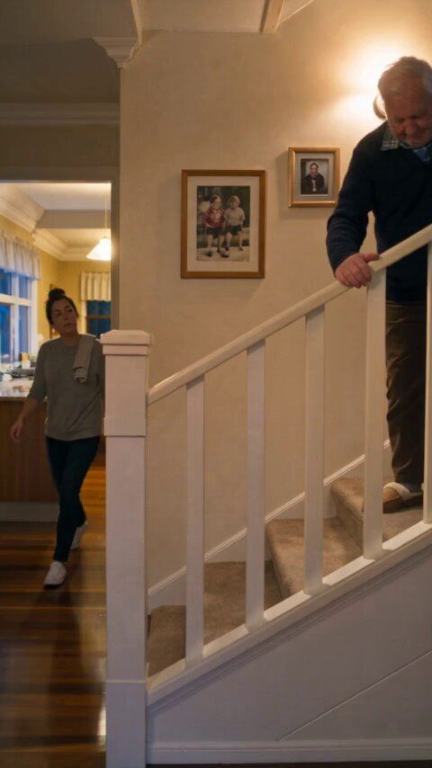

# 105 · Short AI revenge-drama ad (25-60 s: betrayal open, fast cuts, twist, product is how she gets even)

<!-- HERO:START -->
[](EXAMPLE.md)

**[See the example and how to make it →](EXAMPLE.md)** · [watch on X](https://x.com/0xROAS/status/2107188290264740348)
<!-- HERO:END -->


> **LC priority P1** · evidence: Medium-High (many live ads, ecom → apps) · hype risk: Medium · cost $20-150 (AI) per 30 s · 3-6 h

## What it is
The short cousin of F91. A 25-60 second AI-generated (or acted) mini-movie built like a ReelShort clip: **0-3 s betrayal or humiliation** ("my sister-in-law laughed at my jewelry in front of everyone"), **fast cuts every 1-2 s**, a **twist**, and the **product is the reason she wins**. No narrator selling; the product is a plot device. It ends on the satisfying payoff, not a cliffhanger (that is F106).

## Why it works
- Micro-drama viewers (ReelShort, DramaBox) are already trained on betrayal → twist → revenge; boomers and women 35+ binge it and rarely notice it is AI (@david_attisaas).
- It is entertainment first, so CPMs drop and people stay (frankyecom: "stop interrupting the show, make the ad the show").
- 25 s keeps the product inside the retention window; F91 long melodramas lose 90-95% before the product (@TheIvanKreimer).
- Revenge gives the product an emotional job, not just a feature.

## Shot-by-shot (LC version)

| Time / slot | Visual | Audio / copy |
|---|---|---|
| 0-2s | Engagement party, close-up: SIL flicks bride-to-be's necklace | SIL: "Cute. Did it come with the cake?" (laughter) |
| 2-5s | Bride's face, humiliated; fast push-in | Music sting |
| 5-9s | Flash: SIL at the pool, her 'designer' bracelet turning her wrist green | Text: "3 weeks later" |
| 9-14s | Bride swims laps wearing her LC necklace; surfaces, still bright gold | — |
| 14-20s | SIL at the bachelorette, hiding her wrist; bride: "Oh, mine? I shower in it." | — |
| 20-25s | Product beat: hands-only LC box, '14K PVD · waterproof' | "Any 7 for $85" |
| 25-28s | SIL quietly searching "louise carter" on her phone | Payoff laugh |

## Hooks (swap-in openers)
- "She laughed at my necklace at my engagement party."
- "My mother-in-law said real women wear real gold."
- "He bought her the expensive one. She got the one that lasted."
- "The bridesmaid who mocked my jewelry turned green first."

## Real examples from X (studied)
- @david_attisaas: running short drama ads for several apps; ecom has been on "25-second AI mini-movies that open on a betrayal, cut fast, land a twist, and make the product the reason someone gets revenge" since May; dropshippers only keep budget on formats that sell; ReelShort users watch more minutes a day than Netflix users ([post](https://x.com/david_attisaas/status/2108195582607081720)).
- @0xROAS: 100% AI drama ad in Seedance 2.5: very aggressive hook, a plot twist, revenge, multiple cuts per video ([post](https://x.com/0xROAS/status/2107188290264740348)).
- @ViralOps_: Koriderm (skincare) is "crushing" with drama ads; never show the product in the first 3 s; build the story around the problem, then make it worse before the product ([post](https://x.com/ViralOps_/status/2108255353016406383)).
- @zedmadeit: the hook is a problem causing an immediate failure at the worst possible moment when something personal is at stake ([post](https://x.com/zedmadeit/status/2102176819709673703)).
- @frankyecom: women want shows; make the ad the show ([post](https://x.com/frankyecom/status/2106833649970684195)).

## Production recipe
1. **Story (Claude):** pick a humiliation moment tied to LC's real problem (green neck, tarnish, cheap-looking jewelry at an event). 6-8 beats, 25-30 s, 2-3 characters.
2. **Character lock:** generate each character once (GPT Image / Nano Banana), keep a reference sheet; same outfit per scene.
3. **Shots:** 12-16 clips of 1.5-2.5 s in Seedance 2.5 / Kling / Veo, 9:16; or Arcads' short-drama template.
4. **Dialogue + lip-sync:** max 8 words per line; ElevenLabs voices; Arcads/HeyGen lip-sync for close-ups.
5. **Product shots must be real** LC footage (no AI-rendered jewelry), cut in for the payoff.
6. **Edit:** cut every 1-2 s, music stings on reveals, burned-in captions; export 25-30 s and a 45-60 s version.

## Bot prompt (copy into the creative agent)
```
Write 5 short revenge-drama ad scripts (25-30 s, 12-16 shots) for Louise Carter. Structure: 0-2 s humiliation/betrayal tied to jewelry (green neck, 'cheap' comment, tarnish at a big event); 2-15 s escalation with fast cuts; twist where the LC piece survives water/sweat and the antagonist's doesn't; 20-25 s real product beat (any 7 for $85); 25-30 s payoff. Give each shot: duration, camera, action, dialogue (≤8 words), on-screen text, and a Seedance prompt. Mark AI disclosure. Never name a competitor.
```

## 3 LC scripts
- A · "She laughed at my necklace at my engagement party" → pool twist → bachelorette payoff → any 7 for $85.
- B · "My mother-in-law said real women wear real gold" → beach vacation → MIL's chain tarnishes, LC still bright → MIL asks for one.
- C · "He bought his new girlfriend the expensive one" → her bracelet turns green at the wedding → ours survives the ocean.

## Variants to test
- Length 25 s vs 45 s vs 60 s
- AI vs acted
- Antagonist (SIL vs MIL vs ex)
- Product reveal time (15 s vs 20 s)

## Omni test plan
- **Budget/structure:** 3 scripts × 2 lengths in one ABO test, $50/day each for 5 days
- **Primary KPIs:** 3 s hook rate, hold to product beat, CTR, CPA; Omni new-customer % on `utm_content=F105-*`
- **Kill rule:** CPA > 1.5× account average after 2× target CPA spend
- **Scale rule:** clone the winner across personas (F97) and lengths
- **Naming:** `utm_content=F105-<story>-<length>`

## Compliance
Baseline: [_COMPLIANCE.md](../_COMPLIANCE.md) (no fake testimonials, AI disclosure, no bulk/spoofed accounts, copy structure not assets, PDP-only claims).
- AI characters must be disclosed where the platform requires (Meta AI label; TikTok AIGC label).
- Never imply a real person or a real competitor; no defamatory 'their product is fake' lines.
- Product footage and claims must be real (PDP facts only).

## Related
- Strategies: 32-drama-show-ads-hidden-storyline, 37-ai-realism-craft, 36-owned-winner-video-remix
- Formats: [91-ai-melodrama-mini-movie](../91-ai-melodrama-mini-movie/README.md), [08-drama-show-micro-series](../08-drama-show-micro-series/README.md), [42-ai-object-head-micro-drama](../42-ai-object-head-micro-drama/README.md), [106-cliffhanger-cut-drama-ad](../106-cliffhanger-cut-drama-ad/README.md)
