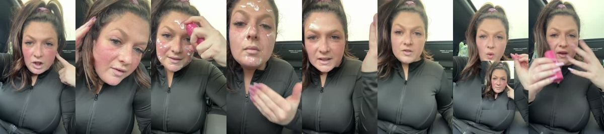
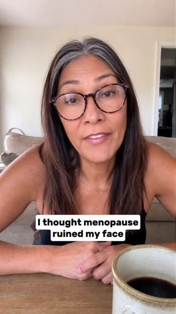
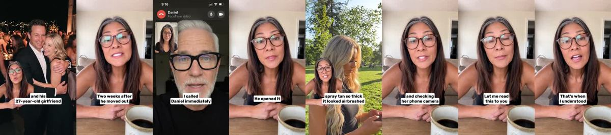
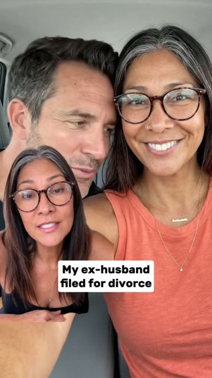
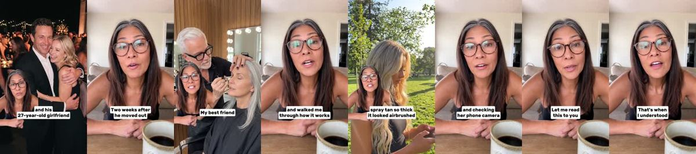
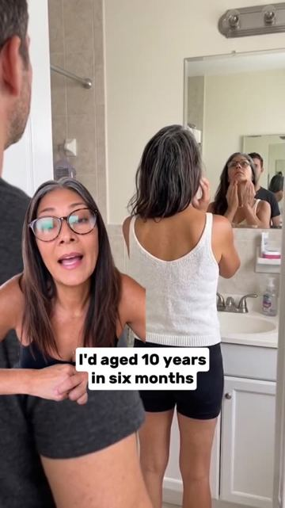
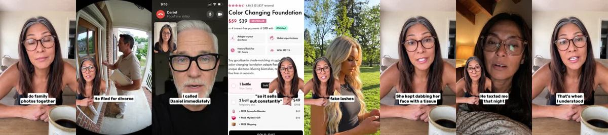

# Meta ad-library examples for F105

<!-- WAVE6 -->
## Wave 6: Resilia & Smooche live Meta ads (Oct 2026)

Pulled from the public Meta Ad Library on 2026-10-09 (Resilia: aged garlic, Ceylon cinnamon, oil of oregano; Smooche: color-changing foundation, Reverse Time peptide serum). Days live are counted to 2026-10-09; most video ads were new tests that week, while the long runners are statics and catalog templates. Transcripts are automatic. Brand claims are the advertisers', not verified, and many are health claims we would never make. The **Do not copy** line flags deceptive tactics (persona "publication" pages, undisclosed AI actors and "experts", fake stock counts).

### Smooche · Smooche: “I'm about to walk into brunch to meet my girlfriend that I was with to…” (41 days live)

- **Ad:** [Meta Ad Library #1038179568995397](https://www.facebook.com/ads/library/?id=1038179568995397) · video 1:33 · page “Smooche” · started 2026-08-28 · 1 copies · lands on `smooche.com/products/ccf2`
- **What happens:** Opens: “I'm about to walk into brunch to meet my girlfriend that I was with to figure out who tried to draw a ying yang on my forehead and guess what? I just saw my ex- boyfriend of 15 years and it's perfect…”
- **Why it works:** The same betrayal openers as the long dramas ("My husband slept with my sister. I was four months pregnant.") cut down to 1-3 minutes. The first line does all the work.
- **How to make one:** Open on the betrayal sentence over a face close-up, add 3-5 fast scenes, and put the product in the transformation beat. Test 3 openers on the same body.
- **Do not copy:** These are AI-acted first-person stories posted from fake narrator pages. Label fiction as fiction.
- **LC remake:** "My sister borrowed my necklace and never gave it back. So I bought seven." (LC any-7 bundle as the punchline.)

Transcript (auto, first ~70 s)

> I'm about to walk into brunch to meet my girlfriend that I was with to figure out who tried to draw a ying yang on my forehead and guess what? I just saw my ex- boyfriend of 15 years and it's perfect only I have with me is my smooch color changing foundation and we're going to see if this can take care of me because this will be horrible if I have to see them looking like this so this goes on white it almost looks like moistur but it is actually a serum that benefit your skin it does have a definite but it blends in and color matches with your pH to make it your this is like a freaking filter for my face where's my lip gloss? alright, get some of that trying and fix this hair this is amazing look at this look at that that is so good so good okay get this you will not regret it so good

### Smooche · Smooche: “Okay, this is a good one. Emergency because I just pulled up to the…” (37 days live)

- **Ad:** [Meta Ad Library #2102781623653815](https://www.facebook.com/ads/library/?id=2102781623653815) · video 1:48 · page “Smooche” · started 2026-09-01 · 1 copies · lands on `smooche.com/products/ccf2`
- **What happens:** Opens: “Okay, this is a good one. Emergency because I just pulled up to the gym.”
- **Why it works:** The same betrayal openers as the long dramas ("My husband slept with my sister. I was four months pregnant.") cut down to 1-3 minutes. The first line does all the work.
- **How to make one:** Open on the betrayal sentence over a face close-up, add 3-5 fast scenes, and put the product in the transformation beat. Test 3 openers on the same body.
- **Do not copy:** These are AI-acted first-person stories posted from fake narrator pages. Label fiction as fiction.
- **LC remake:** "My sister borrowed my necklace and never gave it back. So I bought seven." (LC any-7 bundle as the punchline.)

Transcript (auto, first ~70 s)

> Okay, this is a good one. Emergency because I just pulled up to the gym. Decided to finally take a look at my face and realized I left without makeup on. Knowing that I'm going to see my husband's girlfriend inside. And the only freaking thing I have here now is this color changing foundation. Are you seeing my face? Like I'm red before I even get to working out. I just I cannot go in there looking like this. So let's see if this will cover everything. The only other thing that I keep on me is like a lip gloss. So this has to work and it can't look too crazy. Stuff is so posted just like just all right. That's working pretty good there. I know it has like skin care in here as well. That's why I put it in my car to be going with and SPF. That is crazy like it doesn't even know if it's winter or it's summer. It's just that one shade because that's pretty good. My freckles are still a showing through though. So it looks like

### Smooche · Cosmetic Times: “I thought menopause ruined my face. My ex has been used it as his…” (36 days live)

- **Ad:** [Meta Ad Library #1046608914669307](https://www.facebook.com/ads/library/?id=1046608914669307) · video 3:35 · page “Cosmetic Times” · started 2026-09-02 · 1 copies · lands on `smooche.com/pages/bestfoundation`
- **What happens:** Opens: “I thought menopause ruined my face. My ex has been used it as his excuse to leave me.”
- **Why it works:** The same betrayal openers as the long dramas ("My husband slept with my sister. I was four months pregnant.") cut down to 1-3 minutes. The first line does all the work.
- **How to make one:** Open on the betrayal sentence over a face close-up, add 3-5 fast scenes, and put the product in the transformation beat. Test 3 openers on the same body.
- **Do not copy:** These are AI-acted first-person stories posted from fake narrator pages. Label fiction as fiction.
- **LC remake:** "My sister borrowed my necklace and never gave it back. So I bought seven." (LC any-7 bundle as the punchline.)

Transcript (auto, first ~70 s)

> I thought menopause ruined my face. My ex has been used it as his excuse to leave me. He told our daughter he couldn't be attracted to someone whose face looked that ruined and ugly. Last month my daughter made us do family photos together. Me, him, and his 27-year-old girlfriend. Once menopause hit and my skin changed, everything changed. He started comparing me to other women. His co-workers wives, women at the gym, random people at restaurants. He told me, Sarah's your age and her skin doesn't look like that. She have taken care of herself. He told me I'd aged 10 years in six months. By our last anniversary dinner, he wasn't even pretending anymore. He said being seen with me He filed for divorce three weeks later. Two weeks after he moved out, my daughter called me crying. She said, Mom, I need to tell you something. He'd been sleeping with her since last spring. While we were still together. Yeah. Six months later, my daughter asked me to do family photos. Professional shoot. She said, I need you there, Mom, please. And I said yes, for her. The morning The morning of the shoot, I got a text. By the way, Dad's bringing his girlfriend to the photos. I stared at my my phone. His girlfriend. In my family photos. I called Daniel immediately. My best, friend, a makeup artist who's pulled me out of the fire, more times than I can count. Daniel showed up in 20 minutes. He took one look at me and said absolutely not. Oxidize, turn orange, or cake up on you. You're going to look flawless. The shoot was at Park. July. 5pm. Golden Hour Lighting. 98 degrees. His girlfriend showed u

### Smooche · Cosmetic Times: “My ex has been filed for divorce eight months after my menopause…” (36 days live)

- **Ad:** [Meta Ad Library #1087458693745926](https://www.facebook.com/ads/library/?id=1087458693745926) · video 3:34 · page “Cosmetic Times” · started 2026-09-02 · 1 copies · lands on `smooche.com/pages/bestfoundation`
- **What happens:** Opens: “My ex has been filed for divorce eight months after my menopause started. He told our daughter he couldn't be attracted to someone whose face looked that ruined and ugly.”
- **Why it works:** The same betrayal openers as the long dramas ("My husband slept with my sister. I was four months pregnant.") cut down to 1-3 minutes. The first line does all the work.
- **How to make one:** Open on the betrayal sentence over a face close-up, add 3-5 fast scenes, and put the product in the transformation beat. Test 3 openers on the same body.
- **Do not copy:** These are AI-acted first-person stories posted from fake narrator pages. Label fiction as fiction.
- **LC remake:** "My sister borrowed my necklace and never gave it back. So I bought seven." (LC any-7 bundle as the punchline.)

Transcript (auto, first ~70 s)

> My ex has been filed for divorce eight months after my menopause started. He told our daughter he couldn't be attracted to someone whose face looked that ruined and ugly. Last month my daughter made us do family photos together. His 27-year-old girlfriend. Once menopause hit and my skin changed, everything changed. He started comparing me to other women. His co-workers wives, women at the gym, random people at restaurants. He told me Sarah's your age and her skin doesn't look like that. She actually takes care of herself. He told me I'd aged 10 years in six months. By our last anniversary dinner, he wasn't even pretending anymore. He said, being with me in public was humiliating. He fought for divorce, and she was a bit more of a liar. Two weeks after he moved, she said, she said, Mom, I'm not sure if I'm going to say something. He had been sleeping with her since last spring. While we were still together. Yeah. Six months later, my daughter asked me to do family photos. Pro-fessional shoot. She said, I need you, Mom, please. And I said, yes, for her. Only top artists in Korea had access to it. Now it's public, but they make small batches. So it sells out constantly. He opened it and walked me through how from it works. It uses Centella Aziatica. Korean plant extract that absorbs deep deep into your skin, triggers collagen production, and adap to your exact tone instantly. The shoot was at a park. July 5PM, GOLDEN HOUR LIGHTING, 98 Degrees. His girlfriend showed up looking exactly how I pictured. Blonde extensions, fake lashes, spray tan, so thick it looked airbrushed. You 

### Smooche · Cosmetic Times: “My ex has been told me I'd aged 10 years in six months. And for a…” (36 days live)

- **Ad:** [Meta Ad Library #2412557319519918](https://www.facebook.com/ads/library/?id=2412557319519918) · video 3:37 · page “Cosmetic Times” · started 2026-09-02 · 1 copies · lands on `smooche.com/pages/bestfoundation`
- **What happens:** Opens: “My ex has been told me I'd aged 10 years in six months. And for a while, I actually believed him.”
- **Why it works:** The same betrayal openers as the long dramas ("My husband slept with my sister. I was four months pregnant.") cut down to 1-3 minutes. The first line does all the work.
- **How to make one:** Open on the betrayal sentence over a face close-up, add 3-5 fast scenes, and put the product in the transformation beat. Test 3 openers on the same body.
- **Do not copy:** These are AI-acted first-person stories posted from fake narrator pages. Label fiction as fiction.
- **LC remake:** "My sister borrowed my necklace and never gave it back. So I bought seven." (LC any-7 bundle as the punchline.)

Transcript (auto, first ~70 s)

> My ex has been told me I'd aged 10 years in six months. And for a while, I actually believed him. He told our daughter he couldn't be attracted to someone whose face looked that ruined and ugly. Last month, my daughter made us do family photos together. Me, him, and his 27-year-old girlfriend. Once menopause hit and my skin changed, everything changed. He started comparing me to other women. His co-workers wives, women at the gym, random people at restaurants. He told me Sarah's your age and her skin doesn't look like that. Two weeks after he moved out, my daughter called me crying, she said, mom, I need to tell you something. He'd been sleeping with her since last spring. While we were still together. Yeah, six months later, my daughter asked me to do family photos. Professional shoot. She said, I need you there, mom.

<!-- /WAVE6 -->

