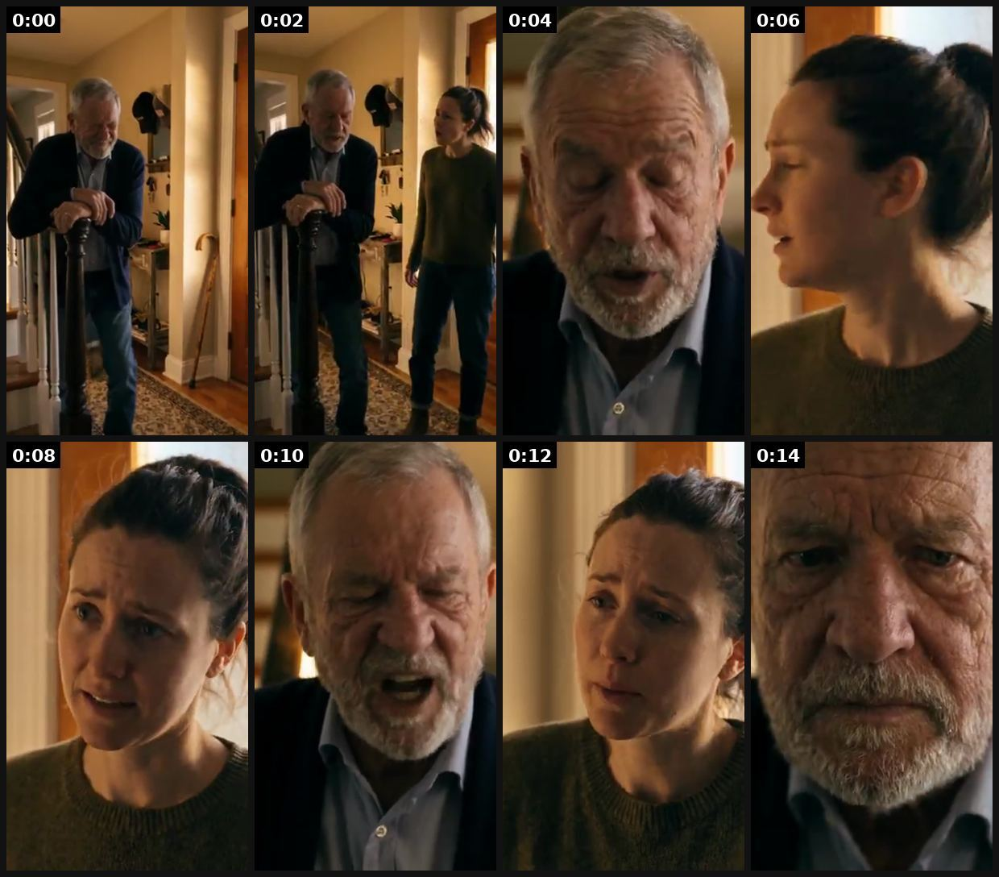
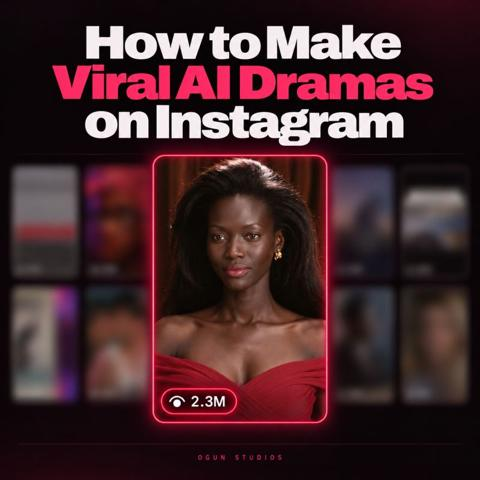

# 106 · Cliffhanger-cut drama ad (stops at the peak; \"part 2\" / full episode lives on the PDP, app or profile): see it, then make it

[](https://x.com/Ecombos_Ai/status/2108240933435400432)

**The example:** [@Ecombos_Ai on X](https://x.com/Ecombos_Ai/status/2108240933435400432) · 0:15 video · 147 likes, 8K views

**Watch it:** [open the post on X](https://x.com/Ecombos_Ai/status/2108240933435400432) · [play the video file](https://video.twimg.com/amplify_video/2108240889856610304/vid/avc1/320x568/wgO2mE4ORkj5ElKQ.mp4?tag=16)

> **How close is this example?** Close: AI drama clips built from a cliffhanger-hook system; the Part 2 landing is not shown. The gallery below has more examples.

> AI drama ads are the next BIG thing printing for brands right now. They don't look like ads. They play like a drama episode, and people stay to see how it ends. Both clips below were made from one Claude chat. Took the team hours to put the full drama ad system together. 8 tools inside one MASTER file: → Claude Skill File (paste once, runs the whole drama ad) → Drama Story Engine → Cliffhanger Hook Library → Characte…

## What you are seeing

An AI drama clip, 15 seconds. An elderly father leans on the banister, and his daughter walks in with a cane visible by the door. "Dad, why didn't you call me?" "Because you'd look at me like that." "The wedding's in six weeks, Dad." "I'm not using the cane. Not there." "Then who's walking me down the aisle?" It cuts on his face with no resolution. That cut is the cliffhanger that makes people watch Part 2 or click through. A second clip in the post uses the same system.

## Beat by beat

The storyboard above samples the video every 0:01. Lines are the transcript for that stretch; on-screen text comes from OCR, so treat it as rough.

| Frame | Time | On screen | Said / sung |
|---|---|---|---|
| 1 | 0:00–0:01 | · | · |
| 2 | 0:01–0:03 | · | Dad, why didn't you call me? |
| 3 | 0:03–0:05 | · | Because you'd look at me like that. |
| 4 | 0:05–0:07 | · | · |
| 5 | 0:07–0:09 | · | The wedding's in six weeks, Dad. |
| 6 | 0:09–0:11 | · | I'm not using the cane. Not there. |
| 7 | 0:11–0:13 | · | Then who's walking me down the aisle? |
| 8 | 0:13–0:15 | ray yt As AN | · |

<details><summary>Full transcript (timestamped)</summary>

- `0:00` Dad, why didn't you call me?
- `0:04` Because you'd look at me like that.
- `0:06` The wedding's in six weeks, Dad.
- `0:08` I'm not using the cane. Not there.
- `0:11` Then who's walking me down the aisle?

</details>

## More real examples (5)

Other posts that show this format, or a close cousin of it. Click a thumbnail to open it on X.

| | | |
|---|---|---|
| [](https://x.com/Olumide_gbenro/status/2103922292640149628)<br>**@Olumide_gbenro** · image · 193 views<br>We just got 2.3M views on an AI drama in 24 hours. Here’s the secret to how we did it. → Find viral winners. Remix them your way. I found a similar st | [](https://x.com/AmyBasirStudio/status/2105707431368269892)<br>**@AmyBasirStudio** · 1:02 video · 87 views<br>DRAGON BRIDE — Episode 1 Bound by an ancient royal pact, a princess is sent to a remote mountaintop altar to marry a mysterious creature. What awaits | [](https://x.com/AdamKPx/status/2108191928923881782)<br>**@AdamKPx** · 0:30 video · 280 views<br>AI Drama Ads are crushing it right now. And Arcads makes them ridiculously easy to create. People don’t want to watch ads. They want stories. Characte |
| [](https://x.com/TheIvanKreimer/status/2107808445508321597)<br>**@TheIvanKreimer** · 2:57 video · 63 views<br>Smooche AI melodrama: ID-photo clerk scene, product at 1:54; retention: 90-95% drop before product. Try only if short DR saturated. | [](https://x.com/SmartEye_ADSpy/status/2087810501686481034)<br>**@SmartEye_ADSpy** · image · 137 views<br>Top 3 Contribute Over 40% of Market Revenue \| Maiya's NetShort Cracks the Top 3 In H1 2026, the Top 20 Chinese micro drama apps in global markets gene |   |

## How to make one like it

**The format in one line:** The ad is **Episode 1 cut at the peak**: the shove, the slap, the necklace falling into the pool, the text that says "I know what you did". A title card says *"Part 2 → link"* or *"Watch how it ends"*, and the click lands where the ending lives (a PDP with the ending video on top, the TikTok profile, or an advertorial). It borrows the micro-drama app paywall: you pay with a click instead of coins.

**Why it works:** - Open loops are the strongest retention tool in short video; the ending becomes the reason to click. - Clicks come from curiosity, so the landing page must pay off the story first, then sell. - Episodes can be sequenced in retargeting (Ep1 cold → Ep2 to 50% viewers → Ep3 with offer). - Caution: it trains clicks, not purchases; judge on Omni revenue, not CTR.

**Contents:** [1. Structure](#1-copy-the-structure) · [2. Shot by shot](#2-shot-by-shot-remake) · [3. Script and hooks](#3-write-the-script) · [4. Prompts](#4-prompts) · [5. Tools and settings](#5-tools-and-settings) · [6. Louise Carter remake](#6-louise-carter-remake) · [7. Variants and test](#7-variants-and-test-plan) · [8. Pitfalls](#8-pitfalls)

### 1. Copy the structure

Use the example's timing as your beat sheet. Keep the beat, change the words and the product.

| Beat | Time | In the example | Your version |
|---|---|---|---|
| 1 | 0:00 | Dad, why didn't you call me? | … |
| 2 | 0:02 | Dad, why didn't you call me? Because you'd look at me like that. | … |
| 3 | 0:04 | Dad, why didn't you call me? Because you'd look at me like that. | … |
| 4 | 0:06 | Because you'd look at me like that. The wedding's in six weeks, Dad. | … |
| 5 | 0:08 | The wedding's in six weeks, Dad. I'm not using the cane. Not there. | … |
| 6 | 0:10 | The wedding's in six weeks, Dad. I'm not using the cane. Not there. Then who's walking me down the aisle? | … |
| 7 | 0:12 | I'm not using the cane. Not there. Then who's walking me down the aisle? | … |
| 8 | 0:14 | Then who's walking me down the aisle? | … |

### 2. Shot-by-shot remake

**Target length / size:** Ep1 12-20s (cold ad) + Ep2 12-15s (landing/retargeting) + Ep3 10s offer

| # | Time / slot | What we see (visual + camera) | Dialogue / on-screen text |
|---|---|---|---|
| 1 | Ep1 0-2s | Wedding pool party; cousin bumps the bride on purpose | Text: "She did it on purpose." |
| 2 | Ep1 2-6s | Slow-motion splash, bride goes in wearing the necklace | Music swell |
| 3 | Ep1 6-10s | Cousin smirks at the edge | "Hope that wasn't real gold." |
| 4 | Ep1 10-12s | Underwater glint of gold; freeze frame | "Part 2 →" |
| 5 | Ep2 0-6s | She surfaces, necklace bright (real LC footage) | Guests: "...it's fine?" |
| 6 | Ep2 6-12s | Cousin's own bracelet dull; product beat | "14K PVD · any 7 for $85" |

<details><summary>Playbook shot list (Louise Carter version from the README)</summary>

| Time / slot | Visual | Audio / copy |
|---|---|---|
| 0-2s | Wedding pool party; bride's cousin 'accidentally' bumps her | Text: "She did it on purpose." |
| 2-6s | Slow motion: necklace snaps off? (no, she goes in wearing it) splash | Music swells |
| 6-10s | Cousin smirks: "Hope that wasn't real gold." | — |
| 10-12s | Underwater: a glint of gold; freeze frame | "Part 2 →" |
| Landing (Ep2, 15 s) | She surfaces, necklace bright; cousin's own bracelet dull; product beat | "14K PVD · any 7 for $85" |

</details>

### 3. Write the script

Open with one of these hooks (first 1–3 seconds, or the headline on a static):

- "She pushed me in the pool on purpose."
- "I wasn't supposed to see that text."
- "My MIL swapped my wedding necklace."
- "Episode 1: the bridesmaid who hated me"

Then fill the beats from the table above. Pull the wording from real customer reviews, not from ad copy: a review line beats a copywriter line almost every time. Read every line out loud and cut anything you would not say to a friend. Ready-made Louise Carter scripts are in section 6; hand [BOT.md](BOT.md) to any AI agent to write versions for another brand.

### 4. Prompts

**Season outline (Claude)**

```text
Write a 3-episode cliffhanger arc for Louise Carter. Ep1 freezes at peak tension (≤20s), Ep2 resolves with a real water/sweat moment (≤15s), Ep3 is an offer close (≤10s). Include the one-line opener for the landing page that resolves Ep1.
```

**Landing page**

```text
Top of PDP/advertorial: Ep2 autoplay muted, 9:16 in a 4:5 frame, captions burned in, then the bundle picker (F86).
```

**Full creative-agent prompt (from the playbook):**

```
Write a 3-episode cliffhanger drama for Louise Carter (12-20 s each). Ep1 ends on a freeze frame at peak tension; Ep2 pays it off with a real LC water/sweat moment; Ep3 is an offer close (any 7 for $85). For each shot: duration, action, dialogue ≤8 words, on-screen text, AI prompt. Add landing-page copy that opens by resolving Ep1 in one line.
```

### 5. Tools and settings

1. Write the full story (3 episodes, 12-20 s each) before shooting; the product must sit in the ending.
2. Produce as F105 (character lock, 1.5-2.5 s shots, real product footage).
3. **Ep1** = cold ad, ends on a freeze frame + "Part 2" card.
4. **Landing:** PDP or advertorial with Ep2 autoplaying muted at the top, then the offer; or the TikTok profile pinned post.
5. **Retarget:** 50% Ep1 viewers get Ep2 as an ad; Ep3 = offer close (F99).

| Setting | Value |
|---|---|
| Canvas | 1080×1920 (9:16) master; crop a 1080×1350 (4:5) cut for feed placements |
| Frame rate | 30 fps (shoot 60 fps for slow-motion water or sparkle shots) |
| Camera | Phone main lens at 1x, exposure locked on skin, HDR off, grid on; tripod or a phone clamp for product shots |
| Light | One soft key at 45° (window or ring light), white card as fill; side light for metal sparkle |
| Audio | Lavalier or phone 15–20 cm from the mouth; mix voice at -14 LUFS, music at -28 to -30 dB under voice |
| Captions | Burned in, 2–5 words per line, 64–80 px bold sans, white with a black stroke or pill; keep text inside the safe zone (top 220 px and bottom 420 px clear, 64 px side margins) |
| Pacing | A visual change every 1.5–3 s; the hook lands in the first 1.5 s with no logo intro |
| Edit / export | CapCut or Premiere; H.264, 12–20 Mbps, AAC 320 kbps; upload natively to each platform, not via links |

### 6. Louise Carter remake

- A · "She pushed me in the pool on purpose" → freeze underwater → Part 2 on PDP: still gold.
- B · "My MIL swapped my wedding necklace" → reveal at the altar → Part 2: the LC one survived the beach ceremony.
- C · "Episode 1: the bridesmaid who hated me" → series with Ep3 = bridesmaid gift sets.

Brand rules, claims you can and cannot make, and more scripts: [brands/louise-carter.md](brands/louise-carter.md). Step-by-step from idea to scale: [STAGES.md](STAGES.md).

### 7. Variants and test plan

- Cliffhanger vs full payoff (F105)
- Landing: PDP-with-video vs advertorial vs profile
- Episode length

**Test plan:** - **Budget/structure:** Ep1 vs F105 full-payoff version, $50/day each, 5 days; Ep2 retargeting to 50% viewers - **Primary KPIs:** CTR, landing video play rate, CPA, Omni new-customer revenue on `utm_content=F106-*` - **Kill rule:** CTR up but CPA > F105 by 30% - **Scale rule:** add episodes; turn into an organic series (F08) - **Naming:** `utm_content=F106-<story>-ep<n>`

**Naming:** `F106-<variant>-<hook##>-<date>` so results map back to this folder. Change one thing per test (hook, narrator, length or offer), never two.

### 8. Pitfalls

- The click must get the ending immediately; making people hunt for Part 2 burns trust.
- Judge on CPA and Omni revenue, not CTR.
- Don't stretch to 5 episodes before Ep1 proves itself.
- Slow open: if the first 1.5 s does not show the hook visually, most people swipe.
- Logo or brand intro at the start reads as an ad; put the brand at the end.
- Captions covered by the platform UI: check the safe zone on a real phone before posting.
- Music over the voice: keep music at least 14 dB under speech.

**Compliance:** Baseline: [_COMPLIANCE.md](../../_COMPLIANCE.md) (no fake testimonials, AI disclosure, no bulk/spoofed accounts, copy structure not assets, PDP-only claims). - The landing page must deliver the promised ending; no bait-and-switch. - AI disclosure as in F105; no real people or competitors. - No violence or humiliation that breaks platform ad policies (keep it soap-opera, not abuse).

## More examples

Every post we found for this format, with transcripts: [examples/](examples/README.md). Playbook: [README.md](README.md). Agent brief: [BOT.md](BOT.md).
