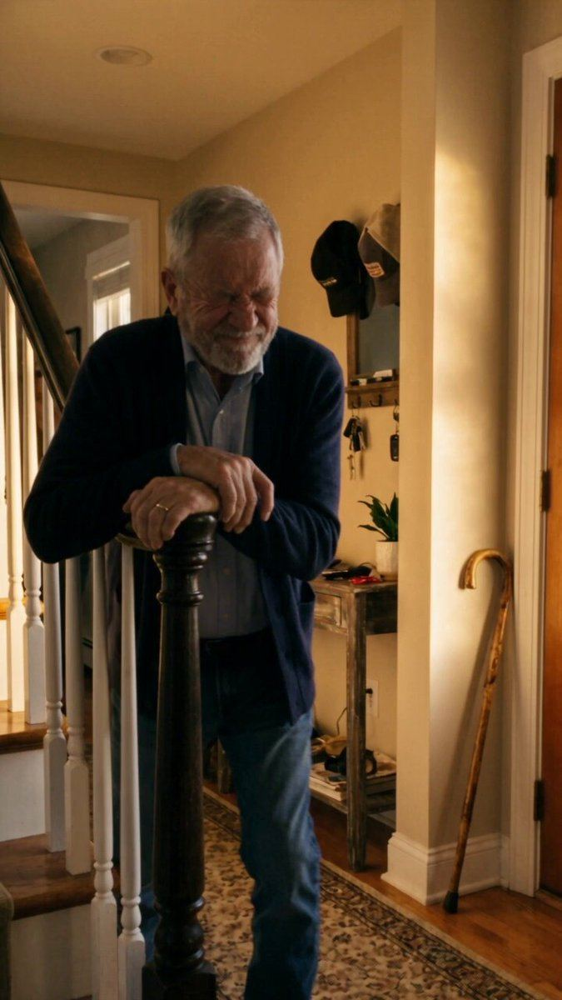

# 106 · Cliffhanger-cut drama ad (stops at the peak; "part 2" / full episode lives on the PDP, app or profile)

<!-- HERO:START -->
[](EXAMPLE.md)

**[See the example and how to make it →](EXAMPLE.md)** · [watch on X](https://x.com/Ecombos_Ai/status/2108240933435400432)
<!-- HERO:END -->


> **LC priority P2** · evidence: Medium (copied from drama apps; few public ROAS numbers) · hype risk: Medium-High · cost $20-150 per episode (AI) · 3-6 h

## What it is
The ad is **Episode 1 cut at the peak**: the shove, the slap, the necklace falling into the pool, the text that says "I know what you did". A title card says *"Part 2 → link"* or *"Watch how it ends"*, and the click lands where the ending lives (a PDP with the ending video on top, the TikTok profile, or an advertorial). It borrows the micro-drama app paywall: you pay with a click instead of coins.

## Why it works
- Open loops are the strongest retention tool in short video; the ending becomes the reason to click.
- Clicks come from curiosity, so the landing page must pay off the story first, then sell.
- Episodes can be sequenced in retargeting (Ep1 cold → Ep2 to 50% viewers → Ep3 with offer).
- Caution: it trains clicks, not purchases; judge on Omni revenue, not CTR.

## Shot-by-shot (LC version)

| Time / slot | Visual | Audio / copy |
|---|---|---|
| 0-2s | Wedding pool party; bride's cousin 'accidentally' bumps her | Text: "She did it on purpose." |
| 2-6s | Slow motion: necklace snaps off? (no, she goes in wearing it) splash | Music swells |
| 6-10s | Cousin smirks: "Hope that wasn't real gold." | — |
| 10-12s | Underwater: a glint of gold; freeze frame | "Part 2 →" |
| Landing (Ep2, 15 s) | She surfaces, necklace bright; cousin's own bracelet dull; product beat | "14K PVD · any 7 for $85" |

## Hooks (swap-in openers)
- "She pushed me in the pool on purpose."
- "I wasn't supposed to see that text."
- "My MIL swapped my wedding necklace."
- "Episode 1: the bridesmaid who hated me"

## Real examples from X (studied)
- @Ecombos_Ai: "AI drama ads… play like a drama episode, and people stay to see how it ends"; system includes a Drama Story Engine, a Cliffhanger Hook Library, character/set lock and shot prompts ([post](https://x.com/Ecombos_Ai/status/2108240933435400432)).
- @Olumide_gbenro: 2.3M views on an AI drama in 24 h by remixing a viral winner around a new lead ([post](https://x.com/Olumide_gbenro/status/2103922292640149628)).
- @SmartEye_ADSpy: top 20 micro-drama apps grossed $976M+ in IAP in H1 2026: the cliffhanger is the paywall ([post](https://x.com/SmartEye_ADSpy/status/2087810501686481034)).
- @TheIvanKreimer (caution): retention curves on long AI melodramas show 90-95% drop before the product ([post](https://x.com/TheIvanKreimer/status/2107808445508321597)).

## Production recipe
1. Write the full story (3 episodes, 12-20 s each) before shooting; the product must sit in the ending.
2. Produce as F105 (character lock, 1.5-2.5 s shots, real product footage).
3. **Ep1** = cold ad, ends on a freeze frame + "Part 2" card.
4. **Landing:** PDP or advertorial with Ep2 autoplaying muted at the top, then the offer; or the TikTok profile pinned post.
5. **Retarget:** 50% Ep1 viewers get Ep2 as an ad; Ep3 = offer close (F99).

## Bot prompt (copy into the creative agent)
```
Write a 3-episode cliffhanger drama for Louise Carter (12-20 s each). Ep1 ends on a freeze frame at peak tension; Ep2 pays it off with a real LC water/sweat moment; Ep3 is an offer close (any 7 for $85). For each shot: duration, action, dialogue ≤8 words, on-screen text, AI prompt. Add landing-page copy that opens by resolving Ep1 in one line.
```

## 3 LC scripts
- A · "She pushed me in the pool on purpose" → freeze underwater → Part 2 on PDP: still gold.
- B · "My MIL swapped my wedding necklace" → reveal at the altar → Part 2: the LC one survived the beach ceremony.
- C · "Episode 1: the bridesmaid who hated me" → series with Ep3 = bridesmaid gift sets.

## Variants to test
- Cliffhanger vs full payoff (F105)
- Landing: PDP-with-video vs advertorial vs profile
- Episode length

## Omni test plan
- **Budget/structure:** Ep1 vs F105 full-payoff version, $50/day each, 5 days; Ep2 retargeting to 50% viewers
- **Primary KPIs:** CTR, landing video play rate, CPA, Omni new-customer revenue on `utm_content=F106-*`
- **Kill rule:** CTR up but CPA > F105 by 30%
- **Scale rule:** add episodes; turn into an organic series (F08)
- **Naming:** `utm_content=F106-<story>-ep<n>`

## Compliance
Baseline: [_COMPLIANCE.md](../_COMPLIANCE.md) (no fake testimonials, AI disclosure, no bulk/spoofed accounts, copy structure not assets, PDP-only claims).
- The landing page must deliver the promised ending; no bait-and-switch.
- AI disclosure as in F105; no real people or competitors.
- No violence or humiliation that breaks platform ad policies (keep it soap-opera, not abuse).

## Related
- Strategies: 32-drama-show-ads-hidden-storyline, 22-serialized-chat-story-slideshows, 35-mass-awareness-placement-to-advertorial
- Formats: [08-drama-show-micro-series](../08-drama-show-micro-series/README.md), [91-ai-melodrama-mini-movie](../91-ai-melodrama-mini-movie/README.md), [105-short-ai-revenge-drama-ad](../105-short-ai-revenge-drama-ad/README.md), [81-fiction-serial-native](../81-fiction-serial-native/README.md)
