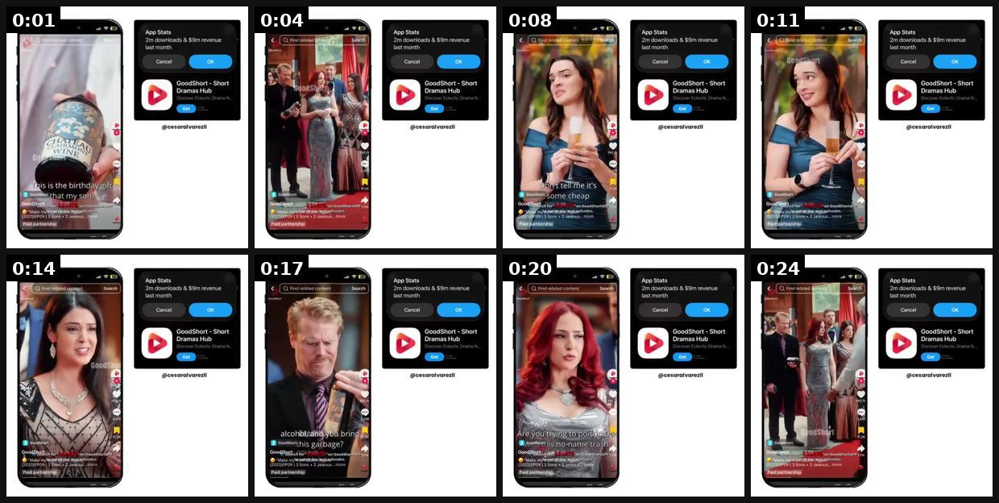
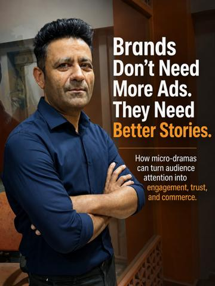
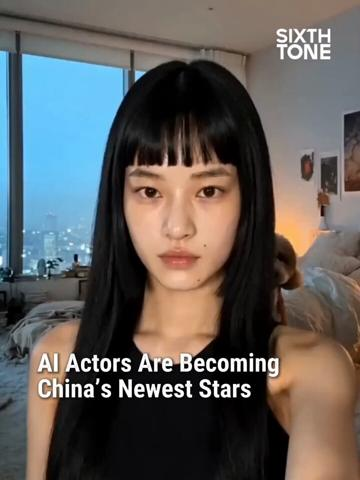
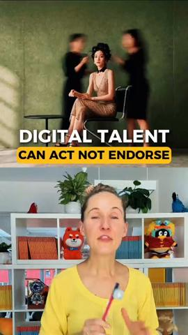

# 107 · Product placement inside short-drama channels (brand written into a micro-drama that already has the audience): see it, then make it

[](https://x.com/cesaralvarezll/status/2108488444414394811)

**The example:** [@cesaralvarezll on X](https://x.com/cesaralvarezll/status/2108488444414394811) · 0:25 video · 4 likes, 447 views

**Watch it:** [open the post on X](https://x.com/cesaralvarezll/status/2108488444414394811) · [play the video file](https://video.twimg.com/amplify_video/2108488418560823297/vid/avc1/540x540/ohlwtO9nGp6j3jG_.mp4?tag=29)

> **How close is this example?** Exact: a GoodShort 'Paid partnership' drama with a wine brand written into the plot. The gallery below has more examples.

> This app is making $9M/month with short drama videos. Their videos get millions of views across social media, driving massive organic traffic to the app. But here's the genius part: They also use those same viral videos to promote products from other brands. So they're not just acquiring users for free, they're monetizing the content itself. Brilliant strategy 😭 And now you can create this type of short drama content…

## What you are seeing

A GoodShort clip shown in a phone frame next to the App Store overlay "App Stats: 2m downloads & $9m revenue last month" (GoodShort - Short Dramas Hub). In the drama, at a red-carpet party, a woman sneers at a birthday gift bottle of wine: "What brand is this... don't tell me it's some cheap knockoff... Are you trying to poison Dad with this no-name trash?" The clip is marked "Paid partnership". The wine brand is placed inside the plot as the "no-name" gift that will be vindicated. That is the drama-app sponsored placement: the brand pays to be the plot device.

## Beat by beat

The storyboard above samples the video every 0:03. Lines are the transcript for that stretch; on-screen text comes from OCR, so treat it as rough.

| Frame | Time | On screen | Said / sung |
|---|---|---|---|
| 1 | 0:00–0:03 | App Stats 2m downloads $9m revenue last month Cancel oK Short Dramas Hub Get fi NE ae is the BS bat my sony OT on coe Pr Make om 2025 Sons Jealous. Paid partner | This is the birthday gift that my son Alex has prepared for his grandfather |
| 2 | 0:03–0:06 | App Stats Find related, Search 2m downloads $9m revenue last month Cancel oK se Short Dramas Hub rods Get nd Sy 2k BB Good 78. Pai a | · |
| 3 | 0:06–0:09 | App Stats Find 2m downloads $9m revenue last month Cancel oK Short Dramas Hub Get it's Some ch Go tor 28 one RR al 4202 Paid partnership | What brand is this and never even heard of it don't tell me it's some cheap knockoff from a street vendor |
| 4 | 0:09–0:12 | · | · |
| 5 | 0:12–0:16 | App Stats 2m downloads $9m revenue Find content Search last month Cancel OK Short Dramas Hub Get 00 268 2K SS tom a my One RR ren APP Sons Paid partnership | Emma, what's the meaning of this? You know dad loves his alcohol and you bringing this garbage |
| 6 | 0:16–0:19 | App Stats Find relate content ch 2m downloads $9m revenue last month Cancel oK Short Dramas Hub Get his garbage? er fer 528 G00 od ryan mee Paid partnership | · |
| 7 | 0:19–0:22 | · | Are you trying to poison dad with this no-name trash? |
| 8 | 0:22–0:25 | App Stats Find related Search 2m downloads $9m last month Cancel oK eT Short Dramas Hub a Get 4s BD Sal | · |

<details><summary>Full transcript (timestamped)</summary>

- `0:00` This is the birthday gift that my son Alex has prepared for his grandfather
- `0:05` What brand is this and never even heard of it don't tell me it's some cheap knockoff from a street vendor
- `0:12` Emma, what's the meaning of this? You know dad loves his alcohol and you bringing this garbage
- `0:18` Are you trying to poison dad with this no-name trash?

</details>

## More real examples (3)

Other posts that show this format, or a close cousin of it. Click a thumbnail to open it on X.

| | | |
|---|---|---|
| [](https://x.com/MogiOTTSolution/status/2066387745732465148)<br>**@MogiOTTSolution** · image · 8 views<br>Brands don't need more ads. They need better stories. 🎬 Lacto Calamine generated 10M organic views in 5 days through a micro-drama. 🎬 Crocs achieved 1 | [](https://x.com/SixthTone/status/2082027321490329688)<br>**@SixthTone** · 0:30 video · 15K views<br>AI-generated stars are attracting real fans. After the AI micro-drama “The Laid-Off Girl” surpassed 200 million views, its female lead launched a Douy | [](https://x.com/AshleyDudarenok/status/2095338838394654999)<br>**@AshleyDudarenok** · 1:31 video · 229 views<br>She has NO eyes, but sold contact lenses. AI micro-drama star Fang Taozi accrued 400k followers in a month, out-charging human influencers with millio |

## How to make one like it

**The format in one line:** Instead of making a drama ad, the brand **buys its way into a drama that already has millions of viewers**: a short-drama channel or app (or an AI micro-drama creator) writes the product into an episode (the necklace is the heirloom, the ring is the clue, the skincare is the glow-up), then the brand whitelists that episode as a Spark/Partnership ad. The drama app gets paid twice: users for free fr

**Why it works:** - The audience is pre-built and already watching for the story; the product rides the plot. - Placement inside entertainment avoids the 'ad' pattern women skip (frankyecom). - Whitelisting the episode gives paid reach with the creator's handle and social proof. - Drama characters build parasocial trust (an AI micro-drama star gained 370K followers after a 200M-view series).

**Contents:** [1. Structure](#1-copy-the-structure) · [2. Shot by shot](#2-shot-by-shot-remake) · [3. Script and hooks](#3-write-the-script) · [4. Prompts](#4-prompts) · [5. Tools and settings](#5-tools-and-settings) · [6. Louise Carter remake](#6-louise-carter-remake) · [7. Variants and test](#7-variants-and-test-plan) · [8. Pitfalls](#8-pitfalls)

### 1. Copy the structure

Use the example's timing as your beat sheet. Keep the beat, change the words and the product.

| Beat | Time | In the example | Your version |
|---|---|---|---|
| 1 | 0:01 | This is the birthday gift that my son Alex has prepared for his grandfather | … |
| 2 | 0:04 | on screen: App Stats Find related, Search 2m downloads $9m revenue last month Cancel oK se Short Dramas Hub rods Get nd Sy 2k BB Go | … |
| 3 | 0:08 | What brand is this and never even heard of it don't tell me it's some cheap knockoff from a street vendor | … |
| 4 | 0:11 | What brand is this and never even heard of it don't tell me it's some cheap knockoff from a street vendor | … |
| 5 | 0:14 | Emma, what's the meaning of this? You know dad loves his alcohol and you bringing this garbage | … |
| 6 | 0:17 | Emma, what's the meaning of this? You know dad loves his alcohol and you bringing this garbage Are you trying to poison dad with this no-nam | … |
| 7 | 0:20 | Are you trying to poison dad with this no-name trash? | … |
| 8 | 0:24 | on screen: App Stats Find related Search 2m downloads $9m last month Cancel oK eT Short Dramas Hub a Get 4s BD Sal | … |

### 2. Shot-by-shot remake

**Target length / size:** Sponsored episode in the channel's native length (60s-3 min) + a 30s whitelisted cut

| # | Time / slot | What we see (visual + camera) | Dialogue / on-screen text |
|---|---|---|---|
| 1 | Setup | Lead touches her necklace when nervous (establish the habit in the first scene) | — |
| 2 | Conflict | Antagonist line about the necklace | "That thing will be green by the wedding." |
| 3 | Proof scene | Rain / pool / tears; necklace visibly fine | — |
| 4 | Hero close-up | 1-2s macro of clasp/pendant, real product | On-screen tag: "Louise Carter · 14K PVD" |
| 5 | Sponsored end card | Paid-partnership label + shop link (whitelisted version) | "Her necklace: any 7 for $85" |

<details><summary>Playbook shot list (Louise Carter version from the README)</summary>

| Time / slot | Visual | Audio / copy |
|---|---|---|
| Episode beat 1 | Lead touches her necklace when nervous (established habit) | — |
| Beat 2 | Antagonist: "That cheap thing will turn green by the wedding." | — |
| Beat 3 | Rain / pool / tears scene; necklace visibly fine | — |
| Beat 4 | Close-up of the clasp/branding for 1 s | On-screen tag: "Louise Carter, 14K PVD" |
| End card (sponsored version only) | Paid-partnership label + shop link | "Her necklace: any 7 for $85" |

</details>

### 3. Write the script

Open with one of these hooks (first 1–3 seconds, or the headline on a static):

- (The channel's own hook; don't rewrite it)
- "Episode 12: the necklace she never takes off"
- "Her mother's necklace is the only clue…"

Then fill the beats from the table above. Pull the wording from real customer reviews, not from ad copy: a review line beats a copywriter line almost every time. Read every line out loud and cut anything you would not say to a friend. Ready-made Louise Carter scripts are in section 6; hand [BOT.md](BOT.md) to any AI agent to write versions for another brand.

### 4. Prompts

**Channel shortlist**

```text
Search TikTok and YouTube for "micro drama", "short drama", "AI drama" with women 25-55 audiences; log avg views (last 10 posts), comment quality, audience geo, posting cadence, and whether they already do brand integrations.
```

**Outreach DM (draft only; send after approval)**

```text
Draft: "Love [series]. We're Louise Carter (waterproof 14K PVD jewelry). Would you write our necklace into an upcoming episode as the lead's never-take-it-off piece? Flat fee + 30-day whitelisting + affiliate code. Can share a 1-page brief."
```

**Full creative-agent prompt (from the playbook):**

```
Write a sponsorship brief for a micro-drama channel to integrate Louise Carter into one episode. Include: the plot role options (heirloom, clue, habit, glow-up), the one required close-up, allowed facts {{PDP_FACTS}}, banned claims, disclosure requirements, whitelisting terms, and 3 example scene beats in the channel's style.
```

### 5. Tools and settings

1. **Find channels:** search TikTok/YouTube for 'micro drama', 'short drama', 'AI drama' channels with women 25-55 audiences; check average views, comments and audience geo.
2. **Brief:** product role in the plot (habit, heirloom, clue), one hero close-up (1-2 s), facts allowed (PDP only), no competitor jabs.
3. **Deal:** flat fee + whitelisting rights (30-60 days) + optional affiliate code.
4. **Launch:** creator posts organically with a paid-partnership label; LC runs the episode as Spark/Partnership ads to lookalikes.
5. **Measure** with a unique code + UTM per channel.

| Setting | Value |
|---|---|
| Canvas | 1080×1920 (9:16) master; crop a 1080×1350 (4:5) cut for feed placements |
| Frame rate | 30 fps (shoot 60 fps for slow-motion water or sparkle shots) |
| Camera | Phone main lens at 1x, exposure locked on skin, HDR off, grid on; tripod or a phone clamp for product shots |
| Light | One soft key at 45° (window or ring light), white card as fill; side light for metal sparkle |
| Audio | Lavalier or phone 15–20 cm from the mouth; mix voice at -14 LUFS, music at -28 to -30 dB under voice |
| Captions | Burned in, 2–5 words per line, 64–80 px bold sans, white with a black stroke or pill; keep text inside the safe zone (top 220 px and bottom 420 px clear, 64 px side margins) |
| Pacing | A visual change every 1.5–3 s; the hook lands in the first 1.5 s with no logo intro |
| Edit / export | CapCut or Premiere; H.264, 12–20 Mbps, AAC 320 kbps; upload natively to each platform, not via links |

### 6. Louise Carter remake

- A · Heirloom: the lead's 'mother's necklace' survives every storm scene; sponsored end card.
- B · Clue: the ring left at the scene is the only piece that didn't tarnish; detective-style drama.
- C · Glow-up: the lead's makeover episode ends on her LC stack; creator code in comments.

Brand rules, claims you can and cannot make, and more scripts: [brands/louise-carter.md](brands/louise-carter.md). Step-by-step from idea to scale: [STAGES.md](STAGES.md).

### 7. Variants and test plan

- Flat fee vs affiliate
- Organic only vs whitelisted
- Integration depth (prop vs plot point)

**Test plan:** - **Budget/structure:** 2 channels × 1 episode each; whitelist the better one at $50/day for 7 days - **Primary KPIs:** Code redemptions, CPM/CPA of the whitelisted episode vs F105, Omni revenue on `utm_content=F107-*` - **Kill rule:** whitelisted CPA > F105 CPA by 30% - **Scale rule:** recurring placement deal with the winning channel - **Naming:** `utm_content=F107-<channel>-<episode>`

**Naming:** `F107-<variant>-<hook##>-<date>` so results map back to this folder. Change one thing per test (hook, narrator, length or offer), never two.

### 8. Pitfalls

- Get whitelisting rights in writing before paying.
- Approve the script for claims; creators improvise.
- Paid-partnership label on every post.
- Slow open: if the first 1.5 s does not show the hook visually, most people swipe.
- Logo or brand intro at the start reads as an ad; put the brand at the end.
- Captions covered by the platform UI: check the safe zone on a real phone before posting.
- Music over the voice: keep music at least 14 dB under speech.

**Compliance:** Baseline: [_COMPLIANCE.md](../../_COMPLIANCE.md) (no fake testimonials, AI disclosure, no bulk/spoofed accounts, copy structure not assets, PDP-only claims). - Paid partnership label required on the organic post (FTC / platform rules); creators must disclose. - AI characters disclosed per platform rules. - Approve the script for claims before production; PDP facts only.

## More examples

Every post we found for this format, with transcripts: [examples/](examples/README.md). Playbook: [README.md](README.md). Agent brief: [BOT.md](BOT.md).
