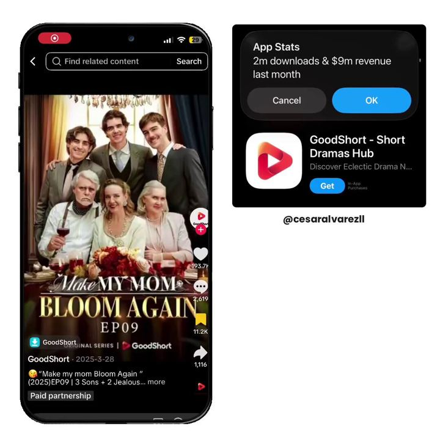

# 107 · Product placement inside short-drama channels (brand written into a micro-drama that already has the audience)

<!-- HERO:START -->
[](EXAMPLE.md)

**[See the example and how to make it →](EXAMPLE.md)** · [watch on X](https://x.com/cesaralvarezll/status/2108488444414394811)
<!-- HERO:END -->


> **LC priority P2** · evidence: Medium (several brands, few public ROAS numbers) · hype risk: Medium · cost $500-10,000 per placement · 1-3 weeks lead time

## What it is
Instead of making a drama ad, the brand **buys its way into a drama that already has millions of viewers**: a short-drama channel or app (or an AI micro-drama creator) writes the product into an episode (the necklace is the heirloom, the ring is the clue, the skincare is the glow-up), then the brand whitelists that episode as a Spark/Partnership ad. The drama app gets paid twice: users for free from viral clips, and brands for placement.

**The verified example (hero).** The @cesaralvarezll post shows a **GoodShort (Short Dramas Hub)** clip next to an App Store overlay: "2m downloads & $9m revenue last month". The clip is labelled **"Paid partnership"**. At a red-carpet party, a woman mocks a birthday gift bottle of wine: "What brand is this... don't tell me it's some cheap knockoff... Are you trying to poison Dad with this no-name trash?" The sponsor's product is written in as the *underdog object*. The villain insults it, and the story is built so that it gets vindicated later. That is the template for LC: the product is not shown being praised, it is shown being *underestimated*. The dupe angle ("it's not the $90 brand... is it?") fits this perfectly.

## Why it works
- The audience is pre-built and already watching for the story; the product rides the plot.
- Placement inside entertainment avoids the 'ad' pattern women skip (frankyecom).
- Whitelisting the episode gives paid reach with the creator's handle and social proof.
- Drama characters build parasocial trust (an AI micro-drama star gained 370K followers after a 200M-view series).

## Shot-by-shot (LC version)

| Time / slot | Visual | Audio / copy |
|---|---|---|
| Episode beat 1 | Lead touches her necklace when nervous (established habit) | — |
| Beat 2 | Antagonist: "That cheap thing will turn green by the wedding." | — |
| Beat 3 | Rain / pool / tears scene; necklace visibly fine | — |
| Beat 4 | Close-up of the clasp/branding for 1 s | On-screen tag: "Louise Carter, 14K PVD" |
| End card (sponsored version only) | Paid-partnership label + shop link | "Her necklace: any 7 for $85" |

## Hooks (swap-in openers)
- (The channel's own hook; don't rewrite it)
- "Episode 12: the necklace she never takes off"
- "Her mother's necklace is the only clue…"

## Real examples from X (studied)
- @cesaralvarezll: "This app is making $9M/month with short drama videos… they also use those same viral videos to promote products from other brands. So they're not just acquiring users for free, they're monetizing the content itself" ([post](https://x.com/cesaralvarezll/status/2108488444414394811)).
- @MogiOTTSolution: Lacto Calamine 10M organic views in 5 days through a micro-drama; Crocs 10M+ with story-led content ([post](https://x.com/MogiOTTSolution/status/2066387745732465148)).
- @Storyboard18_: Meta x KukuTV micro-drama playbook: 65% of viewers exposed in the past year, 3.5 h/week ([post](https://x.com/Storyboard18_/status/2105194685224702410)).
- @AshleyDudarenok: AI micro-drama star Fang Taozi: 400K followers in a month, sold contact lenses ([post](https://x.com/AshleyDudarenok/status/2095338838394654999)).

## Production recipe
1. **Find channels:** search TikTok/YouTube for 'micro drama', 'short drama', 'AI drama' channels with women 25-55 audiences; check average views, comments and audience geo.
2. **Brief:** product role in the plot (habit, heirloom, clue), one hero close-up (1-2 s), facts allowed (PDP only), no competitor jabs.
3. **Deal:** flat fee + whitelisting rights (30-60 days) + optional affiliate code.
4. **Launch:** creator posts organically with a paid-partnership label; LC runs the episode as Spark/Partnership ads to lookalikes.
5. **Measure** with a unique code + UTM per channel.

## Bot prompt (copy into the creative agent)
```
Write a sponsorship brief for a micro-drama channel to integrate Louise Carter into one episode. Include: the plot role options (heirloom, clue, habit, glow-up), the one required close-up, allowed facts {{PDP_FACTS}}, banned claims, disclosure requirements, whitelisting terms, and 3 example scene beats in the channel's style.
```

## 3 LC scripts
- A · Heirloom: the lead's 'mother's necklace' survives every storm scene; sponsored end card.
- B · Clue: the ring left at the scene is the only piece that didn't tarnish; detective-style drama.
- C · Glow-up: the lead's makeover episode ends on her LC stack; creator code in comments.

## Variants to test
- Flat fee vs affiliate
- Organic only vs whitelisted
- Integration depth (prop vs plot point)

## Omni test plan
- **Budget/structure:** 2 channels × 1 episode each; whitelist the better one at $50/day for 7 days
- **Primary KPIs:** Code redemptions, CPM/CPA of the whitelisted episode vs F105, Omni revenue on `utm_content=F107-*`
- **Kill rule:** whitelisted CPA > F105 CPA by 30%
- **Scale rule:** recurring placement deal with the winning channel
- **Naming:** `utm_content=F107-<channel>-<episode>`

## Compliance
Baseline: [_COMPLIANCE.md](../../_COMPLIANCE.md) (no fake testimonials, AI disclosure, no bulk/spoofed accounts, copy structure not assets, PDP-only claims).
- Paid partnership label required on the organic post (FTC / platform rules); creators must disclose.
- AI characters disclosed per platform rules.
- Approve the script for claims before production; PDP facts only.

## Related
- Strategies: 32-drama-show-ads-hidden-storyline, 09-influencer-rev-share, 39-creator-campaign-marketplaces
- Formats: [08-drama-show-micro-series](../../08-drama-show-micro-series/README.md), [91-ai-melodrama-mini-movie](../../91-ai-melodrama-mini-movie/README.md), [19-tiktok-shop-affiliate-shoppable-demo](../../19-tiktok-shop-affiliate-shoppable-demo/README.md), [105-short-ai-revenge-drama-ad](../../105-short-ai-revenge-drama-ad/README.md)
