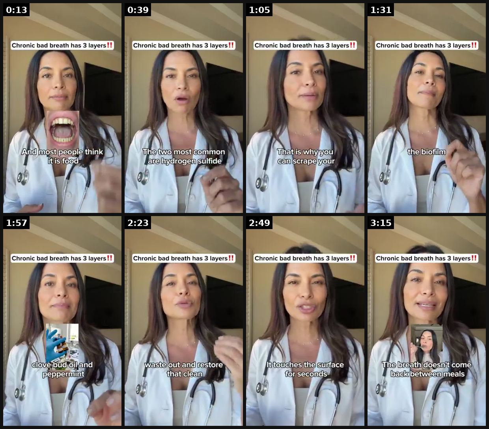

# 108 · AI doctor avatar explainer (white-coat presenter breaks a problem into 'layers', product is the fix for the layer nobody treats): see it, then make it

[](https://x.com/FedotOff90/status/2106401392374186396)

**The example:** [@FedotOff90 on X](https://x.com/FedotOff90/status/2106401392374186396) · 3:28 video · 103 likes, 8K views

**Watch it:** [open the post on X](https://x.com/FedotOff90/status/2106401392374186396) · [play the video file](https://video.twimg.com/amplify_video/2106400932410150912/vid/avc1/320x568/TyfIAquKBQAHBDxG.mp4?tag=29)

> **How close is this example?** Exact: a white-coat AI-style doctor explainer with the "3 layers" structure (bad-breath product). The gallery below has more examples.

> There are 5 AI ad formats actually scaling right now: 1. AI podcast 2. AI UGC 3. AI doctor avatar 4. AI listicle 5. AI animation (claymation, CGI) An AI podcast ad hit 280 days live when I pulled it. Longest-running ad in my entire formats swipe. Not UGC. Not a founder. A fake podcast. Full breakdown of the one printing hardest. No comment or follow needed. https://rural-lifeboat-196.notion.site/3addb9d7074d8137bd78e…

## What you are seeing

A 3:28 vertical explainer. A woman in a white coat with a stethoscope sits in a warm home-office set under a fixed top headline: "Chronic bad breath has 3 layers‼️". Word-by-word captions sit mid-frame, and small picture-in-picture inserts pop up for each layer (a tongue close-up, a gloved hand with a scraper, a dropper bottle). Script: "If you want your tongue to look like this, you are only seeing the first layer… Layer one, that white coating… most people think it is food residue… it is biofilm. Layer two, the bacteria underneath… producing volatile sulfur compounds… hydrogen sulfide and methyl mercaptan. Layer three, and this is what most people never find out…" The product (clove bud oil + peppermint) is the fix for layer 3. Fedotoff posted it as an example of the "AI doctor avatar", one of 5 AI formats scaling now.

## Beat by beat

The storyboard above samples the video every 0:26. Lines are the transcript for that stretch; on-screen text comes from OCR, so treat it as rough.

| Frame | Time | On screen | Said / sung |
|---|---|---|---|
| 1 | 0:00–0:26 | Chronic bad breath has layers! a Vi ep people think food fi | All right if you want your tongue to look like this you are only seeing the first layer of the problem and let me show you what is underneath. Okay so layer one that white coating that is what you can see and most people think it is food residue or dead cells it is not it is biofilm a slimy protecti |
| 2 | 0:26–0:52 | · | the bacteria underneath this is what your scraper never reaches underneath that biofilm colonies of bacteria are alive anchor to your tongue feeding on food particles and producing volatile sulfur compounds as waste the two most common are hydrogen sulfide and methyl marcaptan the first one smells l |
| 3 | 0:52–1:18 | · | not the coating itself the gas that is being produced under it layer three and this is what most people never find out these same bacteria don't just live on your tongue they live throughout your throat and your upper gut that is why you can scrape your tongue perfectly clean and still have breath t |
| 4 | 1:18–1:44 | Chronic bad breath has layers ay hi | to break through the biofilm kill the bacteria underneath and rebalance the environment all the way from your tongue throughout your throat and to your gut to get rid of layer one the biofilm take chlorophyllin it's a plant-based derived compound that doesn't scrape the surface like your tongue scra |
| 5 | 1:44–2:10 | Chronic bad breath has layers!! ff love peppermint | sulfur compounds on contact that white coating isn't being scraped off and rebuilt by lunch it is being broken down at the structural level to get rid of layer two the bacteria producing the gas that's clove bud oil and peppermint once chlorophyllin breaks the biofilm open these natural antibacteria |
| 6 | 2:10–2:36 | Chronic bad breath has layers restore vr ag | of the day and for layer three the throat and gut where the deepest bacteria live that is green tea parsley and lemon bomb green tea and parsley flush the sulfur waste out and restore that clean fresh feeling from the inside out and lemon bomb consy inflammation in your throat and gut that allows th |
| 7 | 2:36–3:02 | Chronic bad breath has layers! a as touches te rr | few hours so the good news is that you don't have to find all of these yourself in different places they are all inside whisper this is an herbal gel and the gel format is what makes it work a mouthwash switches and spits it touches the surface for seconds a pill bypasses your mouth entirely this ge |
| 8 | 3:02–3:28 | Chronic bad breath has cas met’, iF it come | starts clearing the white coating things within two to three weeks layer two is under control the sour morning taste fades and by week three or four layer three catches up the breath doesn't come back between meals between conversations between brushings because all three layers are finally dealt wi |

<details><summary>Full transcript (timestamped)</summary>

- `0:00` All right if you want your tongue to look like this you are only seeing the first layer of the
- `0:05` problem and let me show you what is underneath. Okay so layer one that white coating that is
- `0:11` what you can see and most people think it is food residue or dead cells it is not it is biofilm
- `0:17` a slimy protective layer that bacteria build around themselves in order to survive layer two
- `0:23` the bacteria underneath this is what your scraper never reaches underneath that biofilm colonies
- `0:29` of bacteria are alive anchor to your tongue feeding on food particles and producing volatile sulfur
- `0:36` compounds as waste the two most common are hydrogen sulfide and methyl marcaptan the first one smells
- `0:44` like rotten eggs and the other one smells like something decomposing that's your bad breath
- `0:49` not the coating itself the gas that is being produced under it layer three and this is what
- `0:56` most people never find out these same bacteria don't just live on your tongue they live throughout
- `1:02` your throat and your upper gut that is why you can scrape your tongue perfectly clean and still have
- `1:08` breath that smells the source is deeper than anything on the surface so if you actually want
- `1:14` the white coating gone and the breath fixed you cannot just scrape the first layer you have
- `1:20` to break through the biofilm kill the bacteria underneath and rebalance the environment all the
- `1:26` way from your tongue throughout your throat and to your gut to get rid of layer one the biofilm
- `1:32` take chlorophyllin it's a plant-based derived compound that doesn't scrape the surface like
- `1:37` your tongue scraper does it actually dissolves the biofilm layer itself and neutralizes the
- `1:43` sulfur compounds on contact that white coating isn't being scraped off and rebuilt by lunch
- `1:49` it is being broken down at the structural level to get rid of layer two the bacteria producing
- `1:55` the gas that's clove bud oil and peppermint once chlorophyllin breaks the biofilm open these natural
- `2:01` antibacterials kill the bacteria that were hiding underneath the ones your scraper was
- `2:06` sliding right over the ones producing hydrogen sulfide and methyl more captain every second
- `2:12` of the day and for layer three the throat and gut where the deepest bacteria live that is green
- `2:17` tea parsley and lemon bomb green tea and parsley flush the sulfur waste out and restore that clean
- `2:24` fresh feeling from the inside out and lemon bomb consy inflammation in your throat and gut that
- `2:29` allows the biofilm to rebuild so that the cycle actually breaks instead of restarting every
- `2:35` few hours so the good news is that you don't have to find all of these yourself in different
- `2:41` places they are all inside whisper this is an herbal gel and the gel format is what makes
- `2:46` it work a mouthwash switches and spits it touches the surface for seconds a pill bypasses
- `2:52` your mouth entirely this gel coats your mouth your throat and your upper gut all three layers
- `2:57` and stays in contact with your tissues four hours two scoops a day within a week layer one
- `3:03` starts clearing the white coating things within two to three weeks layer two is under control
- `3:09` the sour morning taste fades and by week three or four layer three catches up the breath
- `3:15` doesn't come back between meals between conversations between brushings because all three layers are
- `3:22` finally dealt with 50 off right now 60 day money back guarantee if it doesn't work you get your money back

</details>

## How to make one like it

**The format in one line:** A single presenter in a white coat (or scrubs) talks straight to camera in a calm clinic or home-office set. The top of the screen has a fixed headline that names the problem and promises structure, for example **"Chronic bad breath has 3 layers‼️"**. Word-by-word captions sit mid-frame. Small picture-in-picture inserts (a mouth close-up, a gloved hand, a dropper bottle) pop up for each "layer". T

**Why it works:** - **Authority without a real doctor's calendar:** the white coat, stethoscope and calm delivery borrow trust, and AI makes it about $5-40 per video instead of $3-5K for an expert shoot (Fedotoff: AI formats are $3-6 per ad in credits versus a studio). - **"It has 3 layers" is a curiosity loop.** The viewer waits for layer 3, and the product sits in layer 3. - **The reframe gives a graceful exit.** "Most people think it's food" tells buyers their past purchases failed because they were aimed at t

**Contents:** [1. Structure](#1-copy-the-structure) · [2. Shot by shot](#2-shot-by-shot-remake) · [3. Script and hooks](#3-write-the-script) · [4. Prompts](#4-prompts) · [5. Tools and settings](#5-tools-and-settings) · [6. Louise Carter remake](#6-louise-carter-remake) · [7. Variants and test](#7-variants-and-test-plan) · [8. Pitfalls](#8-pitfalls)

### 1. Copy the structure

Use the example's timing as your beat sheet. Keep the beat, change the words and the product.

| Beat | Time | In the example | Your version |
|---|---|---|---|
| 1 | 0:13 | All right if you want your tongue to look like this you are only seeing the first layer of the problem and let me show you what is underneat | … |
| 2 | 0:39 | the bacteria underneath this is what your scraper never reaches underneath that biofilm colonies of bacteria are alive anchor to your tongue | … |
| 3 | 1:05 | not the coating itself the gas that is being produced under it layer three and this is what most people never find out these same bacteria d | … |
| 4 | 1:31 | to break through the biofilm kill the bacteria underneath and rebalance the environment all the way from your tongue throughout your throat | … |
| 5 | 1:57 | sulfur compounds on contact that white coating isn't being scraped off and rebuilt by lunch it is being broken down at the structural level | … |
| 6 | 2:23 | of the day and for layer three the throat and gut where the deepest bacteria live that is green tea parsley and lemon bomb green tea and par | … |
| 7 | 2:49 | few hours so the good news is that you don't have to find all of these yourself in different places they are all inside whisper this is an h | … |
| 8 | 3:15 | starts clearing the white coating things within two to three weeks layer two is under control the sour morning taste fades and by week three | … |

### 2. Shot-by-shot remake

**Target length / size:** 60-120s (plus a 3-min long cut), 1080x1920, avatar head-and-shoulders + 1 PiP insert per layer

| # | Time / slot | What we see (visual + camera) | Dialogue / on-screen text |
|---|---|---|---|
| 1 | 0-3s | AI specialist (lab coat, 40s, warm studio). Fixed top headline in a white pill: "Why your necklace turns your neck green: 3 layers‼️" | "If your jewelry turns your skin green, it's not your skin." |
| 2 | 3-15s | PiP top-right: real green-neck close-up (UGC, with permission). Word-by-word captions mid-frame | "Layer one is what everyone blames: sweat, perfume, sensitive skin." |
| 3 | 15-35s | PiP: macro of worn plating flaking off a brass base (stock or own lab shot) | "Layer two is the real cause: a copper or brass base under plating so thin it wears through in weeks." |
| 4 | 35-60s | PiP: water beading on a PVD-coated piece (REAL LC footage) | "Layer three is the one nobody fixes: the bond. PVD fuses gold to steel. It doesn't rub off." |
| 5 | 60-75s | Full-screen real LC b-roll: shower, pool, sleep | "That's why ours are waterproof. Shower, swim, sleep in them." |
| 6 | 75-90s | Avatar returns, offer card lower third | "Any 7 for $85. Link below." End card 2s |

<details><summary>Playbook shot list (Louise Carter version from the README)</summary>

| Time / slot | Visual | Audio / copy |
|---|---|---|
| 0-3s | AI "jewelry chemist" in a lab coat, a soft-lit studio, fixed headline "Why your necklace turns your neck green: 3 layers‼️" | "If your jewelry turns your skin green, it's not your skin." |
| 3-15s | PiP: green neck close-up | "Layer one is what everyone blames: sweat, perfume, 'sensitive skin'." |
| 15-35s | PiP: macro of worn plating flaking off brass | "Layer two is the real cause: a copper or brass base under plating so thin it wears through in weeks." |
| 35-60s | PiP: water drop beading on a PVD-coated piece | "Layer three is the one nobody fixes: the bond. PVD fuses gold to steel at the molecular level. It doesn't rub off." |
| 60-75s | Real LC product macro on skin, in water, in the shower | "That's why ours are waterproof. Shower, swim, sleep in them." |
| 75-90s | Avatar + LC offer card | "Any 7 for $85. Link below." |

</details>

### 3. Write the script

Open with one of these hooks (first 1–3 seconds, or the headline on a static):

- "[Problem] has 3 layers, and you've only been treating the first one."
- "Doctors don't tell you this about [problem]."
- "If you've tried [3 things], here's why they didn't work."
- "I'm going to explain [problem] in 60 seconds."
- "Stop blaming [common scapegoat]."

Then fill the beats from the table above. Pull the wording from real customer reviews, not from ad copy: a review line beats a copywriter line almost every time. Read every line out loud and cut anything you would not say to a friend. Ready-made Louise Carter scripts are in section 6; hand [BOT.md](BOT.md) to any AI agent to write versions for another brand.

### 4. Prompts

**Script (Claude)**

```text
Write a 90-second explainer for Louise Carter in the "[problem] has 3 layers" structure: layer 1 = what people blame, layer 2 = real cause, layer 3 = what nothing fixes → PVD bond. ≤15 words per sentence, 140 wpm, calm specialist voice. Mark one PiP insert per layer. No medical claims, no credentials.
```

**Avatar (HeyGen / Arcads / Captions)**

```text
Pick 4 "specialist" avatars: woman 35 lab coat, man 55 smart casual, woman 60 cardigan, woman 28 scrubs-free studio. 9:16 head-and-shoulders, neutral warm background, eye-line to lens. Upload the same script to each; export 1080x1920.
```

**Voice (ElevenLabs)**

```text
Stability 50, similarity 75, style 15; "calm, reassuring, slightly slow"; add 0.3s pauses after each "Layer N".
```

**Edit (CapCut)**

```text
Fixed headline pill top 12%; captions word-by-word mid-frame (white, black stroke, 58px); punch-in zoom 105% every 5s; PiP 35% width top-right with 0.2s pop; end card 2s.
```

**Full creative-agent prompt (from the playbook):**

```
Write 4 AI-doctor-avatar explainer scripts (60-120 s) for Louise Carter waterproof PVD jewelry. Structure: fixed headline '[problem] has 3 layers'; layer 1 = what people blame; layer 2 = the real cause; layer 3 = what nothing they tried fixes → LC's PVD bond. One PiP insert per layer (describe it). Calm specialist voice, 140 wpm, ≤15 words per sentence. The presenter is a 'jewelry materials specialist', never a medical doctor, never claims credentials. End with any 7 for $85. Give 3 headline variants and 5 avatar casting notes (age/ethnicity/setting).
```

### 5. Tools and settings

1. **Script (Claude):** problem → "it has N layers" → layer 1 (what they blame) → layer 2 (the real cause) → layer 3 (what nothing touches) → product = layer 3 → proof → offer. 150-450 words.
2. **Avatar:** HeyGen / Arcads / Captions "doctor" or "specialist" avatar in a white coat, 9:16 head-and-shoulders, neutral clinic background. Make 4-10 faces of different ages and ethnicities.
3. **Voice:** ElevenLabs, a calm and slightly slow delivery; 140-150 wpm.
4. **Inserts:** 1 PiP per layer (stock macro, a real product macro); keep the fixed headline at the top the whole time.
5. **Captions:** word-by-word, white with a black stroke, mid-frame.
6. **Edit:** cuts every 4-6 s (zoom punch-ins), an end card with the offer. Export 60 s, 90 s and a long version.

| Setting | Value |
|---|---|
| Canvas | 1080×1920 (9:16) master; crop a 1080×1350 (4:5) cut for feed placements |
| Frame rate | 30 fps (shoot 60 fps for slow-motion water or sparkle shots) |
| Camera | Phone main lens at 1x, exposure locked on skin, HDR off, grid on; tripod or a phone clamp for product shots |
| Light | One soft key at 45° (window or ring light), white card as fill; side light for metal sparkle |
| Audio | Lavalier or phone 15–20 cm from the mouth; mix voice at -14 LUFS, music at -28 to -30 dB under voice |
| Captions | Burned in, 2–5 words per line, 64–80 px bold sans, white with a black stroke or pill; keep text inside the safe zone (top 220 px and bottom 420 px clear, 64 px side margins) |
| Pacing | A visual change every 1.5–3 s; the hook lands in the first 1.5 s with no logo intro |
| Edit / export | CapCut or Premiere; H.264, 12–20 Mbps, AAC 320 kbps; upload natively to each platform, not via links |

### 6. Louise Carter remake

- A · "Why your necklace turns your neck green: 3 layers" (sweat → brass base → PVD bond).
- B · "Why 'waterproof' jewelry still tarnishes: the 3 things nobody tells you" (coating thickness, base metal, sealant).
- C · "A jewelry specialist explains why gold-filled ≠ gold-plated ≠ PVD in 60 seconds."

Brand rules, claims you can and cannot make, and more scripts: [brands/louise-carter.md](brands/louise-carter.md). Step-by-step from idea to scale: [STAGES.md](STAGES.md).

### 7. Variants and test plan

- Avatar age (30s vs 50s vs 60s) and gender
- White coat vs smart casual "specialist"
- 60 s vs 3 min
- Headline "3 layers" vs "3 mistakes" vs "the real reason"

**Test plan:** - **Budget/structure:** 2 scripts × 3 avatars, ABO $50/day each for 4 days - **Primary KPIs:** hold to layer 3 (ThruPlay), CTR, CPA; Omni new-customer % on `utm_content=F108-*` - **Kill rule:** CPA > 1.5× account average after 2× target CPA spend - **Scale rule:** keep the winning script; swap 10 avatar faces (F97) to open new pockets - **Naming:** `utm_content=F108-<script>-<avatar>`

**Naming:** `F108-<variant>-<hook##>-<date>` so results map back to this folder. Change one thing per test (hook, narrator, length or offer), never two.

### 8. Pitfalls

- Never call the avatar "Dr." or give credentials it does not have: deceptive endorsement.
- Disclose AI-generated people (Meta AI info label / TikTok AIGC).
- Keep layer 3 = product; if the product appears before layer 3 the curiosity loop breaks.
- Use real product macros for every LC shot; AI-rendered jewelry looks wrong and breaks trust.
- Health brands: run claims through a banned-words list; structure-function wording only.
- Slow open: if the first 1.5 s does not show the hook visually, most people swipe.
- Logo or brand intro at the start reads as an ad; put the brand at the end.
- Captions covered by the platform UI: check the safe zone on a real phone before posting.
- Music over the voice: keep music at least 14 dB under speech.

**Compliance:** Baseline: [_COMPLIANCE.md](../_COMPLIANCE.md) (no fake testimonials, AI disclosure, no bulk/spoofed accounts, copy structure not assets, PDP-only claims). - **Never present an AI avatar as a real, licensed doctor** ("Dr." titles, "MD", fake credentials). FTC endorsement guides and Meta's health policies treat that as deceptive. Use "specialist" and label the AI. - Health and supplement brands: mechanism claims must match substantiated, structure-function wording. Run copy through a banned-words list before launch. - Label AI-generated people where the platform requires it (Meta AI info, TikTok AIGC).

## Field notes

Newer observations live in the playbook: [Wave 4 update: Fedotoff October 2026 swipe boards](README.md)

## More examples

Every post we found for this format, with transcripts: [examples/](examples/README.md). Playbook: [README.md](README.md). Agent brief: [BOT.md](BOT.md).
