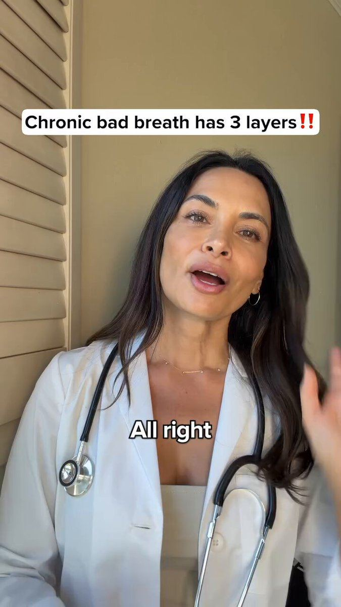

# 108 · AI doctor avatar explainer (white-coat presenter breaks a problem into "layers", product is the fix for the layer nobody treats)

<!-- HERO:START -->
[](EXAMPLE.md)

**[See the example and how to make it →](EXAMPLE.md)** · [watch on X](https://x.com/FedotOff90/status/2106401392374186396)
<!-- HERO:END -->


> **LC priority P2** · evidence: High (one of the 5 AI formats Fedotoff says are scaling; 283-ad board) · hype risk: Medium (authority claims) · cost $5-40 per video · 1-3 h

## What it is
A single presenter in a white coat (or scrubs) talks straight to camera in a calm clinic or home-office set. The top of the screen has a fixed headline that names the problem and promises structure, for example **"Chronic bad breath has 3 layers‼️"**. Word-by-word captions sit mid-frame. Small picture-in-picture inserts (a mouth close-up, a gloved hand, a dropper bottle) pop up for each "layer". The script **reframes the problem**: what most people think it is (layer 1, "food"), what it really is (layer 2, "hydrogen sulfide / biofilm"), and the layer nothing they have tried touches (layer 3). The product is introduced as the only thing that reaches layer 3. The presenter is fully AI-generated (HeyGen / Arcads / Captions avatar) or an AI-cloned real expert. It runs 60 s to 3.5 min.

It differs from F06 (AI UGC talking head: a "customer" sharing an experience) and F15 (retro infomercial expert: a staged TV set). Here the authority is the **lab coat plus the layered mechanism**. Nobody is giving a testimonial.

## Why it works
- **Authority without a real doctor's calendar:** the white coat, stethoscope and calm delivery borrow trust, and AI makes it about $5-40 per video instead of $3-5K for an expert shoot (Fedotoff: AI formats are $3-6 per ad in credits versus a studio).
- **"It has 3 layers" is a curiosity loop.** The viewer waits for layer 3, and the product sits in layer 3.
- **The reframe gives a graceful exit.** "Most people think it's food" tells buyers their past purchases failed because they were aimed at the wrong layer, not because they were stupid (Fedotoff: "sell the reframe, not the relief").
- **Long holds are fine:** a 3:28 explainer keeps watch time because each layer is a mini-payoff.
- **Scales by persona:** the same script can run on 10 different doctor faces (age, ethnicity, gender) to open new Andromeda pockets (see F97).

## Shot-by-shot (LC version)

| Time / slot | Visual | Audio / copy |
|---|---|---|
| 0-3s | AI "jewelry chemist" in a lab coat, a soft-lit studio, fixed headline "Why your necklace turns your neck green: 3 layers‼️" | "If your jewelry turns your skin green, it's not your skin." |
| 3-15s | PiP: green neck close-up | "Layer one is what everyone blames: sweat, perfume, 'sensitive skin'." |
| 15-35s | PiP: macro of worn plating flaking off brass | "Layer two is the real cause: a copper or brass base under plating so thin it wears through in weeks." |
| 35-60s | PiP: water drop beading on a PVD-coated piece | "Layer three is the one nobody fixes: the bond. PVD fuses gold to steel at the molecular level. It doesn't rub off." |
| 60-75s | Real LC product macro on skin, in water, in the shower | "That's why ours are waterproof. Shower, swim, sleep in them." |
| 75-90s | Avatar + LC offer card | "Any 7 for $85. Link below." |

## Hooks (swap-in openers)
- "[Problem] has 3 layers, and you've only been treating the first one."
- "Doctors don't tell you this about [problem]."
- "If you've tried [3 things], here's why they didn't work."
- "I'm going to explain [problem] in 60 seconds."
- "Stop blaming [common scapegoat]."

## Real examples from X and the swipe boards (studied)
- @FedotOff90: "There are 5 AI ad formats actually scaling right now: 1. AI podcast 2. AI UGC 3. AI doctor avatar 4. AI listicle 5. AI animation… An AI podcast ad hit 280 days live." The attached hero is a 3:28 white-coat explainer, "Chronic bad breath has 3 layers", with "most people think it is food", "the two most common are hydrogen sulfide", "the biofilm", "clove bud oil and peppermint" ([post](https://x.com/FedotOff90/status/2106401392374186396)).
- GetHookd board 209142, "AI UGC + Doctor Avatars, Health & Wellness" (283 video ads). The 10-ad public preview shows a clinic presenter in navy scrubs (Khazanay Pakistan, 70 s, 338 days, run twice), a hair-oil UGC (Botanix, 257 d), an elder "doctor exposed" presenter with a dropper bottle (Male Health Tips, 222 d), "Dr. Amina Siddiq, MD" (289 s, 214 d), three Blossom Essentials skin UGCs (210-213 d), and two long Astrid Zeegen talking heads (357-392 s, 208 d).

## Production recipe
1. **Script (Claude):** problem → "it has N layers" → layer 1 (what they blame) → layer 2 (the real cause) → layer 3 (what nothing touches) → product = layer 3 → proof → offer. 150-450 words.
2. **Avatar:** HeyGen / Arcads / Captions "doctor" or "specialist" avatar in a white coat, 9:16 head-and-shoulders, neutral clinic background. Make 4-10 faces of different ages and ethnicities.
3. **Voice:** ElevenLabs, a calm and slightly slow delivery; 140-150 wpm.
4. **Inserts:** 1 PiP per layer (stock macro, a real product macro); keep the fixed headline at the top the whole time.
5. **Captions:** word-by-word, white with a black stroke, mid-frame.
6. **Edit:** cuts every 4-6 s (zoom punch-ins), an end card with the offer. Export 60 s, 90 s and a long version.

## Bot prompt (copy into the creative agent)
```
Write 4 AI-doctor-avatar explainer scripts (60-120 s) for Louise Carter waterproof PVD jewelry. Structure: fixed headline '[problem] has 3 layers'; layer 1 = what people blame; layer 2 = the real cause; layer 3 = what nothing they tried fixes → LC's PVD bond. One PiP insert per layer (describe it). Calm specialist voice, 140 wpm, ≤15 words per sentence. The presenter is a 'jewelry materials specialist', never a medical doctor, never claims credentials. End with any 7 for $85. Give 3 headline variants and 5 avatar casting notes (age/ethnicity/setting).
```

## 3 LC scripts
- A · "Why your necklace turns your neck green: 3 layers" (sweat → brass base → PVD bond).
- B · "Why 'waterproof' jewelry still tarnishes: the 3 things nobody tells you" (coating thickness, base metal, sealant).
- C · "A jewelry specialist explains why gold-filled ≠ gold-plated ≠ PVD in 60 seconds."

## Variants to test
- Avatar age (30s vs 50s vs 60s) and gender
- White coat vs smart casual "specialist"
- 60 s vs 3 min
- Headline "3 layers" vs "3 mistakes" vs "the real reason"

## Omni test plan
- **Budget/structure:** 2 scripts × 3 avatars, ABO $50/day each for 4 days
- **Primary KPIs:** hold to layer 3 (ThruPlay), CTR, CPA; Omni new-customer % on `utm_content=F108-*`
- **Kill rule:** CPA > 1.5× account average after 2× target CPA spend
- **Scale rule:** keep the winning script; swap 10 avatar faces (F97) to open new pockets
- **Naming:** `utm_content=F108-<script>-<avatar>`

## Compliance
Baseline: [_COMPLIANCE.md](../_COMPLIANCE.md) (no fake testimonials, AI disclosure, no bulk/spoofed accounts, copy structure not assets, PDP-only claims).
- **Never present an AI avatar as a real, licensed doctor** ("Dr." titles, "MD", fake credentials). FTC endorsement guides and Meta's health policies treat that as deceptive. Use "specialist" and label the AI.
- Health and supplement brands: mechanism claims must match substantiated, structure-function wording. Run copy through a banned-words list before launch.
- Label AI-generated people where the platform requires it (Meta AI info, TikTok AIGC).

## Related
- Strategies: 37-ai-realism-craft, 10-skit-and-problem-first-ugc-hooks, 36-owned-winner-video-remix
- Formats: [06-ai-ugc-talking-head](../06-ai-ugc-talking-head/README.md), [15-retro-infomercial-expert-authority](../15-retro-infomercial-expert-authority/README.md), [58-educational-care-material-explainer](../58-educational-care-material-explainer/README.md), [13-podcast-style-ad](../13-podcast-style-ad/README.md), [76-whiteboard-explainer](../76-whiteboard-explainer/README.md), [96-result-reveal-expert-stitch](../96-result-reveal-expert-stitch/README.md)
## Wave 4 update: Fedotoff October 2026 swipe boards
- Khazanay Pakistan: Clinic presenter in scrubs (orthopedic shoes), 338 days live (AI UGC + Doctor Avatars board). The scrubs give authority, the reframe ("it's not an injury, it's your shoes") does the selling, and running two near-identical cuts is typical DCO practice.
- Male Health Tips: Elder "ancient remedy" doctor (men's health, gut-blood-flow claim), 222 days live (AI UGC + Doctor Avatars board). The claims are extreme; this is the risky end of the format.
- Dr. Amina Siddiq, MD: "Dr. Amina Siddiq, MD" long explainer (skin), 214 days live (AI UGC + Doctor Avatars board). A long-form "the one thing" reframe that blames the category (moisturizers).
- Astrid Zeegen: 60-year-old founder quiz talking head (collagen), 208 days live (AI UGC + Doctor Avatars board). A quiz opener makes the viewer answer in their head, and the age-matched presenter fits the 50+ buyer.
- Dr. Lisa Downing: "Men's health researcher" podcast (prostate DHT), 267 days live (Podcast-Style Ads board). A persona "researcher" plus one mechanism (DHT) plus one dose number; the page runs 1,357 ads across personas.
- Stills, how-to and LC remakes: [adlibrary/](adlibrary/README.md).

