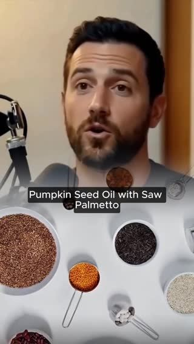
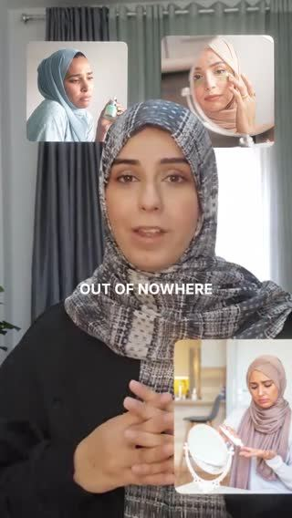
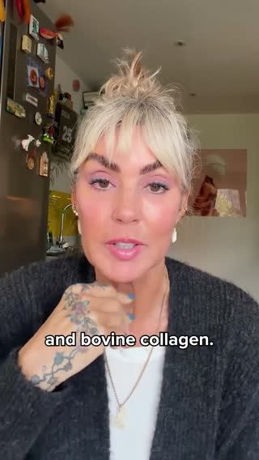

# Meta ad-library examples for F108

<!-- WAVE4 -->
## Wave 4: Alex Fedotoff's October 2026 swipe boards (GetHookd public previews)

Each ad below is from the free 10-ad preview of a public GetHookd board that [@FedotOff90](https://x.com/FedotOff90) shared on X. Days live are as of 2026-10-09; brand claims are the advertisers', not verified.

### Khazanay Pakistan: Clinic presenter in scrubs (orthopedic shoes) (338 days live)

- **Board:** [AI UGC + Doctor Avatars — Health & Wellness](https://x.com/FedotOff90/status/2106401392374186396) · video 70 s
- **What happens:** A woman in navy scrubs in a clinic corridor: "Let me tell you that you don't need a new body. You just need better support… it's not always an injury… unsupported shoes… plantar fasciitis". 70 s, run as 2 near-identical ads.
- **Why it lasts:** 338 days. The scrubs give authority, the reframe ("it's not an injury, it's your shoes") does the selling, and running two near-identical cuts is typical DCO practice.
- **How to make one:** A specialist look-alike (scrubs, not a named doctor), a reframe sentence first, then cause, then product category. Captions mid-frame.
- **LC remake:** "You don't need new skin. You need better metal." A specialist explains nickel and brass.

### Dr. Lisa Downing: "Men's health researcher" podcast (prostate DHT) (267 days live)

- **Board:** [Podcast-Style Ads — Ecom (mic/interview format)](https://x.com/FedotOff90/status/2101063012471951797) · video 54 s
- **What happens:** "As a men's health researcher, I study why the prostate swells… This is what most men over 40 get wrong about nighttime urination… Block DHT at the source… 3,000 mg cold-pressed pumpkin seed oil with saw palmetto." 54 s. Dr. Lisa Downing page, 1,357 ads.
- **Why it lasts:** 267 days. A persona "researcher" plus one mechanism (DHT) plus one dose number; the page runs 1,357 ads across personas.
- **How to make one:** A persona expert title (not "MD"), "what most [avatar] get wrong", the mechanism, the dose, the result.
- **LC remake:** "What most women get wrong about gold-plated jewelry."

### Male Health Tips: Elder "ancient remedy" doctor (men's health, gut-blood-flow claim) (222 days live)

- **Board:** [AI UGC + Doctor Avatars — Health & Wellness](https://x.com/FedotOff90/status/2106401392374186396) · video 41 s
- **What happens:** A grey-bearded man in a suit vest holds a dropper bottle; captions read "Dr. Sebi exposed how to increase size QUICKLY". Script: "Most men don't realize… It all comes down to blood flow and what's happening in your gut… berberine and sodium alginate…". 41 s, 222 days.
- **Why it lasts:** It ties a primal desire (size) to a gut mechanism and an "ancient" ingredient. The claims are extreme; this is the risky end of the format.
- **How to make one:** An elder-authority avatar, an "ancient remedy" story, one mechanism. Avoid health claims you can't substantiate.
- **LC remake:** Not for LC.

### Dr. Amina Siddiq, MD: "Dr. Amina Siddiq, MD" long explainer (skin) (214 days live)

- **Board:** [AI UGC + Doctor Avatars — Health & Wellness](https://x.com/FedotOff90/status/2106401392374186396) · video 289 s
- **What happens:** A hijab-wearing presenter in a lab-coat look with before/after skin inserts: "It all comes back to one thing. Your skin is missing… The part most women never realize. Almost all modern moisturizers make this worse." 289 s.
- **Why it lasts:** 214 days. A long-form "the one thing" reframe that blames the category (moisturizers).
- **How to make one:** A one-root-cause script: blame the category, name the missing thing, then product. 4-5 min with inserts.
- **LC remake:** "Almost all plated jewelry makes this worse."

### Astrid Zeegen: 60-year-old founder quiz talking head (collagen) (208 days live)

- **Board:** [AI UGC + Doctor Avatars — Health & Wellness](https://x.com/FedotOff90/status/2106401392374186396) · video 357 s
- **What happens:** A woman of 60 to camera: "Quick quiz. Do you know the difference between marine collagen and bovine collagen? …Does that help your skin, your joints or your gut?" 357 s (with a 392 s sibling).
- **Why it lasts:** 208 days. A quiz opener makes the viewer answer in their head, and the age-matched presenter fits the 50+ buyer.
- **How to make one:** An age-matched presenter, a quiz-style A-or-B question, and the answer explains the product range.
- **LC remake:** "Quick quiz: gold-filled or PVD, which survives the pool?"

