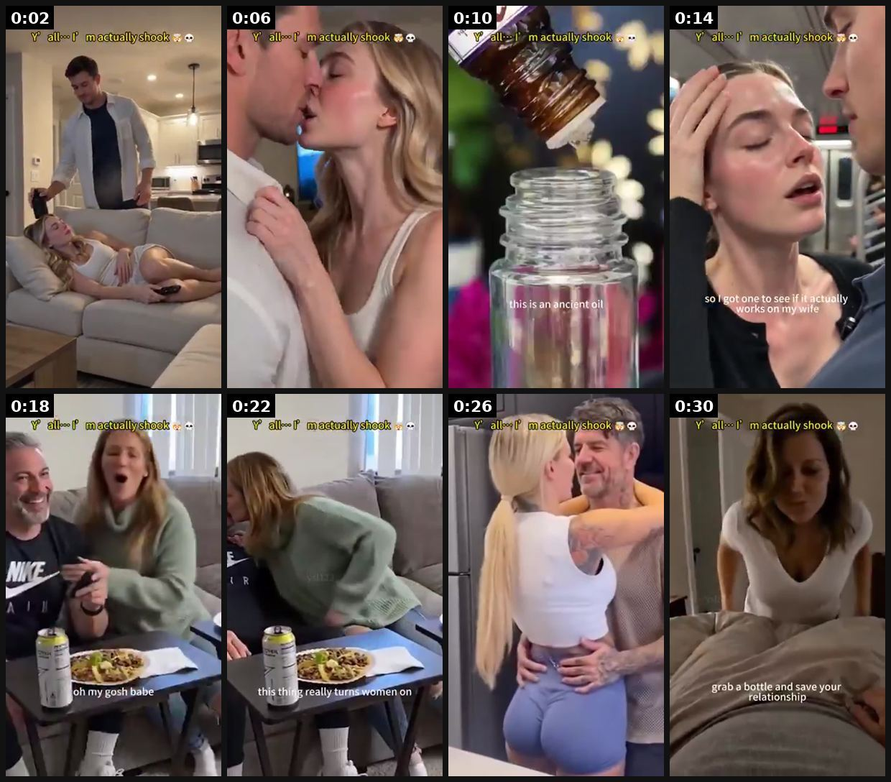

# 109 · Attraction-proof partner reaction (primal-desire hook: 'I got one to see if it actually works on my wife/him', the partner's reaction is the proof): see it, then make it

[](https://x.com/FedotOff90/status/2108201405496336460)

**The example:** [@FedotOff90 on X](https://x.com/FedotOff90/status/2108201405496336460) · 0:32 video · 27 likes, 4K views

**Watch it:** [open the post on X](https://x.com/FedotOff90/status/2108201405496336460) · [play the video file](https://video.twimg.com/amplify_video/2108200402088755200/vid/avc1/320x568/_J4XyAhuTcpJpD3c.mp4?tag=29)

> **How close is this example?** Exact: a partner-reaction "test it on my wife" ad for a men's desire product (the LC version flips it to a female buyer). The gallery below has more examples.

> Men think about getting LAID 19 TIMES a day. NATURAL fucking desire you must use with your ads if you sell to men. Keep it simple, keep it primal, and print mfers.

## What you are seeing

A 32 s phone-shot montage with a fixed top caption, "🤟 I'm actually shook 😳". Shots: a man in the kitchen and a woman on the couch, a close-up nuzzle, a dropper into a glass bottle ("this is an ancient oil blend which is designed to turn women on"), "so I got one to see if it actually works on my wife", a woman fanning herself, a couple laughing at dinner with beers ("oh my gosh babe", "this thing really turns women on"), an embrace in the kitchen, then "it even comes with the sixty day guarantee… grab a bottle and save your relationship". The partner's reaction is the only proof. Fedotoff used it to illustrate "keep it simple, keep it primal" for men's offers.

## Beat by beat

The storyboard above samples the video every 0:04. Lines are the transcript for that stretch; on-screen text comes from OCR, so treat it as rough.

| Frame | Time | On screen | Said / sung |
|---|---|---|---|
| 1 | 0:00–0:04 | · | · |
| 2 | 0:04–0:08 | · | · |
| 3 | 0:08–0:12 | actually shook me I a | This is It is an ancient oil blend which is designed to turn women on. |
| 4 | 0:12–0:16 | · | So I got one to see if it actually actually it actually |
| 5 | 0:16–0:20 | · | · |
| 6 | 0:20–0:24 | · | I'm glad I tried it this thing really turns women on it even comes with the sixty |
| 7 | 0:24–0:28 | · | · |
| 8 | 0:28–0:32 | · | day guarantee so click the link below grab a bottle and and save your relationshipoi |

<details><summary>Full transcript (timestamped)</summary>

- `0:09` This is It is an ancient oil blend which is designed to turn women on.
- `0:13` So I got one to see if it actually actually it actually
- `0:15` I'm glad I tried it this thing really turns women on it even comes with the sixty
- `0:27` day guarantee so click the link below grab a bottle and
- `0:30` and save your relationshipoi

</details>

## How to make one like it

**The format in one line:** A 20-40 s phone-shot skit that sells **desire, not the product**. The buyer says one sentence that frames a private test: *"So I got one to see if it actually works on my wife"* / *"this fragrance helped me pull"*. What follows is a montage of **the partner's reaction**: she leans in and sniffs his neck, laughs, grabs him, drags him off the couch. The reaction is the whole proof. A fixed top capti

**Why it works:** - **Primal motive.** Fedotoff: "Men think about getting LAID 19 TIMES a day. NATURAL desire you must use with your ads if you sell to men. Keep it simple, keep it primal." Attraction and status are older than any product category. - **Third-party proof.** The *partner's* reaction is more believable than the buyer's own claim, which fits his "testimonials beat claims" rule: someone else is reacting. - **A curiosity test format.** "To see if it actually works" is an experiment, and people watch ex

**Contents:** [1. Structure](#1-copy-the-structure) · [2. Shot by shot](#2-shot-by-shot-remake) · [3. Script and hooks](#3-write-the-script) · [4. Prompts](#4-prompts) · [5. Tools and settings](#5-tools-and-settings) · [6. Louise Carter remake](#6-louise-carter-remake) · [7. Variants and test](#7-variants-and-test-plan) · [8. Pitfalls](#8-pitfalls)

### 1. Copy the structure

Use the example's timing as your beat sheet. Keep the beat, change the words and the product.

| Beat | Time | In the example | Your version |
|---|---|---|---|
| 1 | 0:02 | (visual beat, see frame 1) | … |
| 2 | 0:06 | (visual beat, see frame 2) | … |
| 3 | 0:10 | This is It is an ancient oil blend which is designed to turn women on. | … |
| 4 | 0:14 | This is It is an ancient oil blend which is designed to turn women on. So I got one to see if it actually actually it actually | … |
| 5 | 0:18 | (visual beat, see frame 5) | … |
| 6 | 0:22 | I'm glad I tried it this thing really turns women on it even comes with the sixty | … |
| 7 | 0:26 | day guarantee so click the link below grab a bottle and | … |
| 8 | 0:30 | day guarantee so click the link below grab a bottle and and save your relationshipoi | … |

### 2. Shot-by-shot remake

**Target length / size:** 20-30s, 1080x1920, 8-12 handheld clips of 2-3s, fixed top caption

| # | Time / slot | What we see (visual + camera) | Dialogue / on-screen text |
|---|---|---|---|
| 1 | 0-2s | Mirror selfie, she clasps the LC layered necklace. Fixed top caption: "testing if he notices 😳" | "Wore this to see if he'd say anything." |
| 2 | 2-6s | Kitchen, handheld from the counter: he walks in, stops mid-sentence, double-take | Him: "Wait… is that new?" |
| 3 | 6-12s | He touches the pendant, pulls her in; she glances at camera | Her (whisper): "He NEVER notices." |
| 4 | 12-18s | Dinner, candle light on gold, he keeps looking | Caption: "day 3 he's still talking about it" |
| 5 | 18-24s | REAL LC macro: 3-layer set on a tray, splash of water | Text: "14K PVD · waterproof · any 7 for $85" |
| 6 | 24-28s | Her wink to camera | "Go test it on yours." |

<details><summary>Playbook shot list (Louise Carter version from the README)</summary>

| Time / slot | Visual | Audio / copy |
|---|---|---|
| 0-2s | Her mirror selfie putting on the LC layered necklace; top caption "testing if he notices 😳" | "Wore this to see if he'd say anything." |
| 2-6s | Kitchen: he walks in, stops mid-sentence, double-take | (him) "Wait… is that new?" |
| 6-12s | He touches the pendant, pulls her in | (her, whisper to camera) "He NEVER notices." |
| 12-18s | Dinner out: candle light on the gold, he can't stop looking | caption: "day 3 he's still talking about it" |
| 18-24s | Real LC product insert: the 3-layer set on a tray, waterproof splash | "14K PVD, waterproof, any 7 for $85" |
| 24-28s | Her wink to camera | "Go test it on yours." |

</details>

### 3. Write the script

Open with one of these hooks (first 1–3 seconds, or the headline on a static):

- "I got one to see if it actually works on my wife."
- "This [product] helped me pull, no joke."
- "I stopped buying $400 [premium thing]… and started [cheap thing]."
- "Wore this to see if he'd notice."
- "My husband asked where I got this 3 times in one night."

Then fill the beats from the table above. Pull the wording from real customer reviews, not from ad copy: a review line beats a copywriter line almost every time. Read every line out loud and cut anything you would not say to a friend. Ready-made Louise Carter scripts are in section 6; hand [BOT.md](BOT.md) to any AI agent to write versions for another brand.

### 4. Prompts

**Script (Claude)**

```text
Write 5 partner-reaction skits (20-30 s) for Louise Carter: one private-test line, partner reaction is the proof, 1-2 real product inserts, wink CTA. 6 beats each with duration, dialogue ≤8 words, fixed top caption. Flirty, not sexual; no claims that jewelry changes attraction.
```

**Casting brief (Billo / Insense)**

```text
Real couple 28-45, natural chemistry, home kitchen + one dinner location, phone-shot vertical, natural light. Deliver 12 raw clips + 3 hook takes. Usage: paid social 12 months.
```

**Edit (CapCut)**

```text
Fixed top caption 10% from top; cuts every 2-3s; trending sound at -18 dB under dialogue; captions burned in; 3 hook variants on one body.
```

**Full creative-agent prompt (from the playbook):**

```
Write 5 'attraction-proof' partner-reaction skits (20-30 s) for Louise Carter. The buyer frames a private test in one line ('wore this to see if he'd notice' / male gifter: 'got her this to see if she'd stop stealing mine'); the partner's reaction is the proof (double-take, compliment, asks where it's from); product appears in 1-2 real inserts; wink CTA with any 7 for $85. For each: fixed top caption, 6 beats with duration, dialogue ≤8 words, casting note. Tasteful, no sexual explicitness, no claims that jewelry changes attraction.
```

### 5. Tools and settings

1. **Cast a real couple** (creator couples on Billo / Insense / TikTok Creator Marketplace) or a single creator plus a friend. AI couples look fake at the touch moments, so avoid them.
2. **Script 6 beats:** private test line → partner notices → partner escalates (touch, compliment) → caption timestamp ("day 3") → product insert → wink CTA.
3. **Shoot vertical on a phone,** natural light, 8-12 clips of 2-3 s; keep the fixed top caption.
4. **Product inserts must be real** LC macro footage.
5. **Edit:** fast cuts, trending sound at low volume, burned-in captions. Make 3 hooks × 1 body.

| Setting | Value |
|---|---|
| Canvas | 1080×1920 (9:16) master; crop a 1080×1350 (4:5) cut for feed placements |
| Frame rate | 30 fps (shoot 60 fps for slow-motion water or sparkle shots) |
| Camera | Phone main lens at 1x, exposure locked on skin, HDR off, grid on; tripod or a phone clamp for product shots |
| Light | One soft key at 45° (window or ring light), white card as fill; side light for metal sparkle |
| Audio | Lavalier or phone 15–20 cm from the mouth; mix voice at -14 LUFS, music at -28 to -30 dB under voice |
| Captions | Burned in, 2–5 words per line, 64–80 px bold sans, white with a black stroke or pill; keep text inside the safe zone (top 220 px and bottom 420 px clear, 64 px side margins) |
| Pacing | A visual change every 1.5–3 s; the hook lands in the first 1.5 s with no logo intro |
| Edit / export | CapCut or Premiere; H.264, 12–20 Mbps, AAC 320 kbps; upload natively to each platform, not via links |

### 6. Louise Carter remake

- A · "Wore this to see if he'd notice" → kitchen double-take → dinner → "go test it on yours."
- B · Male gifter: "Got her this to see if she'd stop stealing my chain" → she wears it everywhere → "worth it."
- C · Girls' night: "Testing if anyone asks where my necklace is from" → 4 compliments counted on screen → offer.

Brand rules, claims you can and cannot make, and more scripts: [brands/louise-carter.md](brands/louise-carter.md). Step-by-step from idea to scale: [STAGES.md](STAGES.md).

### 7. Variants and test plan

- Buyer gender (her test vs his gift)
- Real couple vs creator plus friend
- Caption "I'm actually shook" vs "testing if he notices"
- Length 20 s vs 35 s

**Test plan:** - **Budget/structure:** 3 skits × 2 hooks, ABO $50/day each for 4 days - **Primary KPIs:** 3 s hook rate, shares, CTR, CPA; Omni new-customer % on `utm_content=F109-*` - **Kill rule:** CPA > 1.5× account average after 2× target CPA spend - **Scale rule:** remix the winning hook across 5 couples (F97 persona swap) - **Naming:** `utm_content=F109-<skit>-<hook>`

**Naming:** `F109-<variant>-<hook##>-<date>` so results map back to this folder. Change one thing per test (hook, narrator, length or offer), never two.

### 8. Pitfalls

- No sexual explicitness: Meta rejects implied sexual enhancement; keep it flirty.
- No claim that the product causes attraction or arousal (especially supplements/oils).
- AI couples fail at touch moments; cast real people.
- Disclose dramatizations if actors are used.
- Slow open: if the first 1.5 s does not show the hook visually, most people swipe.
- Logo or brand intro at the start reads as an ad; put the brand at the end.
- Captions covered by the platform UI: check the safe zone on a real phone before posting.
- Music over the voice: keep music at least 14 dB under speech.

**Compliance:** Baseline: [_COMPLIANCE.md](../_COMPLIANCE.md) (no fake testimonials, AI disclosure, no bulk/spoofed accounts, copy structure not assets, PDP-only claims). - Meta restricts adult content and implied sexual enhancement: keep it flirty, not sexual, and make **no claims that a product causes arousal or attraction** (supplements and oils especially). - Men's-health supplements: no ED or testosterone claims without substantiation; avoid "without pills" comparisons to drugs unless they are substantiated. - Skits must be disclosed as dramatizations if actors are used.

## Field notes

Newer observations live in the playbook: [Wave 4 update: Fedotoff October 2026 swipe boards](README.md)

## More examples

Every post we found for this format, with transcripts: [examples/](examples/README.md). Playbook: [README.md](README.md). Agent brief: [BOT.md](BOT.md).
