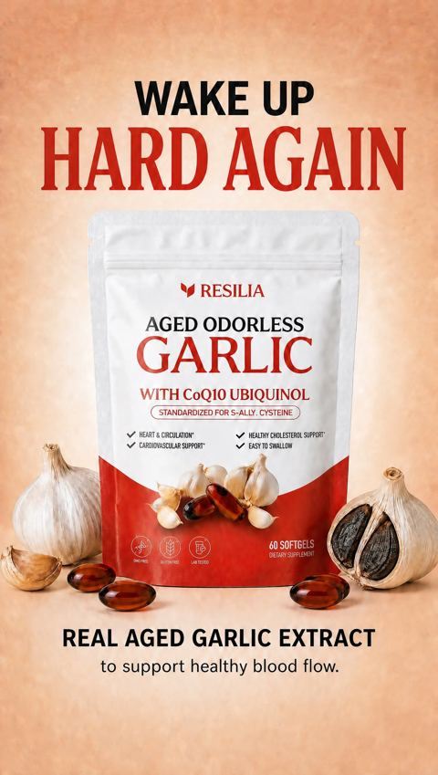
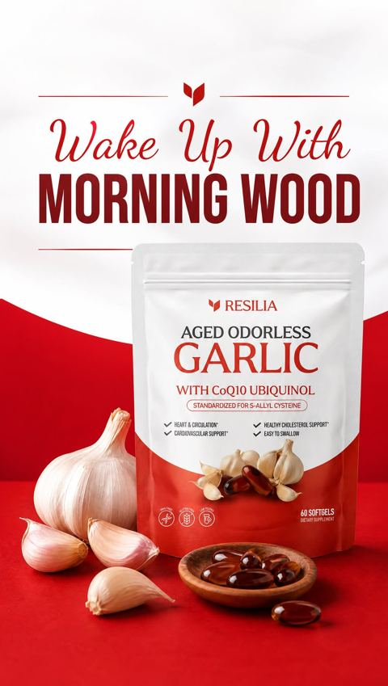

# Meta ad-library examples for F109

<!-- WAVE6 -->
## Wave 6: Resilia & Smooche live Meta ads (Oct 2026)

Pulled from the public Meta Ad Library on 2026-10-09 (Resilia: aged garlic, Ceylon cinnamon, oil of oregano; Smooche: color-changing foundation, Reverse Time peptide serum). Days live are counted to 2026-10-09; most video ads were new tests that week, while the long runners are statics and catalog templates. Transcripts are automatic. Brand claims are the advertisers', not verified, and many are health claims we would never make. The **Do not copy** line flags deceptive tactics (persona "publication" pages, undisclosed AI actors and "experts", fake stock counts).

### Resilia · Arterial Health Review: “WAKE UP HARD AGAIN” (1 day live)

- **Ad:** [Meta Ad Library #1641866314319094](https://www.facebook.com/ads/library/?id=1641866314319094) · static image · page “Arterial Health Review” · started 2026-10-07 · lands on `resilia.shop/products/resilia-aged-odorless-garlic`
- **What happens:** "WAKE UP HARD AGAIN" over an aged-garlic pouch with garlic bulbs.
- **Why it works:** "Wake up hard again" and "Wake up with morning wood" on an aged-garlic pouch: a primal benefit headline for a heart supplement.
- **How to make one:** Not a fit for LC as is. The pattern is a bold benefit headline that is unexpected for the category.
- **Do not copy:** Implied sexual-health claims for a garlic supplement are unsupported.
- **LC remake:** Not core for LC.

Primary text

> Looking to Take Control of Your Heart Health Naturally?❤️ Experience the Power of Resilia Aged Garlic Extract! ✅: Supports cardiovascular health naturally ✅: Completely odorless formula ✅: Supports arterial health ✅: 20-month aging process ✅: 900+ clinical studies ✅: SAC-standardized aged garlic extract ✅: Plus CoQ10 Ubiquinol & Vitamin K2 MK-7 Transform your cardiovascular health with three clinically studied ingredients backed by modern science — 30-Day Risk-Free Guarantee.

### Resilia · Arterial Health Review: “Wake Up With Morning Wood” (1 day live)

- **Ad:** [Meta Ad Library #1529874595567832](https://www.facebook.com/ads/library/?id=1529874595567832) · static image · page “Arterial Health Review” · started 2026-10-07 · lands on `resilia.shop/products/resilia-aged-odorless-garlic`
- **What happens:** "Wake Up With Morning Wood" on a red split background with the pouch.
- **Why it works:** "Wake up hard again" and "Wake up with morning wood" on an aged-garlic pouch: a primal benefit headline for a heart supplement.
- **How to make one:** Not a fit for LC as is. The pattern is a bold benefit headline that is unexpected for the category.
- **Do not copy:** Implied sexual-health claims for a garlic supplement are unsupported.
- **LC remake:** Not core for LC.

Primary text

> Looking to Take Control of Your Heart Health Naturally?❤️ Experience the Power of Resilia Aged Garlic Extract! ✅: Supports cardiovascular health naturally ✅: Completely odorless formula ✅: Supports arterial health ✅: 20-month aging process ✅: 900+ clinical studies ✅: SAC-standardized aged garlic extract ✅: Plus CoQ10 Ubiquinol & Vitamin K2 MK-7 Transform your cardiovascular health with three clinically studied ingredients backed by modern science — 30-Day Risk-Free Guarantee.

<!-- /WAVE6 -->

<!-- WAVE4 -->
## Wave 4: Alex Fedotoff's October 2026 swipe boards (GetHookd public previews)

Each ad below is from the free 10-ad preview of a public GetHookd board that [@FedotOff90](https://x.com/FedotOff90) shared on X. Days live are as of 2026-10-09; brand claims are the advertisers', not verified.

### HappySupp: Girlfriend-voice men's multivitamin (HappySupp) (378 days live)

- **Board:** [Winning Men's Health / Testosterone Ads — June 2026](https://x.com/FedotOff90/status/2102455699557200246) · video 86 s
- **What happens:** A woman in a black top to camera: "Cause ain't no way he taking this without me around… this is only for you and your girl. Don't get too crazy with it. This is the men's multivitamin by HappySupp… herbal blend to support your prostate." 86 s.
- **Why it lasts:** 378 days. Primal framing told by the partner; the partner's voice is the proof.
- **How to make one:** A female partner speaks to men about the product's effect on "him", in a playful tone.
- **LC remake:** The male-gifting version: "Ladies, send this to him."

### Penrose Skin: "Wanna pull? You need this fragrance" dupe yapper (Penrose) (89 days live)

- **Board:** [Penrose Skin: 100 Longest-Running 4-5 Star Ads (Oct 2026)](https://x.com/FedotOff90/status/2107841782251671953) · video 28 s
- **What happens:** A man to camera: "Wanna pull fine shit like this, trust me you need to get this fragrance… it literally smells like [designer], the most identical fragrance… a lot more affordable… lasts a lot longer." 28 s.
- **Why it lasts:** 89 days (the brand has 4,358 active ads). A primal hook, a dupe-of-luxury angle and a price anchor.
- **How to make one:** Hook = desire outcome, product = dupe of the expensive thing, 2 advantages (price, longevity).
- **LC remake:** "Want the $2,000 Cartier look? This is the closest I've found, and it's waterproof."

### Penrose Skin: Nightlife street-reaction montage (Penrose) (89 days live)

- **Board:** [Penrose Skin: 100 Longest-Running 4-5 Star Ads (Oct 2026)](https://x.com/FedotOff90/status/2107841782251671953) · video 41 s
- **What happens:** Night-street clips of people reacting to a man ("Before you go, what do you think of this?", "OK, that's dangerous"), then a VO: "That reaction? It's real. And it happens every time. This is Penrose Skin, a pheromone-infused body butter…" 41 s.
- **Why it lasts:** 89 days. Stranger reactions as proof, then a VO mechanism (shea plus pheromones).
- **How to make one:** Shoot 6-10 real stranger reactions, add a VO explaining the product, then the offer.
- **LC remake:** Street: "Guess what this necklace cost?" Reactions, then the $85 for 7 reveal.

