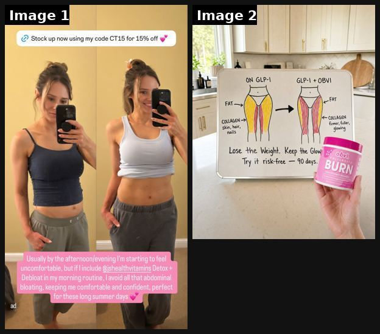
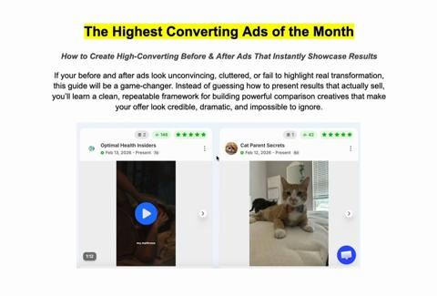
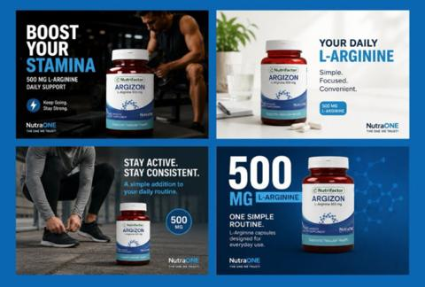
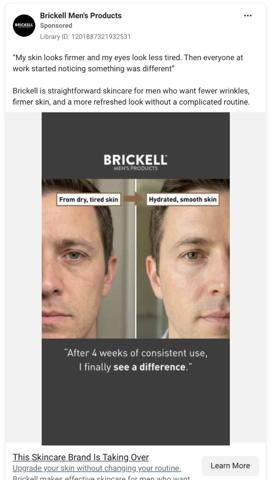
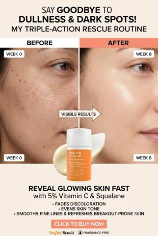
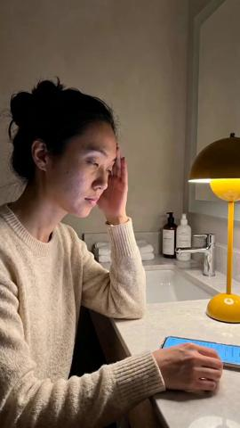
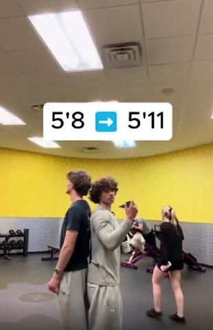

# 11 · Before → After (static + video), incl. "Me before / me after" and Polaroid proof: see it, then make it

[](https://x.com/tryatria_AI/status/2092961578974896447)

**The example:** [@tryatria_AI on X](https://x.com/tryatria_AI/status/2092961578974896447) · 2 images · 107 likes, 6K views

**Watch it:** [open the post on X](https://x.com/tryatria_AI/status/2092961578974896447)

> BEFORE → AFTER ADS ARE PRINTING 👀 The simplest creative format might be one of the best. I pulled the TOP 50 before/after ads on Atria right now. Real brands. Real ads. Real creative signals. Reply “BEFORE” and I’ll send the swipe file 👇 https://t.co/jjuBb2wzof

## What you are seeing

Two images: a mirror-selfie before/after side by side with a caption, and a whiteboard diagram ("lose the weight, keep the glow") with a hand holding the pink product tub.

## Image by image

| Image | Text on it (OCR, rough) |
|---|---|
| 1 | (mostly visual) |
| 2 | COLLAGEN COLLAGEN skin, hair, … fuller, nails glowing Lose the Weight. Keep the … Try it risk-free 90 days. |

## More real examples (8)

Other posts that show this format, or a close cousin of it. Click a thumbnail to open it on X.

| | | |
|---|---|---|
| [](https://x.com/adamtaylorl/status/2105251326959509651)<br>**@adamtaylorl** · 1:18 video · 404 views<br>5. The reverse before & after She ran out for a week and the symptoms came straight back. Proof by taking the product away. Film a customer who stoppe | [](https://x.com/ZedNilm1/status/2027004587232657441)<br>**@ZedNilm1** · 0:28 video · 3K views<br>$220k+ months don’t start with “design something creative” they start with proof people can understand in one second before → after same angle same li | [](https://x.com/Design__Lord/status/2091625281077260728)<br>**@Design__Lord** · image · 273 views<br>A static ad concept for this hydration skincare product. Clean visuals, product-focused composition, and a premium before → after concept designed to |
| [](https://x.com/nicktheriot_/status/2027206415253684227)<br>**@nicktheriot_** · image · 2K views<br>This Brickell ad is a MASTERCLASS in removing every objection a guy has to trying skincare. And it’s, by far, one of the cleanest men's skincare stati | [](https://x.com/MatsMa68231/status/2099623924325658683)<br>**@MatsMa68231** · image · 97 views<br>Before → After. this skincare static ad to grab attention, communicate the value faster, and make the product harder to ignore. Stop posting ads that | [](https://x.com/gresswoodhao/status/2064597459846987997)<br>**@gresswoodhao** · 0:19 video · 11 views<br>AI-made this UGC skincare ad in ~30 min — looks hand-shot, not AI. Real-person feel, before/after proof, ready to A/B test. Run paid social for a skin |
| [](https://x.com/adamtaylorl/status/2092205351336661342)<br>**@adamtaylorl** · image · 332 views<br>3. Status Transformation "5'8 ➡️ 5'11" Fast-paced. Highly native to TikTok and Reels. It targets the gym-bro demographic by appealing directly to stat | [](https://x.com/antonioventre_/status/2078512377616589256)<br>**@antonioventre_** · image · 5K views<br>Before/after photos are best native ad image: change creates curiosity; long copy tells story. |   |

## How to make one like it

**The format in one line:** Split image or 2-slide: left/first "before" (problem state), right/second "after" (result), with a date or condition label; video version = jump-cut transition. "People stop because they see a real change, not a product… then long primary text tells the story" ([@antonioventre_](https://x.com/antonioventre_/status/2078512377616589256)).

**Contents:** [1. Structure](#1-copy-the-structure) · [2. Shot by shot](#2-shot-by-shot-remake) · [3. Script and hooks](#3-write-the-script) · [4. Prompts](#4-prompts) · [5. Tools and settings](#5-tools-and-settings) · [6. Louise Carter remake](#6-louise-carter-remake) · [7. Variants and test](#7-variants-and-test-plan) · [8. Pitfalls](#8-pitfalls)

### 1. Copy the structure

The skeleton every version follows: **hook → problem or tension → turn (the product shows up) → proof → one clear ask.** The shot-by-shot below fills it in.

### 2. Shot-by-shot remake

**Target length / size:** Static 1080x1350 split, or 2 slides, or 8-15s jump-cut video

| # | Time / slot | What we see (visual + camera) | Dialogue / on-screen text |
|---|---|---|---|
| 1 | Before (left / slide 1 / 0-3s) | The problem state shot in harsh, honest light: green ring mark, tarnished chain, broken clasp | Label: "Before: 3 weeks of gold-plated" (date or condition) |
| 2 | After (right / slide 2 / 3-8s) | Same angle, same framing, the product after the same use | Label: "After: 6 months of [product], showered daily" |
| 3 | Video transition | Jump cut on a hand clap / swipe | Caption carries the time gap |
| 4 | End | Product close-up | Offer |

### 3. Write the script

Then fill the beats from the table above. Pull the wording from real customer reviews, not from ad copy: a review line beats a copywriter line almost every time. Read every line out loud and cut anything you would not say to a friend. Ready-made Louise Carter scripts are in section 6; hand [BOT.md](BOT.md) to any AI agent to write versions for another brand.

### 4. Prompts

**Shoot spec**

```text
Tripod, same lens and distance for both shots, same daylight. Mark the spot on the table with tape. Shoot RAW, no beauty filter on the "after".
```

### 5. Tools and settings

Collect real wear-test photos from 10 customers/creators (send product, pay $50, 6-month check-in); meanwhile staff test. Metric: CTR, CPA; Omni.

| Setting | Value |
|---|---|
| Canvas | 1080×1350 (4:5) for feed; 1080×1920 (9:16) story/reel version with the same elements stacked |
| Type | Headline 80–110 px, max 8 words; body 36–44 px; at most 2 typefaces |
| Layout | Headline readable at thumbnail size; product at least 40% of the canvas; logo small, bottom corner |
| Safe zone | Keep text out of the bottom 20% on 9:16 (UI overlays) |
| Tools | Figma or Canva for layout; Photoshop or Photoroom to cut out product; Midjourney or Flux only for backgrounds, never for the product itself |
| Export | PNG or JPG at quality 90, sRGB, under 1 MB |

### 6. Louise Carter remake

- **Wear test**: "Day 1 vs Day 180, worn in shower + ocean daily" (real piece, real owner, unretouched).
- **Cheap vs LC**: green-stained neck/finger from a cheap ring (illustrative, own model) vs clean skin with LC.
- **Styling glow-up**: plain outfit → same outfit with a 3-piece stack.

Brand rules, claims you can and cannot make, and more scripts: [brands/louise-carter.md](brands/louise-carter.md). Step-by-step from idea to scale: [STAGES.md](STAGES.md).

### 7. Variants and test plan

**Naming:** `F11-<variant>-<hook##>-<date>` so results map back to this folder. Change one thing per test (hook, narrator, length or offer), never two.

### 8. Pitfalls

- Before/after must be real and of the same item/person; staged results are deceptive and get ads rejected.
- Meta restricts before/after for health and weight claims; keep it about the product's condition, not body changes.
- Different lighting between the two halves makes people assume a trick.
- Too much text: if it cannot be read in 1 second at thumbnail size, cut it.
- AI-generated product images: show the real product; AI is fine for backgrounds only.

**Compliance:** [_COMPLIANCE.md](../_COMPLIANCE.md). Before/after must be genuine and unretouched; don't name competitors in the "cheap" side.

## Field notes

Newer observations live in the playbook: [Wave 2d update: before/after share in neighbouring accounts](README.md) · [Wave 8 update: Voynov page, Adam Taylor teardowns, queued posts (Oct 9, 2026)](README.md) · [Wave 4 update: Fedotoff October 2026 swipe boards](README.md)

## More examples

Every post we found for this format, with transcripts: [examples/](examples/README.md). Playbook: [README.md](README.md). Agent brief: [BOT.md](BOT.md).
