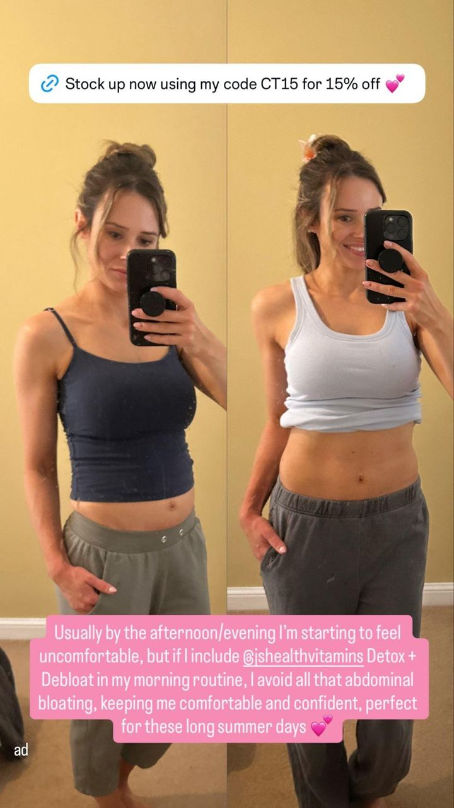

# 11 · Before → After

<!-- HERO:START -->

**[See the example and how to make it →](EXAMPLE.md)** · [watch on X](https://x.com/tryatria_AI/status/2092961578974896447)
<!-- HERO:END -->

## What it looks like
Split image or 2-slide: left/first "before" (problem state), right/second "after" (result), with a date or condition label; video version = jump-cut transition. "People stop because they see a real change, not a product… then long primary text tells the story" ([@antonioventre_](https://x.com/antonioventre_/status/2078512377616589256)).

## LC versions
- **Wear test**: "Day 1 vs Day 180, worn in shower + ocean daily" (real piece, real owner, unretouched).
- **Cheap vs LC**: green-stained neck/finger from a cheap ring (illustrative, own model) vs clean skin with LC.
- **Styling glow-up**: plain outfit → same outfit with a 3-piece stack.

## 3 scripts
A. Static: left "my $12 necklace after 2 weeks" (green, dull), right "my Louise Carter after 6 months" (glowing) — headline "I stopped taking it off." 
B. Video 10s: hand in pool water, "6 months, every day" → close-up shine → stack offer.
C. Carousel "Polaroid proof": 5 customer polaroids (real, permissioned) of the same piece over months.

## Production + test
Collect real wear-test photos from 10 customers/creators (send product, pay $50, 6-month check-in); meanwhile staff test. Metric: CTR, CPA; Omni.

## Compliance
[_COMPLIANCE.md](../_COMPLIANCE.md). Before/after must be genuine and unretouched; don't name competitors in the "cheap" side.

## Wave 2d update: before/after share in neighbouring accounts
- AdWhispr samples (120-169 ads each): Lymphoria 52% before/after; Rosabella 84% UGC lifestyle; Resilia 60% animation, 20% UGC talking head; Koriderm 40% studio product, 28% text overlay. Resilia's "Day 1 → Day 42" selfie diary stitches into an expert clip (**F96**).

<!-- EVIDENCE:START -->
## Wave 4 update: Fedotoff October 2026 swipe boards
- Deborah Hayes: "Spa treatments for belly fat don't work" two-layer explainer, 286 days live (AI & CGI Ads That Actually Convert board). A "what you tried doesn't work, here's the layer it misses" reframe, the same skeleton as F108's "3 layers".
- Muscle Mat: "I transform your bed today" demo (Muscle Mat), 819 days live (Hook Frameworks That Stop the Scroll board). A before/after demo in one location with a clear transformation.
- Stills, how-to and LC remakes: [adlibrary/](adlibrary/README.md).

## Evidence from X discovery (auto-generated)

| Date | Author | Post | Engagement | Grade | Gist |
|---|---|---|---|---|---|
| 2026-08-10 | [@LachezarVoynov](https://x.com/LachezarVoynov) | [link](https://x.com/LachezarVoynov/status/2086842038457098499) | 396L/1453BM/87kV | VALUE | 29 TOF video ad formats to test on Meta (transformation, Suno song, skit, beginner-intermediate-expert...). |
| 2026-08-27 | [@tryatria_AI](https://x.com/tryatria_AI) | [link](https://x.com/tryatria_AI/status/2092961578974896447) | 107L/147BM/6kV | VALUE | Before->after ads printing; top 50 swipe (reply-bait for file). |
| 2026-07-18 | [@antonioventre_](https://x.com/antonioventre_) | [link](https://x.com/antonioventre_/status/2078512377616589256) | 79L/64BM/4kV | VALUE | Before/after photos are best native ad image: change creates curiosity; long copy tells story. |
<!-- EVIDENCE:END -->
