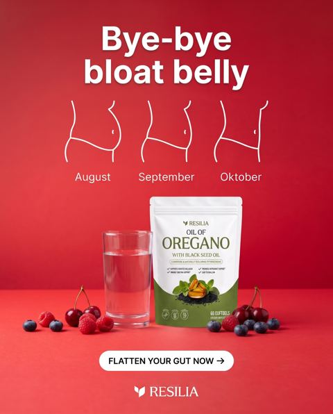
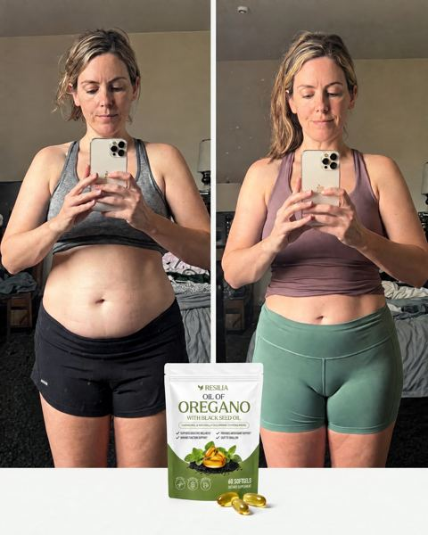
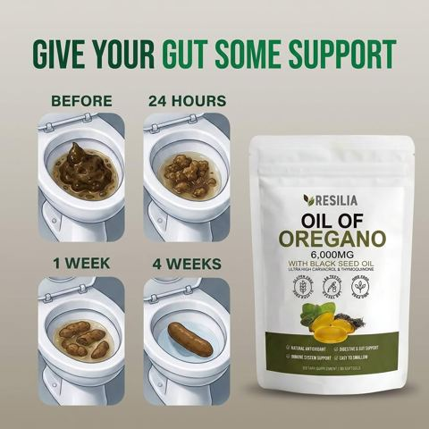
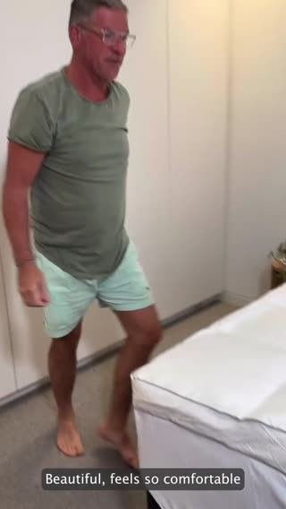

# Meta ad-library examples for F11

<!-- WAVE6 -->
## Wave 6: Resilia & Smooche live Meta ads (Oct 2026)

Pulled from the public Meta Ad Library on 2026-10-09 (Resilia: aged garlic, Ceylon cinnamon, oil of oregano; Smooche: color-changing foundation, Reverse Time peptide serum). Days live are counted to 2026-10-09; most video ads were new tests that week, while the long runners are statics and catalog templates. Transcripts are automatic. Brand claims are the advertisers', not verified, and many are health claims we would never make. The **Do not copy** line flags deceptive tactics (persona "publication" pages, undisclosed AI actors and "experts", fake stock counts).

### Resilia · Gut Health Insider: “Bye-bye bloat belly” (0 days live)

- **Ad:** [Meta Ad Library #1147742937783185](https://www.facebook.com/ads/library/?id=1147742937783185) · static image · page “Gut Health Insider” · started 2026-10-08 · 1 copies · lands on `resilia.shop/products/resilia-oil-of-oregano-softgels`
- **What happens:** "Bye-bye bloat belly": August / September / October line-drawn waists and the pouch.
- **Why it works:** Mirror-selfie before/after shots and "Bye-bye bloat belly" Aug→Sep→Oct line drawings show the change at a glance.
- **How to make one:** Use the same pose and angle, dates on screen, and the product between the frames.
- **Do not copy:** Weight-loss before/afters are restricted on Meta and these imply unsupported results.
- **LC remake:** Day 1 vs day 180 of the same LC necklace after daily showers (the same light and angle).

Primary text

> Resilia is powered by oil of oregano and cold-pressed black seed oil — two of nature's most time-tested botanicals. Our easy-to-swallow softgels feature premium oil of oregano with naturally occurring carvacrol and black seed oil with thymoquinone. Clean, no-BS ingredients, third-party tested, and shipped right from the USA to deliver daily support for a healthy gut, a healthy inflammatory response, and your body's natural defenses. Just two softgels a day, no powders or routines to remember.

### Resilia · Resilia: Mirror-selfie before/after in gym wear (1 day live)

- **Ad:** [Meta Ad Library #1075537335107750](https://www.facebook.com/ads/library/?id=1075537335107750) · static image · page “Resilia” · started 2026-10-07 · lands on `resilia.shop/products/resilia-oil-of-oregano-softgels`
- **What happens:** Mirror-selfie before/after in gym wear, with the pouch in the corner.
- **Why it works:** Mirror-selfie before/after shots and "Bye-bye bloat belly" Aug→Sep→Oct line drawings show the change at a glance.
- **How to make one:** Use the same pose and angle, dates on screen, and the product between the frames.
- **Do not copy:** Weight-loss before/afters are restricted on Meta and these imply unsupported results.
- **LC remake:** Day 1 vs day 180 of the same LC necklace after daily showers (the same light and angle).

Primary text

> Resilia is powered by oil of oregano and cold-pressed black seed oil — two of nature's most time-tested botanicals. Our easy-to-swallow softgels feature premium oil of oregano with naturally occurring carvacrol and black seed oil with thymoquinone. Clean, no-BS ingredients, third-party tested, and shipped right from the USA to deliver daily support for a healthy gut, a healthy inflammatory response, and your body's natural defenses. Just two softgels a day, no powders or routines to remember.

### Resilia · Resilia: “GIVE YOUR GUT SOME SUPPORT” (0 days live)

- **Ad:** [Meta Ad Library #943570188411919](https://www.facebook.com/ads/library/?id=943570188411919) · static image · page “Resilia” · started 2026-10-08 · 1 copies · lands on `resilia.shop/products/resilia-oil-of-oregano-softgels`
- **What happens:** "GIVE YOUR GUT SOME SUPPORT": before / 24 hours / 1 week / 4 weeks progression photos.
- **Why it works:** Mirror-selfie before/after shots and "Bye-bye bloat belly" Aug→Sep→Oct line drawings show the change at a glance.
- **How to make one:** Use the same pose and angle, dates on screen, and the product between the frames.
- **Do not copy:** Weight-loss before/afters are restricted on Meta and these imply unsupported results.
- **LC remake:** Day 1 vs day 180 of the same LC necklace after daily showers (the same light and angle).

Primary text

> Introducing Resilia Oil of Oregano — premium dual-action softgels that support your body's natural drainage and everyday vitality. 💧 Supports natural cleansing and healthy circulation 💧 Helps reduce puffiness and water retention 💧 Supports healthy fluid balance and lighter-feeling days 💧 Promotes clearer-looking skin and steady energy ✅ Dual-action blend of Oil of Oregano + Black Seed Oil ✅ 3rd-party tested in the USA, Non-GMO, no aftertaste ✨ No messy liquids — just two easy softgels each morning 🌿 Inspired by tradition, made for modern life ❤️‍🩹 Two softgels a day to help you feel light and vibrant again. Tap Shop Now to reclaim your flow with Resilia Oil of Oregano! 🌿 Don’t Just Mask It: Help your body fix the source. Support your natural drainage with the power of Resilia.

<!-- /WAVE6 -->

<!-- WAVE4 -->
## Wave 4: Alex Fedotoff's October 2026 swipe boards (GetHookd public previews)

Each ad below is from the free 10-ad preview of a public GetHookd board that [@FedotOff90](https://x.com/FedotOff90) shared on X. Days live are as of 2026-10-09; brand claims are the advertisers', not verified.

### Muscle Mat: "I transform your bed today" demo (Muscle Mat) (819 days live)

- **Board:** [Hook Frameworks That Stop the Scroll (Top 150)](https://x.com/FedotOff90/status/2106774251777020286) · dco 27 s
- **What happens:** A man sits on a hard bed, rolls out the topper, sits again and smiles; end card "SALE ON NOW · swipe up to save". 27 s.
- **Why it lasts:** 819 days. A before/after demo in one location with a clear transformation.
- **How to make one:** Same spot, before (discomfort), the product goes on, after (relief); end card offer.
- **LC remake:** "Watch me fix a green neck in 10 seconds."

### Deborah Hayes: "Spa treatments for belly fat don't work" two-layer explainer (286 days live)

- **Board:** [AI & CGI Ads That Actually Convert](https://x.com/FedotOff90/status/2107892934050037807) · video 126 s
- **What happens:** "Spa treatments for belly fat don't work. And there's a scientific reason why… I did six spa sessions… $1,200… Your belly fat has two types of fat… these only work on surface fat." UGC plus a medical-paper insert plus CGI. 126 s.
- **Why it lasts:** 286 days. A "what you tried doesn't work, here's the layer it misses" reframe, the same skeleton as F108's "3 layers".
- **How to make one:** List what they tried with money spent, then a 2-layer mechanism, then the product reaches layer 2.
- **LC remake:** "I spent $600 on plated jewelry that turned green. Here's the layer they skip."

