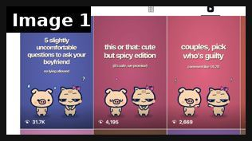
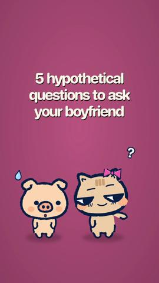
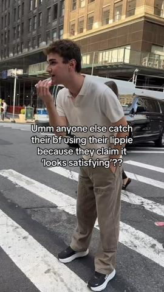
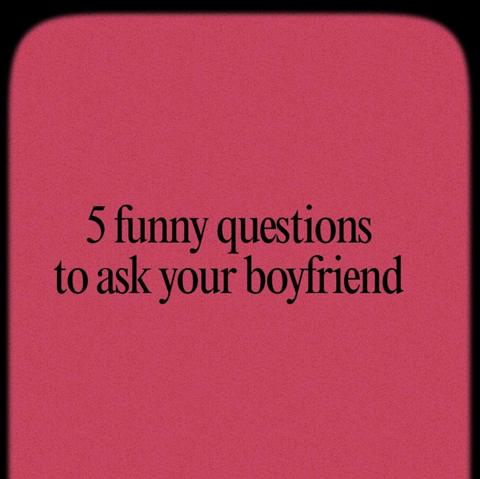

# 110 · Couples prompt slideshow with a mascot duo (\"5 slightly uncomfortable questions to ask your boyfriend\", \"this or that\", \"pick who's guilty, comment 1A 2B\"): see it, then make it

[](https://x.com/jackfriks/status/2108536144896163993)

**The example:** [@jackfriks on X](https://x.com/jackfriks/status/2108536144896163993) · 1 image · 139 likes, 15K views

**Watch it:** [open the post on X](https://x.com/jackfriks/status/2108536144896163993)

> **How close is this example?** Exact: the source account for this format (couples app, mascot-duo prompt slideshows). The gallery below has more examples.

> yesterdays posts created by opus 5.5 based on my reference sheet and taste for marketing my couples app, claude also scheduled/posted them all through post bridge MCP

## What you are seeing

A 3-up screenshot of one couples app's TikTok grid. Every cover shows the same cartoon duo, a brown pig ("him") and a white cat with a pink bow ("her"), on a flat colour background (lilac, pink, teal) under a bold white headline. Covers: "5 slightly uncomfortable questions to ask your boyfriend / no lying allowed" (31.7K views), "this or that: cute but spicy edition / (it's safe, we promise)" (4,195) and "couples, pick who's guilty / comment like 1A 2B" (2,669). The poster says an AI model wrote the posts from his reference sheet and Claude scheduled and posted them through the Post Bridge MCP.

## Image by image

| Image | Text on it (OCR, rough) |
|---|---|
| 1 | slightly this or that: cute … couples, pick your who's guilty its safe, we promise … 31.7K 4195 2,669 |

## More real examples (3)

Other posts that show this format, or a close cousin of it. Click a thumbnail to open it on X.

| | | |
|---|---|---|
| [](https://x.com/lovelee_app/status/2105351703578997169)<br>**@lovelee_app** · 0:18 video · 1K views<br>hypothetical questions to ask your boyfriend (he has to answer #3) | [](https://x.com/tartecosmetics/status/1958207490522284241)<br>**@tartecosmetics** · 0:05 video · 2K views<br>Send this to your boyfriend to get them on that maracuja juicy lip plump 🤫 | [](https://x.com/FlexFusion_/status/2027044780761596142)<br>**@FlexFusion_** · image · 12K views<br>5 funny questions to ask your boyfriend -Thread- |

## How to make one like it

**The format in one line:** A TikTok or Instagram photo-mode slideshow from a faceless brand account. Every cover uses the **same two cartoon characters**, a "him" and a "her" (the example uses a pig and a cat with a pink bow), on a flat colour background. A short lowercase-feeling headline in bold white sits at the top. Inside are 5-8 slides of **prompts couples answer together**:

**Why it works:** - **Shareable to exactly one person.** "Questions to ask your boyfriend" begs to be DM'd to the boyfriend, and sends are the strongest TikTok and Instagram signal. - **Comment codes ("1A 2B")** make commenting effortless, and every comment is a vote, so comments stack. - **"Slightly uncomfortable" is the dose** (reply under the post): fully uncomfortable gets scrolled past, mildly uncomfortable gets answered. - **Mascots make it brand-ownable and safe.** The same characters on every cover build 

**Contents:** [1. Structure](#1-copy-the-structure) · [2. Shot by shot](#2-shot-by-shot-remake) · [3. Script and hooks](#3-write-the-script) · [4. Prompts](#4-prompts) · [5. Tools and settings](#5-tools-and-settings) · [6. Louise Carter remake](#6-louise-carter-remake) · [7. Variants and test](#7-variants-and-test-plan) · [8. Pitfalls](#8-pitfalls)

### 1. Copy the structure

The skeleton every version follows: **hook → problem or tension → turn (the product shows up) → proof → one clear ask.** The shot-by-shot below fills it in.

### 2. Shot-by-shot remake

**Target length / size:** 6-8 slides, 1080x1920 photo mode, trending audio auto-added

| # | Time / slot | What we see (visual + camera) | Dialogue / on-screen text |
|---|---|---|---|
| 1 | Slide 1 (cover) | LC mascot duo (gold bear "him", bunny "her" with a pearl necklace) centred in the bottom third on a blush-pink flat background. Headline top third, white bold 72px: "this or that: jewelry edition"; sub-line 36px "(he has to answer honestly)" | Trending sound (auto) |
| 2 | Slide 2 | Two half-panels: bear holding gold, bunny holding silver. Text "gold 🅰️ or silver 🅱️" | - |
| 3 | Slide 3 | Panels: dainty chain versus chunky chain. "dainty 🅰️ or chunky 🅱️" | - |
| 4 | Slide 4 | Mascots holding matching rings versus mascot shrugging. "matching rings 🅰️ or never 🅱️" | - |
| 5 | Slide 5 | Surprise box versus phone with link. "surprise gift 🅰️ or send-me-the-link 🅱️" | - |
| 6 | Slide 6 | Both mascots pointing at the viewer. "comment your answers like 1A 2B 3A" | - |
| 7 | Slide 7 (CTA) | Bunny holding a real LC box photo (composited). "send this to him 👀 · any 7 for $85 · link in bio" | Pinned comment: answer legend |

<details><summary>Playbook shot list (Louise Carter version from the README)</summary>

| Time / slot | Visual | Audio / copy |
|---|---|---|
| Slide 1 (cover) | LC mascot duo (e.g. a little gold bear "him" and a bunny "her" with a pearl necklace) on blush pink; headline "this or that: jewelry edition" + "(he has to answer honestly)" | Trending sound, auto-added |
| Slide 2 | Two mascot panels: "gold 🅰️ or silver 🅱️" | — |
| Slide 3 | "dainty 🅰️ or chunky 🅱️" | — |
| Slide 4 | "matching couple rings 🅰️ or never 🅱️" | — |
| Slide 5 | "surprise gift 🅰️ or send-me-the-link 🅱️" | — |
| Slide 6 | "necklace 🅰️ or bracelet 🅱️" | "comment your answers like 1A 2B 3A" |
| Slide 7 | Mascot holding an LC box: "send this to him 👀 (any 7 for $85, link in bio)" | — |

</details>

### 3. Write the script

Open with one of these hooks (first 1–3 seconds, or the headline on a static):

- "5 slightly uncomfortable questions to ask your boyfriend"
- "this or that: [category] edition"
- "couples, pick who's guilty (comment like 1A 2B)"
- "send this to him if you want [X] for your birthday"
- "rate your boyfriend's gift history 1-10"

Then fill the beats from the table above. Pull the wording from real customer reviews, not from ad copy: a review line beats a copywriter line almost every time. Read every line out loud and cut anything you would not say to a friend. Ready-made Louise Carter scripts are in section 6; hand [BOT.md](BOT.md) to any AI agent to write versions for another brand.

### 4. Prompts

**Mascot sheet (GPT Image / Nano Banana)**

```text
"Two cute chibi characters side by side, thick dark navy outline, flat pastel shading, a tan bear (him) and a white bunny with a small pearl necklace and pink bow (her), front-facing, simple expressions, transparent background, sticker style." Then 8 poses: shy, guilty, pointing, shrugging, holding a gift box, blushing, arms crossed, hugging.
```

**Prompt sets (Claude + reference sheet)**

```text
From the LC reference sheet, write 20 couples-prompt slideshows across 4 families (questions to ask your boyfriend / this or that / pick who's guilty 1A 2B / send this to him). Cover ≤8 words lowercase-feeling, 5-6 prompts, CTA slide, pinned comment. Slightly uncomfortable, never mean or explicit.
```

**Template (Canva Bulk Create)**

```text
CSV columns: bg_colour, headline, subline, slide2..slide6, cta. One template, bulk-generate 20 sets, export PNG 1080x1920.
```

**Posting (Post Bridge / native)**

```text
Schedule 1-3 per day per warmed account; TikTok photo mode auto-adds trending audio; pin the answer-code comment within 5 minutes.
```

**Full creative-agent prompt (from the playbook):**

```
Using the LC reference sheet (tone: playful, lowercase-feeling, never explicit, never salesy), write 10 couples-prompt slideshows for the LC mascot duo. Mix 4 families: 'questions to ask your boyfriend', 'this or that: <x> edition', 'pick who's guilty (comment 1A 2B)', 'send this to him'. Each: cover headline (≤8 words) + sub-line, 5-6 slides with one prompt each and A/B options where relevant, final slide CTA (any 7 for $85, link in bio), pinned comment, 3 hashtags. Keep it slightly uncomfortable, never mean.
```

### 5. Tools and settings

1. **Mascot sheet:** generate the duo once (GPT Image / Nano Banana: "two cute chibi characters, thick dark outline, flat pastel shading, a bear and a bunny with a pearl necklace, front-facing, transparent background") and make 8 poses (shy, guilty, pointing, holding a box).
2. **Reference sheet** (Google Doc): 30 example headlines that worked, tone rules (lowercase-feeling, playful, never explicit), banned salesy phrases, a CTA list.
3. **Prompt bank:** Claude writes 20 prompt sets a week from the sheet. Swap the hook families so it doesn't converge on two hooks.
4. **Template:** Canva or Figma 1080×1920, flat colour background per series, white bold headline, mascots at the bottom third.
5. **Post:** schedule via Post Bridge (MCP or UI) or post natively; let TikTok auto-add trending audio; 1-3 a day per account.
6. **Pin a comment** with the answer code legend ("comment like 1A 2B 3A").

| Setting | Value |
|---|---|
| Canvas | 1080×1350 (4:5) per slide; 1080×1920 for TikTok photo mode |
| Slides | 5–10; slide 1 is the hook only, last slide is the ask (save / follow / shop) |
| Type | 64–96 px headline per slide, one idea per slide, consistent position across slides |
| Continuity | Same template, colour and font on every slide so it reads as one piece |
| Audio (TikTok) | Add a trending sound at low volume; photo mode auto-advances |
| Tools | Canva or Figma template; Postnitro or ChatGPT for drafts; export PNG, sRGB |

### 6. Louise Carter remake

- A · "this or that: jewelry edition (he has to answer honestly)" → 5 A/B slides → "send this to him 👀".
- B · "couples, pick who's guilty: comment like 1A 2B" → "who forgets anniversaries / who loses jewelry / who steals the other's chain" → LC CTA.
- C · "5 slightly uncomfortable questions to ask your boyfriend: gift edition" → "what's my ring size?" "gold or silver for me?" → reveal slide.

Brand rules, claims you can and cannot make, and more scripts: [brands/louise-carter.md](brands/louise-carter.md). Step-by-step from idea to scale: [STAGES.md](STAGES.md).

### 7. Variants and test plan

- Mascot duo versus real couple photo covers
- Comment-code versus "send this to him" CTA
- Pastel background per series versus one brand colour
- AI-written versus human-written hooks (Matt Gittleson: never let AI write hooks; run both)

**Test plan:** - **Budget/structure:** organic first, 2 posts/day for 3 weeks on one warmed account; Spark-boost the top 3 by sends and saves at $30/day - **Primary KPIs:** shares/sends per 1K views, comments per 1K, profile visits, link clicks; Omni new-customer % on `utm_content=F110-*` - **Kill rule:** a hook family under 2 shares/1K views after 6 posts - **Scale rule:** spin the winning family into 10 editions; a second account with a different mascot pair - **Naming:** `utm_content=F110-<family>-<edition>`

**Naming:** `F110-<variant>-<hook##>-<date>` so results map back to this folder. Change one thing per test (hook, narrator, length or offer), never two.

### 8. Pitfalls

- One reference sheet converges on 2 hooks in a week: rotate hook families and refresh the sheet weekly.
- Cold accounts cap views: warm the account first (Matt Gittleson: zero views = account problem, low views = content problem).
- Spicy must stay PG-13; cartoon sexual content still gets restricted.
- Product must be the payoff slide, not missing: a viral slideshow with no LC slide converts at zero.
- A weak first slide: nobody swipes past a boring cover.
- No reason to save: give a list, a checklist or a reference people come back to.

**Compliance:** Baseline: [_COMPLIANCE.md](../_COMPLIANCE.md) (no fake testimonials, AI disclosure, no bulk/spoofed accounts, copy structure not assets, PDP-only claims). - Keep "spicy" PG-13; TikTok restricts sexual content even in cartoons. - Automated posting via APIs or MCP must stay within platform terms; no bulk, spoofed or engagement-farming accounts. - Brand account must be identifiable as the brand where the platform requires it (branded content toggle for paid boosts).

## More examples

Every post we found for this format, with transcripts: [examples/](examples/README.md). Playbook: [README.md](README.md). Agent brief: [BOT.md](BOT.md).
