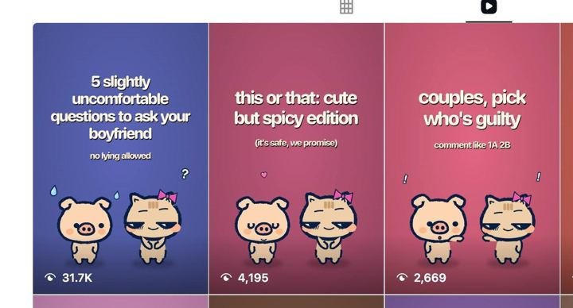

# 110 · Couples prompt slideshow with a mascot duo

<!-- HERO:START -->
[](EXAMPLE.md)

**[See the example and how to make it →](EXAMPLE.md)** · [watch on X](https://x.com/jackfriks/status/2108536144896163993)
<!-- HERO:END -->


> **LC priority P1** · evidence: Medium (31.7K views on a small app account; agent-run) · hype risk: Medium · cost $0-5 · 10-20 min or fully automated

## What it is
A TikTok or Instagram photo-mode slideshow from a faceless brand account. Every cover uses the **same two cartoon characters**, a "him" and a "her" (the example uses a pig and a cat with a pink bow), on a flat colour background. A short lowercase-feeling headline in bold white sits at the top. Inside are 5-8 slides of **prompts couples answer together**:
- "5 slightly uncomfortable questions to ask your boyfriend (no lying allowed)"
- "this or that: cute but spicy edition (it's safe, we promise)"
- "couples, pick who's guilty (comment like 1A 2B)"

The product (here a couples app) appears on the last slide or in the caption as the place to keep playing. The engine: people **send it to their partner** or **answer in the comments with a code**, and both signals feed distribution.

## Why it works
- **Shareable to exactly one person.** "Questions to ask your boyfriend" begs to be DM'd to the boyfriend, and sends are the strongest TikTok and Instagram signal.
- **Comment codes ("1A 2B")** make commenting effortless, and every comment is a vote, so comments stack.
- **"Slightly uncomfortable" is the dose** (reply under the post): fully uncomfortable gets scrolled past, mildly uncomfortable gets answered.
- **Mascots make it brand-ownable and safe.** The same characters on every cover build recognition (F21), and nobody's face is needed.
- **Cheap to run at volume.** @jackfriks says Claude wrote a day's posts from his reference sheet and taste notes and scheduled and posted them through the Post Bridge MCP.

## Shot-by-shot (LC version, 7 slides)

| Time / slot | Visual | Audio / copy |
|---|---|---|
| Slide 1 (cover) | LC mascot duo (e.g. a little gold bear "him" and a bunny "her" with a pearl necklace) on blush pink; headline "this or that: jewelry edition" + "(he has to answer honestly)" | Trending sound, auto-added |
| Slide 2 | Two mascot panels: "gold 🅰️ or silver 🅱️" | — |
| Slide 3 | "dainty 🅰️ or chunky 🅱️" | — |
| Slide 4 | "matching couple rings 🅰️ or never 🅱️" | — |
| Slide 5 | "surprise gift 🅰️ or send-me-the-link 🅱️" | — |
| Slide 6 | "necklace 🅰️ or bracelet 🅱️" | "comment your answers like 1A 2B 3A" |
| Slide 7 | Mascot holding an LC box: "send this to him 👀 (any 7 for $85, link in bio)" | — |

## Hooks (swap-in openers)
- "5 slightly uncomfortable questions to ask your boyfriend"
- "this or that: [category] edition"
- "couples, pick who's guilty (comment like 1A 2B)"
- "send this to him if you want [X] for your birthday"
- "rate your boyfriend's gift history 1-10"

## Real examples from X (studied)
- @jackfriks (couples app): yesterday's posts were created by an AI model "based on my reference sheet and taste for marketing my couples app"; Claude also scheduled and posted them all through the Post Bridge MCP. Covers: "5 slightly uncomfortable questions to ask your boyfriend / no lying allowed" (31.7K views), "this or that: cute but spicy edition / (it's safe, we promise)" (4,195), "couples, pick who's guilty / comment like 1A 2B" (2,669) ([post](https://x.com/jackfriks/status/2108536144896163993)). From the replies:
  - TikTok auto-adds trending audio to slideshows posted via Post Bridge, but you can't pick the song.
  - "TikTok hasn't been hitting as hard on these, will need to mix it up."
  - "A properly warmed-up account with good history does wonders" (in answer to API-posting shadowban worries).
  - One reply warns that a week of posts from one reference sheet starts leaning on the same two hooks.

## Production recipe
1. **Mascot sheet:** generate the duo once (GPT Image / Nano Banana: "two cute chibi characters, thick dark outline, flat pastel shading, a bear and a bunny with a pearl necklace, front-facing, transparent background") and make 8 poses (shy, guilty, pointing, holding a box).
2. **Reference sheet** (Google Doc): 30 example headlines that worked, tone rules (lowercase-feeling, playful, never explicit), banned salesy phrases, a CTA list.
3. **Prompt bank:** Claude writes 20 prompt sets a week from the sheet. Swap the hook families so it doesn't converge on two hooks.
4. **Template:** Canva or Figma 1080×1920, flat colour background per series, white bold headline, mascots at the bottom third.
5. **Post:** schedule via Post Bridge (MCP or UI) or post natively; let TikTok auto-add trending audio; 1-3 a day per account.
6. **Pin a comment** with the answer code legend ("comment like 1A 2B 3A").

## Bot prompt (copy into the creative agent)
```
Using the LC reference sheet (tone: playful, lowercase-feeling, never explicit, never salesy), write 10 couples-prompt slideshows for the LC mascot duo. Mix 4 families: 'questions to ask your boyfriend', 'this or that: <x> edition', 'pick who's guilty (comment 1A 2B)', 'send this to him'. Each: cover headline (≤8 words) + sub-line, 5-6 slides with one prompt each and A/B options where relevant, final slide CTA (any 7 for $85, link in bio), pinned comment, 3 hashtags. Keep it slightly uncomfortable, never mean.
```

## 3 LC scripts
- A · "this or that: jewelry edition (he has to answer honestly)" → 5 A/B slides → "send this to him 👀".
- B · "couples, pick who's guilty: comment like 1A 2B" → "who forgets anniversaries / who loses jewelry / who steals the other's chain" → LC CTA.
- C · "5 slightly uncomfortable questions to ask your boyfriend: gift edition" → "what's my ring size?" "gold or silver for me?" → reveal slide.

## Variants to test
- Mascot duo versus real couple photo covers
- Comment-code versus "send this to him" CTA
- Pastel background per series versus one brand colour
- AI-written versus human-written hooks (Matt Gittleson: never let AI write hooks; run both)

## Omni test plan
- **Budget/structure:** organic first, 2 posts/day for 3 weeks on one warmed account; Spark-boost the top 3 by sends and saves at $30/day
- **Primary KPIs:** shares/sends per 1K views, comments per 1K, profile visits, link clicks; Omni new-customer % on `utm_content=F110-*`
- **Kill rule:** a hook family under 2 shares/1K views after 6 posts
- **Scale rule:** spin the winning family into 10 editions; a second account with a different mascot pair
- **Naming:** `utm_content=F110-<family>-<edition>`

## Compliance
Baseline: [_COMPLIANCE.md](../_COMPLIANCE.md) (no fake testimonials, AI disclosure, no bulk/spoofed accounts, copy structure not assets, PDP-only claims).
- Keep "spicy" PG-13; TikTok restricts sexual content even in cartoons.
- Automated posting via APIs or MCP must stay within platform terms; no bulk, spoofed or engagement-farming accounts.
- Brand account must be identifiable as the brand where the platform requires it (branded content toggle for paid boosts).

## Related
- Strategies: 01-viral-slideshow-recreation, 22-serialized-chat-story-slideshows, 38-agentic-creative-studio, 24-niche-character-account-network
- Formats: [01-faceless-niche-slideshow](../01-faceless-niche-slideshow/README.md), [21-recurring-ai-character-mascot](../21-recurring-ai-character-mascot/README.md), [51-quiz-guess-game](../51-quiz-guess-game/README.md), [02-listicle-save-carousel](../02-listicle-save-carousel/README.md), [85-persona-aesthetic-slideshow-caption-template](../85-persona-aesthetic-slideshow-caption-template/README.md)
