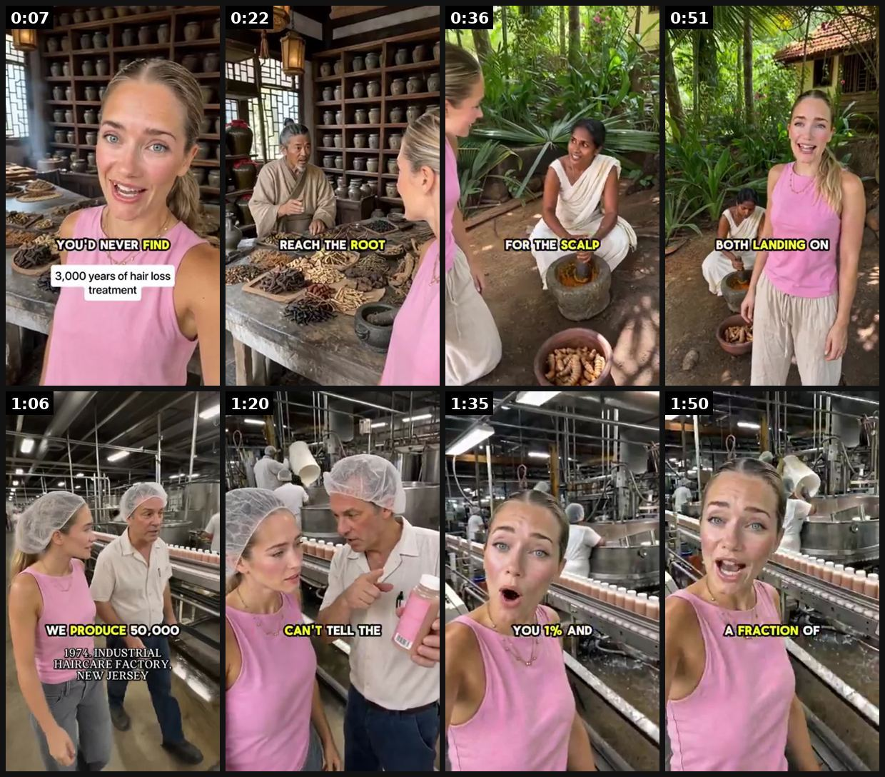
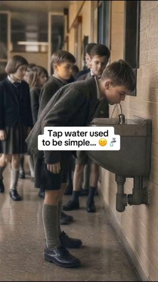
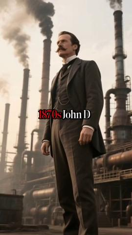
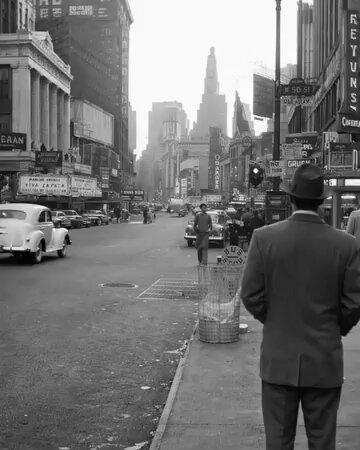
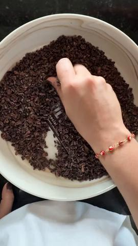

# 111 · History-lesson ad (\"2,000 years ago people did X. Then the industry changed it for profit. Here's the version that goes back to the original\"): see it, then make it

[](https://x.com/LachezarVoynov/status/2079594476352246083)

**The example:** [@LachezarVoynov on X](https://x.com/LachezarVoynov/status/2079594476352246083) · 1:57 video · 40 likes, 3K views

**Watch it:** [open the post on X](https://x.com/LachezarVoynov/status/2079594476352246083) · [play the video file](https://video.twimg.com/ext_tw_video/2079594309842538496/pu/vid/avc1/320x568/CyuHTK-ufkDD2O-I.mp4?tag=12)

> We spend $10,000/month on AI video generation tools to create ads like this one. AI gives us the ability to take people through ancient history and explain to them what people in the past used to treat their problems. And how the whole industry has changed so that corporations can maximise profit. It makes people understand what they are buying. It makes them angry. It evokes a response from them. And it makes them i…

## What you are seeing

A 1:57 fully AI-generated vertical ad. A blonde presenter in a pink tank top time-travels through the history of hair-loss treatment, talking to camera like a travel vlogger. 0:07 an ancient Chinese apothecary (on-screen "3,000 years of hair loss treatment"), where an herbalist explains blood flow to the scalp; 0:36 a village in India grinding turmeric for the scalp; 0:51 "two completely separate civilizations… both landing on the exact same principles". 1:06 a "1974, industrial haircare factory, New Jersey" title card: a manager says "we produce 50,000 units a day… maybe 1% actives, consumers can't tell the difference". The presenter turns to camera: "they gave you 1% and charged you for 10", and only then is the product introduced. Word-by-word yellow captions throughout. The agency calls it "a direct-response VSL disguised as a founder story" and says it spends $10K a month on AI video tools.

## Beat by beat

The storyboard above samples the video every 0:14. Lines are the transcript for that stretch; on-screen text comes from OCR, so treat it as rough.

| Frame | Time | On screen | Said / sung |
|---|---|---|---|
| 1 | 0:00–0:14 | 3,000 years of hair loss treatment | The most effective hair loss ingredient in history isn't new, it's ancient, the industry just hoped you'd never find it. What do you use for hair loss here? We stimulate blood flow to the scalp, herbal tonics. |
| 2 | 0:14–0:29 | · | Plant extracts apply directly to the follicle needs nourishment from within. If blood doesn't reach the root, nothing goes. Blood flow, scalp nourishment, plant extracts directly at the root, 200 BC, remember that. |
| 3 | 0:29–0:44 | FOR THE on on | What is that? Turmeric, we use it for everything, wounds, inflammation, skin conditions and for the scalp to strengthen hair at the root and calm irritations. And it works? We've used it for a thousand years. The root reduces swelling, the scalp heals, the hair returns. |
| 4 | 0:44–0:58 | As seen oH. he | Two completely separate civilizations, thousands of kilometers and years apart, both landing on the exact same principles of blood flow, plant extracts, treating the scalp and nourishing the root. |
| 5 | 0:58–1:13 | HAIR ARE FACTORY I a | This wasn't a coincidence, they were onto something real. What changed? Demand, we produce 50,000 units a day now. And the active ingredients, the plant extracts, the botanicals? |
| 6 | 1:13–1:28 | · | We use what's cost effective, water base, fragrance, a small percentage of actives, maybe 1%, consumers can't tell the difference. So you know a higher concentration works better? Sure, but that's not what the margins say. |
| 7 | 1:28–1:42 | · | They figured out you can't smell the difference between 1% active ingredients and 10%. So they gave you 1% and charged you for 10. Everything those ancient civilizations discovered, the turmeric, the blood flow, the real plant |
| 8 | 1:42–1:57 | · | science and |

<details><summary>Full transcript (timestamped)</summary>

- `0:00` The most effective hair loss ingredient in history isn't new, it's ancient, the industry
- `0:06` just hoped you'd never find it.
- `0:08` What do you use for hair loss here?
- `0:10` We stimulate blood flow to the scalp, herbal tonics.
- `0:15` Plant extracts apply directly to the follicle needs nourishment from within.
- `0:20` If blood doesn't reach the root, nothing goes.
- `0:23` Blood flow, scalp nourishment, plant extracts directly at the root, 200 BC, remember that.
- `0:31` What is that?
- `0:32` Turmeric, we use it for everything, wounds, inflammation, skin conditions and for the scalp
- `0:37` to strengthen hair at the root and calm irritations.
- `0:39` And it works?
- `0:40` We've used it for a thousand years.
- `0:42` The root reduces swelling, the scalp heals, the hair returns.
- `0:45` Two completely separate civilizations, thousands of kilometers and years apart, both landing
- `0:51` on the exact same principles of blood flow, plant extracts, treating the scalp and nourishing
- `0:57` the root.
- `0:58` This wasn't a coincidence, they were onto something real.
- `1:02` What changed?
- `1:04` Demand, we produce 50,000 units a day now.
- `1:08` And the active ingredients, the plant extracts, the botanicals?
- `1:12` We use what's cost effective, water base, fragrance, a small percentage of actives,
- `1:18` maybe 1%, consumers can't tell the difference.
- `1:22` So you know a higher concentration works better?
- `1:25` Sure, but that's not what the margins say.
- `1:28` They figured out you can't smell the difference between 1% active ingredients and 10%.
- `1:34` So they gave you 1% and charged you for 10.
- `1:38` Everything those ancient civilizations discovered, the turmeric, the blood flow, the real plant
- `1:44` science and

</details>

## More real examples (5)

Other posts that show this format, or a close cousin of it. Click a thumbnail to open it on X.

| | | |
|---|---|---|
| [](https://x.com/LachezarVoynov/status/2072708967147471270)<br>**@LachezarVoynov** · 1:21 video · 4K views<br>history lesson ads are money printers rn people on social media love conspiracy theories everyone knows that big household corporations optimise for p | [](https://x.com/LachezarVoynov/status/2050577141197087015)<br>**@LachezarVoynov** · 1:15 video · 2K views<br>history-lesson ad creatives are the most untapped ad creative style in the eComm space right now perfect for saturated niches humans never get tired o | [](https://x.com/LachezarVoynov/status/2062925236916420679)<br>**@LachezarVoynov** · 1:15 video · 524 views<br>History lesson ads. This uses storytelling to keep the viewers' attention. Give people a quick rundown on how your industry ended up in the terrible s |
| [](https://x.com/LachezarVoynov/status/2027442187835695191)<br>**@LachezarVoynov** · 1:16 video · 456 views<br>Meta ad creatives at their finest. Don't sell your product. Give people a history lesson. Educate them on how the industry you are in ended up in the | [](https://x.com/LachezarVoynov/status/2041181235230232837)<br>**@LachezarVoynov** · 1:57 video · 4K views<br>I have a new favorite ad library to get inspired by. The Conscious Bar. Their content is so clean and so aesthetically pleasing that you just watch it |   |

## How to make one like it

**The format in one line:** A 60-120 second video that **doesn't sell the product first. It tells the story of the category.** It opens in the past ("In ancient Rome…", "For 3,000 years monks…", "Before 1950 every chocolate bar was…"), shows how people used to solve the problem, then explains **how and why the industry changed** (cheaper materials, shortcuts, profit). It lands on today's status quo (what the viewer is buying

**Why it works:** - **The brain files it as education, not advertising** ([post](https://x.com/LachezarVoynov/status/2050577141197087015)). "You get their attention for free because you're not asking for a sale." - **Humans never get tired of a good story.** A time-travel open loop ("how did we get here?") holds attention past the 3-second mark. - **It builds an enemy without naming a competitor.** "The industry optimised for profit" makes the viewer angry at the status quo ([post](https://x.com/LachezarVoynov/st

**Contents:** [1. Structure](#1-copy-the-structure) · [2. Shot by shot](#2-shot-by-shot-remake) · [3. Script and hooks](#3-write-the-script) · [4. Prompts](#4-prompts) · [5. Tools and settings](#5-tools-and-settings) · [6. Louise Carter remake](#6-louise-carter-remake) · [7. Variants and test](#7-variants-and-test-plan) · [8. Pitfalls](#8-pitfalls)

### 1. Copy the structure

Use the example's timing as your beat sheet. Keep the beat, change the words and the product.

| Beat | Time | In the example | Your version |
|---|---|---|---|
| 1 | 0:07 | The most effective hair loss ingredient in history isn't new, it's ancient, the industry just hoped you'd never find it. What do you use for | … |
| 2 | 0:22 | Plant extracts apply directly to the follicle needs nourishment from within. If blood doesn't reach the root, nothing goes. Blood flow, scal | … |
| 3 | 0:36 | What is that? Turmeric, we use it for everything, wounds, inflammation, skin conditions and for the scalp to strengthen hair at the root and | … |
| 4 | 0:51 | Two completely separate civilizations, thousands of kilometers and years apart, both landing on the exact same principles of blood flow, pla | … |
| 5 | 1:06 | This wasn't a coincidence, they were onto something real. What changed? Demand, we produce 50,000 units a day now. And the active ingredient | … |
| 6 | 1:20 | We use what's cost effective, water base, fragrance, a small percentage of actives, maybe 1%, consumers can't tell the difference. So you kn | … |
| 7 | 1:35 | They figured out you can't smell the difference between 1% active ingredients and 10%. So they gave you 1% and charged you for 10. Everythin | … |
| 8 | 1:50 | science and | … |

### 2. Shot-by-shot remake

**Target length / size:** 60-90s, 1080x1920 (and 4:5), documentary VO, era date stamps, big serif captions

| # | Time / slot | What we see (visual + camera) | Dialogue / on-screen text |
|---|---|---|---|
| 1 | 0-4s hook | AI period still animated in Kling: a Roman woman stepping into steaming baths, a gold bracelet catching light. Serif text: "Why Roman women never took their gold off". Era stamp "27 BC" | VO: "Two thousand years ago, Roman women wore their gold into the baths. Every single day." |
| 2 | 4-15s past | Museum-style close-ups or AI renders: Egyptian collar, Byzantine ring, 1700s locket, all still shining | VO: "Real gold doesn't rust or tarnish. That's why these pieces still shine in museums." |
| 3 | 15-30s change | AI 1950s factory line dipping brass in colour; cut to a modern $5 earring counter. Stamp "1952" | VO: "Then jewelry got cheap: brass with a coat of colour thinner than a hair." |
| 4 | 30-42s status quo | Green-finger close-up, a tarnished chain in a drawer, rings taken off before a shower. Stamp "today" | VO: "By week three it's green and dull. We were taught that's normal. It isn't." |
| 5 | 42-60s return to the original | Qirra's hands at the workbench, PVD chamber B-roll, a necklace going into the ocean | VO: "Louise Carter went back to the original rule: jewelry you never take off. 14K gold bonded with PVD." |
| 6 | 60-75s offer | Stack on a wet wrist in the sea → product grid → "any 7 for $85" | VO: "Wear it like the Romans did." CTA: Shop the stack |

<details><summary>Playbook shot list (Louise Carter version from the README)</summary>

| Time | Visual | Audio / copy |
|---|---|---|
| 0-4 s | AI period still animated (Kling): a Roman woman stepping into steaming baths, a gold bracelet catching light. On-screen: "Why Roman women never took their gold off" | VO: "Two thousand years ago, Roman women wore their gold into the baths. Every single day." |
| 4-15 s | Museum close-ups / AI renders: Egyptian collar, Byzantine ring, a 1700s locket. Each one still shines. | "Real gold doesn't rust, doesn't tarnish and doesn't care about water. That's why you can still see these pieces in museums today." |
| 15-30 s | Shift to a 1950s factory (AI), then a modern fast-fashion counter with $5 earrings | "Then jewelry got cheap. Brass dipped in a coat of colour thinner than a hair. It looks like gold on day one…" |
| 30-42 s | Green-finger close-up, a tarnished chain in a drawer, taking rings off before the shower | "…and by week three it's green, it's dull and you're taking it off to wash your hands. We were taught that's normal. It isn't." |
| 42-60 s | LC founder hands (Qirra) at a workbench; PVD chamber B-roll; a necklace going into the ocean | "Louise Carter went back to the original rule: jewelry you never take off. 14K gold bonded with PVD, so you can swim, shower and sweat in it." |
| 60-75 s | Stack on wrist in the sea → product grid | "Any 7 pieces for $85. Wear it like the Romans did." CTA: Shop the stack |

</details>

### 3. Write the script

Open with one of these hooks (first 1–3 seconds, or the headline on a static):

- "Why Roman women never took their gold off"
- "In 1950 jewelry changed forever, and nobody told you"
- "Your grandmother's ring is 60 years old and still shines. Your new one went green in a month. Here's why."
- "The jewelry industry has a secret it doesn't want you to know about the 1980s"
- "How monks / sailors / pearl divers wore jewelry in the sea" (Voynov's "Monk history lesson" variant)

Then fill the beats from the table above. Pull the wording from real customer reviews, not from ad copy: a review line beats a copywriter line almost every time. Read every line out loud and cut anything you would not say to a friend. Ready-made Louise Carter scripts are in section 6; hand [BOT.md](BOT.md) to any AI agent to write versions for another brand.

### 4. Prompts

**Script (Claude / GPT)**

```text
Write a 75 s history-lesson ad for Louise Carter: hook set in the past with a date; 2-3 real, checkable facts about historical gold jewelry (list a source for each); how plated costume jewelry changed the category (no named competitor); today's visible letdown (green fingers, taking rings off to shower); LC as the return to the original (PVD 14K, waterproof); offer any 7 for $85. 150-200 words.
```

**Period stills (Nano Banana / GPT Image)**

```text
"Cinematic photoreal scene, ancient Roman bathhouse, steam, warm torchlight, a woman in a linen stola lowering herself into the water, a thick gold bracelet on her wrist catching the light, 35mm film grain, documentary lighting, 9:16"; one prompt per script line, same colour grade.
```

**Motion (Kling 3.0 image-to-video)**

```text
Slow push-in, 5 s per still, subtle steam/water movement, no face morphing; keep the jewelry shape fixed.
```

**VO (ElevenLabs / human)**

```text
Calm documentary narrator, 150 wpm, low strings or room-tone ASMR under it.
```

**Full creative-agent prompt (from the playbook):**

```
Write a 75-second history-lesson ad for <BRAND> (<PRODUCT>, <OFFER>). Structure: (1) hook set in the past, 1 line, with a date or place; (2) how people solved <PROBLEM> back then (2-3 real, checkable facts; list the source for each); (3) how and why the industry changed (cheaper materials, shortcuts, profit) without naming a competitor; (4) today's status quo and how it lets the viewer down (a specific, visible moment); (5) the product as the return to the original way (one mechanism line); (6) offer + CTA. Then a shot list: one AI period image prompt per line (Nano Banana style), Kling motion note, on-screen text, and an era stamp. No invented history, no health claims, no 'ancient secret' that isn't real.
```

### 5. Tools and settings

1. **Research (1 h):** three real, checkable historical facts about the category (for LC: Roman and Egyptian gold jewelry, why gold doesn't corrode, when plated costume jewelry became mass-market). Write the source next to every fact.
2. **Script (VSL bones, F72):** past → change → status quo → enemy (the shortcut, never a named competitor) → product as the return to the original → offer. 150-200 words for 75 s.
3. **Visuals:** Nano Banana / GPT Image period stills (one per line), animated with Kling 3.0 image-to-video; museum B-roll only where the licence allows; real LC footage for the last third.
4. **VO:** calm documentary narrator (human or ElevenLabs), with low strings or ASMR room tone.
5. **Edit:** big serif captions, 1 cut every 2-3 s, a date stamp on each era ("27 BC", "1952", "today").
6. **Variants:** 3 hooks (era-first / mystery-first / grandmother's ring), 2 lengths (45 s and 90 s).

| Setting | Value |
|---|---|
| Canvas | 1080×1920 (9:16) master; crop a 1080×1350 (4:5) cut for feed placements |
| Frame rate | 30 fps (shoot 60 fps for slow-motion water or sparkle shots) |
| Camera | Phone main lens at 1x, exposure locked on skin, HDR off, grid on; tripod or a phone clamp for product shots |
| Light | One soft key at 45° (window or ring light), white card as fill; side light for metal sparkle |
| Audio | Lavalier or phone 15–20 cm from the mouth; mix voice at -14 LUFS, music at -28 to -30 dB under voice |
| Captions | Burned in, 2–5 words per line, 64–80 px bold sans, white with a black stroke or pill; keep text inside the safe zone (top 220 px and bottom 420 px clear, 64 px side margins) |
| Pacing | A visual change every 1.5–3 s; the hook lands in the first 1.5 s with no logo intro |
| Edit / export | CapCut or Premiere; H.264, 12–20 Mbps, AAC 320 kbps; upload natively to each platform, not via links |

### 6. Louise Carter remake

- A · **"Why Roman women never took their gold off"** → baths → museum pieces still shine → 1950s plating → green fingers → LC PVD 14K → "wear it like the Romans did".
- B · **"Your grandmother's ring vs. your new necklace"** (grandmother's ring, 60 years old and still gold) → what changed (plating thickness) → LC.
- C · **"Pearl divers wore their gold in the sea"** (check the fact first; otherwise use sailors' gold hoop earrings) → saltwater test → LC ocean demo.

Brand rules, claims you can and cannot make, and more scripts: [brands/louise-carter.md](brands/louise-carter.md). Step-by-step from idea to scale: [STAGES.md](STAGES.md).

### 7. Variants and test plan

- Time-traveller host interviewing people in each era (featured example) versus pure narrator over period scenes
- AI period scenes versus museum/archive B-roll
- Narrator VO versus founder (Qirra) telling it to camera (founder-story wrapper, F27)
- ASMR room tone versus strings
- 45 s versus 90 s (Voynov's examples are 75-117 s)

**Test plan:** - **Budget/structure:** TOF broad, 3 hooks × 1 body, $50/day each for 7 days; judge on 7-day blended CAC (Adam Taylor), not one day - **Primary KPIs:** hook rate (3 s), hold rate to 50%, outbound CTR, CPA; Omni new-customer % on `utm_content=F111-*` - **Kill rule:** hook rate < 25% after $150 or no purchases after 2× target CPA - **Scale rule:** winner → new eras (Egypt, Victorian, 1980s) on the same body; cut a 6 s micro-demo (F98) from the ocean shot for retargeting - **Naming:** `utm_content=F111-<era>-<hook>`

**Naming:** `F111-<variant>-<hook##>-<date>` so results map back to this folder. Change one thing per test (hook, narrator, length or offer), never two.

### 8. Pitfalls

- Invented history kills trust: every fact needs a source in the doc before the edit.
- AI renders must not be presented as real museum artefacts; label AI where required.
- "Conspiracy" framing ("the industry is poisoning you") is a claim; keep the enemy to verifiable facts (plating wears off).
- Too long before the product: test 45 s and 90 s cuts; Voynov's examples run 75-117 s.
- Slow open: if the first 1.5 s does not show the hook visually, most people swipe.
- Logo or brand intro at the start reads as an ad; put the brand at the end.
- Captions covered by the platform UI: check the safe zone on a real phone before posting.
- Music over the voice: keep music at least 14 dB under speech.

**Compliance:** Baseline: [_COMPLIANCE.md](../_COMPLIANCE.md). - **Every historical claim must be true and sourced.** No invented "ancient secrets", fake quotes or fake artefacts. - Don't make "the industry is poisoning you" conspiracy claims. Keep the enemy to verifiable facts (plating wears; brass can turn skin green). - Label AI-generated period scenes where the platform requires it; never pass AI renders off as real museum pieces. - No health or wellness claims about gold. - **Do not copy:** "ancient wisdom cures X" scripts on supplements and the "conspiracy theory" framing Voynov praises. Copy the structure, not unverifiable claims.

## More examples

Every post we found for this format, with transcripts: [examples/](examples/README.md). Playbook: [README.md](README.md). Agent brief: [BOT.md](BOT.md).
