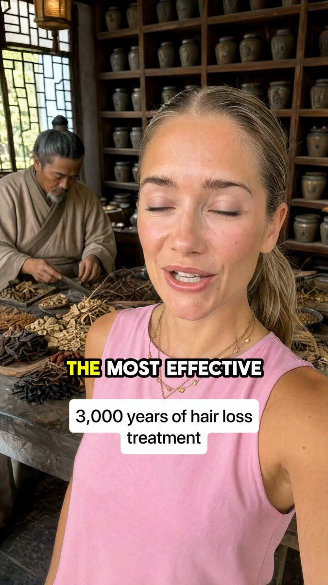

# 111 · History-lesson ad

<!-- HERO:START -->
[](EXAMPLE.md)

**[See the example and how to make it →](EXAMPLE.md)** · [watch on X](https://x.com/LachezarVoynov/status/2079594476352246083)
<!-- HERO:END -->


> **LC priority P1** · evidence: Medium-high (5 agency examples plus 3 brands on his format lists; spend claims unverified) · hype risk: Medium · cost $50-400 · 1-2 days

## What it is
A 60-120 second video that **doesn't sell the product first. It tells the story of the category.** It opens in the past ("In ancient Rome…", "For 3,000 years monks…", "Before 1950 every chocolate bar was…"), shows how people used to solve the problem, then explains **how and why the industry changed** (cheaper materials, shortcuts, profit). It lands on today's status quo (what the viewer is buying now and why it disappoints them), and only then introduces the product as **the return to the original way**. The visuals are AI-generated period scenes (Nano Banana / Kling), archive art or museum B-roll, and a calm documentary narrator.

**The featured example uses a time-traveller host:** one AI presenter (the same face in every era) walks into a 200 BC Chinese apothecary, then an Indian village grinding turmeric, then a "1974, industrial haircare factory, New Jersey", interviewing the people there like a travel vlogger. The factory manager delivers the turn ("we produce 50,000 units a day… maybe 1% actives, consumers can't tell the difference"), so the host never has to attack anyone herself.

Lachezar Voynov's recipe ([post](https://x.com/LachezarVoynov/status/2072708967147471270)): *"tell them how everything started → explain how and why things changed → show them what the current status quo is → then introduce your product, which is the solution and the only alternative on the market."*

## Why it works
- **The brain files it as education, not advertising** ([post](https://x.com/LachezarVoynov/status/2050577141197087015)). "You get their attention for free because you're not asking for a sale."
- **Humans never get tired of a good story.** A time-travel open loop ("how did we get here?") holds attention past the 3-second mark.
- **It builds an enemy without naming a competitor.** "The industry optimised for profit" makes the viewer angry at the status quo ([post](https://x.com/LachezarVoynov/status/2079594476352246083): "it makes them angry, it evokes a response"), and the product becomes "not a solution but the only viable option."
- **Built for saturated markets** (supplements, skincare, SaaS, and jewelry) where every brand claims the same benefit. A history lesson gives you a new reason to believe.
- **Low frequency, unaware audience.** It reaches people who aren't shopping yet, which is where Adam Taylor says most accounts spend $0 (strategy 44).

## Shot-by-shot (LC version, ~75 s)
| Time | Visual | Audio / copy |
|---|---|---|
| 0-4 s | AI period still animated (Kling): a Roman woman stepping into steaming baths, a gold bracelet catching light. On-screen: "Why Roman women never took their gold off" | VO: "Two thousand years ago, Roman women wore their gold into the baths. Every single day." |
| 4-15 s | Museum close-ups / AI renders: Egyptian collar, Byzantine ring, a 1700s locket. Each one still shines. | "Real gold doesn't rust, doesn't tarnish and doesn't care about water. That's why you can still see these pieces in museums today." |
| 15-30 s | Shift to a 1950s factory (AI), then a modern fast-fashion counter with $5 earrings | "Then jewelry got cheap. Brass dipped in a coat of colour thinner than a hair. It looks like gold on day one…" |
| 30-42 s | Green-finger close-up, a tarnished chain in a drawer, taking rings off before the shower | "…and by week three it's green, it's dull and you're taking it off to wash your hands. We were taught that's normal. It isn't." |
| 42-60 s | LC founder hands (Qirra) at a workbench; PVD chamber B-roll; a necklace going into the ocean | "Louise Carter went back to the original rule: jewelry you never take off. 14K gold bonded with PVD, so you can swim, shower and sweat in it." |
| 60-75 s | Stack on wrist in the sea → product grid | "Any 7 pieces for $85. Wear it like the Romans did." CTA: Shop the stack |

## Hooks (swap-in openers)
- "Why Roman women never took their gold off"
- "In 1950 jewelry changed forever, and nobody told you"
- "Your grandmother's ring is 60 years old and still shines. Your new one went green in a month. Here's why."
- "The jewelry industry has a secret it doesn't want you to know about the 1980s"
- "How monks / sailors / pearl divers wore jewelry in the sea" (Voynov's "Monk history lesson" variant)

## Real examples from X (studied)
- **@LachezarVoynov, 5 history-lesson ads (Feb-Jul 2026):**
  - "Give people a history lesson. Educate them on how the industry you are in ended up in the position it is today. Tell them why everything about it is wrong. And only then reveal your product" ([post](https://x.com/LachezarVoynov/status/2027442187835695191), 76 s).
  - "the most untapped ad creative style in the eComm space right now, perfect for saturated niches" ([post](https://x.com/LachezarVoynov/status/2050577141197087015), 75 s).
  - In his cheat-sheet thread: "how your industry ended up in the terrible spot it is now and how your product is revolutionising it because it uses ancient wisdom… This is a printer" ([post](https://x.com/LachezarVoynov/status/2062925236916420679), 75 s).
  - "history lesson ads are money printers rn. People on social media love conspiracy theories" ([post](https://x.com/LachezarVoynov/status/2072708967147471270), 81 s).
  - "We spend $10,000/month on AI video generation tools to create ads like this one… take people through ancient history… a direct-response VSL disguised as a founder story" ([post](https://x.com/LachezarVoynov/status/2079594476352246083), 117 s).
- On his lists: "History-lesson ads" (UndrDog Hemp) and "Monk history lesson" (Ming San) in the [29 TOF formats](https://x.com/LachezarVoynov/status/2086842038457098499); "ASMR-HistoryLesson-FounderStory" (The Conscious Bar: the story of cacao told with ASMR B-roll and a spokesperson, framework hook → problem intro → problem education → agitation → product intro → explanation → CTA, [post](https://x.com/LachezarVoynov/status/2041181235230232837)).

## Production recipe
1. **Research (1 h):** three real, checkable historical facts about the category (for LC: Roman and Egyptian gold jewelry, why gold doesn't corrode, when plated costume jewelry became mass-market). Write the source next to every fact.
2. **Script (VSL bones, F72):** past → change → status quo → enemy (the shortcut, never a named competitor) → product as the return to the original → offer. 150-200 words for 75 s.
3. **Visuals:** Nano Banana / GPT Image period stills (one per line), animated with Kling 3.0 image-to-video; museum B-roll only where the licence allows; real LC footage for the last third.
4. **VO:** calm documentary narrator (human or ElevenLabs), with low strings or ASMR room tone.
5. **Edit:** big serif captions, 1 cut every 2-3 s, a date stamp on each era ("27 BC", "1952", "today").
6. **Variants:** 3 hooks (era-first / mystery-first / grandmother's ring), 2 lengths (45 s and 90 s).

## Bot prompt (copy into the creative agent)
```
Write a 75-second history-lesson ad for <BRAND> (<PRODUCT>, <OFFER>). Structure: (1) hook set in the past, 1 line, with a date or place; (2) how people solved <PROBLEM> back then (2-3 real, checkable facts; list the source for each); (3) how and why the industry changed (cheaper materials, shortcuts, profit) without naming a competitor; (4) today's status quo and how it lets the viewer down (a specific, visible moment); (5) the product as the return to the original way (one mechanism line); (6) offer + CTA. Then a shot list: one AI period image prompt per line (Nano Banana style), Kling motion note, on-screen text, and an era stamp. No invented history, no health claims, no 'ancient secret' that isn't real.
```

## 3 LC scripts
- A · **"Why Roman women never took their gold off"** → baths → museum pieces still shine → 1950s plating → green fingers → LC PVD 14K → "wear it like the Romans did".
- B · **"Your grandmother's ring vs. your new necklace"** (grandmother's ring, 60 years old and still gold) → what changed (plating thickness) → LC.
- C · **"Pearl divers wore their gold in the sea"** (check the fact first; otherwise use sailors' gold hoop earrings) → saltwater test → LC ocean demo.

## Variants to test
- Time-traveller host interviewing people in each era (featured example) versus pure narrator over period scenes
- AI period scenes versus museum/archive B-roll
- Narrator VO versus founder (Qirra) telling it to camera (founder-story wrapper, F27)
- ASMR room tone versus strings
- 45 s versus 90 s (Voynov's examples are 75-117 s)

## Omni test plan
- **Budget/structure:** TOF broad, 3 hooks × 1 body, $50/day each for 7 days; judge on 7-day blended CAC (Adam Taylor), not one day
- **Primary KPIs:** hook rate (3 s), hold rate to 50%, outbound CTR, CPA; Omni new-customer % on `utm_content=F111-*`
- **Kill rule:** hook rate < 25% after $150 or no purchases after 2× target CPA
- **Scale rule:** winner → new eras (Egypt, Victorian, 1980s) on the same body; cut a 6 s micro-demo (F98) from the ocean shot for retargeting
- **Naming:** `utm_content=F111-<era>-<hook>`

## Compliance
Baseline: [_COMPLIANCE.md](../_COMPLIANCE.md).
- **Every historical claim must be true and sourced.** No invented "ancient secrets", fake quotes or fake artefacts.
- Don't make "the industry is poisoning you" conspiracy claims. Keep the enemy to verifiable facts (plating wears; brass can turn skin green).
- Label AI-generated period scenes where the platform requires it; never pass AI renders off as real museum pieces.
- No health or wellness claims about gold.
- **Do not copy:** "ancient wisdom cures X" scripts on supplements and the "conspiracy theory" framing Voynov praises. Copy the structure, not unverifiable claims.

## Related
- Strategies: 44-awareness-ladder-angle-system, 37-ai-realism-craft
- Formats: [50-mini-documentary-how-its-made](../50-mini-documentary-how-its-made/README.md), [72-vsl-long-form-and-text-sales-letter](../72-vsl-long-form-and-text-sales-letter/README.md), [15-retro-infomercial-expert-authority](../15-retro-infomercial-expert-authority/README.md), [94-buyers-guide-warning-flip-the-label](../94-buyers-guide-warning-flip-the-label/README.md), [91-ai-melodrama-mini-movie](../91-ai-melodrama-mini-movie/README.md)
